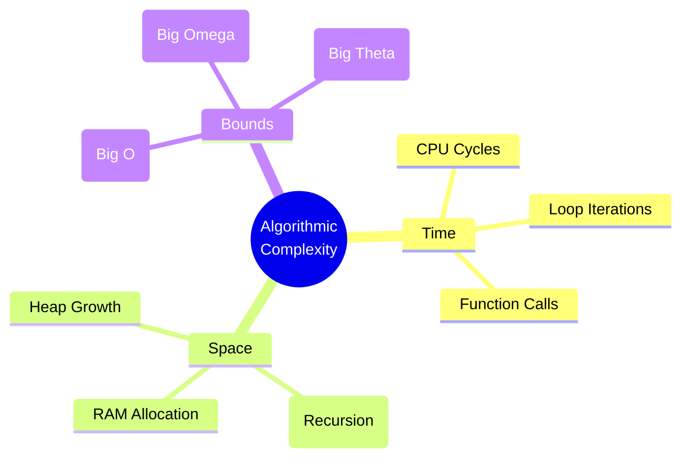
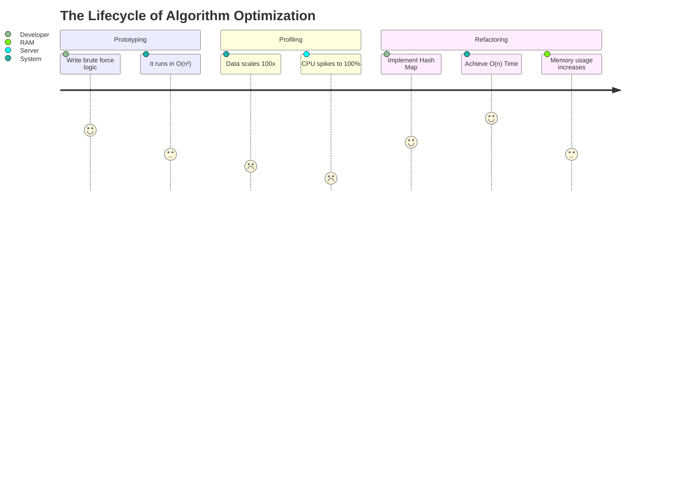
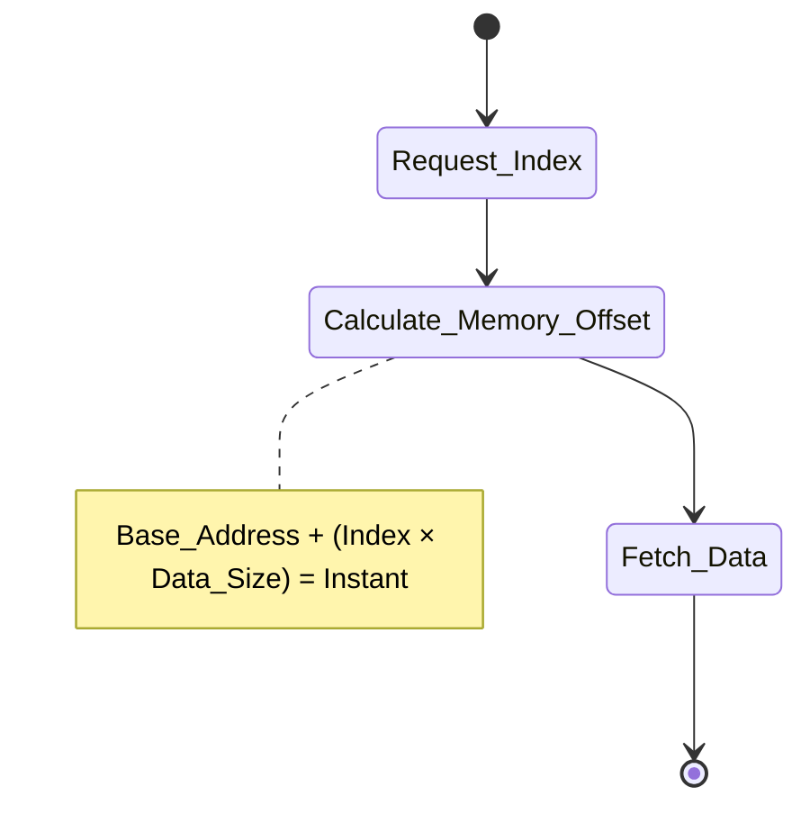
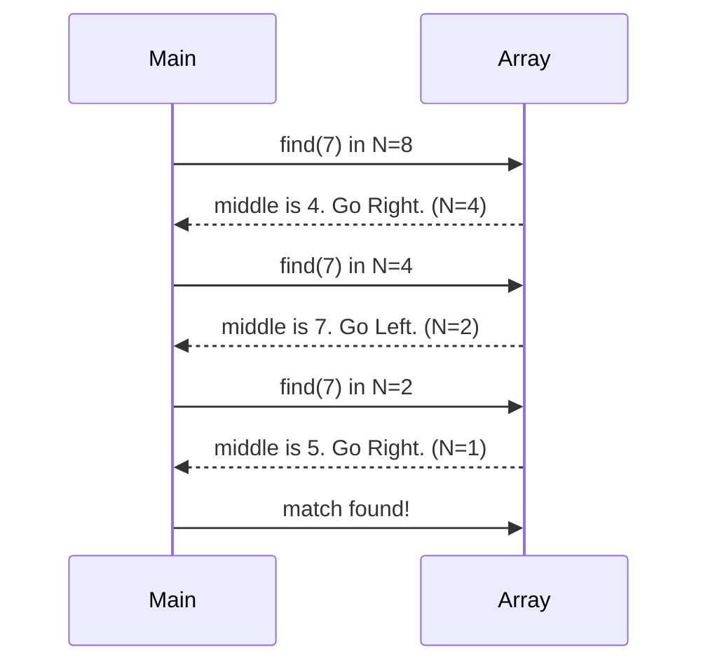
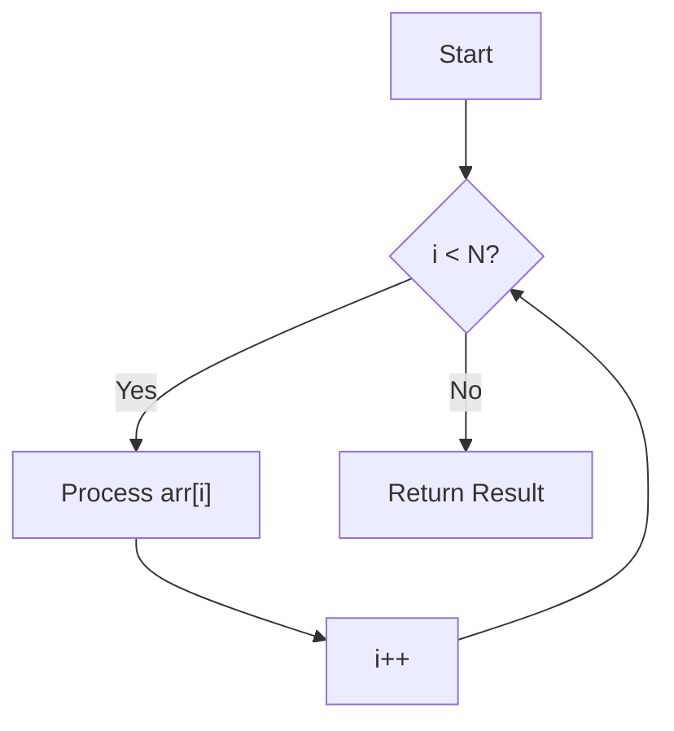
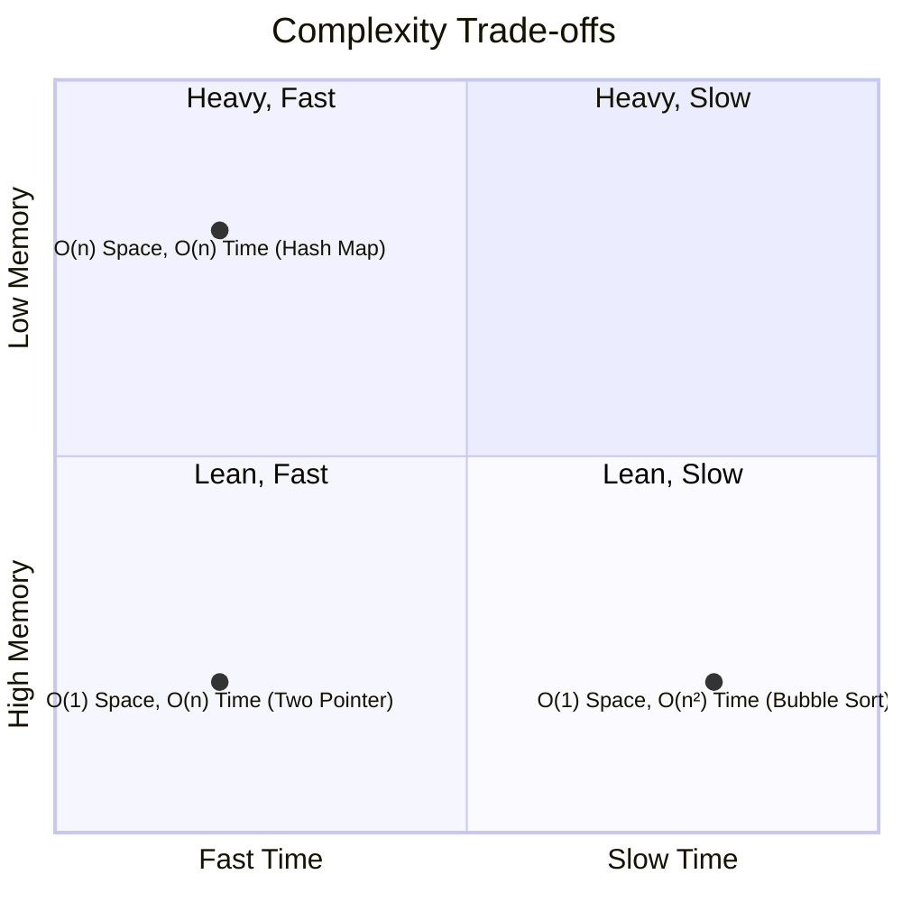
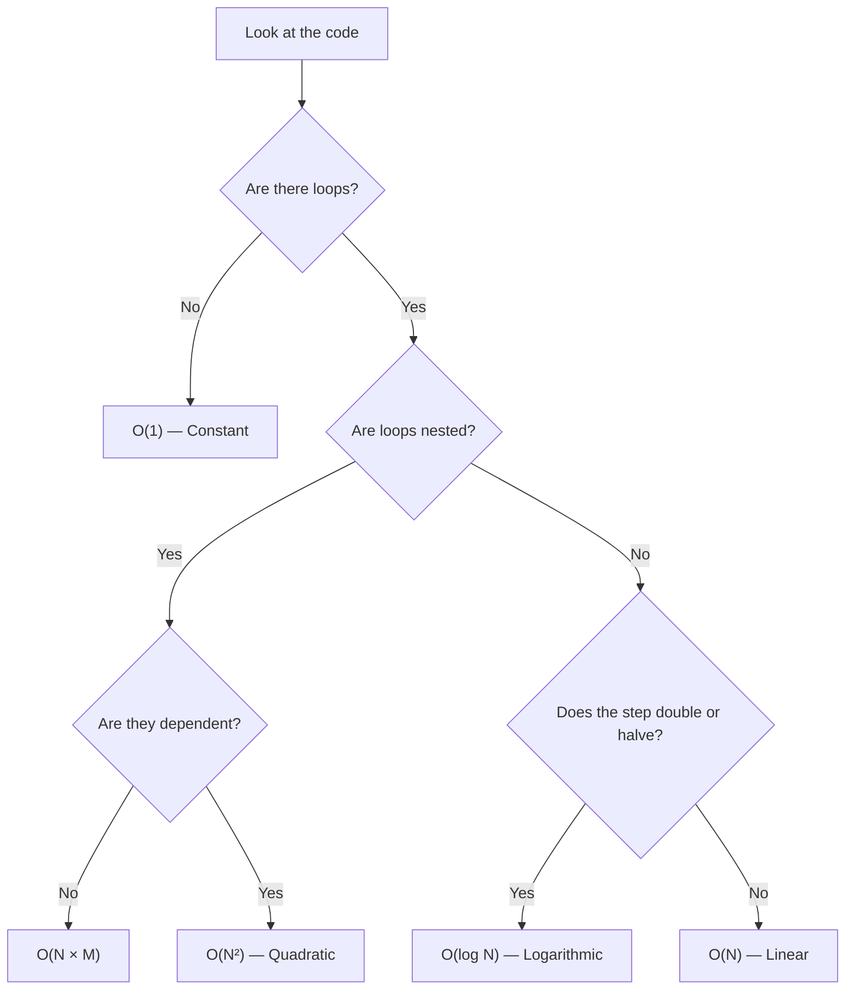
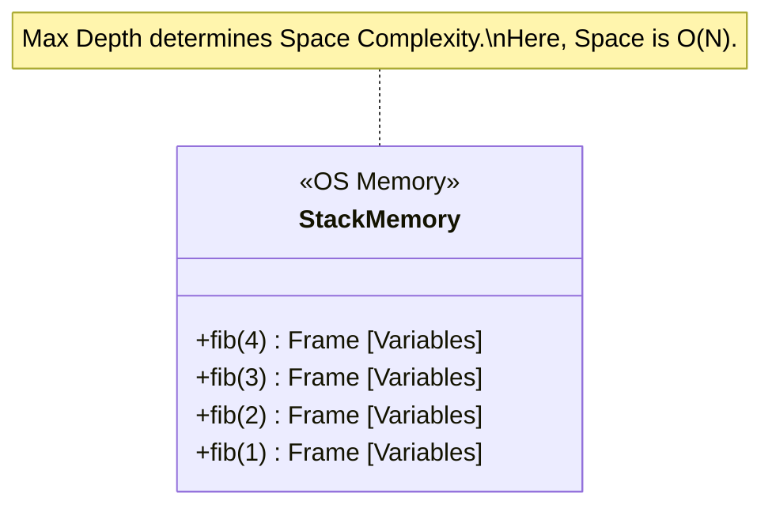
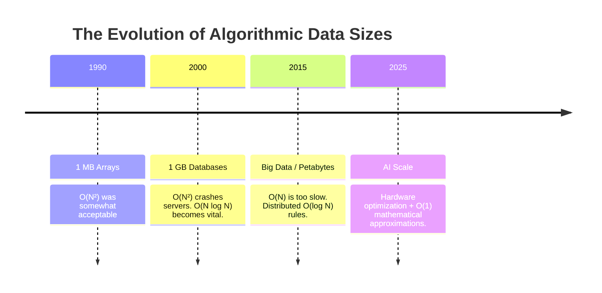

# Chapter 01 — Big O Notation

> *"Amateurs measure algorithms in seconds. Professionals measure algorithms in operations. Masters measure algorithms in asymptotic growth."*

---

## Table of Contents

- [Part 1 — The Philosophy of Complexity](#part-1--the-philosophy-of-complexity)
  - [Why Big O Exists](#why-big-o-exists)
  - [The Rules of the Game: Asymptotic Analysis](#the-rules-of-the-game-asymptotic-analysis)
- [Part 2 — The Formal Notations](#part-2--the-formal-notations)
- [Part 3 — Visualizing the Complexity Spectrum](#part-3--visualizing-the-complexity-spectrum)
- [Part 4 — Core Complexities (Deep Dive)](#part-4--core-complexities-deep-dive)
  - [O(1) — Constant Time](#o1--constant-time)
  - [O(log n) — Logarithmic Time](#olog-n--logarithmic-time)
  - [O(n) — Linear Time](#on--linear-time)
  - [O(n²) — Quadratic Time](#on--quadratic-time)
- [Part 5 — Code Analysis & Mental Models](#part-5--code-analysis--mental-models)
- [Part 6 — The Interviewer's Sandbox](#part-6--the-interviewers-sandbox)
- [Part 7 — Summary & Cheat Sheet](#part-7--summary--cheat-sheet)

---

## Part 1 — The Philosophy of Complexity

### Why Big O Exists

Imagine you write an algorithm to sort user data. You test it locally — it runs in `0.05s`. You ship it. A year later, the database grows from **1,000 users to 10,000,000 users**. The server crashes.

Why? Because **measuring algorithms in seconds is a trap.**

| Factor | Problem |
|---|---|
| Faster CPU | Makes bad code look good temporarily |
| Different language (C++ vs Python) | Changes execution time arbitrarily |
| Background processes | Introduces random noise into benchmarks |

**Big O Notation separates the algorithm from the hardware.** It answers one universal question:

> *As the input size approaches infinity, how does the number of operations grow?*



---

### The Rules of the Game: Asymptotic Analysis

We analyze **asymptotic behavior** — what happens as `n` grows unimaginably large.

#### Rule 1 — Drop Constants

`O(2n)` and `O(500n)` both simplify to **`O(n)`**.

At `n → ∞`, multiplying by 500 is irrelevant compared to a higher-order term. A line is a line, regardless of slope.

#### Rule 2 — Drop Non-Dominant Terms

For `f(n) = n² + 5n + 1000`, we write **`O(n²)`**.

At `n = 1,000,000`:

| Term | Value | Contribution |
|---|---|---|
| n² | 1,000,000,000,000 | ~100% |
| 5n | 5,000,000 | ~0.0005% |
| 1000 | 1,000 | negligible |

The lower-order terms are **statistical noise**.

#### Rule 3 — Best, Average, and Worst Cases

| Case | Description | Usefulness |
|---|---|---|
| **Best** | The target is the very first element | Rarely useful |
| **Average** | Statistically expected performance | Useful for Hash Maps, QuickSort |
| **Worst** | Target is last, or doesn't exist | **This is what Big O measures** |

---

## Part 2 — The Formal Notations

We casually say "Big O" for everything, but Computer Science defines five distinct notations.

### Big O — `O(·)` — The Upper Bound (The Pessimist)

**Definition:** `f(n) = O(g(n))` if ∃ constants `c > 0`, `n₀` such that:

```
0 ≤ f(n) ≤ c · g(n)   for all n ≥ n₀
```

- **Intuition:** The algorithm grows **no faster** than this curve.
- **Engineering use:** Guarantees to stakeholders that a query will *never* exceed a threshold. Used 99% of the time in practice.

---

### Big Omega — `Ω(·)` — The Lower Bound (The Optimist)

**Definition:** `f(n) = Ω(g(n))` if ∃ constants `c > 0`, `n₀` such that:

```
0 ≤ c · g(n) ≤ f(n)   for all n ≥ n₀
```

- **Intuition:** The algorithm takes **at least** this much time.
- **Engineering use:** Proves algorithmic limits. Any comparison-based sort must be at least `Ω(n log n)`.

---

### Big Theta — `Θ(·)` — The Tight Bound (The Realist)

**Definition:** `f(n) = Θ(g(n))` if `f(n)` is both `O(g(n))` and `Ω(g(n))`.

- **Intuition:** The algorithm grows **exactly like** this curve.
- **Engineering use:** Used when performance doesn't fluctuate based on input data.

---

### Little o and Little ω

| Notation | Definition | Intuition |
|---|---|---|
| `o(g(n))` | `lim f(n)/g(n) = 0` as `n→∞` | Strictly *better* than `g(n)` — excludes the boundary |
| `ω(g(n))` | `lim g(n)/f(n) = 0` as `n→∞` | Strictly *worse* than `g(n)` — excludes the boundary |

> **Key distinction:** `O(n²)` *includes* `n²`. But `o(n²)` means strictly less — like `n log n`.

---

### Notation Summary

| Notation | Bound | Math Analogy | Interview Phrasing |
|---|---|---|---|
| `O` | Upper | ≤ | *"What is the worst-case runtime?"* |
| `Ω` | Lower | ≥ | *"What is the absolute best-case runtime?"* |
| `Θ` | Tight | = | *"What is the exact asymptotic behavior?"* |
| `o` | Strict upper | < | *"Can you do strictly better than O(n²)?"* |
| `ω` | Strict lower | > | *"Is this provably worse than O(n log n)?"* |

### The Lifecycle of Optimization



---

## Part 3 — Visualizing the Complexity Spectrum

Understanding the difference between `O(n)` and `O(n²)` is the difference between a system that scales gracefully and one that crashes under load.

```


```

**Key insight:** At `n = 1,000,000`:

| Complexity | Operations |
|---|---|
| `O(1)` | 1 |
| `O(log n)` | ~20 |
| `O(n)` | 1,000,000 |
| `O(n log n)` | ~20,000,000 |
| `O(n²)` | 1,000,000,000,000 |
| `O(2ⁿ)` | More than atoms in the universe |

---

## Part 4 — Core Complexities (Deep Dive)

---

### O(1) — Constant Time

#### Professional Definition

Execution time remains completely **independent of input size**. Whether the array has 10 items or 10 billion, the algorithm performs a fixed number of operations.

#### Visual Intuition

```
Array: [ Data₀, Data₁, Data₂, ..., Data₉₉₉₉₉₉ ]
              ↑
         Direct access — one step, always.
```

Arrays occupy **contiguous blocks in RAM**. The CPU calculates the exact address instantly:

```
Target Address = Base Address + (Index × Element Size)
```

No searching. No iteration. Pure arithmetic.

#### CPU State Diagram



#### CPU / Memory Behavior

- Requires a **single ALU addition** and one memory fetch
- No branching, no loops → perfect pipeline prediction
- Space: `O(1)` — no auxiliary data scales with input

#### Java Example

```java
public int getFirstElement(int[] data) {
    if (data == null || data.length == 0) return -1;
    return data[0]; // Exactly 1 operation, regardless of array size
}
```

#### Interview Notes

> Hash Maps provide `O(1)` lookup **on average**. This is your primary weapon for eliminating nested loops.

#### Common Mistakes

A loop that always runs exactly 1,000,000 iterations is **`O(1)`**, not `O(n)`. If the bound is a hardcoded constant, the complexity is constant.

```java
for (int i = 0; i < 1_000_000; i++) { ... }  // ← O(1), not O(n)
```

#### Practice

**Q:** Write an `O(1)` check for whether a number is even or odd.

**A:**
```java
return (n & 1) == 0;  // Bitwise AND — single CPU cycle
```

#### Cheat Sheet

> Arrays (by index) · Hash Maps (average lookup) · Math formulas · Stack push/pop

---

### O(log n) — Logarithmic Time

#### Professional Definition

The algorithm **halves the problem size** with each operation. Operations increase by 1 only when input size doubles. Extremely efficient for massive datasets.

#### Visual Intuition

Searching for `7` in a sorted array of 8 elements:

```
Step 1 — 8 elements:  [ 1  2  3  4 | 5  7  8  9 ]   Is 7 > 4?  Yes → discard left
Step 2 — 4 elements:  [ 5  7 | 8  9 ]                Is 7 > 7?  No  → discard right
Step 3 — 2 elements:  [ 5 | 7 ]                      Is 7 > 5?  Yes → discard left
Step 4 — 1 element:   [ 7 ] ✓ Found
```

4 steps for 8 elements. 30 steps for **1 billion** elements.

#### Binary Search — Execution Flow



#### Mathematical Foundation

```
log₂(n) = x   where   2ˣ = n

n = 1,000,000     → ~20 steps
n = 1,000,000,000 → ~30 steps
```

#### CPU / Memory Behavior

- Iterative binary search: `O(1)` space
- Recursive binary search: `O(log n)` space (call stack overhead)
- Wide memory jumps can cause **CPU cache misses** — be aware at scale

#### Java Example

```java
public int binarySearch(int[] arr, int target) {
    int left = 0, right = arr.length - 1;

    while (left <= right) {
        int mid = left + (right - left) / 2;  // ← Prevents integer overflow

        if (arr[mid] == target) return mid;
        if (arr[mid] < target)  left  = mid + 1;
        else                    right = mid - 1;
    }

    return -1;
}
```

#### Interview Notes

> If the input array is **sorted**, your first thought should be: *"Can I use Binary Search here?"*

#### Common Mistakes

```java
// ❌ WRONG — overflows for large arrays
int mid = (left + right) / 2;

// ✅ CORRECT — overflow-safe
int mid = left + (right - left) / 2;
```

#### Optimization Tip

If sorting takes `O(n log n)` upfront but you'll search thousands of times, the sort cost amortizes into near-zero per query.

#### Practice

**Q:** Find the integer square root of `x` without using math libraries.

**A:** Binary search between `0` and `x/2`. Square the midpoint and compare to `x`.

#### Cheat Sheet

> Binary Search · Balanced BSTs · Divide-and-conquer algorithms · Heap operations

---

### O(n) — Linear Time

#### Professional Definition

Execution time scales **directly and proportionately** with input size. You must touch every element at least once.

#### Visual Intuition

```
Data:  [ ■  ■  ■  ■  ■  ■ ]
Read:    ↑  ↑  ↑  ↑  ↑  ↑
Steps:   1  2  3  4  5  6
```

Reading every page of a book to find a specific sentence.

#### Linear Scan — Control Flow



#### CPU / Memory Behavior

- Linear scans exploit **CPU spatial locality** — sequential memory access is highly cache-friendly
- The CPU prefetches contiguous memory blocks ahead of time
- Space: `O(1)` in most basic scan implementations

#### Java Example

```java
public int findMax(int[] arr) {
    int max = Integer.MIN_VALUE;
    for (int num : arr) {
        if (num > max) max = num;
    }
    return max;
}
```

#### Interview Notes

> **String trap:** `stringA + stringB` inside a loop silently creates `O(n²)` behavior because Java recreates the string each time. Always use `StringBuilder`.

#### Common Mistakes

```java
// Two sequential loops ≠ O(n²)
for (int i = 0; i < n; i++) { ... }   // O(n)
for (int j = 0; j < n; j++) { ... }   // O(n)
// Total: O(n + n) = O(2n) = O(n)     ← still linear
```

#### Optimization Tip

If you need to check membership repeatedly, convert the array to a `HashSet` once (`O(n)` space), then enjoy `O(1)` lookups from that point on.

#### Practice

**Q:** Find the missing number in an array containing integers 1 to N.

**A:** Use Gauss's formula:

```java
int expectedSum = n * (n + 1) / 2;
int actualSum   = Arrays.stream(arr).sum();
return expectedSum - actualSum;  // O(n) time, O(1) space
```

#### Cheat Sheet

> Simple iteration · Linear search · Array traversal · Single-pass accumulation

---

### O(n²) — Quadratic Time

#### Professional Definition

For every element, you iterate over every other element. The growth curve is a **parabola**. Generally unacceptable in production systems handling large data.

#### Visual Intuition

The handshake problem: 5 people in a room don't shake 5 hands — they shake `n × (n-1)` hands.

```
n = 4 elements:

[0] compares with → [1], [2], [3]
[1] compares with → [0], [2], [3]
[2] compares with → [0], [1], [3]
[3] compares with → [0], [1], [2]

Total comparisons = 4 × 4 = 16  →  Grid size is N × N
```

#### Complexity Trade-offs — Time vs Space



#### CPU / Memory Behavior

- Typically `O(1)` space — the trap: it doesn't crash RAM, it just **grinds CPU to a halt**
- Inner loops over disjointed memory segments trigger **cache thrashing**
- At `n = 1,000`: 1,000,000 operations. At `n = 10,000`: 100,000,000 operations.

#### Java Example

```java
public void printAllPairs(int[] arr) {
    for (int i = 0; i < arr.length; i++) {
        for (int j = 0; j < arr.length; j++) {
            System.out.println(arr[i] + ", " + arr[j]);
        }
    }
}
```

#### Interview Notes

> In technical interviews, the brute-force solution is almost always `O(n²)`. Your job is to **recognize it, name it, and immediately pivot** to a Hash Map or sorting-based optimization.

#### Common Mistakes

Methods like `array.indexOf()` and `string.contains()` are inherently `O(n)`. Placing them inside a `for` loop silently makes the entire block `O(n²)`.

```java
for (String word : words) {
    if (sentence.contains(word)) { ... }  // ← O(n²) in disguise
}
```

#### Optimization Approach

| Strategy | Time After | Space Cost |
|---|---|---|
| Sort + Two Pointers | `O(n log n)` | `O(1)` |
| Hash Map / Hash Set | `O(n)` | `O(n)` |

#### Practice

**Q:** Detect if an array contains duplicate elements.

**A (Brute Force):** Compare every pair → `O(n²)`.

**A (Optimized):**
```java
Set<Integer> seen = new HashSet<>();
for (int num : arr) {
    if (!seen.add(num)) return true;  // add() returns false on duplicate
}
return false;  // O(n) time, O(n) space
```

#### Cheat Sheet

> Nested loops · Bubble Sort · Insertion Sort · Naive string matching

---

## Part 5 — Code Analysis & Mental Models

Senior engineers identify complexity in seconds by mentally parsing code into a decision tree.

### The Complexity Decision Tree



---

### The "Hidden N" Trap

Clean abstractions can conceal expensive operations.

```java
for (String word : wordList) {        // O(N) — N = number of words
    String reversed = reverse(word);  // O(L) — L = length of each word
    System.out.println(reversed);
}
```

**Total: `O(N × L)` — never assume built-in functions are `O(1)`.**

---

### Recursion and the Call Stack

Every recursive call allocates a new frame on the stack. Max depth determines space complexity.



---

## Part 6 — The Interviewer's Sandbox

FAANG interviews test your ability to consciously trade **space for time**.

---

**Scenario:** Two arrays of size `N` and `M`. Find common elements.

---

**Junior Developer approach:**

> *"I'll loop through N and check each element against M."*

```java
for (int a : arrayN) {
    for (int b : arrayM) {
        if (a == b) results.add(a);
    }
}
```

| Metric | Value |
|---|---|
| Time | `O(N × M)` |
| Space | `O(1)` |
| Result | ❌ Rejected |

---

**Senior Developer approach:**

> *"I'll load M into a HashSet first, then do a single pass through N."*

```java
Set<Integer> setM = new HashSet<>(Arrays.asList(arrayM));  // O(M)

for (int a : arrayN) {                                      // O(N)
    if (setM.contains(a)) results.add(a);                  // O(1) lookup
}
```

| Metric | Value |
|---|---|
| Time | `O(N + M)` |
| Space | `O(M)` |
| Result | ✅ Hired |

**The principle:** They consciously traded `O(M)` RAM to eliminate an entire loop. That is the core skill being evaluated.

---

## Part 7 — Summary & Cheat Sheet

### Time Complexity Taxonomy

| Complexity | Name | Example | At n = 1,000 |
|---|---|---|---|
| `O(1)` | Constant | Hash Map lookup | 1 op |
| `O(log n)` | Logarithmic | Binary Search | ~10 ops |
| `O(n)` | Linear | Array traversal | 1,000 ops |
| `O(n log n)` | Linearithmic | Merge Sort, Timsort | ~10,000 ops |
| `O(n²)` | Quadratic | Bubble Sort, nested loops | 1,000,000 ops |
| `O(2ⁿ)` | Exponential | Brute-force recursion | 10³⁰⁰ ops |
| `O(n!)` | Factorial | Permutation generation | ∞ (practically) |

---

### The Four Golden Rules

```
Rule 1 — Drop Constants
         O(2n) → O(n)

Rule 2 — Drop Non-Dominant Terms
         O(n² + n) → O(n²)

Rule 3 — Sequential vs Nested Loops
         Sequential: O(A + B)
         Nested:     O(A × B)

Rule 4 — Recursion Costs Memory
         Space = O(maximum call stack depth)
```

---

### Complexity Evolution by Era



---

### Quick-Reference Card

```
┌──────────────┬──────────────────────────────────────────────────────┐
│  O(1)        │  Hash Map get/put · Array index · Stack top          │
│  O(log n)    │  Binary Search · Balanced BST · Heap ops             │
│  O(n)        │  Linear scan · BFS/DFS · Single-pass sums            │
│  O(n log n)  │  Merge Sort · Quick Sort · Heap Sort                 │
│  O(n²)       │  Nested loops · Bubble Sort · Naive duplicates       │
│  O(2ⁿ)       │  Recursive subsets · Fibonacci (naive)               │
│  O(n!)       │  All permutations · TSP brute force                  │
└──────────────┴──────────────────────────────────────────────────────┘
```

---

*End of Chapter 01. Master these mental models before proceeding to Chapter 05: Advanced Data Structures.*
