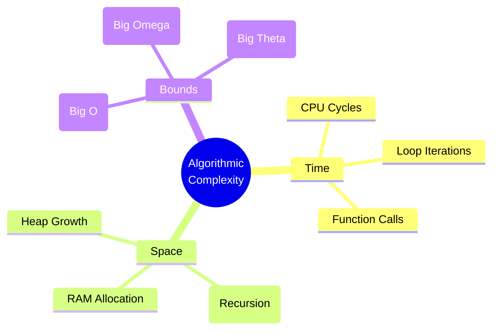
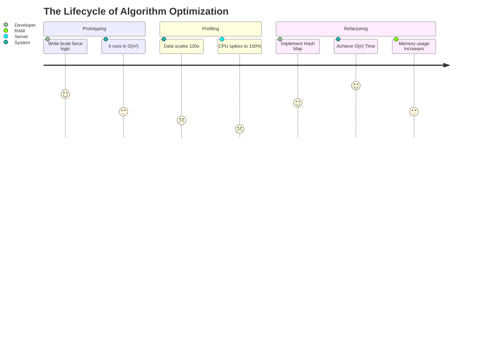
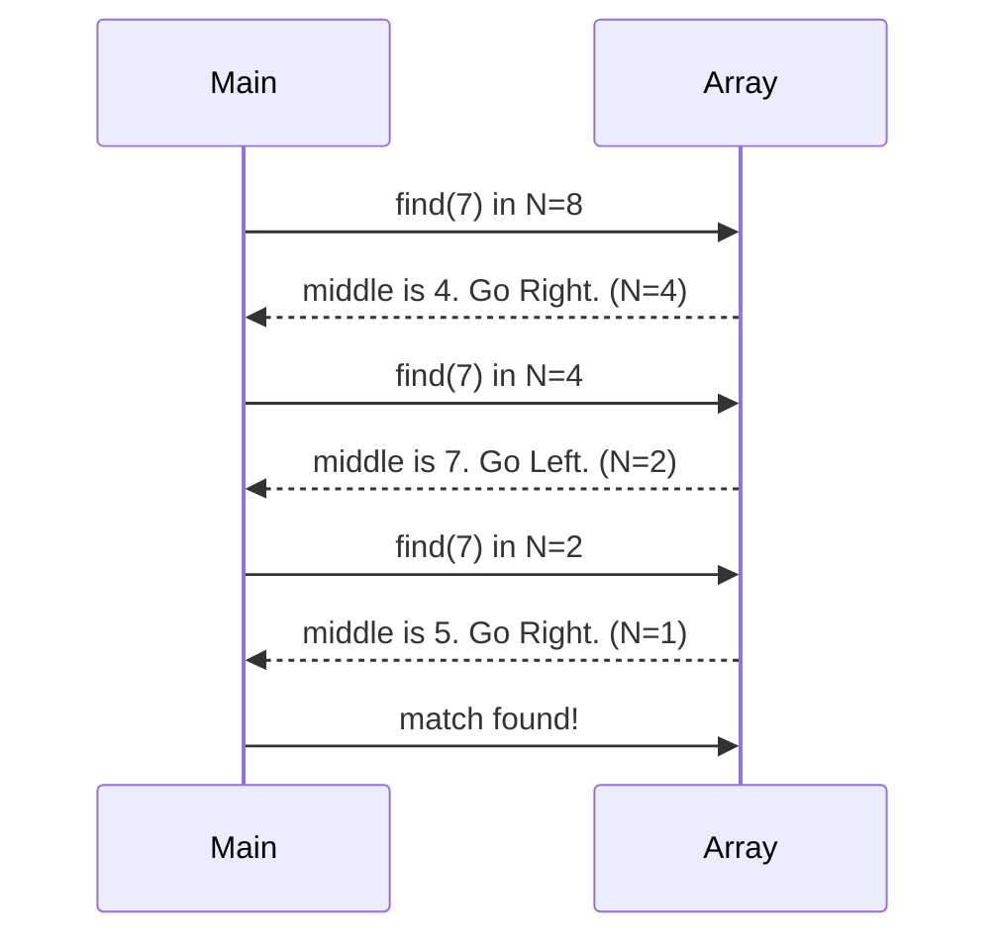
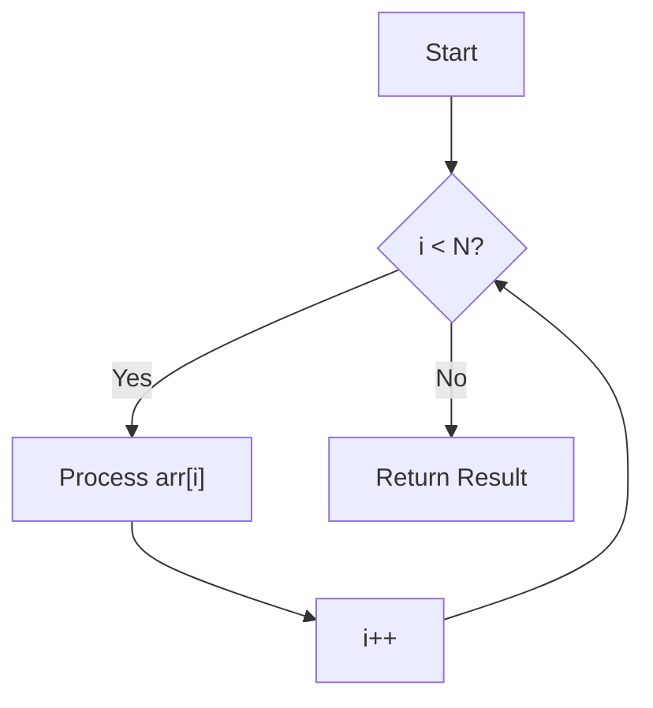
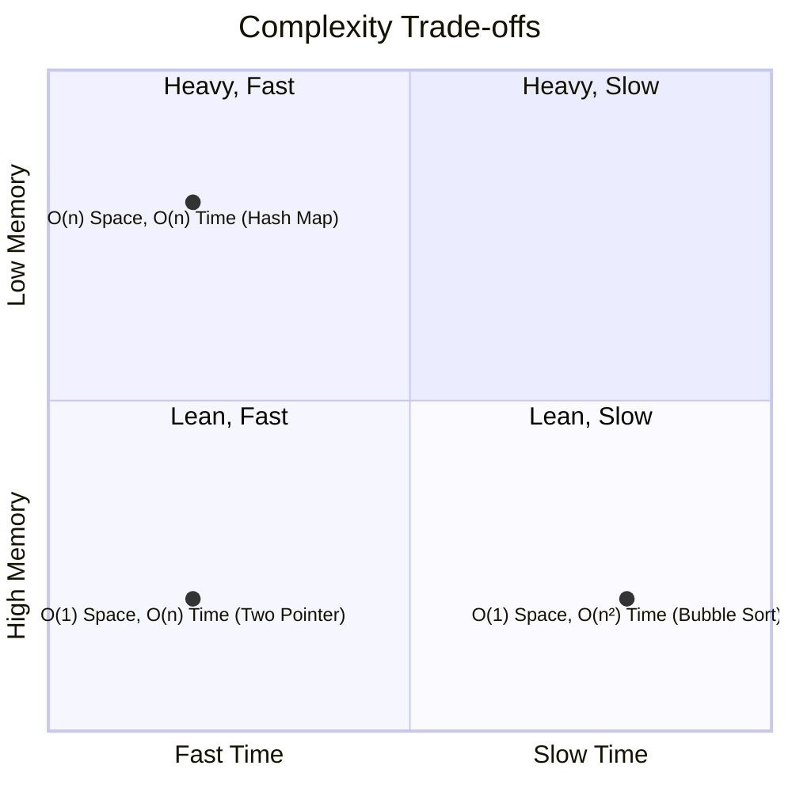
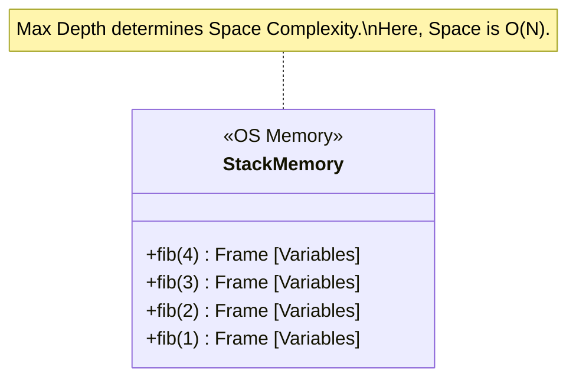
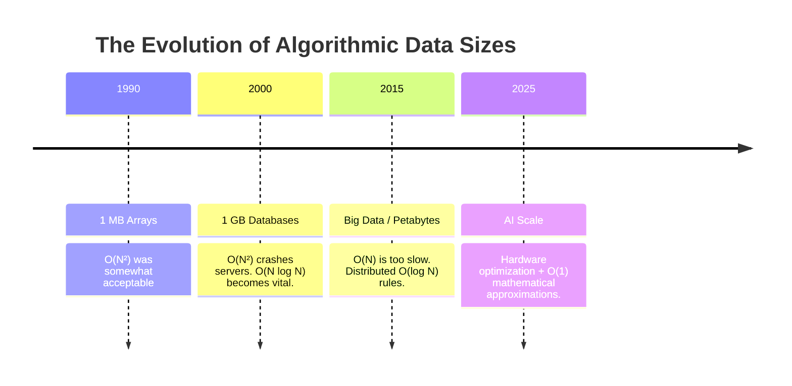

# 01-Big O Notation

> *"Amateurs measure algorithms in seconds. Professionals measure algorithms in operations. Masters measure algorithms in asymptotic growth."*

Welcome to the definitive guide on Big O Notation. In this chapter, we will strip away the mathematics to reveal the intuition, build the mental models used by Senior Engineers, and reconstruct the formal proofs to give you absolute confidence in any system design or technical interview.
---
## 📑 Table of Contents

- [🧭 Part 1: The Philosophy of Complexity (WHY before HOW)](#-part-1-the-philosophy-of-complexity-why-before-how)
  - [Why Big O Exists](#why-big-o-exists)
  - [The Rules of the Game: Asymptotic Analysis](#the-rules-of-the-game-asymptotic-analysis)
- [🔬 Part 2: The Formal Notations Explained](#-part-2-the-formal-notations-explained)
- [📈 Part 3: Visualizing the Complexity Spectrum](#-part-3-visualizing-the-complexity-spectrum)
- [🧠 Part 4: The Core Complexities (Deep Dive)](#-part-4-the-core-complexities-deep-dive)
  - [1. Constant Time: O(1)](#1-constant-time-o1)
  - [2. Logarithmic Time: O(log n)](#2-logarithmic-time-olog-n)
  - [3. Linear Time: O(n)](#3-linear-time-on)
  - [4. Quadratic Time: O(n²)](#4-quadratic-time-on2)
- [🌳 Part 5: Code Analysis & Mental Models](#-part-5-code-analysis--mental-models)
  - [The "Hidden N" Trap](#the-hidden-n-trap)
  - [Understanding Recursion Space: The Call Stack](#understanding-recursion-space-the-call-stack)
- [⚔️ Part 6: The Interviewer's Sandbox](#️-part-6-the-interviewers-sandbox)
- [📜 Part 7: Printable Summary & Cheat Sheet](#-part-7-printable-summary--cheat-sheet)
## 🧭 Part 1: The Philosophy of Complexity (WHY before HOW)

### Why Big O Exists

Imagine you write an algorithm to sort user data. You test it on your local machine, and it takes $0.05$ seconds. You deploy it. A year later, the database grows from $1,000$ users to $10,000,000$ users. Suddenly, the server crashes.

Why? Because measuring algorithms in **seconds** is a trap.

* A faster CPU will make bad code run faster.
* A different programming language (C++ vs Python) will change the execution time.
* Background processes alter runtime randomly.

**Big O Notation exists to separate the algorithm from the hardware.** It answers one universal question: **As the size of the input approaches infinity, how does the number of operations grow?**



### The Rules of the Game: Asymptotic Analysis

When we analyze algorithms, we look at the **Asymptotic Behavior**—what happens as the input $n$ gets unimaginably large.

#### 1. We Ignore Constants

If an algorithm takes $O(2n)$ or $O(500n)$, we simply call it $O(n)$.
**Why?** Because at $n = \infty$, multiplying by $500$ is mathematically irrelevant compared to a higher-order power. A line is a line, whether its slope is $1$ or $500$.

#### 2. We Ignore Lower-Order Terms

If an algorithm's exact operation count is $f(n) = n^2 + 5n + 1000$, we say it is $O(n^2)$.
**Why?** If $n = 1,000,000$:

* $n^2 = 1,000,000,000,000$
* $5n = 5,000,000$
The $n^2$ term accounts for $99.9995\%$ of the total work. The lower terms are statistical noise.

#### 3. Best, Average, and Worst Cases

* **Best Case:** The target is the very first item. (Rarely useful).
* **Average Case:** The statistically expected performance. (Useful for Hash Maps, QuickSort).
* **Worst Case:** The target is at the very end, or doesn't exist. **(This is what Big O measures).**

---

## 🔬 Part 2: The Formal Notations Explained

We casually say "Big O" for everything, but Computer Science relies on five distinct notations. Let's break them down mathematically and practically.

### 1. Big O ($O$): The Upper Bound (The Pessimist)

* **Definition:** $f(n) = O(g(n))$ if there exist positive constants $c$ and $n_0$ such that $0 \leq f(n) \leq c \cdot g(n)$ for all $n \geq n_0$.
* **Intuition:** The algorithm will grow **no faster than** this curve. It is the absolute worst-case ceiling.
* **Engineering Usage:** Used 99% of the time. When building a system, you must guarantee to stakeholders that a query will *never* exceed a certain threshold.

### 2. Big Omega ($\Omega$): The Lower Bound (The Optimist)

* **Definition:** $f(n) = \Omega(g(n))$ if there exist constants $c$ and $n_0$ such that $0 \leq c \cdot g(n) \leq f(n)$ for all $n \geq n_0$.
* **Intuition:** The algorithm will take **at least** this much time.
* **Engineering Usage:** Used to prove algorithmic limits. For example, any comparison-based sorting algorithm *must* look at every element at least once, making sorting inherently $\Omega(n \log n)$.

### 3. Big Theta ($\Theta$): The Tight Bound (The Realist)

* **Definition:** $f(n) = \Theta(g(n))$ if $f(n)$ is bounded both above and below by $g(n)$ multiplied by constants. (It is both $O$ and $\Omega$).
* **Intuition:** The algorithm grows **exactly like** this curve.
* **Engineering Usage:** Used in precise mathematical analysis when an algorithm's performance doesn't fluctuate based on input data (e.g., iterating through a fixed-size array).

### 4. Little o ($o$): The Strict Upper Bound

* **Definition:** $f(n) = o(g(n))$ if $\lim_{n \to \infty} \frac{f(n)}{g(n)} = 0$.
* **Intuition:** The algorithm is strictly **better/slower-growing** than $g(n)$. $O(n^2)$ includes $n^2$, but $o(n^2)$ means it *must* be strictly less (like $n \log n$).

### 5. Little omega ($\omega$): The Strict Lower Bound

* **Definition:** $f(n) = \omega(g(n))$ if $\lim_{n \to \infty} \frac{g(n)}{f(n)} = 0$.
* **Intuition:** The algorithm is strictly **worse/faster-growing** than $g(n)$.

| Notation | Bound Type | Math Analogy | Interview Question |
| --- | --- | --- | --- |
| **Big O** | Upper bound | $\leq$ | "What is the worst-case runtime?" |
| **Big $\Omega$** | Lower bound | $\geq$ | "What is the absolute best it could do?" |
| **Big $\Theta$** | Tight bound | $=$ | "What is the exact asymptotic behavior?" |



---

## 📈 Part 3: Visualizing the Complexity Spectrum

Understanding the difference between $O(n)$ and $O(n^2)$ is the difference between a system that runs smoothly and one that crashes during peak hours.

Here is a visual tool to interactively map out these mathematical boundaries. Notice how quickly the curves for $O(n^2)$ and $O(2^n)$ skyrocket, while $O(\log n)$ remains nearly flat even as $N$ grows massively.

---

## 🧠 Part 4: The Core Complexities (Deep Dive)

Let's dissect the primary time complexities using the rigorous 14-point framework required for engineering mastery.

### 1. Constant Time: $O(1)$

**1. Professional Explanation:** Execution time remains completely independent of the input size. Whether the array has 10 items or 10 billion items, the algorithm performs a fixed number of operations.

**2. Visual Intuition:**

```text
Array: [ Data0, Data1, Data2, ..., Data999999 ]
           ↑
        Directly access index 1 in one step.

```

**3. Mermaid Diagram (CPU State):**


**4. Real Java Example:**

```java
public class O1_Example {
    public int getFirstElement(int[] data) {
        if (data == null || data.length == 0) return -1;
        return data[0]; // Exactly 1 operation regardless of array size
    }
}

```

**5. Memory Explanation:** Arrays occupy contiguous blocks in RAM. The CPU calculates the exact memory address using `Base Address + (Index * Size)`. No searching required.
**6. CPU Explanation:** Requires a single ALU addition and one memory fetch instruction. No branching, no looping, pipeline prediction is perfect.
**7. Time Explanation:** Absolute flatline graph. Time $t = c$.
**8. Space Explanation:** Variables created (like index pointers) do not scale with the input. Space is $O(1)$.
**9. Interview Notes:** Hash Maps (Dictionaries) provide $O(1)$ lookup time on average. This is your primary weapon for optimizing nested loops.
**10. Common Mistakes:** Thinking a loop that runs exactly 1,000,000 times is $O(n)$. If the loop bounds are hardcoded constants (e.g., `for(int i=0; i<1000; i++)`), it is $O(1)$.
**11. Optimization:** You cannot optimize $O(1)$ asymptotically.
**12. Practice Question:** Write an $O(1)$ algorithm to determine if a number is even or odd.
**13. Solution:** `return (n & 1) == 0;` (Bitwise AND is a single CPU cycle).
**14. Cheat Sheet:** Arrays (by index), HashMaps (average), Math formulas.

---

### 2. Logarithmic Time: $O(\log n)$

**1. Professional Explanation:** The algorithm halves the problem size with each operation. The number of operations increases by 1 only when the input size doubles. Extremely efficient for massive datasets.

**2. Visual Intuition (Animated Thinking):**
Imagine searching for a word in a dictionary. You don't read page by page. You open the middle, determine if the word is to the left or right, and rip the book in half.

```text
Searching for '7'

8 elements left
[ 1  2  3  4  |  5  7  8  9 ]   (Is 7 > 4? Yes. Discard left half)
                 ↓
4 elements left
[ 5  7  |  8  9 ]               (Is 7 > 7? No. Discard right half)
   ↓
2 elements left
[ 5  |  7 ]                     (Is 7 > 5? Yes. Discard left)
        ↓
1 element left
[ 7 ] -> Found!

```

**3. Mermaid Diagram (Binary Search Journey):**



**4. Real Java Example:**

```java
public int binarySearch(int[] arr, int target) {
    int left = 0, right = arr.length - 1;
    while (left <= right) {
        int mid = left + (right - left) / 2; // Prevents integer overflow
        if (arr[mid] == target) return mid;
        if (arr[mid] < target) left = mid + 1;
        else right = mid - 1;
    }
    return -1;
}

```

**5. Memory Explanation:** Uses a few primitive pointer variables (`left`, `right`, `mid`).
**6. CPU Explanation:** High branch prediction hit rate if localized, but jumping across wide memory addresses can cause CPU Cache misses.
**7. Time Explanation:** Mathematically, $\log_2(n) = x$, where $2^x = n$. For 1,000,000 items, it takes ~20 operations. For 1,000,000,000 items, it takes ~30 operations.
**8. Space Explanation:** Iterative binary search is $O(1)$ space. Recursive binary search is $O(\log n)$ space due to the call stack overhead.
**9. Interview Notes:** If the input array is **sorted**, your first thought should immediately be "Can I use Binary Search?"
**10. Common Mistakes:** Calculating mid as `(left + right) / 2`. This will overflow for massively large arrays. Use `left + (right - left) / 2`.
**11. Optimization:** Ensure the data is sorted. If sorting takes $O(n \log n)$ but you search thousands of times, the upfront sort cost is worth the $O(\log n)$ retrieval.
**12. Practice Question:** Find the square root of $x$ without math libraries.
**13. Solution:** Use binary search between $0$ and $x/2$. Square the midpoint and compare to $x$.

---

### 3. Linear Time: $O(n)$

**1. Professional Explanation:** Execution time scales directly and proportionately with the size of the input data. You must touch every element at least once.

**2. Visual Intuition:**
Reading every page of a book to find a specific sentence.

```text
Data:  [ ■, ■, ■, ■, ■, ■ ]
Scan:    ↑  ↑  ↑  ↑  ↑  ↑
Steps:   1  2  3  4  5  6

```

**3. Mermaid Diagram (Code Flow):**



**4. Real Java Example:**

```java
public int findMax(int[] arr) {
    int max = Integer.MIN_VALUE;
    for (int num : arr) {
        if (num > max) {
            max = num;
        }
    }
    return max;
}

```

**5. Memory Explanation:** Iterating through an array is highly cache-friendly. The CPU pre-fetches contiguous memory blocks.
**6. CPU Explanation:** Linear scans take excellent advantage of CPU Spatial Locality.
**7. Time Explanation:** A straight diagonal line graph. Double the input, double the time.
**8. Space Explanation:** $O(1)$ auxiliary space used here.
**9. Interview Notes:** Be careful with String operations. `stringA + stringB` inside a loop often recreates the string, accidentally causing $O(n^2)$ time. Use `StringBuilder`.
**10. Common Mistakes:** "I have two `for` loops, one after the other. Is it $O(n^2)$?" No. $O(n + n) = O(2n)$, which reduces to $O(n)$.
**11. Optimization:** If you need to search multiple times, convert the array to a HashSet first ($O(n)$ upfront space, but allows $O(1)$ subsequent lookups).
**12. Practice Question:** Find the missing number in an array containing $1$ to $N$.
**13. Solution:** Use Gauss's formula: $\sum = \frac{n(n+1)}{2}$, then subtract the sum of the array. Takes exactly $O(n)$ time.

---

### 4. Quadratic Time: $O(n^2)$

**1. Professional Explanation:** For every element, you iterate over every other element. The growth curve explodes quadratically. Generally unacceptable for production systems handling large data.

**2. Visual Intuition (Combinatorial Explosion):**
Imagine a hand-shake algorithm. If 5 people enter a room, they don't do 5 handshakes. Person 1 shakes 4 hands. Person 2 shakes 3 hands...

```text
■ ■ ■ ■
For each square, look at every other square:
[0] compares with [1], [2], [3]
[1] compares with [0], [2], [3]
[2] compares with [0], [1], [3]
[3] compares with [0], [1], [2]
Grid size is N × N.

```

**3. Mermaid Diagram (Time vs Space Tradeoffs):**



**4. Real Java Example:**

```java
public void printAllPairs(int[] arr) {
    for (int i = 0; i < arr.length; i++) {
        for (int j = 0; j < arr.length; j++) {
            System.out.println(arr[i] + ", " + arr[j]);
        }
    }
}

```

**5. Memory/Space Explanation:** Usually $O(1)$ space, which is why developers fall into the trap of using it—it doesn't crash RAM, it just grinds the CPU to a halt.
**6. CPU Explanation:** Triggers massive context switching and cache thrashing if inner loops process disjointed memory segments.
**7. Time Explanation:** A parabola. If $N = 1000$, steps = $1,000,000$.
**8. Interview Notes:** In technical interviews, the brute force solution is almost always $O(n^2)$. Your job is to recognize it, say it out loud, and say "I can do better using a Hash Map or sorting."
**10. Common Mistakes:** Forgetting that methods like `array.indexOf()` or `string.contains()` are inherently $O(n)$. Putting them inside a `for` loop quietly makes your code $O(n^2)$.
**11. Optimization:** Sort the data first ($O(n \log n)$) or use Two Pointers.
**12. Practice Question:** Detect if an array has duplicate elements.
**13. Solution:** $O(n^2)$ is comparing every pair. Optimized $O(n)$ solution: Add elements to a `HashSet`. If `set.add()` returns false, a duplicate exists.

---

## 🌳 Part 5: Code Analysis & Mental Models

How do Senior Engineers identify complexity in 3 seconds? They parse the code into an AST (Abstract Syntax Tree) in their minds. Use this decision tree:

```mermaid
graph TD
    A[Look at the code] --> B{Are there loops?}
    B -- No --> C[O(1) Constant]
    B -- Yes --> D{Are loops nested?}
    D -- Yes --> E{Are they dependent?}
    E -- No --> F[Outer N * Inner M = O(N * M)]
    E -- Yes --> G[Outer N * Inner N-i = O(N²)]
    D -- No --> H{Does the step double/halve?}
    H -- Yes --> I[O(log N)]
    H -- No --> J[O(N) Linear]

```

### The "Hidden N" Trap

Sometimes complexity hides behind clean abstractions.

```java
for (String word : wordList) {          // O(N) where N is words
    String reversed = reverse(word);    // O(L) where L is word length
    System.out.println(reversed);
}

```

**Total Complexity:** $O(N \cdot L)$. Never assume built-in functions are $O(1)$!

### Understanding Recursion Space: The Call Stack

Recursion is rarely $O(1)$ space. Every function call allocates a new frame on the system Call Stack.



---

## ⚔️ Part 6: The Interviewer's Sandbox

When interviewing at FAANG, they test your ability to trade Space for Time.

**Scenario:** You have two arrays of size $N$ and $M$. Find the common elements.

**Junior Developer:**
"I'll loop through $N$, and inside that loop, check if it exists in $M$."

* Time: $O(N \cdot M)$
* Space: $O(1)$
* *Result: Rejection.*

**Senior Developer:**
"I will load array $M$ into a HashSet. Then I will loop through array $N$ and check the set."

* Time: $O(M)$ to build set + $O(N)$ to scan = $O(N + M)$
* Space: $O(M)$ for the HashSet.
* *Result: Hired. They successfully traded RAM to save CPU cycles.*

---

## 📜 Part 7: Printable Summary & Cheat Sheet

### Time Complexity Taxonomy

* $O(1)$: Pure magic. (Direct indexing, Hash Maps).
* $O(\log n)$: Fast as light. (Binary Search, Balanced Trees).
* $O(n)$: Blue-collar work. (Iteration, simple search).
* $O(n \log n)$: The limit of sorting. (Merge Sort, Quick Sort, Timsort).
* $O(n^2)$: Dangerous. (Nested loops, 2D matrices).
* $O(2^n)$: Combinatorial explosion. (Brute-force recursion, subsets).
* $O(n!)$: Heat death of the universe. (Generating permutations, TSP brute force).

### The Golden Rules of Big O

1. **Drop Constants:** $O(2n) \rightarrow O(n)$.
2. **Drop Non-Dominant Terms:** $O(n^2 + n) \rightarrow O(n^2)$.
3. **Multiplication vs Addition:** * Loops sequentially: Add. $O(A + B)$.
* Loops nested: Multiply. $O(A \cdot B)$.


4. **Space matters:** Time is cheap, memory is finite. Recursive algorithms cost memory linearly equal to the maximum stack depth.



---

*End of Chapter 1. Ensure you master the mental models before proceeding to Chapter 5: Advanced Data Structures.*
