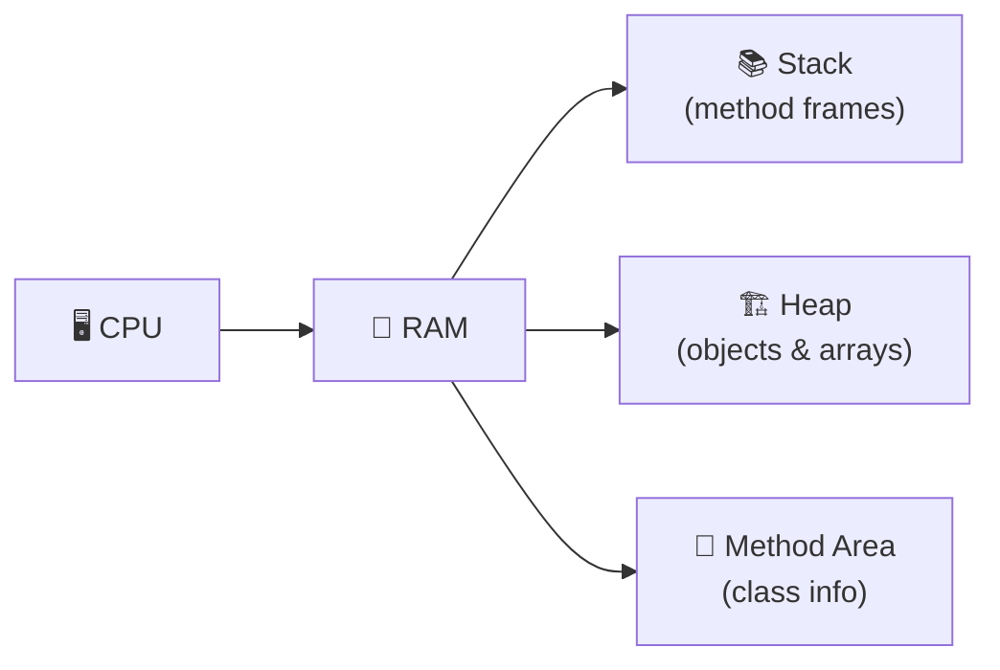
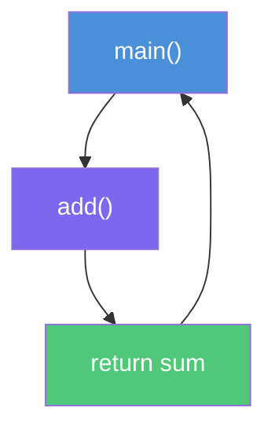
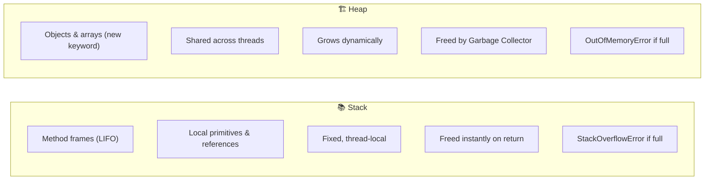
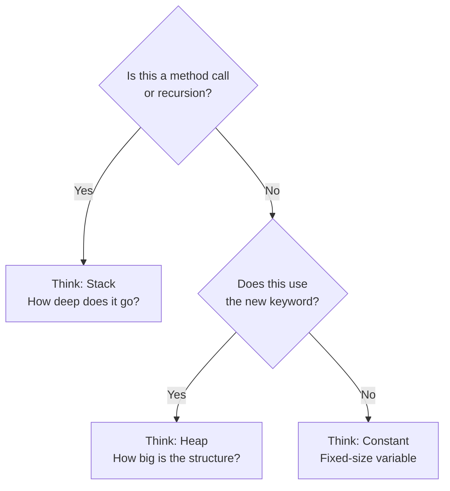

# 03-Space Complexity

> *"An algorithm must be seen to be believed."* — Donald Knuth

---

## Table of Contents

1. [Introduction](#introduction)
2. [How Programs Really Run](#how-programs-really-run)
3. [What is RAM?](#what-is-ram)
4. [Memory Layout](#memory-layout)
5. [Stack Memory](#stack-memory)
6. [Heap Memory](#heap-memory)
7. [Primitive Variables vs Objects](#primitive-variables-vs-objects)
8. [Memory Cost Table](#memory-cost-table)
9. [Why Java Doesn't Give Exact Memory Sizes](#why-java-doesnt-give-exact-memory-sizes)
10. [Garbage Collection](#garbage-collection)
11. [Memory Leaks](#memory-leaks)
12. [What is Space Complexity?](#what-is-space-complexity)
13. [Types of Space Complexity](#types-of-space-complexity)
14. [Space Complexity Decision Tree](#space-complexity-decision-tree)
15. [Memory Simulation](#memory-simulation)
16. [Memory Timeline](#memory-timeline)
17. [Common Mistakes](#common-mistakes)
18. [Myth Busters](#myth-busters)
19. [Interview Thinking](#interview-thinking)
20. [Real-World Memory Stories](#real-world-memory-stories)
21. [How Senior Engineers Think](#how-senior-engineers-think)
22. [Interview Dialogue](#interview-dialogue)
23. [Heap vs Stack Comparison](#heap-vs-stack-comparison)
24. [Memory Quiz](#memory-quiz)
25. [Cheat Sheet](#cheat-sheet)
26. [Practice Problems](#practice-problems)
27. [Space Complexity Roadmap](#space-complexity-roadmap)
28. [Final Thought](#final-thought)

---

## Introduction

Imagine you are moving into a new apartment. You care about two things: how quickly you can unpack your boxes, and whether everything actually fits inside the rooms. A fast unpacker who arrives with a truck full of furniture and nowhere to put it has not solved the problem — they have created a new one.

Algorithms work the same way.

When we study algorithms, we usually begin with **time complexity**: how many steps does this algorithm need? That is the unpacking speed. But there is a second question that is equally important and far too often ignored until something goes catastrophically wrong in production: **how much memory does this algorithm consume?**

Memory is not infinite. A laptop running a Java application might have 8 or 16 gigabytes of RAM, but that memory is shared with the operating system, the browser, the editor, and dozens of background processes. The memory your program is actually allowed to use is a fraction of what the machine physically contains. When your algorithm exceeds that budget, the operating system does not politely ask it to stop — it terminates the program abruptly, or starts evicting memory to disk in a process so slow it can make a fast algorithm feel like it is running underwater.

Real-world disasters have happened because engineers underestimated memory. Servers have crashed under load not because the CPU was saturated, but because each request silently allocated megabytes of objects that were never released quickly enough. Mobile apps have been rejected from app stores because they consumed too much RAM on low-end devices. Video games have stuttered not from slow code but from the garbage collector pausing execution to clean up the heap.

Speed and space are two dimensions of the same problem. A great engineer thinks about both.

There is also a practical, career-level reason to care about this. Technical interviews at top software companies routinely ask for the space complexity of your solution. Saying "O(n) time" without mentioning space signals to the interviewer that you have an incomplete mental model. The strongest candidates can articulate both dimensions fluently, explain where the memory is actually being consumed, and often propose a trade-off between the two.

This chapter will take you from the physical reality of RAM all the way to analyzing algorithms the way a senior engineer or a technical interviewer would. We will start at the foundation — how a Java program actually runs — and build every concept on top of that foundation until space complexity feels not like a formula to memorize, but like a natural way of reading code.

---

## How Programs Really Run

Before we can talk about memory, we need to understand the journey a program takes from the text you write to the instructions a CPU executes. Most beginners think of this as a black box. We are going to open it.

When you write Java code in a file like `Main.java`, you have written something that a human can read but a computer cannot execute directly. The CPU speaks in machine code — raw binary instructions specific to its architecture. Java code is nowhere near that level. There is a whole chain of transformation that happens every time you hit "run."

```
Your Java Source Code   (Main.java)
          │
          ▼
      Java Compiler      (javac)
          │
          ▼
        Bytecode          (Main.class)
          │
          ▼
  Java Virtual Machine   (JVM)
          │
          ▼
    Operating System
          │
          ▼
          RAM
          │
          ▼
          CPU
```





Let us walk through each step.

**Java Source Code** is what you write. It is human-readable text that expresses your intent — loops, variables, method calls, conditions.

**The Java Compiler (`javac`)** translates your source code into **bytecode**, stored in `.class` files. Bytecode is not machine code. It is a set of instructions designed for an imaginary, platform-neutral machine — the Java Virtual Machine.

**The JVM** is a program that reads bytecode and translates it into actual machine instructions for the real CPU it is running on. This is why Java is "write once, run anywhere": the same `.class` file runs on Windows, macOS, and Linux because each platform has its own JVM that handles the final translation.

**The Operating System** acts as a gatekeeper. The JVM does not directly control RAM. Instead, it asks the operating system — Windows, macOS, Linux — for memory. The OS grants regions of memory to the JVM process, and the JVM manages those regions internally.

**RAM (Random Access Memory)** is where your program actually lives while it runs. Every variable, every object, every string, every method call occupies a piece of RAM. We will spend most of this chapter here.

**The CPU** reads instructions from RAM, executes them, and writes results back to RAM. It is blindingly fast, but it can only work on what is already loaded into memory.

This pipeline explains something important: memory consumption is not just about the data your algorithm processes. It includes the overhead of method calls, the instructions themselves, the JVM's internal bookkeeping, and much more. When we analyze space complexity, we focus specifically on the memory your algorithm's own logic consumes — but understanding the full picture helps you reason about the system holistically.

---

## What is RAM?

Let us build an intuition for RAM before we discuss how programs use it.

Think of RAM as a massive row of numbered mailboxes — millions or billions of them, depending on how much memory your computer has. Each mailbox holds exactly one byte (eight bits). Every mailbox has a unique address, starting from 0 and counting up.

```
Address:  0    1    2    3    4    5    6    7    ...
        ┌────┬────┬────┬────┬────┬────┬────┬────┬─────┐
        │    │    │    │    │    │    │    │    │ ... │
        └────┴────┴────┴────┴────┴────┴────┴────┴─────┘
```

When your program needs to store an integer, it asks the operating system for four consecutive mailboxes (since Java's `int` is 32 bits = 4 bytes). The OS responds with an address, and from that moment on, those four mailboxes belong to your integer for as long as the variable exists.

RAM has one superpower that makes it different from storage (like a hard drive): any mailbox can be accessed in the same amount of time, regardless of its address. You can jump directly to address 4,000,000 as fast as you can read address 7. This is what "random access" means — the access time is random in the sense that it does not depend on where in memory you look.

This is relevant to us because algorithms that access memory in predictable, sequential patterns tend to be faster in practice (due to CPU cache behavior), while algorithms that scatter their memory accesses pay a hidden performance cost that Big-O notation does not capture.

Programs do not request individual bytes one at a time. The JVM requests large regions of memory from the OS upfront, and then manages those regions internally. These regions are divided into distinct areas — some for your method calls, some for your objects — and understanding that division is the key to understanding space complexity.

---

## Memory Layout

When the JVM runs your program, it divides its allocated memory into several distinct regions. Two of them are what every developer must understand deeply: the **Stack** and the **Heap**.

```
  JVM Memory Layout
  ─────────────────────────────────────────────────────
  │                                                   │
  │   Stack                        Heap               │
  │  ┌──────────────┐         ┌──────────────────┐    │
  │  │ Frame 3      │         │  Object C        │    │
  │  │  local vars  │         │  Object A        │    │
  │  ├──────────────┤         │  Object B        │    │
  │  │ Frame 2      │         │  String "hello"  │    │
  │  │  local vars  │         │  int[] array     │    │
  │  ├──────────────┤         │                  │    │
  │  │ Frame 1      │         │  (grows freely)  │    │
  │  │  local vars  │         └──────────────────┘    │
  │  └──────────────┘                                 │
  │  (grows downward)                                 │
  │                                                   │
  │   (Other regions: Method Area, PC Registers...)   │
  └───────────────────────────────────────────────────┘
```

The **Stack** is the region where method calls and local variables live. It is organized, compact, and managed automatically. When you call a method, memory is pushed onto the stack. When the method returns, that memory is instantly reclaimed.

The **Heap** is the region where objects, arrays, and strings live. It is large, flexible, and managed by the garbage collector. Objects on the heap persist until nothing in the program refers to them anymore.

We will explore each region in detail now.

---

## Stack Memory

Picture a stack of trays in a cafeteria. You can only add a new tray to the top, and you can only remove the top tray. That is the exact structure of stack memory — **Last In, First Out (LIFO)**.

Every time your program calls a method, the JVM creates a **stack frame** for that method and pushes it onto the top of the stack. The frame contains:

- All **local variables** declared inside the method
- The **parameters** passed to the method
- The **return address** — where execution should resume when the method finishes
- Intermediate computation results

When the method returns, its frame is popped off the stack and all that memory is instantly released. No cleanup code runs. No garbage collector intervenes. The stack pointer simply moves back to where it was before.

This is why the stack is so fast: allocating and deallocating memory on the stack is a single operation — move a pointer.

Let us trace through a simple example:

```java
public class Example {
    public static void main(String[] args) {
        int result = add(3, 5);
        System.out.println(result);
    }

    public static int add(int a, int b) {
        int sum = a + b;
        return sum;
    }
}
```

**Step 1: `main` is called**

```
Stack
┌──────────────────────────┐  ← Top of stack
│  Frame: main             │
│  ┌────────────────────┐  │
│  │ args = (reference) │  │
│  │ result = ?         │  │
│  └────────────────────┘  │
└──────────────────────────┘
```

**Step 2: `add(3, 5)` is called**

```
Stack
┌──────────────────────────┐  ← Top of stack
│  Frame: add              │
│  ┌────────────────────┐  │
│  │ a = 3              │  │
│  │ b = 5              │  │
│  │ sum = ?            │  │
│  └────────────────────┘  │
├──────────────────────────┤
│  Frame: main             │
│  ┌────────────────────┐  │
│  │ args = (reference) │  │
│  │ result = ?         │  │
│  └────────────────────┘  │
└──────────────────────────┘
```

**Step 3: `sum = a + b` executes, `add` returns**

```
Stack
┌──────────────────────────┐  ← Frame: add is GONE
│  Frame: main             │
│  ┌────────────────────┐  │
│  │ args = (reference) │  │
│  │ result = 8         │  │  ← return value captured
│  └────────────────────┘  │
└──────────────────────────┘
```

The memory that `add`'s frame occupied is instantly reclaimed the moment `add` returns. The stack has a fixed maximum size (you can configure it with JVM flags), and if you exceed it — for example, by calling methods recursively without a base case — you get the famously named `StackOverflowError`.

This is also why **recursion has space implications that iteration does not**: each recursive call adds a new frame to the stack. A recursion that is 10,000 levels deep has 10,000 frames on the stack simultaneously.

> 🧠 **Mental Model:** Stack = a pile of cafeteria trays. You can only touch the top one. Add a tray (call a method), remove a tray (return from it). The pile has a height limit — stack too high, and it tips over (`StackOverflowError`).

> 🎯 **Interview Angle:** Whenever an interviewer sees recursion in your solution, they are silently asking "how deep does this go?" If you can answer that without being asked, you have already demonstrated the space-complexity instinct they are testing for.

---

## Heap Memory

The Heap is the opposite of the Stack in almost every way. Where the Stack is rigid and automatic, the Heap is flexible and manually managed (with the garbage collector doing the cleanup work on your behalf in Java).

Every time you use the `new` keyword in Java, memory is allocated on the Heap.

```java
int[] numbers = new int[5];
String greeting = new String("hello");
ArrayList<Integer> list = new ArrayList<>();
```

In each of these cases:

- The **variable** (`numbers`, `greeting`, `list`) lives on the Stack
- The **actual data** (the array, the string characters, the list internals) lives on the Heap

The variable on the Stack does not hold the data itself. It holds a **reference** — an address that points to where the data lives in the Heap. This distinction is fundamental.

```
Stack                        Heap
┌─────────────────┐         ┌──────────────────────────┐
│ Frame: main     │         │                          │
│ ┌─────────────┐ │         │  Address 1004:           │
│ │ numbers ────┼─┼────────►│  [0, 0, 0, 0, 0]        │
│ │  (ref:1004) │ │         │                          │
│ │             │ │         │  Address 2048:           │
│ │ greeting ───┼─┼────────►│  "hello"                 │
│ │  (ref:2048) │ │         │                          │
│ └─────────────┘ │         └──────────────────────────┘
└─────────────────┘
```

The arrow represents the reference. When you write `numbers[0] = 42`, Java follows the reference to address 1004 and writes 42 into the first slot of the array in the Heap.

This indirection has a profound implication for space complexity. When you pass an array to a method, you are not copying the entire array — you are copying the reference. The reference itself is tiny (typically 4 or 8 bytes). The array still lives in one place in the Heap, and both the caller and the callee can see it through their references.

```java
public static void fill(int[] arr) {
    for (int i = 0; i < arr.length; i++) {
        arr[i] = i * 2;
    }
}
```

Calling `fill(numbers)` does not double the memory usage of the array. Only a small reference is added to the Stack. This is why large arrays and objects can be passed to methods efficiently — but it is also why methods can unexpectedly modify data you did not intend them to change.

The Heap is larger than the Stack and grows dynamically. Objects can be allocated and can reference other objects, forming complex graphs of interconnected data. This flexibility comes with a cost: the Heap requires a garbage collector to reclaim memory from objects that are no longer needed.

> 🧠 **Mental Model:** Heap = a big warehouse with no fixed shelving plan. Anyone holding a claim ticket (a reference) can find their item, no matter where the warehouse staff (the JVM) decided to put it. The Stack, by contrast, is more like a single organized shelf where you only ever touch the top item.

---

## Primitive Variables vs Objects

Java has two categories of data, and they have entirely different relationships with memory.

**Primitive types** store their value directly. They are:

| Type      | Size    | Example value |
|-----------|---------|---------------|
| `byte`    | 1 byte  | `127`         |
| `short`   | 2 bytes | `32000`       |
| `int`     | 4 bytes | `42`          |
| `long`    | 8 bytes | `9999999999L` |
| `float`   | 4 bytes | `3.14f`       |
| `double`  | 8 bytes | `3.14159`     |
| `char`    | 2 bytes | `'A'`         |
| `boolean` | 1 byte  | `true`        |

When you declare `int x = 42` inside a method, the value `42` is stored directly inside the Stack frame. There is no Heap involvement. The variable and its value are one and the same thing.

```
Stack Frame
┌──────────────┐
│ x = 42       │  ← value stored directly here
│ y = true     │  ← value stored directly here
│ z = 3.14     │  ← value stored directly here
└──────────────┘
```

**Reference types** (everything else) behave differently. When you declare an object, the Stack frame holds only a reference — a memory address pointing to the actual object data in the Heap.

```java
int x = 42;                     // primitive → value on Stack
int[] arr = new int[]{1,2,3};   // reference → Stack holds address, data on Heap
String name = "Alice";          // reference → Stack holds address, data on Heap
StringBuilder sb = new StringBuilder();  // reference → Stack holds address, data on Heap
```

```
Stack Frame                 Heap
┌────────────────┐         ┌─────────────────────┐
│ x    =  42     │         │                     │
│ arr  → ────────┼────────►│  [1, 2, 3]          │
│ name → ────────┼────────►│  "Alice"            │
│ sb   → ────────┼────────►│  StringBuilder obj  │
└────────────────┘         └─────────────────────┘
```

This distinction matters deeply for space complexity because:

1. A method with only primitive local variables uses only Stack memory proportional to the number of those variables — no Heap allocation.
2. A method that creates objects, arrays, or strings allocates memory on the Heap, and that memory may outlive the method call itself.
3. When you pass a primitive to a method, a copy is made. When you pass a reference type, only the reference is copied — the Heap object is shared.

Understanding this division makes it possible to look at a piece of code and immediately identify where memory is being consumed and whether that memory is on the Stack (fast, automatic, limited) or the Heap (larger, flexible, requires collection).

---

## Memory Cost Table

Understanding the exact byte cost of each Java type helps you estimate the memory footprint of your data structures before you even run the code.

| Java Type   | Size          | Notes                                    |
|-------------|---------------|------------------------------------------|
| `byte`      | 1 byte        | Smallest integer type                    |
| `short`     | 2 bytes       | Rarely used in modern code               |
| `int`       | 4 bytes       | Default integer type                     |
| `long`      | 8 bytes       | 64-bit integer                           |
| `float`     | 4 bytes       | Single-precision floating point          |
| `double`    | 8 bytes       | Default floating point type              |
| `char`      | 2 bytes       | Unicode character (UTF-16)               |
| `boolean`   | JVM-dependent | Typically 1 byte, sometimes 4 bytes      |
| Reference   | 4 or 8 bytes  | Depends on JVM and Compressed OOPs       |
| Object header | 12–16 bytes | Every object pays this overhead          |
| Array header | 16 bytes     | Object header + length field             |

> 🧠 **Key Insight:** When you create `new int[n]`, the actual memory used is not just `4 * n` bytes. It is `16 bytes (header) + 4 * n bytes (elements)`, rounded up to the nearest 8 bytes for alignment. For large arrays this is negligible. For millions of tiny objects, the header overhead can dominate.

---

## Why Java Doesn't Give Exact Memory Sizes

This is one of the most misunderstood topics in Java memory. You will often see answers like "an Object takes 8 bytes" — and that is almost always wrong.

### Object Header

Every Java object carries a hidden overhead that you never write in your code:

```
┌──────────────────────────────────────────────┐
│ Object in Heap                               │
├────────────────┬─────────────────────────────┤
│ Mark Word      │ 8 bytes  (GC info, hashcode,│
│                │           lock state)        │
├────────────────┼─────────────────────────────┤
│ Class Pointer  │ 4 or 8 bytes (points to     │
│                │  class metadata)             │
├────────────────┼─────────────────────────────┤
│ Your fields    │ whatever you declared        │
└────────────────┴─────────────────────────────┘
```

So a class with a single `int` field:
```java
class Box {
    int value;  // 4 bytes
}
```
Does **not** consume 4 bytes. It consumes:
- 8 bytes (mark word) + 4 bytes (class pointer with Compressed OOPs) + 4 bytes (`value`) = **16 bytes**.

### 64-bit JVM and Compressed OOPs

On a modern 64-bit JVM, references are theoretically 8 bytes. But the JVM uses a trick called **Compressed Ordinary Object Pointers (Compressed OOPs)**: when the heap is under 32 GB, it compresses references to 4 bytes, saving significant memory in object-heavy programs.

```
Heap < 32 GB   → References are 4 bytes  (Compressed OOPs ON)
Heap ≥ 32 GB   → References are 8 bytes  (Compressed OOPs OFF)
```

### Padding and Alignment

The JVM aligns objects to 8-byte boundaries. If your object's fields add up to 13 bytes, the JVM pads it to 16 bytes.

```
class Weird {
    byte a;    // 1 byte
    int b;     // 4 bytes
    byte c;    // 1 byte
    // Total fields = 6 bytes
    // With header (12 bytes) = 18 bytes
    // Padded to next 8-byte boundary = 24 bytes
}
```

### The Practical Lesson

For Big-O analysis, these details do not matter — we drop constants. But for real systems work (profiling, reducing memory pressure, designing cache-efficient data structures), understanding JVM object layout is essential.

> 💡 **Tool Tip:** Use [Java Object Layout (JOL)](https://openjdk.org/projects/code-tools/jol/) to inspect the exact memory layout of any Java object in your specific JVM version.

---

## Garbage Collection

The Heap can grow large, but it is not infinite. Objects that are no longer needed must eventually be removed so their memory can be reused. In languages like C and C++, this is the programmer's responsibility — you allocate memory, and you free it manually. Forgetting to free memory causes **memory leaks**, one of the most destructive bugs in systems programming.

Java removes this burden from the programmer by providing a **Garbage Collector (GC)** — a background process that automatically identifies and removes objects that your program can no longer use.

The GC's core question is: **can this object be reached from anywhere in the running program?**

An object is **reachable** if there is a chain of references from some active part of your program that leads to it. An object is **unreachable** — and therefore eligible for collection — when no such chain exists.

```
Before:                          After reassignment:

Stack                            Stack
┌───────────────┐               ┌───────────────┐
│ list → ───────┼──►[1,2,3]    │ list → ───────┼──► [4,5,6]  (new object)
└───────────────┘               └───────────────┘
                                                  
                                [1,2,3] ← UNREACHABLE
                                         (eligible for GC)
```

When you write:

```java
int[] list = new int[]{1, 2, 3};
list = new int[]{4, 5, 6};      // list now points to a new array
```

The original array `[1, 2, 3]` is still sitting in the Heap, but nothing points to it anymore. The GC will eventually discover this and reclaim that memory.

The garbage collector runs periodically, not instantaneously. This means that between when an object becomes unreachable and when the GC reclaims its memory, that memory is still occupied. In space complexity analysis, we typically assume the GC runs when needed, but in real-world performance work, GC pauses and GC pressure are important considerations.

What this means for us: **creating many short-lived objects in a tight loop is not "free" from a memory perspective**, even if each individual object is small. They accumulate in the Heap faster than the GC can collect them. Good algorithm design considers object creation, not just variable declaration.

> 🧠 **Mental Model:** GC = a building superintendent who periodically walks every floor checking which apartments (objects) no longer have a lease (a reference) attached. No lease means the apartment gets cleared for the next tenant. The walk-through is not instant — it happens on its own schedule, which is why "unreachable" and "already freed" are not the same moment.

---

## Memory Leaks

A **memory leak** in Java occurs when objects are no longer needed by your program, but references to them still exist — preventing the garbage collector from reclaiming the memory. Unlike C or C++, Java cannot have "dangling pointer" leaks, but it absolutely can have **logical leaks**: objects that are technically reachable but semantically dead.

### Classic Memory Leak Example

```java
List<Object> cache = new ArrayList<>();

while (true) {
    cache.add(new Object());  // forever adding, never removing
}
```

This will eventually throw:
```
java.lang.OutOfMemoryError: Java heap space
```

**Why `OutOfMemoryError` and not `StackOverflowError`?**

| Error               | Cause                                          | Region   |
|---------------------|------------------------------------------------|----------|
| `StackOverflowError`| Call stack grew too deep (infinite recursion)  | Stack    |
| `OutOfMemoryError`  | Heap exhausted (too many live objects)         | Heap     |

The loop above never recurses — the Stack stays constant. But every iteration adds a new `Object` to the Heap, and `cache` holds references to all of them. The GC cannot collect any of them because they are still reachable through `cache`. Memory grows without bound until the JVM has nowhere left to allocate.

### More Subtle Leak

```java
public class EventSystem {
    private List<Listener> listeners = new ArrayList<>();

    public void register(Listener l) {
        listeners.add(l);
    }

    // Bug: no deregister() method!
    // Every registered listener stays in memory forever.
}
```

Even when the component that created a `Listener` is done using it, `EventSystem` still holds a reference. This is the most common real-world memory leak pattern in Java.

### Prevention Rules

1. **Close what you open** — streams, connections, listeners.
2. **Use weak references** for caches: `WeakHashMap` lets the GC collect entries when keys are no longer used elsewhere.
3. **Size-bound your caches** — never grow a cache unboundedly; use LRU eviction.
4. **Profile, don't guess** — use tools like VisualVM, JProfiler, or heap dumps to find real leaks.

> 🎯 **Interview Angle:** If an interviewer asks "why is your algorithm using O(n) space?" and your answer involves a cache or memoization table, follow up with "in production, I'd add a size bound or expiration policy to prevent unbounded growth."

---

## What is Space Complexity?

We have built the foundation. Now we can define the concept properly.

**Space complexity** is a measure of how much memory an algorithm uses as a function of its input size. It answers the question: as the input grows, how does my algorithm's memory consumption grow?

But there is an important subtlety here, and most explanations gloss over it: **should we count the memory used by the input itself?**

Consider a function that takes an array of `n` integers and returns its maximum value. The array occupies `n` slots of memory. But that memory was going to exist regardless of which algorithm you chose — you were given that data. The question we really care about is: **how much extra memory does your algorithm need, above and beyond what it was given?**

This extra memory is called **Auxiliary Space**.

```
Total Space = Input Space + Auxiliary Space
Space Complexity (as typically used) = Auxiliary Space
```

When an interviewer asks "what is the space complexity of your solution?", they almost always mean: how much additional memory does your algorithm allocate? The input is assumed to already exist.

There are contexts where total space matters — for instance, when you are deciding whether you can even afford to load the input into memory. But for algorithm analysis, **we measure auxiliary space**.

This makes intuitive sense. A sorting algorithm that rearranges elements within the original array without creating new arrays is fundamentally different from one that creates a copy of the array to work on. The first uses O(1) auxiliary space; the second uses O(n) auxiliary space. Even though both receive the same input, one is far more memory-efficient.

Space complexity, like time complexity, is expressed using **Big-O notation**, which describes the asymptotic behavior — how the space requirement grows as the input size `n` approaches infinity, ignoring constant factors and lower-order terms.

---

## Types of Space Complexity

> 💡 **How to Think (not memorize):** For any new complexity class you meet — in this chapter or any future one — ask three questions in order:
> 1. **What new structure does the algorithm create** (array, list, map, recursion frame)?
> 2. **Does its size depend on `n`, on a fixed constant, or on something smaller than `n`** (like `log n`)?
> 3. **Where does it live** — Stack (recursion) or Heap (`new`)?
>
> The Big-O label falls out automatically once you answer these three. You never need to memorize "this pattern = O(n²)" — you derive it every time.

### O(1) — Constant Space

An algorithm uses **O(1) auxiliary space** when the amount of extra memory it uses does not depend on the size of the input at all. No matter how large the array you pass in, the algorithm uses the same fixed amount of additional memory.

**Intuition:** Imagine reading through a thousand-page book and keeping only one sticky note to track your place. The number of sticky notes does not grow with the size of the book.

**Java Example:**

```java
public static int findMax(int[] arr) {
    int max = arr[0];           // One extra integer on the Stack
    for (int i = 1; i < arr.length; i++) {
        if (arr[i] > max) {
            max = arr[i];       // Still just one extra integer
        }
    }
    return max;
}
```

This method declares exactly two local variables (`max` and `i`) regardless of whether `arr` has 10 elements or 10 million. The extra memory is fixed.

**Memory growth:**

```
Input size:   10        1,000      1,000,000
Extra memory: 8 bytes   8 bytes    8 bytes
              (max + i) (max + i)  (max + i)
```

**Visualization:**

```
n = 10:        [extra: ■]
n = 1000:      [extra: ■]
n = 1,000,000: [extra: ■]
                         ← always the same, regardless of input
```

> ⚖️ **Compare with O(n):** O(1) and O(n) feel similar in code length — both might be "one loop" — but the difference is whether the loop *stores* what it sees (O(n), growing structure) or just *tracks* a running value (O(1), fixed-size variable). Always ask: is this variable replaced each iteration, or appended to?

---

### O(log n) — Logarithmic Space

An algorithm uses **O(log n) auxiliary space** when the extra memory it uses grows proportionally to the logarithm of the input size. This most commonly appears in recursive algorithms that divide the problem in half at each step.

**Intuition:** Binary search on a sorted array of 1,000,000 elements needs roughly 20 steps (since 2²⁰ ≈ 1,000,000). If implemented recursively, it creates roughly 20 stack frames simultaneously. Doubling the input to 2,000,000 requires only one more step — 21 frames. The memory grows incredibly slowly.

**Java Example:**

```java
public static int binarySearch(int[] arr, int target, int low, int high) {
    if (low > high) return -1;

    int mid = low + (high - low) / 2;    // One extra int per frame

    if (arr[mid] == target) return mid;
    else if (arr[mid] < target) return binarySearch(arr, target, mid + 1, high);
    else return binarySearch(arr, target, low, mid - 1);
}
```

Each recursive call adds one Stack frame with a few integer variables. The depth of recursion is O(log n).

**Memory growth:**

```
n = 8:         3 frames deep (2³ = 8)
n = 16:        4 frames deep
n = 1,024:     10 frames deep
n = 1,048,576: 20 frames deep
```

**Visualization:**

```
Stack at deepest point (n = 16):
┌──────────────────────┐
│ binarySearch [0,15]  │
├──────────────────────┤
│ binarySearch [8,15]  │
├──────────────────────┤
│ binarySearch [8,11]  │
├──────────────────────┤
│ binarySearch [8,9]   │  ← 4 frames for 16 elements
└──────────────────────┘
```

> ⚖️ **Compare with O(1) and O(n):** O(log n) sits between the two — it grows, but so slowly it is almost invisible in practice (an array of a billion elements only needs ~30 stack frames). The tell-tale sign is **halving**: if each recursive call works on roughly half the previous input, you are in O(log n) territory, not O(n).

---

### O(n) — Linear Space

An algorithm uses **O(n) auxiliary space** when the extra memory it uses grows in direct proportion to the input size. If you double the input, you roughly double the extra memory.

**Intuition:** Copying a list of names onto a new sheet of paper. The more names there are, the more paper you use.

**Java Example:**

```java
public static int[] copyArray(int[] arr) {
    int[] copy = new int[arr.length];    // n extra integers in Heap
    for (int i = 0; i < arr.length; i++) {
        copy[i] = arr[i];
    }
    return copy;
}
```

For an input of size `n`, this creates a new array of size `n` in the Heap. The auxiliary space is directly proportional to `n`.

Another classic example: recursive algorithms where each level of recursion stores meaningful data.

```java
public static int[] range(int n) {
    if (n == 0) return new int[]{};
    int[] result = new int[n];
    for (int i = 0; i < n; i++) result[i] = i;
    return result;
}
```

**Memory growth:**

```
n = 10:    10 extra integers  = 40 bytes
n = 100:   100 extra integers = 400 bytes
n = 1000:  1000 extra integers = 4,000 bytes
```

**Visualization:**

```
n = 4:  [■][■][■][■]
n = 8:  [■][■][■][■][■][■][■][■]
n = 16: [■][■][■][■][■][■][■][■][■][■][■][■][■][■][■][■]
         ↑ memory grows linearly with input size
```

> ⚖️ **Compare with O(log n) and O(n²):** O(n) is the "one new structure sized like the input" case — the most common space complexity you will encounter. The moment you see a *second* dimension scaling with `n` (a list of lists, a grid), you have jumped to O(n²), not O(n) — that jump is exactly what the next section covers.

---

### O(n²) — Quadratic Space

An algorithm uses **O(n²) auxiliary space** when the extra memory grows proportionally to the square of the input size. This most commonly appears when an algorithm needs to store a two-dimensional grid or matrix whose dimensions both scale with `n`.

**Intuition:** If you are creating a seating chart where every one of `n` guests can interact with every other guest, you need `n × n` rows — a table that grows quadratically.

**Java Example:**

```java
public static int[][] buildAdjacencyMatrix(int n) {
    int[][] matrix = new int[n][n];    // n * n integers in Heap
    // ... fill the matrix
    return matrix;
}
```

For `n = 100`, this creates 10,000 integers. For `n = 1,000`, this creates 1,000,000 integers. The memory explodes.

**Memory growth:**

```
n = 10:   10 × 10   = 100   integers
n = 100:  100 × 100 = 10,000 integers
n = 1000: 1000 × 1000 = 1,000,000 integers
```

**Visualization:**

```
n = 3:      n = 4:        n = 5:
■ ■ ■       ■ ■ ■ ■       ■ ■ ■ ■ ■
■ ■ ■       ■ ■ ■ ■       ■ ■ ■ ■ ■
■ ■ ■       ■ ■ ■ ■       ■ ■ ■ ■ ■
(9 cells)   ■ ■ ■ ■       ■ ■ ■ ■ ■
            (16 cells)    ■ ■ ■ ■ ■
                          (25 cells)
```

Each step adds not just a row and a column — it adds an entirely new row and column of the new size. The growth is explosive.

> ⚖️ **Compare with O(n):** A single `new int[n]` and a single `new int[n][n]` look almost identical in code, but one is linear and the other is quadratic. The question to ask is not "did I write `new`?" but "how many of the array's dimensions are tied to `n`?" One dimension → O(n). Two dimensions → O(n²).

---

## Space Complexity Decision Tree

Use this decision tree on any piece of code to determine its auxiliary space complexity. Work top to bottom.

```
START: Look at the algorithm
            │
            ▼
    Does it use recursion?
       /          \
     YES           NO
      │             │
      ▼             ▼
 What is the    Does it create any
 max depth?     new data structure?
      │              /        \
   ┌──┴──┐         YES         NO
   │     │          │           │
   n   log n        ▼           ▼
   │     │     How big is it?  O(1)
   ▼     ▼       /    |    \
  O(n) O(log n) n    n²    fixed
                │     │       │
                ▼     ▼       ▼
              O(n)  O(n²)   O(1)
```

**Flowchart version (for scanning code quickly):**

```
Read the code
      │
      ▼
Look for recursion → depth n? → O(n) stack
      │              depth log n? → O(log n) stack
      │
      ▼
Look for `new` keyword
      │
      ▼
Look for new Array/List → size n? → O(n)
      │                  size n×n? → O(n²)
      │                  fixed? → O(1)
      ▼
Look for new HashMap/HashSet → entries up to n? → O(n)
      │
      ▼
Look for StringBuilder → chars up to n? → O(n)
      │
      ▼
Ignore the input itself
      │
      ▼
Take the LARGEST complexity found → that is your answer
```

> 🎯 **Rule of thumb:** The total auxiliary space is dominated by the single largest structure you create. If you have an O(n) array and an O(log n) recursion stack, the answer is O(n).

---

## Memory Simulation

This section is where everything comes together. We will trace through algorithms line by line, drawing the Stack and Heap after each significant step, exactly like a debugger would show you.

---

### Simulation 1: Reversing an Array (O(n) Space)

```java
public static int[] reverse(int[] arr) {
    int n = arr.length;
    int[] result = new int[n];
    for (int i = 0; i < n; i++) {
        result[n - 1 - i] = arr[i];
    }
    return result;
}
```

We call `reverse(new int[]{1, 2, 3})`.

---

**After `int n = arr.length;`**

```
Stack                           Heap
┌─────────────────────────┐    ┌──────────────────────┐
│ Frame: reverse          │    │                      │
│ ┌─────────────────────┐ │    │ [0x100]: {1, 2, 3}   │ ← input (existed before call)
│ │ arr  → 0x100        │ │    │                      │
│ │ n    = 3            │ │    │                      │
│ │ result = ?          │ │    │                      │
│ │ i    = ?            │ │    │                      │
│ └─────────────────────┘ │    └──────────────────────┘
└─────────────────────────┘
```

---

**After `int[] result = new int[n];`**

```
Stack                           Heap
┌─────────────────────────┐    ┌──────────────────────┐
│ Frame: reverse          │    │ [0x100]: {1, 2, 3}   │
│ ┌─────────────────────┐ │    │                      │
│ │ arr    → 0x100      │ │    │ [0x200]: {0, 0, 0}   │ ← NEW allocation (auxiliary)
│ │ n      = 3          │ │    │                      │
│ │ result → 0x200      │ │    │                      │
│ │ i      = ?          │ │    └──────────────────────┘
│ └─────────────────────┘ │
└─────────────────────────┘
```

Here is where auxiliary space appears: `result` is a new array in the Heap. This is the memory our algorithm adds beyond the input.

---

**After loop iteration i=0: `result[2] = arr[0]`**

```
Stack                           Heap
┌─────────────────────────┐    ┌──────────────────────┐
│ Frame: reverse          │    │ [0x100]: {1, 2, 3}   │
│ ┌─────────────────────┐ │    │                      │
│ │ arr    → 0x100      │ │    │ [0x200]: {0, 0, 1}   │ ← index 2 set to 1
│ │ n      = 3          │ │    │                      │
│ │ result → 0x200      │ │    └──────────────────────┘
│ │ i      = 0          │ │
│ └─────────────────────┘ │
└─────────────────────────┘
```

---

**After loop iteration i=1: `result[1] = arr[1]`**

```
Stack                           Heap
┌─────────────────────────┐    ┌──────────────────────┐
│ Frame: reverse          │    │ [0x100]: {1, 2, 3}   │
│ ┌─────────────────────┐ │    │                      │
│ │ arr    → 0x100      │ │    │ [0x200]: {0, 2, 1}   │ ← index 1 set to 2
│ │ n      = 3          │ │    │                      │
│ │ result → 0x200      │ │    └──────────────────────┘
│ │ i      = 1          │ │
│ └─────────────────────┘ │
└─────────────────────────┘
```

---

**After loop iteration i=2: `result[0] = arr[2]`**

```
Stack                           Heap
┌─────────────────────────┐    ┌──────────────────────┐
│ Frame: reverse          │    │ [0x100]: {1, 2, 3}   │
│ ┌─────────────────────┐ │    │                      │
│ │ arr    → 0x100      │ │    │ [0x200]: {3, 2, 1}   │ ← complete!
│ │ n      = 3          │ │    │                      │
│ │ result → 0x200      │ │    └──────────────────────┘
│ │ i      = 2          │ │
│ └─────────────────────┘ │
└─────────────────────────┘
```

---

**After `return result;` — frame is popped**

```
Stack                           Heap
┌─────────────────────────┐    ┌──────────────────────┐
│ Frame: caller           │    │ [0x100]: {1, 2, 3}   │
│ ┌─────────────────────┐ │    │                      │
│ │ ... → 0x200         │ │    │ [0x200]: {3, 2, 1}   │ ← returned to caller
│ └─────────────────────┘ │    │                      │
└─────────────────────────┘    └──────────────────────┘
```

The `reverse` frame is gone. The result array lives on because the caller holds a reference to it. **Auxiliary space used: O(n)** — exactly the size of `result`.

---

### Simulation 2: Factorial with Recursion (O(n) Stack Space)

```java
public static int factorial(int n) {
    if (n <= 1) return 1;
    return n * factorial(n - 1);
}
```

We call `factorial(4)`.

---

**Calling `factorial(4)` → calls `factorial(3)` → calls `factorial(2)` → calls `factorial(1)`**

```
Stack (at deepest point)
┌──────────────────────────────┐  ← Top
│ Frame: factorial(1)          │
│  n = 1                       │
│  [will return 1]             │
├──────────────────────────────┤
│ Frame: factorial(2)          │
│  n = 2                       │
│  [waiting for factorial(1)]  │
├──────────────────────────────┤
│ Frame: factorial(3)          │
│  n = 3                       │
│  [waiting for factorial(2)]  │
├──────────────────────────────┤
│ Frame: factorial(4)          │
│  n = 4                       │
│  [waiting for factorial(3)]  │
├──────────────────────────────┤
│ Frame: main                  │
└──────────────────────────────┘
```

At the deepest point, there are `n` frames on the Stack simultaneously. Each frame holds one integer (`n`). The stack depth grows linearly with the input — this is **O(n) auxiliary space** consumed entirely on the Stack, with no Heap involvement.

**Unwinding:**

```
factorial(1) returns 1
  → factorial(2) computes 2 * 1 = 2, returns 2
    → factorial(3) computes 3 * 2 = 6, returns 6
      → factorial(4) computes 4 * 6 = 24, returns 24
```

After each return, the top frame is popped. The Stack shrinks back to just `main`.

---

### Simulation 3: Constant Space In-Place Swap (O(1) Space)

```java
public static void reverseInPlace(int[] arr) {
    int left = 0;
    int right = arr.length - 1;
    while (left < right) {
        int temp = arr[left];
        arr[left] = arr[right];
        arr[right] = temp;
        left++;
        right--;
    }
}
```

We call `reverseInPlace(new int[]{1, 2, 3, 4})`.

**After method entry:**

```
Stack                           Heap
┌─────────────────────────┐    ┌──────────────────────┐
│ Frame: reverseInPlace   │    │ [0x100]: {1, 2, 3, 4}│
│ ┌─────────────────────┐ │    └──────────────────────┘
│ │ arr   → 0x100       │ │
│ │ left  = 0           │ │  ← only these three
│ │ right = 3           │ │     extra variables exist
│ │ temp  = ?           │ │     regardless of arr size
│ └─────────────────────┘ │
└─────────────────────────┘
```

**After first swap (left=0, right=3):**

```
Stack                           Heap
┌─────────────────────────┐    ┌──────────────────────┐
│ Frame: reverseInPlace   │    │ [0x100]: {4, 2, 3, 1}│ ← modified in place
│ ┌─────────────────────┐ │    └──────────────────────┘
│ │ arr   → 0x100       │ │
│ │ left  = 1           │ │
│ │ right = 2           │ │
│ │ temp  = 1           │ │
│ └─────────────────────┘ │
└─────────────────────────┘
```

**After second swap (left=1, right=2):**

```
Stack                           Heap
┌─────────────────────────┐    ┌──────────────────────┐
│ Frame: reverseInPlace   │    │ [0x100]: {4, 3, 2, 1}│ ← fully reversed
│ ┌─────────────────────┐ │    └──────────────────────┘
│ │ arr   → 0x100       │ │
│ │ left  = 2           │ │
│ │ right = 1           │ │
│ │ temp  = 2           │ │
│ └─────────────────────┘ │
└─────────────────────────┘
```

No new Heap memory was created at any point. The three variables `left`, `right`, and `temp` on the Stack are constant regardless of the array size. **Auxiliary space: O(1).**

---

## Memory Timeline

This timeline shows the complete lifecycle of memory for a typical method call — from allocation to garbage collection.

```
Time ──────────────────────────────────────────────────────────►

  main() begins
       │
       │  ┌─── Stack: main frame allocated
       │  │
       ▼  ▼
  [Stack: main frame]
       │
       │  new int[5] called
       │  ┌─── Heap: array allocated at 0x100
       ▼  ▼
  [Stack: main] [Heap: 0x100 → {0,0,0,0,0}]
       │
       │  reverse(arr) called
       │  ┌─── Stack: reverse frame pushed
       │  │    Heap: result array allocated at 0x200
       ▼  ▼
  [Stack: reverse | main] [Heap: 0x100, 0x200]
       │
       │  reverse() returns
       │  ┌─── Stack: reverse frame POPPED (instant)
       │  │    Heap: 0x200 still live (reference returned)
       ▼  ▼
  [Stack: main] [Heap: 0x100, 0x200]
       │
       │  main() returns
       │  ┌─── Stack: main frame POPPED
       │  │    Heap: 0x100 and 0x200 → no more references
       ▼  ▼
  [] [Heap: 0x100✗, 0x200✗ → eligible for GC]
       │
       │  GC runs (at its own schedule)
       │  ┌─── Heap memory for 0x100 and 0x200 reclaimed
       ▼  ▼
  [] [Heap: empty]
```

**Key takeaways from this timeline:**

- Stack memory is freed **instantly** when a method returns — no GC needed.
- Heap memory is freed **eventually** when the GC runs — not the moment references drop.
- An object can be "logically dead" (no references) but still occupy memory until the GC collects it.
- The GC pause itself has a performance cost — minimizing short-lived heap allocations in hot loops reduces GC pressure.

---

## Common Mistakes

Learning space complexity is as much about unlearning misconceptions as it is about acquiring knowledge. Here are the mistakes that appear most frequently.

---

**Mistake 1: Counting the Input as Auxiliary Space**

A very common error is to look at a function that takes an `int[]` of size `n` and immediately say "this uses O(n) space." But the array was already allocated before the function was called. If the function does not create any additional data structures, its auxiliary space may well be O(1).

The question to ask is: *what did this algorithm create?* Not: *what was it given?*

---

**Mistake 2: Ignoring Recursion**

Iterative and recursive solutions can have different space complexities even when they compute the same result. An iterative loop that sums an array uses O(1) auxiliary space. A naive recursive sum uses O(n) space because it builds a call stack n frames deep before it can begin returning.

Whenever you see recursion, immediately ask: *how deep can the call stack get, and what does each frame contain?*

---

**Mistake 3: Thinking Every Variable Adds Complexity**

Variables that are declared inside a loop do not create more space with each iteration. Each time the loop body runs, the same Stack slot is reused.

```java
for (int i = 0; i < n; i++) {
    int temp = arr[i] * 2;    // same Stack slot reused each iteration
    // ...
}
```

This loop uses O(1) space for `temp`, not O(n), even though the loop runs `n` times. The variable `temp` does not accumulate — it is overwritten every iteration.

The space is O(n) only if you are *storing* results in a growing data structure:

```java
List<Integer> results = new ArrayList<>();
for (int i = 0; i < n; i++) {
    results.add(arr[i] * 2);    // list GROWS with each iteration → O(n)
}
```

---

**Mistake 4: Confusing Stack and Heap**

Beginners sometimes believe that Stack space is "free" and only Heap allocations count for space complexity. This is false. Stack memory is also finite, and deep recursion *will* overflow it. A recursive algorithm with O(n) call depth has O(n) auxiliary space whether or not it touches the Heap.

Conversely, some beginners panic about every `new` keyword. A single `new int[1]` regardless of `n` is still O(1) space.

---

**Mistake 5: Not Considering String Operations**

In Java, strings are immutable objects on the Heap. String concatenation inside a loop creates a new String object with every iteration:

```java
String result = "";
for (int i = 0; i < n; i++) {
    result = result + words[i];    // creates a NEW String object each time → O(n²) total!
}
```

This is both a time and space problem. Each concatenation creates a string one character longer than the last, and the old string is left for the garbage collector. Use `StringBuilder` instead.

---

## Myth Busters

These are the most common misconceptions about space complexity. Each one sounds plausible — that is why they are so dangerous.

---

❌ **Myth: Nested loops mean O(n²) space**

```java
for (int i = 0; i < n; i++) {
    for (int j = 0; j < n; j++) {
        System.out.println(i + ", " + j);  // no storage
    }
}
```

✅ **Reality: O(1) space.** Nested loops affect *time* complexity, not space. Space is about what you *store*, not how many times you loop. This code prints n² times but stores only `i` and `j` — constant space.

---

❌ **Myth: Every variable increases space complexity**

```java
int a = 1;
int b = 2;
int c = 3;
int d = 4;
// ... ten more fixed variables
```

✅ **Reality: Still O(1).** Ten fixed variables is still constant space. Space complexity is about growth relative to `n`. A hundred fixed variables is still O(1). The count must *grow with n* to affect complexity.

---

❌ **Myth: Recursion only affects time complexity**

```java
public static int sum(int n) {
    if (n == 0) return 0;
    return n + sum(n - 1);  // n frames on the Stack!
}
```

✅ **Reality: Recursion also affects space.** Every recursive call adds a frame to the Stack. This method has O(n) time *and* O(n) space — the Stack frames are real memory consumption.

---

❌ **Myth: Heap = RAM**

✅ **Reality: Heap is one region *inside* RAM.** RAM is the physical hardware. The JVM divides its RAM allocation into multiple regions: Stack, Heap, Method Area, etc. The Heap is where objects live, but it is not all of RAM — not even all of the JVM's allocation.

---

❌ **Myth: Passing a large array to a method copies the array**

```java
process(new int[1_000_000]);  // "that must use 4 MB just to call it!"
```

✅ **Reality: Only the reference is copied.** A reference is 4 or 8 bytes. The array stays in one place in the Heap. Passing large objects to methods is cheap in Java.

---

❌ **Myth: O(1) space means "uses very little memory"**

```java
int[] arr = new int[1_000_000];  // 4 MB
int x = arr[500_000];            // O(1) auxiliary space
```

✅ **Reality: O(1) means "uses a *fixed* amount of extra memory regardless of input."** An algorithm can use gigabytes of memory and still be O(1) auxiliary space, if that usage does not grow with the input.

---

## Interview Thinking

Technical interviewers do not just want to hear the correct Big-O answer — they want to see your thinking process. Here is how senior engineers approach space complexity during interviews.

---

**Step 1: Identify the algorithm's auxiliary data structures**

Scan the code for:
- Array or list declarations: `new int[n]`, `new ArrayList<>()`
- Map or set declarations: `new HashMap<>()`, `new HashSet<>()`
- Queue or stack declarations: `new LinkedList<>()`, `new Stack<>()`
- String builders: `new StringBuilder()`

Each of these is a potential O(n) or worse contributor.

---

**Step 2: Check for recursion**

If the method calls itself, ask:
- What is the maximum depth of recursion?
- What does each stack frame contain (just a few integers, or a reference to a data structure)?

Recursion depth × frame size = stack space consumed.

---

**Step 3: Separate input from auxiliary**

Always distinguish: "this variable holds the input" versus "this variable was created by my algorithm."

A classic interview setup is to ask for a solution that is "in-place" — meaning O(1) auxiliary space. If you recognize that the interviewer is asking for in-place, you immediately know you cannot create new arrays sized proportionally to `n`.

---

**Step 4: Consider the return value**

Some algorithms build their answer into a new data structure and return it. The returned structure counts as auxiliary space, even if you are returning it to the caller. If a method returns a new array of size `n`, its auxiliary space is O(n).

---

**Step 5: State your answer with confidence and reasoning**

Do not just blurt out "O(n)." Say:

> *"The auxiliary space is O(n) because I create a new array of size n to store intermediate results. The input array itself does not count toward the auxiliary space. The stack frames from the loop are constant, so they do not affect the asymptotic complexity."*

This tells the interviewer you understand *why*, not just *what*.

---

**Quick identification patterns:**

| What you see in code                            | Space implication                 |
|-------------------------------------------------|-----------------------------------|
| A few `int` or `boolean` variables              | O(1) contribution                 |
| A new array/list of size `n`                    | O(n) contribution                 |
| A 2D array of size `n × n`                      | O(n²) contribution                |
| Recursion `n` levels deep                       | O(n) Stack contribution           |
| Recursion that halves the problem               | O(log n) Stack contribution       |
| String concatenation in a loop                  | Hidden O(n²) space                |
| StringBuilder in a loop (appending n chars)     | O(n) Heap contribution            |

---

## Cheat Sheet

| Complexity | Name        | What causes it                                 | Example                           |
|------------|-------------|------------------------------------------------|-----------------------------------|
| O(1)       | Constant    | Fixed number of variables, no new structures   | Finding max in array (iterative)  |
| O(log n)   | Logarithmic | Recursive halving, log-depth call stack        | Binary search (recursive)         |
| O(n)       | Linear      | New array/list of size n; n-deep recursion     | Array copy; recursive factorial   |
| O(n log n) | Linearithmic| Merge sort's merge step with recursion depth   | Merge Sort                        |
| O(n²)      | Quadratic   | 2D array of size n × n                        | Adjacency matrix; nested n-lists  |

| Concept               | Key point                                                     |
|-----------------------|---------------------------------------------------------------|
| Auxiliary Space       | Extra memory beyond the input                                 |
| Stack Space           | Stack frames from method calls (especially recursion)         |
| Heap Space            | Objects, arrays, strings created with `new`                   |
| In-place              | O(1) auxiliary space — modifies input without new structures  |
| Reference vs. Value   | Primitives live on Stack; Objects live on Heap                |
| GC Eligibility        | Objects with no references become eligible for collection     |
| Recursion depth       | Every recursive call adds one Stack frame                     |

---

## Practice Problems

Work through these problems in order. They are designed to build your intuition progressively. Do not look for solutions until you have made a genuine attempt.

---

**Quick Conceptual Check** *(answer in one sentence each — these test recall of definitions, not problem-solving)*

1. What is the difference between total space and auxiliary space?
2. Why does Stack memory get reclaimed instantly while Heap memory needs a garbage collector?
3. Why does passing a large array to a method not double its space usage?
4. Why can a recursive solution have a different space complexity than an iterative solution that produces the same output?
5. Why is `result = result + word` inside a loop a space (not just time) problem in Java?

---

**Level 1 — Beginner**

**Problem 1.**
What is the auxiliary space complexity of the following method? Justify your answer by identifying every piece of extra memory it uses.

```java
public static boolean isPalindrome(String s) {
    int left = 0;
    int right = s.length() - 1;
    while (left < right) {
        if (s.charAt(left) != s.charAt(right)) return false;
        left++;
        right--;
    }
    return true;
}
```

**Problem 2.**
A method takes an array and returns a new array containing only the even numbers. If the input has `n` elements, what is the worst-case auxiliary space complexity? What is the best case? Under what conditions does each occur?

**Problem 3.**
Two engineers are debating how to sum all elements in an array. Engineer A uses a `for` loop. Engineer B uses recursion. Both produce the correct answer. Compare the space complexity of their two approaches and explain why they differ.

---

**Level 2 — Intermediate**

**Problem 4.**
Consider a recursive method that computes the Fibonacci number at position `n` by making two recursive calls: `fib(n-1)` and `fib(n-2)`. Analyze its space complexity. Hint: draw the recursion tree and think about the maximum number of simultaneous active stack frames.

**Problem 5.**
You are given the following method. Analyze its space complexity carefully, paying attention to the `StringBuilder`.

```java
public static String joinWithCommas(String[] words) {
    StringBuilder sb = new StringBuilder();
    for (int i = 0; i < words.length; i++) {
        sb.append(words[i]);
        if (i < words.length - 1) sb.append(", ");
    }
    return sb.toString();
}
```

**Problem 6.**
A method takes a 2D matrix of size `m × n` and creates a transposed copy (rows become columns). What is its auxiliary space complexity in terms of `m` and `n`? Is it possible to transpose a square matrix in O(1) auxiliary space?

---

**Level 3 — Advanced**

**Problem 7.**
Merge Sort creates auxiliary arrays during the merge step. Analyze the total auxiliary space used by Merge Sort when sorting an array of `n` elements. Consider the recursion depth and the arrays created at each level. What is the overall auxiliary space complexity?

**Problem 8.**
Two solutions exist for checking if a linked list has a cycle. Solution A uses a `HashSet` to record visited nodes. Solution B uses two pointers (Floyd's algorithm). Compare their auxiliary space complexities, then consider: are there situations where the higher-space solution might be preferable in practice?

**Problem 9.**
Design an algorithm that takes an unsorted array of `n` integers and returns all pairs that sum to a target value `k`. Your first solution can use any auxiliary space. Then, challenge yourself: can you reduce the auxiliary space to O(1)? What trade-off must you accept to achieve this?

**Problem 10 (Open-ended).**
You are building a cache that stores the last `k` results of an expensive computation. The computation is called with a string key and returns an integer. Design a solution and analyze both its time complexity per lookup and its auxiliary space complexity in terms of `k` and the average key length.

---

**Debugging Challenges** *(each snippet contains a space-complexity misconception — find it and name the actual complexity)*

**Problem 11.**
```java
public static int sumArray(int[] arr) {
    if (arr.length == 0) return 0;
    int[] rest = new int[arr.length - 1];
    System.arraycopy(arr, 1, rest, 0, arr.length - 1);
    return arr[0] + sumArray(rest);
}
```
A developer claims this is O(1) auxiliary space "because it only ever adds two numbers per call." What is the actual auxiliary space complexity, and what did they overlook?

**Problem 12.**
```java
public static List<Integer> getEvens(int[] arr) {
    List<Integer> evens = new ArrayList<>();
    for (int num : arr) {
        if (num % 2 == 0) evens.add(num);
    }
    return evens;
}
```
A developer claims this is O(1) because "no new array is created, just a list that grows." Is that reasoning correct? Justify your answer.

**Problem 13.**
```java
public static boolean hasDuplicate(int[] arr) {
    for (int i = 0; i < arr.length; i++) {
        for (int j = i + 1; j < arr.length; j++) {
            if (arr[i] == arr[j]) return true;
        }
    }
    return false;
}
```
A developer claims this method is O(n²) auxiliary space "because it has nested loops." Explain why this reasoning is wrong, and state the actual auxiliary space complexity.

---

## Real-World Memory Stories

Space complexity is not an academic abstraction. It is the reason production systems go down, mobile apps get removed from stores, and high-traffic services suddenly slow to a crawl at 3 a.m. Here are real patterns from real systems — each one illustrating a space complexity lesson in disguise.

---

### The Redis Story: Why In-Memory Matters More Than You Think

Redis is one of the most widely deployed data stores in the world. Engineers use it as a cache, a session store, a message broker, and a rate limiter. Its defining property is that everything lives in RAM. There is no disk — the data either fits in memory or it does not.

When a startup runs Redis on a single server with 16 GB of RAM and stores session data, each session might be a small hash map — perhaps 200 bytes. That sounds tiny. At 10,000 concurrent users, that is 2 MB. Perfectly fine.

Then the startup launches a campaign. Users spike to 1,000,000. The 200-byte sessions are now 200 MB — still fine. But the engineers had been storing not just the session token, but the full serialized user profile: preferences, recent activity, notification history. Each session is now 4 KB. At 1,000,000 users, that is 4 GB — and they are running other things in Redis too.

The server runs out of memory. Redis starts evicting keys with LRU (Least Recently Used) policy. Users randomly get logged out. The on-call engineer wakes up at 3 a.m.

The fix? A trivial space optimization: store only the user ID in the session token and fetch the profile from the database on demand. O(1) per session instead of O(profile size). The memory footprint drops by 95%.

**The lesson:** O(n) space with a large constant factor is not "just O(n)." Constants matter in production. Every byte stored per user is multiplied by your user count.

---

### The Chrome Tab Problem: Heap Fragmentation at Scale

Chrome uses a separate process for each tab, in part to isolate memory faults. But early versions of Chrome had a subtle problem: each tab's JavaScript engine allocated and freed memory frequently as pages rendered, scripts ran, and animations executed.

Over time, the Heap became fragmented. Even when most objects were freed, the usable contiguous blocks of memory were small. Chrome appeared to "use" 2 GB of RAM even though only 500 MB of live objects existed. The rest was fragmentation — freed memory that was in unusable pieces.

The engineers eventually implemented a **compacting garbage collector**: periodically, live objects were moved together to eliminate gaps, restoring large contiguous regions.

**The lesson:** Space complexity analysis counts *live* objects. Real memory usage also includes fragmentation, object header overhead, and GC bookkeeping. Understanding both the theoretical bound and the implementation reality is what separates engineers who profile from engineers who guess.

---

### Git: The World's Most Memory-Efficient Version Control

Git stores the entire history of a codebase — sometimes decades of commits, millions of changes — and does so with remarkable memory efficiency. The secret is a concept called **content-addressed storage** combined with **delta compression**.

When you commit a change to a file, Git does not store the new version of the file alongside the old. It stores the *delta* — only what changed. And when multiple files or commits contain identical content, they share a single object in Git's object store.

A repository with 10 years of history for a large project might store millions of file versions but occupy far less disk space than you would expect, because identical blobs are deduplicated and similar blobs are stored as deltas.

From a space complexity perspective, Git's storage grows with the number of *unique* changes, not the total number of file versions. In practice this is O(unique content) rather than O(total versions × file size).

**The lesson:** The best space optimization is sometimes algorithmic — a fundamentally different representation of the same data. Not "use less memory," but "represent the same information more efficiently."

---

### Java's String Pool: Interning to the Rescue

Java programs frequently work with strings that repeat — HTTP headers, JSON keys, log messages, database column names. In a naive implementation, each occurrence of the string `"Content-Type"` would allocate a new object in the Heap.

Java addresses this with **String interning**: the JVM maintains a pool of unique string literals. When you write `"Content-Type"` in code, the JVM checks the pool first. If the string already exists, it returns the existing reference. No new allocation.

```java
String a = "hello";
String b = "hello";
// a and b point to the SAME object in the String pool
System.out.println(a == b);  // true (same reference)
```

For a web server handling millions of requests per second, this saves enormous amounts of memory. Instead of millions of `"Content-Type"` objects, there is exactly one.

**The lesson:** When the same data is referenced many times, sharing a single copy (interning, deduplication, flyweight pattern) can reduce O(n × data size) to O(unique data). This is a classic space optimization technique.

---

## How Senior Engineers Think

Most tutorials teach you to recognize Big-O labels. Senior engineers do something deeper: they maintain a running mental model of memory state as they read code — much the way a chess player tracks the board. This section explains not what to think, but *how* to think about space.

---

### They Ask "Where Does This Memory Go?" Before "How Much?"

A junior engineer sees `int[] arr = new int[n]` and says "O(n) space."

A senior engineer sees the same line and asks:

- *Where does this live?* (Heap — it's a `new` allocation)
- *When does it get collected?* (When the reference goes out of scope)
- *Who else might hold a reference?* (Did I pass this to another method? Did I store it in a field?)
- *How many of these can exist simultaneously?* (If this method is called recursively, could there be n copies alive at the same time?)

The Big-O label is the *output* of this reasoning. They do not start with the label.

---

### They Think in "Peak Memory" Not Just "Final Memory"

Consider Merge Sort. At the end, you have a sorted array — no extra memory. But during execution, you create auxiliary arrays at each merge step. The *peak* memory usage is O(n), not O(1), even though the algorithm "cleans up" after itself.

Senior engineers think about peak memory because that is what determines whether your algorithm fits in the available budget. An algorithm that uses 4 GB temporarily and then frees it still crashes on a 2 GB machine.

```
Merge Sort memory over time:

         ██████
        █      █
       █        █
      █          █
─────█            █─────
(allocating)   (freeing)
   peak = O(n)
```

---

### They Immediately Spot Hidden Quadratic Space

The most common subtle mistake in Java is string concatenation in a loop:

```java
String result = "";
for (String word : words) {
    result = result + word;  // NEW String object created every iteration
}
```

A senior engineer sees this and immediately thinks: "Each concatenation allocates a new string whose length grows by one word per iteration. The total memory allocated across all iterations is proportional to 1 + 2 + 3 + ... + n = O(n²). This is a hidden quadratic space cost, not O(n)."

They fix it without being asked:

```java
StringBuilder sb = new StringBuilder();
for (String word : words) {
    sb.append(word);
}
String result = sb.toString();  // O(n) total — one allocation at the end
```

---

### They Think About Recursion Depth Before Writing Recursive Code

When a senior engineer writes a recursive solution, they do not write it and then analyze it. They ask the recursion depth question *first*:

- "This recurses on n/2 each time, so the depth is O(log n). Stack space is fine."
- "This recurses on n-1 each time. For large input, that could be 100,000 frames. I need to check the JVM's default stack size or convert to iteration."

For a balanced binary tree with 1 million nodes, O(log n) recursion is about 20 frames. For an unbalanced tree (essentially a linked list), it is 1 million frames. The same recursive algorithm has wildly different space behavior depending on the data shape — and senior engineers are keenly aware of that.

---

### They Think About the Interviewer's Follow-Up Before It Comes

During interviews, after stating the space complexity, senior engineers proactively address the obvious follow-up:

> *"The auxiliary space is O(n) because I'm building a HashMap of size n. If the interviewer asks me to reduce space, I would consider whether sorting the input first allows a two-pointer approach — which brings auxiliary space to O(1) at the cost of O(n log n) time instead of O(n). The right trade-off depends on whether the input is already sorted, and whether we are allowed to modify it."*

This demonstrates not just knowledge of the current solution's complexity, but awareness of the entire space-time trade-off landscape.

---

### They Treat Space Complexity as a Design Constraint, Not an Afterthought

On a low-memory embedded device, O(n) auxiliary space might be unacceptable. On a cloud server with 256 GB of RAM, O(n²) might be fine for n up to 1,000. Senior engineers do not analyze complexity in a vacuum — they anchor it to the real constraints of the system they are building.

When designing a solution, they ask:

1. What is the available memory budget?
2. What is the maximum possible input size?
3. Does the product of those two (input size × space per element) fit in the budget?
4. Is there a space-time trade-off that better fits the constraints?

This is the engineering mindset. Big-O is not the destination — it is the tool that helps you reason about whether your solution fits.

---

## Interview Dialogue

What follows is a realistic technical interview exchange. Study not just the answers, but the *structure* of the thinking being demonstrated — that structure is what interviewers are trained to look for.

---

**Interviewer:** Write a method that takes an array of integers and returns a new array containing all elements that appear more than once. Analyze the time and space complexity of your solution.

**Candidate:**

*[Thinks for a moment, then writes:]*

```java
public static int[] findDuplicates(int[] arr) {
    Map<Integer, Integer> freq = new HashMap<>();
    for (int num : arr) {
        freq.put(num, freq.getOrDefault(num, 0) + 1);
    }

    List<Integer> duplicates = new ArrayList<>();
    for (Map.Entry<Integer, Integer> entry : freq.entrySet()) {
        if (entry.getValue() > 1) {
            duplicates.add(entry.getKey());
        }
    }

    return duplicates.stream().mapToInt(Integer::intValue).toArray();
}
```

"The time complexity is O(n) — two passes through the data, each O(n). The space complexity is O(n) for the auxiliary structures: the HashMap can hold at most n entries in the worst case where all elements are distinct, and the output list can hold at most n/2 elements. If we count the output as part of the requirement rather than auxiliary space, and focus purely on working memory, it is still O(n) for the HashMap."

---

**Interviewer:** Can you reduce the space complexity?

**Candidate:**

"Yes, with a trade-off. If we're allowed to sort the input in place, we can use two pointers to find duplicates in O(n log n) time and O(1) auxiliary space. Sorting rearranges equal elements next to each other, and then a single pass can identify any element that equals its neighbor."

```java
public static int[] findDuplicatesInPlace(int[] arr) {
    Arrays.sort(arr);  // O(n log n) time, O(1) or O(log n) auxiliary space
    List<Integer> result = new ArrayList<>();
    for (int i = 1; i < arr.length; i++) {
        if (arr[i] == arr[i - 1] && (i == 1 || arr[i] != arr[i - 2])) {
            result.add(arr[i]);
        }
    }
    return result.stream().mapToInt(Integer::intValue).toArray();
}
```

"The caveat is that this modifies the input, which is sometimes not acceptable. And even `Arrays.sort` in Java uses O(log n) stack space for its recursive implementation. The HashMap approach is O(n) space but O(n) time; the sort approach is O(log n) auxiliary space but O(n log n) time. Which to choose depends on the constraints: if memory is tight, sort; if time is critical and memory is available, HashMap."

---

**Interviewer:** What if the integers are all in the range 1 to n, where n is the array length?

**Candidate:**

"That's a beautiful constraint. We can use the array itself as a frequency counter by using the values as indices — a technique called index marking. We negate elements to mark them as seen."

```java
public static int[] findDuplicatesO1Space(int[] arr) {
    List<Integer> result = new ArrayList<>();
    for (int i = 0; i < arr.length; i++) {
        int index = Math.abs(arr[i]) - 1;  // map value to index
        if (arr[index] < 0) {
            result.add(Math.abs(arr[i]));  // already marked = duplicate
        } else {
            arr[index] = -arr[index];      // mark as seen
        }
    }
    // Optionally restore the array
    for (int i = 0; i < arr.length; i++) arr[i] = Math.abs(arr[i]);
    return result.stream().mapToInt(Integer::intValue).toArray();
}
```

"This uses O(1) auxiliary space — we borrow the input array as temporary storage. The output list still grows with the number of duplicates, but the working memory is constant. The constraint 'values in range 1 to n' is what makes this possible: it guarantees that every value is a valid index."

---

**Interviewer:** What is the risk of the last approach in production?

**Candidate:**

"Two risks. First, it mutates the input array — a caller who expects the array to remain unchanged will see corrupted data unless we restore it, which I've done above, but which adds another O(n) pass. Second, it relies entirely on the constraint that values are in range 1 to n. If that contract is violated — say by a bug upstream that introduces a 0 or a value larger than n — we will write to an out-of-bounds index, or misidentify elements. In production, I would add validation or use the HashMap approach with a defensive comment explaining why the O(n) space is justified."

---

*Notice the pattern:* The candidate offers a correct solution, analyzes it, proposes a trade-off, explains the conditions under which each is preferable, and then proactively raises the practical engineering concern. That is the complete picture an interviewer is looking for.

---

## Heap vs Stack Comparison

These two regions of memory are fundamental to everything we have discussed. This table consolidates their differences for quick reference and comparison.



| Property               | Stack                                      | Heap                                          |
|------------------------|--------------------------------------------|-----------------------------------------------|
| **What lives here**    | Method frames, local variables, references | Objects, arrays, strings (anything via `new`) |
| **Lifetime**           | Exactly one method call                    | Until no references remain                    |
| **Deallocation**       | Instant — stack pointer moves back         | GC-dependent — eventual, not immediate        |
| **Size**               | Small and fixed (typically 512 KB–8 MB)    | Large and configurable (up to available RAM)  |
| **Growth direction**   | Grows downward (toward lower addresses)    | Grows upward (toward higher addresses)        |
| **Thread ownership**   | Each thread has its own Stack              | All threads share one Heap                    |
| **Access speed**       | Very fast (CPU cache-friendly, sequential) | Slower (random access, GC overhead)           |
| **Overflow error**     | `StackOverflowError`                       | `OutOfMemoryError`                            |
| **Concurrency risk**   | Thread-safe by design (private)            | Requires synchronization if shared            |
| **Complexity signal**  | Recursive call depth                       | `new` keyword, object creation                |

**When to think about each:**



---

## Memory Quiz

Test yourself before moving on. Think through each question carefully, then reveal the answer.

---

**Quiz 1.**

```java
public static void printAll(int[] arr) {
    for (int i = 0; i < arr.length; i++) {
        System.out.println(arr[i]);
    }
}
```

*What is the auxiliary space complexity? Before you answer — how many variables does this method create, and do any of them grow with `arr.length`?*

<details>
<summary>Answer</summary>

**O(1)** — The method creates exactly one variable (`i`), a single integer on the Stack. This variable is reused every iteration. The method reads the input array but does not create any new data structure. Auxiliary space is constant regardless of input size.

</details>

---

**Quiz 2.**

```java
public static int[] doubled(int[] arr) {
    int[] result = new int[arr.length];
    for (int i = 0; i < arr.length; i++) {
        result[i] = arr[i] * 2;
    }
    return result;
}
```

*What is the auxiliary space complexity? Where does `result` live — Stack or Heap? Does `i` contribute to the complexity?*

<details>
<summary>Answer</summary>

**O(n)** — `result` is a new array of size `n` allocated on the Heap via `new int[arr.length]`. This is the auxiliary memory the algorithm creates. The variable `i` on the Stack is O(1) and does not affect the asymptotic complexity. Total auxiliary space: O(n).

</details>

---

**Quiz 3.**

```java
public static void mystery(int n) {
    if (n <= 0) return;
    mystery(n - 1);
    mystery(n - 1);
}
```

*What is the auxiliary space complexity? Think about the recursion tree — what is the maximum number of Stack frames that exist simultaneously at the deepest point?*

<details>
<summary>Answer</summary>

**O(n)** — Although this method makes two recursive calls at each level (producing 2ⁿ total calls), the maximum Stack depth at any moment is `n`. The two calls happen sequentially, not simultaneously. When `mystery(n-1)` returns, its frame is gone before `mystery(n-1)` is called again. At the deepest point, there are only `n` frames on the Stack at once. Stack space is O(n), even though time complexity is O(2ⁿ).

</details>

---

**Quiz 4.**

```java
public static String repeat(String s, int n) {
    String result = "";
    for (int i = 0; i < n; i++) {
        result = result + s;
    }
    return result;
}
```

*What is the auxiliary space complexity? How long is `result` after each iteration?*

<details>
<summary>Answer</summary>

**O(n²)** — After each iteration, `result` has length `i * s.length()`. The string grows by `s.length()` each time, and a new String object is allocated with every concatenation. Over `n` iterations, the total memory allocated is proportional to `0 + 1 + 2 + ... + n` multiplied by `s.length()` — which is O(n²). Use `StringBuilder` to reduce this to O(n).

</details>

---

**Quiz 5.**

```java
public static boolean[][] buildGrid(int n) {
    boolean[][] grid = new boolean[n][n];
    for (int i = 0; i < n; i++) {
        grid[i][i] = true;  // mark diagonal
    }
    return grid;
}
```

*What is the auxiliary space complexity? Does the content of the grid (mostly `false`) affect the answer?*

<details>
<summary>Answer</summary>

**O(n²)** — The grid is `n × n` regardless of how many cells are `true`. Java allocates all `n × n` cells in memory even if only `n` of them (the diagonal) are set to `true`. The physical memory allocated is proportional to n². The sparsity of the data does not reduce the allocation cost of a 2D array.

</details>

---

## Space Complexity Roadmap

This chapter covered space complexity in depth. Here is how these concepts connect to everything ahead of you in your DSA journey.

```mermaid
graph TD
    SC["Space Complexity\n(This Chapter)"]

    SC --> Arrays["Arrays\nO(n) space — the baseline"]
    SC --> LinkedList["Linked Lists\nO(n) space + pointer overhead per node"]
    SC --> Stack["Stack & Queue\nO(n) space — n elements stored"]
    SC --> HashMap["HashMap / HashSet\nO(n) space — n key-value pairs"]
    SC --> Trees["Trees\nO(n) nodes + O(h) recursion stack\n(h = height)"]
    SC --> Graphs["Graphs\nO(V + E) space — vertices + edges"]
    SC --> Sorting["Sorting Algorithms"]

    Sorting --> InPlace["In-place sorts\nO(1) — Bubble, Selection, Insertion"]
    Sorting --> MergeSort["Merge Sort\nO(n) — auxiliary merge arrays"]
    Sorting --> QuickSort["Quick Sort\nO(log n) avg — recursion stack"]

    Trees --> BST["BST Operations\nO(h) recursion, O(1) iterative"]
    Trees --> BFS["BFS / DFS\nO(n) — queue/stack of nodes"]

    Graphs --> Dijkstra["Dijkstra's\nO(V) — priority queue"]
    Graphs --> DP["Dynamic Programming\nO(n) or O(n²) — memoization table"]

    style SC fill:#4A90D9,color:#fff
    style Arrays fill:#7B68EE,color:#fff
    style LinkedList fill:#7B68EE,color:#fff
    style Stack fill:#7B68EE,color:#fff
    style HashMap fill:#7B68EE,color:#fff
    style Trees fill:#50C878,color:#fff
    style Graphs fill:#50C878,color:#fff
    style Sorting fill:#E8A838,color:#fff
```



**What to look for in each upcoming chapter:**

| Data Structure / Algorithm | Space to watch for                                    |
|----------------------------|-------------------------------------------------------|
| Arrays                     | Whether operations create copies or work in-place     |
| Linked List                | Pointer overhead: each node is data + reference       |
| Stack / Queue              | How many elements are stored at peak                  |
| HashMap                    | Load factor, resize behavior, key + value storage     |
| Binary Tree                | Recursion depth = tree height; balanced vs skewed     |
| BFS                        | Queue holds O(w) nodes, where w = max width           |
| DFS                        | Stack holds O(h) nodes, where h = max depth           |
| Merge Sort                 | Auxiliary arrays at every merge level = O(n) total    |
| Dynamic Programming        | Memoization table size = state space dimensions       |
| Trie                       | Each character is a node; total nodes = total chars   |

Every chapter ahead will introduce new space trade-offs. With the mental model you have built here — Stack vs Heap, recursion depth, auxiliary allocations, Big-O growth — you now have the vocabulary and the instinct to analyze all of them.

---

## Final Thought

When you first encounter space complexity, it can feel like an afterthought — a secondary concern tacked onto the "real" analysis of time. But the deeper you go into software engineering, the more you realize that memory is often the binding constraint.

Time and space are not independent. They trade off against each other in beautiful and sometimes surprising ways. A hash table makes lookups O(1) in time by using O(n) extra space. A recursive algorithm is often elegantly simple in code but secretly allocates an entire call stack. An in-place algorithm uses no extra space but may be harder to implement and harder to parallelize.

The engineers who build systems that scale — the databases handling billions of rows, the models running on embedded devices, the real-time engines processing millions of events per second — are the ones who have internalized both dimensions. They do not just ask "is this fast enough?" They ask "does this fit?" And they know how to reason about both questions with equal precision.

You have now built the foundation to do exactly that. You understand where memory lives, how Java manages it, and how to measure the memory footprint of an algorithm as rigorously as you measure its speed.

The chapters ahead will introduce new data structures and algorithms. With each one, make it a habit: after you understand what it does and how fast it runs, ask yourself — *where does the memory go?* Draw the Stack. Draw the Heap. Follow the references. Count the frames.

That habit, practiced consistently, is what separates a programmer who writes code from an engineer who truly understands it.
