# 04-How Memory Really Works

> *"To understand a program, you must first understand where it lives."*

---

## Table of Contents

1. [The City Analogy — Building Your Mental Model](#1-the-city-analogy--building-your-mental-model)
2. [From Source Code to Electricity](#2-from-source-code-to-electricity)
3. [What Actually Happens When You Press Run](#3-what-actually-happens-when-you-press-run)
4. [What Is RAM Really?](#4-what-is-ram-really)
5. [Memory Addresses — The City's Street System](#5-memory-addresses--the-citys-street-system)
6. [The CPU and Memory — A Dance of Speed](#6-the-cpu-and-memory--a-dance-of-speed)
7. [Virtual Memory — The Grand Illusion](#7-virtual-memory--the-grand-illusion)
8. [How the Operating System Gives Memory](#8-how-the-operating-system-gives-memory)
9. [JVM Memory Architecture — A First Look](#9-jvm-memory-architecture--a-first-look)
10. [Life of a Variable](#10-life-of-a-variable)
11. [Memory Timeline Simulation](#11-memory-timeline-simulation)
12. [Real-World Memory: Chrome, VS Code, Minecraft](#12-real-world-memory-chrome-vs-code-minecraft)
13. [How Senior Engineers Think About Memory](#13-how-senior-engineers-think-about-memory)
14. [Common Misconceptions — Myths Demolished](#14-common-misconceptions--myths-demolished)
15. [Cheat Sheet](#15-cheat-sheet)
16. [Final Thought](#16-final-thought)

---

## 1. The City Analogy — Building Your Mental Model

Before a single line of code is shown, consider this thought experiment.

Imagine a city. Not a small town — a living, breathing metropolis running at millions of operations per second.

In this city:

- The **CPU** is the worker. Tireless, fast, and capable of executing millions of tasks per second. The worker can only act on things that are physically in hand. They cannot work on something that is still in a warehouse across town.
- **RAM** is the office desk. It is where the worker places everything they need *right now*. The desk has limited surface area. Items on the desk can be retrieved instantly because they are within arm's reach.
- The **Hard Drive (Disk)** is the warehouse. It can store enormous quantities of information, but fetching something from the warehouse takes time — far more time than grabbing something off the desk.
- The **Operating System (OS)** is the city manager. It decides who gets which office, how large each desk is, which workers share a room, and what happens when someone leaves. Without the OS, the city would be chaos.
- Your **program** is a temporary tenant. It arrives, requests office space, does its work on the desk, and eventually leaves. When it leaves, the desk is cleared for the next tenant.

This analogy is not decoration. Every concept in this chapter maps directly to something in this city. Keep the city in your mind as you read.

---

### Why Does Understanding Memory Make You a Better Engineer?

Most programmers treat memory as a black box. They write code, run it, and trust that the computer will handle the rest. For small programs, this works. For complex systems — distributed databases, game engines, high-frequency trading systems, web servers handling millions of requests — this attitude becomes a liability.

When you understand memory, you understand:

- **Why your program crashes** with an `OutOfMemoryError`
- **Why some code is 10× faster** than equivalent code that does the same logical work
- **Why garbage collection pauses** can cripple a real-time system
- **Why object creation has a cost** even when you cannot see it
- **Why sharing state between threads is dangerous**
- **Why some data structures are cache-friendly and others are not**

Memory is not an implementation detail. It is the stage on which your code performs.

---

## 2. From Source Code to Electricity

Here is what most tutorials skip: the path from the words you type to the electrons that execute your intent is long, layered, and deeply intentional. Every layer exists to solve a specific problem.

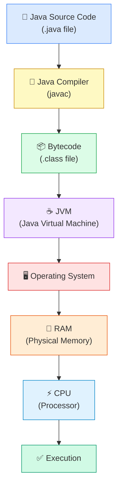

Let us walk through each layer and understand *why* it exists.

---

### 2.1 Java Source Code

You write Java. It reads almost like English. `int x = 10;` is comprehensible to a human because it maps to human concepts — "I have a variable named x and its current value is ten." This readability is deliberate. Programming languages exist for humans, not machines.

**Problem**: CPUs do not understand English or Java.

---

### 2.2 The Compiler (`javac`)

The compiler's job is translation. It reads your `.java` file and produces a `.class` file. This translation involves multiple steps:

1. **Lexical analysis** — Breaking the source code into tokens (`int`, `x`, `=`, `10`, `;`)
2. **Parsing** — Building a tree structure (Abstract Syntax Tree) that represents the grammar of the program
3. **Semantic analysis** — Checking that the program makes sense (you cannot assign a `String` to an `int`)
4. **Code generation** — Producing bytecode instructions

The output is **bytecode** — a compact, binary representation of your program's intent. It is not machine code. This is a critical distinction.

**Why does Java use bytecode instead of compiling directly to machine code?**

Because of portability. Machine code is specific to a processor architecture. Code compiled for an Intel x86 processor will not run on an ARM processor. Java's solution is to compile to a neutral intermediate format (bytecode) and then let a platform-specific JVM interpret or compile that bytecode at runtime. This is the origin of the famous promise: *"Write once, run anywhere."*

---

### 2.3 Bytecode (`.class` file)

Bytecode is a set of instructions for an imaginary, idealized computer — the JVM. These instructions are simpler and more uniform than either Java source or machine code. Each instruction is small, typically 1–3 bytes.

For example, `int x = 10;` might produce bytecode like:

```
bipush 10      // push the integer 10 onto the operand stack
istore_1       // store it in local variable slot 1
```

These instructions don't run on your hardware directly. They are instructions for the JVM.

---

### 2.4 The JVM — Java Virtual Machine

The JVM is a program that runs on your computer and whose job is to execute bytecode. It is a software emulation of a computer — a virtual machine.

When the JVM receives bytecode, it has two strategies:

1. **Interpretation** — Execute each bytecode instruction one at a time, translating on the fly to native machine instructions. Simple but slow for frequently-executed code.
2. **Just-In-Time (JIT) Compilation** — Detect "hot" code paths (code that runs frequently) and compile them entirely to native machine code for that specific CPU. After compilation, execution is as fast as if you had written C.

The JVM also manages garbage collection, thread scheduling, and the security model. It is an extraordinarily sophisticated piece of software.

---

### 2.5 The Operating System

The JVM does not talk directly to hardware. It talks to the OS. The OS provides abstractions:

- **Files** instead of raw disk sectors
- **Memory** instead of raw RAM addresses
- **Threads** instead of raw CPU scheduler slots
- **Network sockets** instead of raw hardware interrupts

The OS is the trusted intermediary that ensures programs coexist without destroying each other.

---

### 2.6 RAM

The OS provides the JVM with a region of RAM. The JVM subdivides this memory into regions for different purposes (more on this shortly). RAM stores both the data your program operates on and the instructions the CPU will execute.

---

### 2.7 The CPU

The CPU reads machine instructions from RAM, executes them, and writes results back to RAM (or to registers, which are faster but tiny storage locations inside the CPU itself). At this level, everything is numbers — addresses, values, and instructions are all represented as binary numbers.

---

## 3. What Actually Happens When You Press Run

The phrase "press run" hides an enormous amount of coordinated activity. Let's expand the timeline completely.

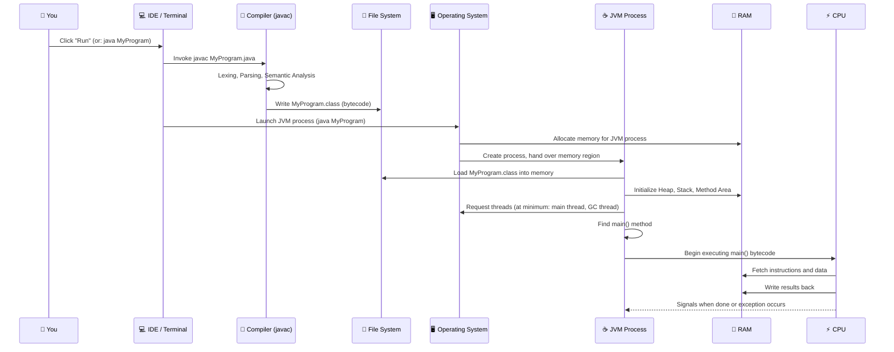

Let us examine several critical moments in this timeline.

---

### Stage 1: The Compiler is Invoked

Compilation is a *separate* process from execution. The `.class` file is written to disk. If the source code has not changed since the last compilation, some tools will skip recompilation. This distinction — compile time versus run time — is fundamental to understanding when errors are caught and when they are not.

---

### Stage 2: The OS Creates a Process

A **process** is the OS's unit of isolation. When you run `java MyProgram`, the OS creates a new process. Each process receives:

- Its own virtual address space (the illusion of private memory)
- A unique Process ID (PID)
- At least one thread (the main thread)
- File descriptors, signal handlers, and other bookkeeping

The process cannot see or touch the memory of any other process. This isolation is not courtesy — it is enforced by hardware with the OS's cooperation.

---

### Stage 3: Memory is Allocated

The OS does not give the JVM a random block of memory. It carves out a **virtual address space** — a contiguous range of addresses that the JVM can use. Initially, much of this space is not backed by physical RAM. Physical RAM is assigned as the program actually needs it (a mechanism called demand paging, covered in Section 7).

---

### Stage 4: The JVM Bootstraps Itself

The JVM is itself a program. Before it can run your code, it must:

1. Load its own internal data structures
2. Initialize the garbage collector
3. Load the core Java class library (`java.lang.Object`, `java.lang.String`, etc.)
4. Set up the JVM memory regions (Heap, Stack, Method Area, etc.)
5. Find and load your `.class` file
6. Locate the `main(String[] args)` method
7. Create the main thread and start executing `main()`

This bootstrapping takes time — it is why short Java programs can feel slow to start compared to equivalent C programs. C programs compile directly to machine code and start immediately. Java programs must start the JVM first.

---

### Stage 5: `main()` Begins

At this point, your program is alive. The CPU is fetching bytecode (or JIT-compiled native code) from RAM, executing instructions, writing results, and advancing through your program line by line.

---

### 💬 Interactive Question #1

> Before reading further: what do you think the JVM does when your `main()` method returns? Where does the program go? What happens to the memory?

**Answer**: When `main()` returns, the JVM begins its shutdown sequence. It runs any registered shutdown hooks (code you or libraries registered to run on exit). It finalizes objects if configured to do so. It then tells the OS it is done. The OS reclaims all memory the process held — instantly, completely, and regardless of what the garbage collector had cleaned up or not. The process ceases to exist.

---

## 4. What Is RAM Really?

RAM stands for Random Access Memory. Each word in that name carries meaning.

---

### 4.1 Physical Reality

RAM is a set of semiconductor chips on your motherboard. Each chip contains billions of tiny capacitors and transistors. Each capacitor can hold a charge or not — representing a `1` or a `0`. This is binary: the physical state of a capacitor is the foundation of all computing.

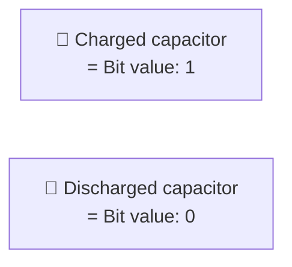

Because capacitors leak charge over time, RAM requires constant refresh cycles — electricity constantly rewriting the values to keep them from degrading. This is why RAM is **volatile**: cut the power, and all data is gone within milliseconds. The capacitors discharge, the 1s become 0s, and the memory is blank.

---

### 4.2 Bits and Bytes

- A **bit** is a single binary digit: `0` or `1`.
- A **byte** is 8 bits: `00000000` to `11111111`, representing 0 to 255.
- A **kilobyte** is 1,024 bytes.
- A **megabyte** is 1,024 × 1,024 = 1,048,576 bytes.
- A **gigabyte** is 1,024 MB ≈ 1 billion bytes.

Why 8 bits per byte? This was standardized in the 1960s as a convenient unit for encoding a single character of text and for fitting neatly into hardware designs. Today, all modern computing is organized around bytes.

---

### 4.3 Why RAM is Fast

The defining characteristic of RAM is that every byte can be read in roughly the same amount of time, regardless of where in memory it is located. This is the "Random Access" part of the name.

Contrast with a hard disk drive (HDD): to read data, a physical arm must physically move to the correct location on a spinning platter. The time varies dramatically depending on where the data is. Reading from the beginning of the disk is different from reading from the middle. HDDs are mechanical; RAM is electronic.

Modern DDR5 RAM can transfer data at over 50 gigabytes per second. A modern HDD transfers data at roughly 0.1–0.2 gigabytes per second. RAM is approximately 300× faster for sequential reads and orders of magnitude faster for random access.

---

### 4.4 Why Volatile Memory Makes Sense for a Workspace

RAM being volatile might seem like a flaw, but consider the alternative: if RAM retained data between power cycles, every program would need to explicitly clean up after itself. Crashes would leave residue. Your next session would inherit the debris of every previous one. Volatility is a feature: it guarantees a clean slate.

---

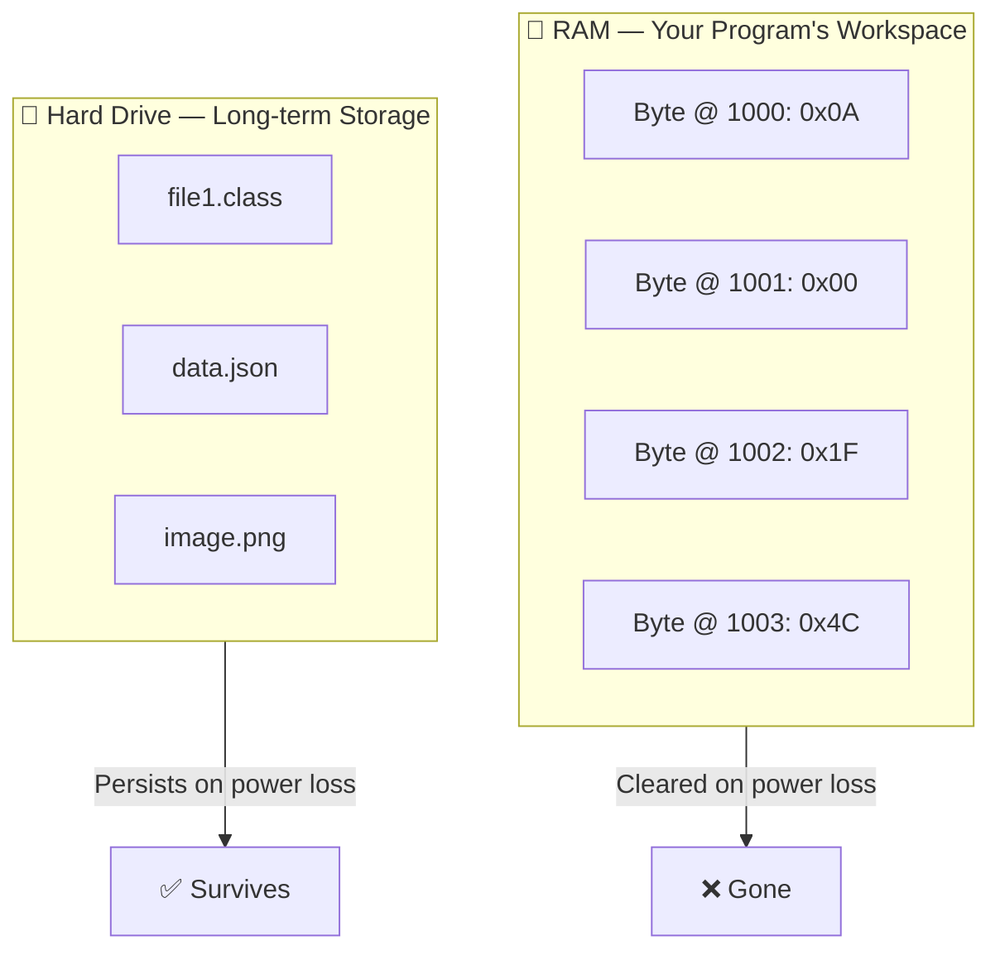

---

## 5. Memory Addresses — The City's Street System

Recall the city analogy. If RAM is the office, then memory addresses are the room numbers. Every byte of RAM has a unique address — a number that uniquely identifies its location.

---

### 5.1 Addresses Are Just Numbers

On a 64-bit system (every modern computer), addresses are 64-bit integers. The theoretical address space is 2^64 bytes ≈ 18 exabytes. In practice, current hardware uses 48 bits of the address, allowing 256 terabytes of virtual address space — still far more than any program could use.

```
Address (decimal)    Contents (hex byte)
─────────────────    ───────────────────
         1000        0x0A
         1001        0x00
         1002        0x00
         1003        0x00
         1004        0x2A
         1005        0xFF
         1006        0x01
         1007        0x00
```

Each address holds exactly one byte. If you want to store a 32-bit integer (4 bytes), you need 4 consecutive addresses.

---

### 5.2 From Bytes to Words

A **word** is the natural unit of data for a CPU. On a 64-bit processor, a word is 8 bytes (64 bits). When the CPU fetches a value from memory, it typically fetches an entire word at once, even if you only need one byte. This is more efficient due to how memory buses work.

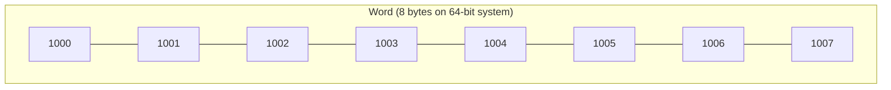

---

### 5.3 References and Pointers

In Java, when you create an object, the object's data is stored somewhere in memory at some address. The variable that "holds" the object does not actually hold the object — it holds the **address** of the object. This address is called a **reference** in Java (and a **pointer** in languages like C and C++).

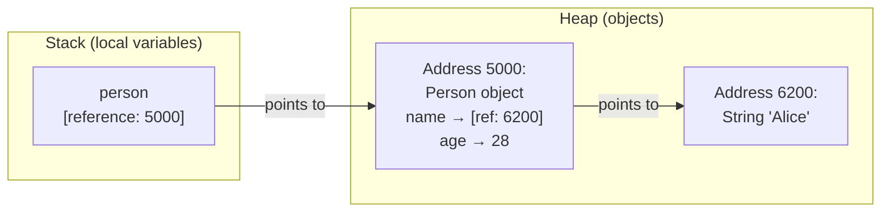

When you write `person.getName()`, the JVM:
1. Reads the address stored in `person` (say, `5000`)
2. Goes to address `5000` in the Heap
3. Reads the `name` field, which is itself another address (`6200`)
4. Goes to address `6200` and reads the String data

Every field access in Java is potentially a pointer dereference. Understanding this chain of indirection is essential for reasoning about performance and memory layout.

---

### 💬 Interactive Question #2

> You have two variables: `Person a = new Person("Alice");` and `Person b = a;`
> How many `Person` objects exist in memory? Where does `b` point?

**Answer**: Exactly **one** `Person` object exists. `b = a` does not copy the object — it copies the *reference* (the address). Both `a` and `b` now hold the same address, pointing to the same object. This is why modifying `b.setName("Bob")` also affects what you see through `a` — they are the same object.

---

## 6. The CPU and Memory — A Dance of Speed

The CPU is extraordinarily fast. RAM, while fast compared to a disk, is slow compared to the CPU. This mismatch drives the entire design of the memory hierarchy.

---

### 6.1 The Fetch-Decode-Execute Cycle

Everything the CPU does follows this cycle:


For a modern CPU running at 3–5 GHz, this cycle repeats billions of times per second. Each iteration requires data from memory.

---

### 6.2 Registers

Registers are storage locations *inside* the CPU. There are typically 16–32 general-purpose registers on a modern CPU (more in some architectures). Each register on a 64-bit CPU holds 8 bytes.

**Why do registers matter?** Reading from a register takes less than 1 nanosecond. Reading from RAM takes 60–100 nanoseconds. The CPU can perform arithmetic only on data that is in registers. Everything must be loaded from RAM into a register before the CPU can work on it.

Registers are the fastest storage in the system, and also the smallest. A 64-bit CPU might have 16 × 8 = 128 bytes of general-purpose register storage. For comparison, your laptop has 8–32 *billion* bytes of RAM.

---

### 6.3 The Cache Hierarchy

Because RAM is slow relative to the CPU, chip designers added **caches** — small, fast memories built directly into the CPU die. Caches exploit **locality**: the observation that programs tend to access the same memory locations repeatedly (temporal locality) and to access nearby memory locations together (spatial locality).

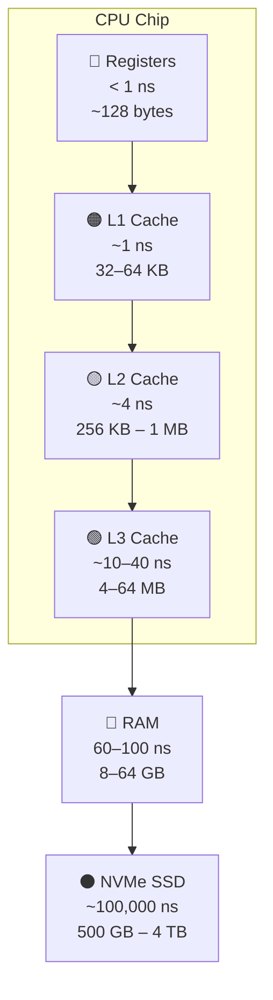

When the CPU needs a value:

1. It first checks the L1 cache (fastest, smallest)
2. If not found (a **cache miss**), it checks L2
3. If not found, it checks L3
4. If not found, it reads from RAM (a significant delay)
5. The value is brought into the cache for future reuse

A program that accesses memory in a cache-friendly pattern (sequentially, predictably) can be dramatically faster than one that accesses memory randomly. This is one reason why iterating over an array is faster than chasing linked list pointers — the array is contiguous in memory, so the cache loads useful data. Linked list nodes can be scattered everywhere.

---

### 💬 Interactive Question #3

> Two programs both process 1 million integers. Program A stores them in an array. Program B stores them in a linked list. Both programs sum all the integers. Which is faster, and why?

**Answer**: **Program A** (array) is dramatically faster — potentially 5–10× faster on modern hardware. An array stores all 1 million integers in contiguous memory. When the cache loads the first few integers, it also preloads the adjacent ones. By the time the CPU processes integer #1, integers #2 through #8 are already in the cache. Linked list nodes store a `next` pointer alongside each value, and nodes are scattered in memory. Each pointer dereference is likely a cache miss, requiring the CPU to wait 60+ nanoseconds for RAM to respond — destroying throughput.

---

## 7. Virtual Memory — The Grand Illusion

Here is something remarkable: the memory addresses your program uses are not real. They are not physical addresses of RAM chips. They are **virtual addresses** — fiction maintained by a cooperation between the CPU and the OS.

---

### 7.1 Why Virtual Memory Exists

Consider these problems the early computer designers faced:

1. **Problem of isolation**: If program A can write to address `5000` and program B also uses address `5000`, they will overwrite each other's data.
2. **Problem of size**: A program might need more memory than physically available RAM.
3. **Problem of fragmentation**: Physical RAM might be available but not in one contiguous block, yet a program might need a contiguous block.

Virtual memory solves all three.

---

### 7.2 Pages and Page Tables

Physical RAM is divided into fixed-size blocks called **frames** (typically 4 KB each). A program's virtual address space is divided into equally-sized blocks called **pages** (also typically 4 KB).

The OS maintains a **page table** for each process — a mapping that translates virtual page numbers to physical frame numbers.

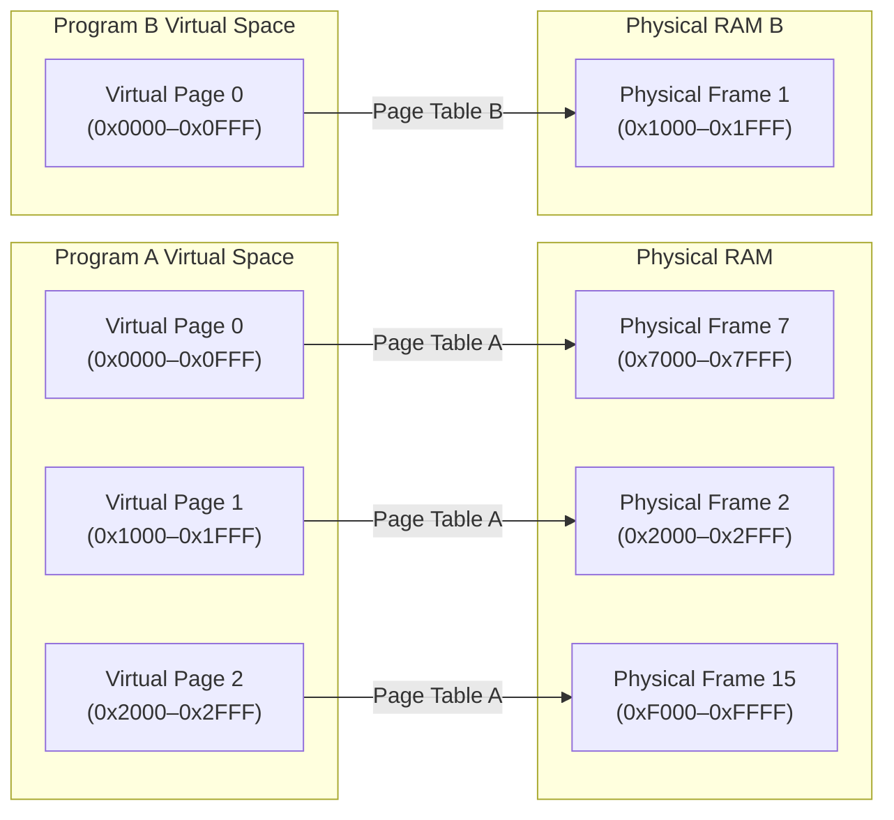

Notice: Program A's virtual page 0 maps to physical frame 7. Program B's virtual page 0 maps to physical frame 1. They use the same virtual addresses, but they translate to entirely different physical locations. **They are completely isolated.**

---

### 7.3 Why Programs Think They Own All of Memory

Your program sees virtual addresses from `0` to some large number — its "private" address space. From the program's perspective, it has exclusive access to a large, contiguous block of memory. It has no idea other programs exist, what physical addresses it is using, or how fragmented its physical footprint actually is.

This illusion is maintained by the **Memory Management Unit (MMU)** — a hardware component in the CPU that automatically translates every virtual address to a physical address using the page table. This translation happens on every memory access, transparently and at hardware speed.

---

### 7.4 Demand Paging — Memory on Demand

When the OS gives a process memory, it does not immediately assign physical RAM to every page. Physical RAM is assigned only when the program actually accesses a page — a technique called **demand paging**.

When a program touches a virtual page that has no physical frame assigned:

1. The CPU raises a **page fault** exception
2. The OS handles the exception, allocates a physical frame
3. Maps it into the page table
4. Resumes the program

The program never knows this happened. From its perspective, the memory was always there.

This also allows the OS to **swap pages to disk** when RAM is full. If a page has not been used recently, the OS writes it to a swap file on disk and frees the physical frame for other uses. If the program later accesses that page, another page fault occurs, the OS reads it back from disk, and execution continues. This is why computers don't crash when you open too many Chrome tabs — they just get slow (disk access to read swapped pages is far slower than RAM).

---

## 8. How the Operating System Gives Memory

Let's follow the complete lifecycle of memory as a program sees it.

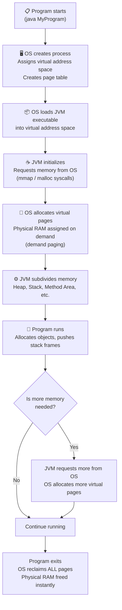

---

### 8.1 Who Actually Owns Memory?

At the bottom of the stack, **the OS owns all memory**. The OS lends memory to processes. The JVM is a process — it is lent memory by the OS. The JVM then acts as a sub-allocator, lending portions of that memory to Java objects, threads, and internal structures.

When a Java program calls `new Person()`, the request flows:

1. JVM checks if the Heap has free space
2. If yes, the JVM allocates from its internal Heap region (no OS call needed)
3. If no, the JVM requests more memory from the OS
4. If the OS has physical memory available, it provides more virtual pages
5. If RAM is full, the OS may swap other pages to disk first

From Java's perspective, object allocation is fast (step 2 is common). The complexity below is hidden.

---

### 8.2 Why Programs Cannot Access Each Other's Memory

Virtual address isolation, enforced by the MMU, makes cross-process memory access impossible by default. If process A tries to access virtual address `5000` belonging to process B, several things happen:

1. The virtual address `5000` in process A's page table maps to a different physical address than in process B's page table
2. Even if A tries to guess physical addresses, the MMU will not allow access to frames not in A's page table
3. The OS will terminate A with a segmentation fault

This is not a software-enforced rule that can be bypassed — it is hardware enforcement. The MMU performs the check on every single memory access.

---

## 9. JVM Memory Architecture — A First Look

Now we arrive at the first place where most tutorials begin. Notice how different it feels now that you understand physical memory, virtual memory, processes, and addresses. These JVM regions are not magic — they are subdivisions of the virtual address space the OS granted to the JVM process.

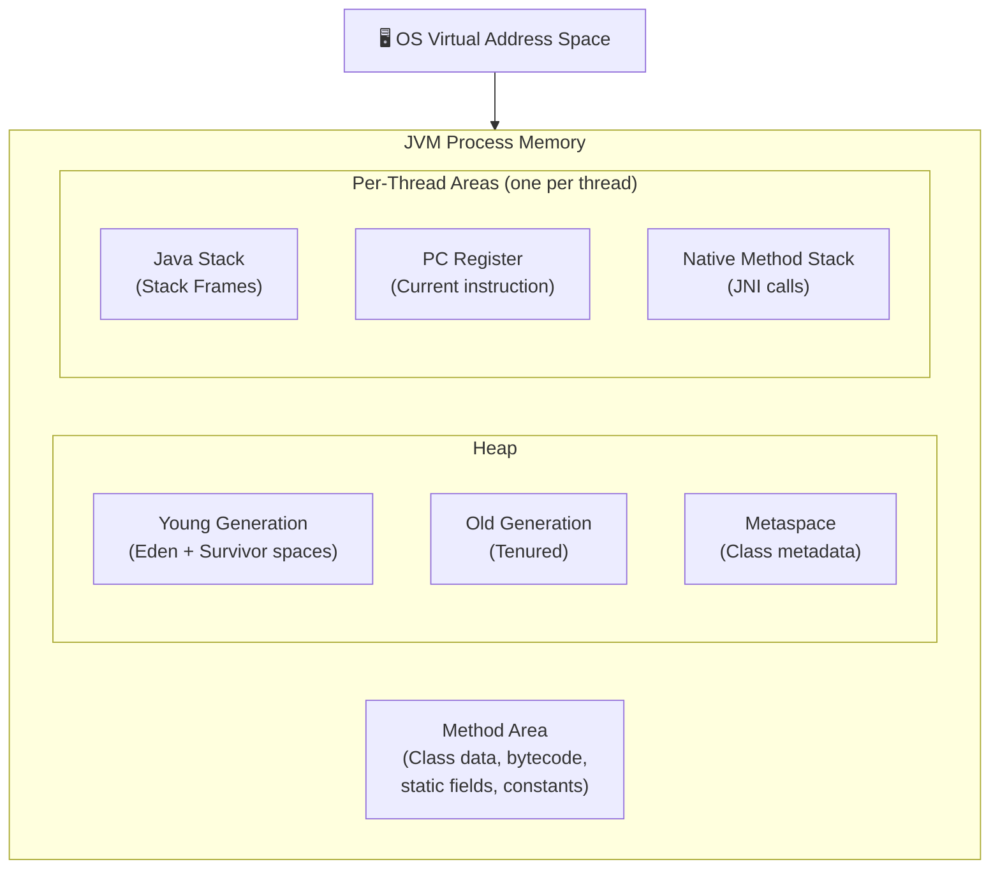

| Region | What it holds | Who manages it |
|---|---|---|
| **Heap** | All Java objects (instances of classes) | Garbage Collector |
| **Stack** | Stack frames, local variables, method call chain | JVM (per-thread) |
| **Method Area** | Class definitions, bytecode, static variables | JVM / Class Loader |
| **PC Register** | Address of next instruction for a thread | JVM |
| **Native Method Stack** | Frames for native (non-Java) method calls | JVM |

Do not worry about the deep mechanics of each region yet. Their roles will be fully explored in the next several chapters. For now, understand three foundational things:

1. **The Heap** is where objects live. It is large, shared across all threads, and managed by the garbage collector.
2. **The Stack** is where method calls and local variables live. It is per-thread and managed automatically.
3. **The Method Area** is where class definitions live. When the class loader loads `Person.class`, the class's structure goes here.

The reason Stack and Heap exist separately is not arbitrary. They exist because two fundamentally different kinds of data have two fundamentally different lifetimes and access patterns. This will be obvious by the end of the next two chapters.

---

## 10. Life of a Variable

Let us trace the complete journey of the simplest possible Java statement.

### 10.1 `int x = 10;`

**In Source Code**:
You type these characters. They are stored as text in your `.java` file on disk.

**During Compilation**:
The compiler parses `int x = 10;` and generates bytecode:
```
bipush 10      // push integer literal 10 onto operand stack
istore_1       // pop it off and store in local variable slot 1
```

**In the `.class` File**:
These bytecode instructions are stored as bytes on disk.

**At Runtime — JVM Loads the Class**:
The Method Area receives the bytecode for the method containing this statement.

**At Runtime — Method is Called**:
When the method containing `int x = 10;` is called, the JVM creates a new **Stack Frame** on the current thread's Stack. This frame includes a **local variable table** — an array of slots for the method's local variables. Slot 1 is reserved for `x`.

**Instruction Executes**:
1. `bipush 10`: The integer `10` is placed on the **operand stack** (a temporary holding area within the stack frame)
2. `istore_1`: The value `10` is popped from the operand stack and written into slot 1 of the local variable table

**In RAM**:
A few bytes somewhere in the Stack region of RAM now hold the binary representation of `10` (which is `0x0000000A` in 32-bit two's complement binary).

**In the CPU**:
To perform operations on `x`, the JVM emits instructions like `iload_1` (load local variable 1 into the operand stack), after which the value may be loaded into a CPU register for arithmetic. The CPU's ALU (Arithmetic Logic Unit) operates on register contents.

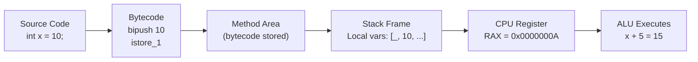

---

### 10.2 `Person person = new Person("Alice", 28);`

This statement is more complex because it involves two memory locations.

**During Compilation**:
The compiler generates bytecode that:
1. Allocates a new object on the Heap
2. Calls the constructor
3. Stores the resulting reference in a local variable

**At Runtime**:

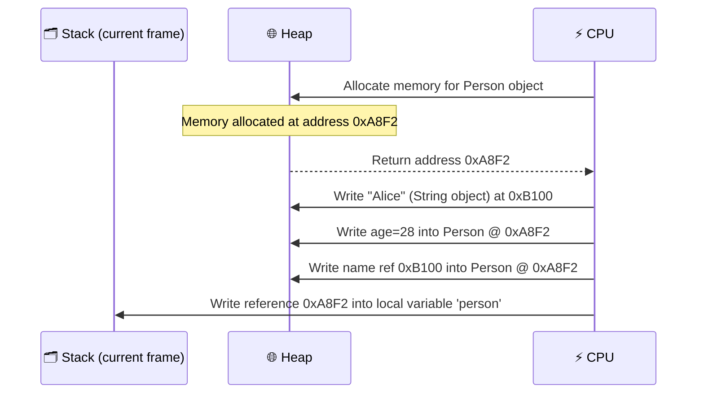

**What lives where?**

| Data | Location | Reason |
|---|---|---|
| The reference `person` (address `0xA8F2`) | Stack (local variable) | It is a local variable — short-lived, belongs to the method call |
| The `Person` object itself | Heap | Objects have unpredictable lifetimes — they may outlive the method |
| The `String "Alice"` object | Heap | Strings are objects; same reasoning |

This is the core insight: **the variable lives on the Stack; the object lives on the Heap**. The variable is a label on a piece of paper that says: *"the actual thing is at address X."* The address is the reference.

---

## 11. Memory Timeline Simulation

Let us watch memory evolve through a complete, small program.

```java
public class Simulation {
    public static void main(String[] args) {
        int x = 10;               // Step 1
        Person p = new Person();  // Step 2
        p.setName("Alice");       // Step 3
        greet(p);                 // Step 4
        // p goes out of scope    // Step 5
        // GC may collect Person  // Step 6
    }                             // Step 7

    static void greet(Person person) {
        String msg = "Hello " + person.getName();
        System.out.println(msg);
    }
}
```

---

### Step 1: `int x = 10;`

```
STACK                         HEAP
─────────────────────         ─────────────────────
main() frame:
  x = 10
```

---

### Step 2: `Person p = new Person();`

```
STACK                         HEAP
─────────────────────         ─────────────────────
main() frame:                 [0xA100] Person {
  x = 10                        name = null
  p → 0xA100                    age  = 0
                              }
```

---

### Step 3: `p.setName("Alice");`

```
STACK                         HEAP
─────────────────────         ─────────────────────
main() frame:                 [0xA100] Person {
  x = 10                        name → 0xB200
  p → 0xA100                    age  = 0
                              }
                              [0xB200] String "Alice"
```

---

### Step 4: `greet(p);` — A new Stack Frame is pushed

```
STACK                         HEAP
─────────────────────         ─────────────────────
greet() frame:                [0xA100] Person {
  person → 0xA100               name → 0xB200
  msg → 0xC300                  age  = 0
                              }
main() frame:                 [0xB200] String "Alice"
  x = 10
  p → 0xA100                 [0xC300] String "Hello Alice"
```

Note: Both `p` (in main's frame) and `person` (in greet's frame) point to the same address `0xA100`. There is one object, two references.

---

### Step 5: `greet()` returns — Stack Frame popped

```
STACK                         HEAP
─────────────────────         ─────────────────────
main() frame:                 [0xA100] Person { ... }
  x = 10                      [0xB200] String "Alice"
  p → 0xA100                  [0xC300] String "Hello Alice" ← UNREACHABLE
```

When `greet()` returns, its Stack Frame is destroyed instantly. The local variable `person` is gone. The local variable `msg` is gone. However, the objects on the Heap (`Person`, `"Alice"`, `"Hello Alice"`) still exist. Only `"Hello Alice"` at `0xC300` is now unreachable — nothing points to it anymore. It is eligible for garbage collection.

---

### Step 6: `main()` returns — All Stack Frames gone

```
STACK                         HEAP
─────────────────────         ─────────────────────
(empty)                       [0xA100] Person — UNREACHABLE
                              [0xB200] String "Alice" — UNREACHABLE
                              [0xC300] String "Hello Alice" — UNREACHABLE
```

All local variables are gone. All objects on the Heap are unreachable. The garbage collector is now free to collect all of them.

---

### Step 7: GC Runs

```
STACK                         HEAP
─────────────────────         ─────────────────────
(empty)                       (empty — all collected)
```

And then the JVM process exits. The OS reclaims all virtual pages.

---

### 💬 Interactive Question #4

> In Step 4, if `greet()` called `person.setAge(99)`, would `p` in `main()` also reflect the change?

**Answer**: **Yes.** `person` in `greet()` and `p` in `main()` point to the *same object* at `0xA100`. Modifying the object through one reference modifies it for all references. This is why Java is described as "pass by value" but where the "value" for objects is the reference (address). The address is copied, not the object.

---

## 12. Real-World Memory: Chrome, VS Code, Minecraft

Understanding memory in theory is one thing. Seeing it reflected in real systems you use every day is another.

---

### Google Chrome

Chrome is notorious for high RAM usage. Why?

Chrome isolates each tab in its own **process** (or at minimum its own set of threads). This is a security decision: if a malicious website can exploit the browser renderer, it is contained within one process and cannot access the memory of other tabs (recall: processes have isolated virtual address spaces).

Each Chrome process has:
- Its own Heap for JavaScript objects
- A compiled JavaScript engine (V8's JIT compilation creates native machine code in memory)
- Decoded images, parsed HTML/CSS, render trees

When you open 20 tabs, you have 20+ processes, each with potentially hundreds of megabytes of Heap. The OS must juggle the physical RAM among them all, potentially swapping less-used tabs to disk — which is why switching to a tab you haven't used in a while sometimes causes a brief freeze.

---

### VS Code

VS Code is built on Electron, which bundles a Chromium renderer and Node.js runtime. It is, essentially, a web browser running a web application locally.

Beyond its own process memory, VS Code spawns **language server processes** — separate processes that analyze your code for autocompletion, error checking, and refactoring. Each language server is a process with its own memory space. A TypeScript language server for a large project can consume gigabytes of RAM to hold parsed representations of thousands of files.

---

### Minecraft

Minecraft (Java Edition) is a JVM application. Its memory profile is a direct illustration of everything in this chapter:

- **Heap**: All game objects — every block, entity, player, chunk data — lives here
- **GC pressure**: Because thousands of objects are created and destroyed per second as you move through the world and new chunks load, the garbage collector is constantly active. GC pauses manifest as the stuttering and lag spikes players call "GC lag"
- **Off-heap memory**: Some Minecraft data (particularly chunk data for rendering) is stored in **direct memory** — memory allocated outside the JVM Heap, managed manually, to avoid GC overhead. This is an advanced JVM optimization technique.

The command `-Xmx8G` that Minecraft players use allocates a maximum Heap size of 8 gigabytes. Without sufficient Heap space, the GC runs constantly trying to free space, and eventually throws `OutOfMemoryError`.

---

### Databases (PostgreSQL, MySQL)

Relational databases are, at their core, programs that manage large amounts of memory very deliberately:

- **Buffer pool / shared buffer**: A region of RAM used to cache frequently-accessed disk pages. When you query a row, the database first checks if the page containing that row is in the buffer pool. If so, it returns from RAM (fast). If not, it reads from disk (slow) and adds it to the pool.
- **Query execution memory**: Sorting large result sets, building hash tables for joins, and other operations require temporary memory allocations during query execution.

Database performance tuning is largely memory tuning. A DBA's first question when a query is slow is often: "Is it disk I/O? Are we spilling to disk because the buffer pool is too small?"

---

## 13. How Senior Engineers Think About Memory

Experienced engineers have internalized several mental models that change how they write code. None of these require memorizing formulas — they require understanding the principles from this chapter.

---

### 13.1 Memory Locality

Code that accesses nearby memory addresses benefits from caching. Code that jumps around memory defeats caching.

**Cache-friendly**: Iterating over an array (`array[0]`, `array[1]`, `array[2]`...) — sequential access, cache loads ahead
**Cache-hostile**: Following linked list pointers scattered through memory, or accessing a 2D array in column-major order when the language stores rows contiguously

This is why Java's `ArrayList` often outperforms `LinkedList` for iteration, despite `LinkedList` having theoretically better O(1) prepend. Theory meets hardware, and hardware wins.

---

### 13.2 Object Creation Cost

`new Object()` is not free. Creating an object requires:

1. Finding free space in the Heap (fast in modern generational GCs, but not zero cost)
2. Zeroing the memory (the JVM guarantees all object fields are zero-initialized)
3. Running the constructor

More importantly, every object created is eventually collected. Collection has a cost. High-frequency object creation means high-frequency GC activity means potential pauses.

Senior engineers ask: *"Does this object need to exist?"* Can a value type (primitive, or a value record in modern Java) substitute for an object? Can an object be reused from an object pool instead of created fresh?

---

### 13.3 Fragmentation

Heap fragmentation occurs when many small objects are freed, leaving gaps in the Heap. Even if there is theoretically enough free memory, a large contiguous allocation may fail because no single free block is large enough.

Modern JVMs use compacting garbage collectors that periodically move surviving objects together, defragmenting the Heap. But compaction requires moving objects — which means updating every reference that points to the moved objects. This is complex, expensive, and pausing.

---

### 13.4 GC Pressure

GC pressure is the rate at which objects are being created and collected. High GC pressure leads to frequent minor GC cycles and, eventually, major (full) GC cycles. Major GC events in older JVMs would stop all application threads (stop-the-world pauses). Modern GCs (G1, ZGC, Shenandoah) do much of their work concurrently, but pressure still affects throughput.

Observing GC behavior is fundamental to Java performance tuning. Tools like `jstat`, `jcmd`, and JVM flight recorder allow engineers to observe how much time is being spent in GC versus useful work.

---

## 14. Common Misconceptions — Myths Demolished

---

### ❌ Myth: RAM is the same as Storage

**Reality**: RAM is your working memory — volatile, fast, expensive. Storage (HDD, SSD) is your long-term filing cabinet — persistent, slower, cheap per gigabyte. They serve fundamentally different purposes. Your program's code and data exist in RAM while running. They are loaded from and saved to storage. This is why installing a program (copying it to storage) is different from running a program (loading it into RAM).

---

### ❌ Myth: "The Heap is physical memory"

**Reality**: The Heap is a logical region — a concept within the JVM. The JVM manages a Heap inside virtual memory. Virtual memory may or may not be backed by physical RAM at any given moment (demand paging). The Heap is an organizational construct, not a physical thing.

---

### ❌ Myth: "The Stack is faster because it's special hardware"

**Reality**: The Stack and the Heap both live in the same RAM. There is no "stack RAM" and "heap RAM." The Stack is faster for allocation because allocating on the Stack is simply incrementing a pointer — an O(1) operation that costs almost nothing. Heap allocation requires the allocator to find free space, which involves bookkeeping. It is the *allocation algorithm* that differs, not the hardware.

---

### ❌ Myth: "Objects live inside variables"

**Reality**: Object variables hold *references* (addresses), not objects. Objects live in the Heap. Variables live on the Stack (for local variables) or in other objects (for instance fields). The variable is a pointer to the object, never the object itself. `Person p = null` means `p` holds the special "no address" value — the object does not exist.

---

### ❌ Myth: "References are objects"

**Reality**: References are addresses — small numbers (8 bytes on a 64-bit JVM) that indicate where an object lives in the Heap. They are not objects themselves. They take no space in the Heap. A reference can be null (no address), it can be copied (both variables point to the same object), and it can be overwritten (the old object becomes unreachable).

---

### ❌ Myth: "More RAM always means faster programs"

**Reality**: Adding RAM helps if your program is RAM-constrained (swapping to disk, GC thrashing due to insufficient Heap, OS paging frequently). If your program fits comfortably in RAM, adding more RAM does nothing for its performance. CPU speed, cache behavior, algorithm choice, and I/O efficiency often matter more than raw RAM quantity.

---

## 15. Cheat Sheet

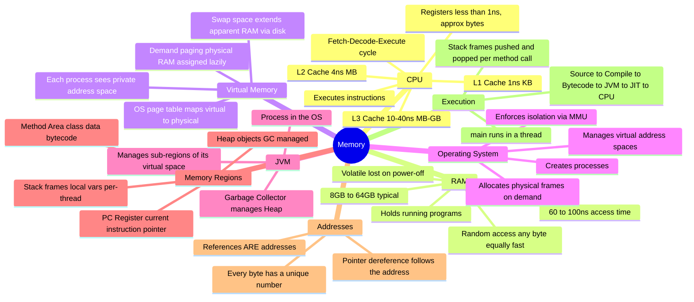

---

| Concept | What it is | Key property |
|---|---|---|
| **Bit** | 0 or 1 | Smallest unit of information |
| **Byte** | 8 bits | Smallest addressable unit of RAM |
| **Register** | Storage inside the CPU | Fastest; only ~128 bytes total |
| **L1 Cache** | CPU-internal cache | ~1 ns; 32–64 KB per core |
| **L2 Cache** | CPU-internal cache | ~4 ns; 256 KB – 1 MB |
| **L3 Cache** | CPU-shared cache | ~10–40 ns; 4–64 MB |
| **RAM** | Main memory | 60–100 ns; 8–64 GB; volatile |
| **Virtual Address** | Program-visible address | Not a physical location; translated by MMU |
| **Page** | 4 KB block of virtual memory | Unit of OS memory management |
| **Page Table** | Virtual→physical mapping | Per-process; managed by OS |
| **Process** | Running program instance | Isolated address space, one or more threads |
| **JVM Heap** | Where Java objects live | GC-managed; shared across threads |
| **JVM Stack** | Where method calls live | Per-thread; LIFO; very fast allocation |
| **Reference** | Object address (a number) | Stored in variables; 8 bytes on 64-bit JVM |
| **GC** | Garbage Collector | Reclaims unreachable Heap objects |
| **JIT** | Just-In-Time compiler | Compiles hot bytecode to native machine code |
| **MMU** | Memory Management Unit | Hardware that translates virtual→physical addresses |

---

## 16. Final Thought

You have just traveled from capacitors in a memory chip all the way to the garbage collector freeing an unreachable `Person` object. That is the complete story of memory, told without shortcuts.

Think about what you now know:

- When you type `new Person()`, you are asking the JVM's allocator to find space in a managed region of virtual memory that the OS gave to the JVM process, which is backed by physical RAM chips whose capacitors are holding charge to represent your data.
- When a method returns, its Stack frame — a precisely-sized region of the Stack — is reclaimed instantly by moving a single pointer.
- When you call `p.getName()`, the JVM is loading an address from the Stack, following it to the Heap, loading another address (the `name` field), following *that* to the Heap, and finally reading bytes of character data.

None of this is magic. All of it is engineering.

---

### What Comes Next

In this chapter, you have seen the Heap and the Stack mentioned repeatedly — as inevitable, obvious conclusions of how memory must work. Objects, which can be shared, which can outlive a method, which can be referenced from multiple places, clearly need a managed, general-purpose region: the **Heap**. Method calls, which are scoped, which have clear beginnings and ends, which contain data that only the current method cares about, clearly need a fast, disciplined, LIFO structure: the **Stack**.

In **Chapter 04: Stack Memory — Deep Dive**, you will dissect the Stack completely. You will see exactly what a Stack Frame contains, how arguments are passed between methods, why stack overflow happens, and why the Stack's speed comes from its structural simplicity.

After everything you've built today, the Stack will not just be a concept you've memorized.

It will be something you *understand*.

---

*End of Chapter 03*

---
