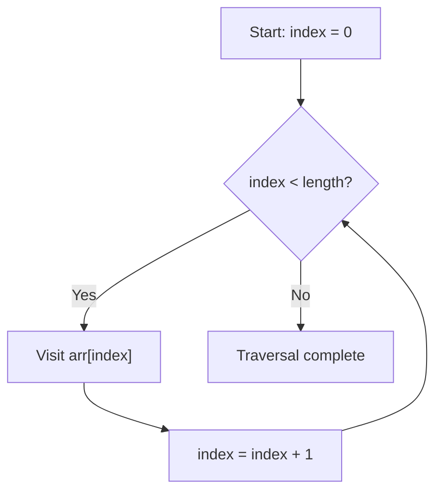
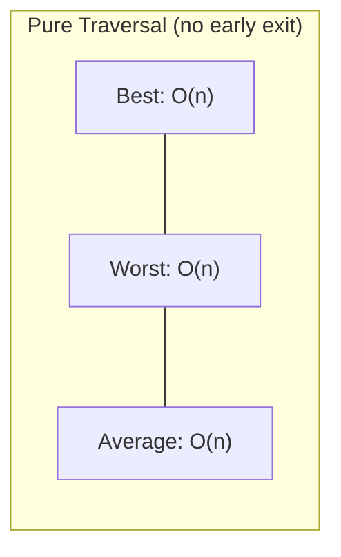
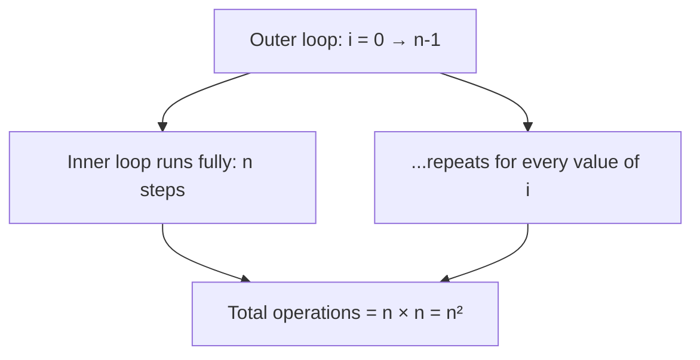
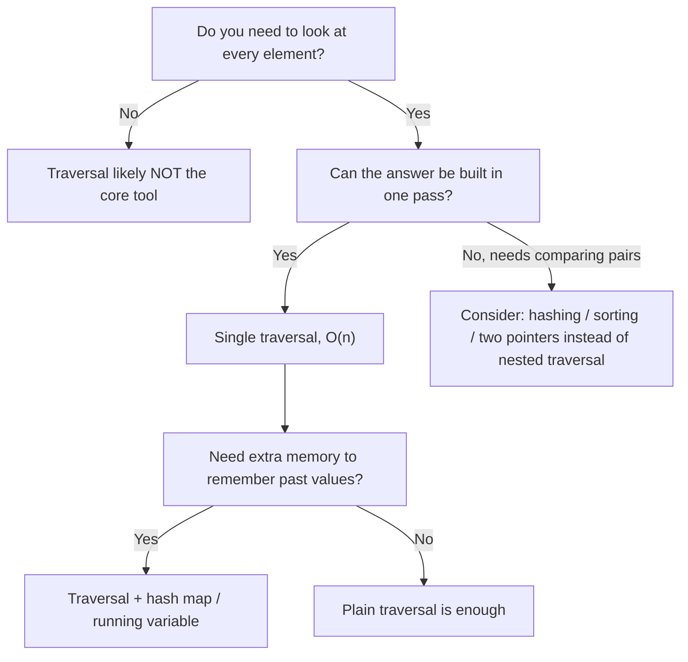

# Traversal Pattern

> The single most fundamental technique in all of array algorithms — visiting every element, once, in a defined order.

Traversal is the heartbeat of array manipulation. Before you can search, sort, filter, or transform data, you must first learn how to *move through it correctly*. This chapter builds that skill from the ground up — from the very first mental model of "visiting a box of data" all the way to the traversal-based reasoning interviewers expect at FAANG-level interviews.

---

## Learning Objectives

After reading this chapter, you should be able to:

- [ ] Explain what traversal means, in plain language and in code
- [ ] Explain **why** traversal exists and why it's the starting point of almost every array problem
- [ ] Distinguish **traversal** from **searching**
- [ ] Distinguish **traversal** from generic **iteration**
- [ ] Prove — not just state — why traversal is `O(n)`
- [ ] Compare traversal against random access
- [ ] Identify the five major types of traversal
- [ ] Write traversal templates fluently in both Java and Python
- [ ] Recognize when a problem needs only a traversal (pattern recognition)
- [ ] Avoid the classic off-by-one and boundary mistakes
- [ ] Solve real interview problems built entirely on traversal

---

## What is Traversal?

**Traversal** means visiting every element of a data structure, one at a time, in a systematic order, without skipping and without repeating (unless intentionally designed to).

Think of it through everyday analogies:

| Real-world Analogy | Array Equivalent |
|---|---|
| 🚶 Walking down a street, checking every house number | Visiting every index from `0` to `n-1` |
| 📖 Reading a book page by page | Reading `arr[0]`, then `arr[1]`, then `arr[2]`... |
| 🧑‍🏫 A teacher checking attendance, one student at a time | Looping through a class-roster array |
| 🛒 A cashier scanning every item in a cart | Iterating through a list of products |

In every one of these analogies, there's a common thread:

> **You commit to visiting each item exactly once, in a fixed order, until none remain.**

That's it. That's traversal. It sounds almost too simple to deserve a whole chapter — and that's exactly why so many engineers under-appreciate it. Nearly **every non-trivial array algorithm is a traversal with extra logic bolted on**. Master traversal, and you've secretly mastered the skeleton of binary search, two pointers, sliding window, prefix sums, and more.

> 💡 **Tip:** Whenever you look at a new array problem and think "I need to look at each element," your brain has already identified that this is (at least partly) a traversal problem.

### Traversal vs. Searching

These two are commonly confused by beginners.

| Concept | Goal | Stops early? | Example |
|---|---|---|---|
| **Traversal** | Visit every element | No (usually) | Print all elements |
| **Searching** | Find a *specific* element | Yes, once found | Find the index of `7` |

Searching is often *implemented using* traversal (linear search), but its **goal** is different: traversal cares about *coverage*, searching cares about *discovery*.

### Traversal vs. Iteration

"Iteration" is a general programming term for repeating an action. Traversal is a *specific kind* of iteration — one that is bound to a data structure's elements.

```
Iteration  = "repeat this block of code N times"
Traversal  = "iterate, where N = number of elements in the structure,
              visiting each one"
```

All traversals are iterations. Not all iterations are traversals (e.g., `for i in range(10): print("hi")` is iteration but not traversal — nothing is being visited).

---

## Visualization

Let's watch traversal happen, step by step, over a real array.

```
Array (5 elements):

+----+----+----+----+----+
| 12 | 25 | 17 | 40 |  9 |
+----+----+----+----+----+
  0    1    2    3    4      <- indices
```

**Step 0 — start at index 0**

```
+----+----+----+----+----+
| 12 | 25 | 17 | 40 |  9 |
+----+----+----+----+----+
  ^
index = 0   →  visiting value 12
```

**Step 1 — move to index 1**

```
+----+----+----+----+----+
| 12 | 25 | 17 | 40 |  9 |
+----+----+----+----+----+
       ^
     index = 1   →  visiting value 25
```

**Step 2 — move to index 2**

```
+----+----+----+----+----+
| 12 | 25 | 17 | 40 |  9 |
+----+----+----+----+----+
            ^
          index = 2   →  visiting value 17
```

**Step 3 — move to index 3**

```
+----+----+----+----+----+
| 12 | 25 | 17 | 40 |  9 |
+----+----+----+----+----+
                 ^
               index = 3   →  visiting value 40
```

**Step 4 — move to index 4 (last element)**

```
+----+----+----+----+----+
| 12 | 25 | 17 | 40 |  9 |
+----+----+----+----+----+
                      ^
                    index = 4   →  visiting value 9
```

**Step 5 — index becomes 5 → out of bounds → traversal ends**

```
+----+----+----+----+----+
| 12 | 25 | 17 | 40 |  9 |
+----+----+----+----+----+
                           ^
                        index = 5  →  STOP (5 == length, no box here)
```

Every arrow-move represents **one unit of work**. There are exactly `n` moves for `n` elements — this observation is the seed of the `O(n)` proof later in this chapter.

Here's the same idea as a Mermaid flowchart:



---

## Memory Visualization

Arrays are stored in **contiguous memory** — one slot immediately after another. This is *why* traversal is not just logically simple, but also physically fast on real hardware.

```
Array: [12, 25, 17, 40, 9]     (each int = 4 bytes)

Memory Address     Value
--------------     -----
     1000            12      <- arr[0]
     1004            25      <- arr[1]
     1008            17      <- arr[2]
     1012            40      <- arr[3]
     1016             9      <- arr[4]
```

Notice the address increases by exactly `4` each step (the size of an `int`). Traversal simply walks forward through this block:

```
addr(arr[i]) = base_address + (i * size_of_element)
```

### Why this is cache-friendly

Modern CPUs don't fetch a single value from RAM — they fetch a whole **cache line** (typically 64 bytes) at once. Because array elements sit right next to each other:

```
Cache Line (64 bytes) fetched in ONE trip to RAM
┌─────────────────────────────────────────────┐
│ 12 │ 25 │ 17 │ 40 │  9 │ .. │ .. │ .. │ .. │ │
└─────────────────────────────────────────────┘
   ↑ one memory fetch may satisfy MANY traversal steps
```

When you traverse forward, you keep reading data that's **already sitting in cache** from the previous fetch — no waiting on slow RAM. This is called **spatial locality**, and it's the reason a simple `for` loop over an array can outperform far "smarter-looking" data structures like linked lists, which scatter their nodes randomly across memory.

> 📝 **Note:** This is also why backward traversal is just as fast as forward traversal (contiguous memory doesn't care about direction) — but traversing a *linked list* backward is a completely different, and much harder, story.

---

## Why Traversal is O(n)

It's not enough to memorize "traversal is O(n)." Let's actually **prove** it.

### The core argument

A traversal visits every element **exactly once**. If the array has `n` elements, then the number of "visit" operations is:

```
visits = 1 + 1 + 1 + ... + 1     (n times)
       = n
```

Each visit does **constant-time work** (read a value, compare it, maybe update a variable) — this work does not grow as the array grows. So the total time is:

```
Total time = n × (constant work per element)
           = O(n)
```

This is a **linear relationship**: double the array, double the work. Nothing hidden, nothing exponential.

### Best, Worst, and Average Case

Traversal is one of the rare patterns where all three cases are usually identical:

| Case | When it happens | Time |
|---|---|---|
| **Best case** | You must still visit every element (unless early-exit logic exists) | O(n) |
| **Worst case** | Same — a full traversal always visits everything | O(n) |
| **Average case** | Same reasoning applies on average | O(n) |

> ⚠️ **Warning:** If your traversal has an **early exit** (e.g., "stop when you find X"), then *that specific use* (like linear search) can have a best case of `O(1)` — but that's a property of the *search*, not of traversal itself. Pure traversal (visit everything, no exit) is always `O(n)` in all cases.



---

## Traversal vs Random Access

| Aspect | Traversal | Random Access |
|---|---|---|
| Movement pattern | Sequential (one after another) | Jump directly to any index |
| Time Complexity | O(n) for the whole structure | O(1) per access |
| Use case | "I need to look at everything" | "I need element #k *right now*" |
| Example | Summing all elements | `arr[7]` — grab the 8th element instantly |
| Cache behavior | Excellent (sequential memory reads) | Good, but isolated single reads |

### When to use each

- Use **traversal** when the task inherently requires examining every element: computing a sum, finding a maximum, checking a condition across all data, building a new transformed array.
- Use **random access** when you already know exactly *which* index you need, and don't care about the rest: `arr[i]` in a formula, swapping two known positions, or indexing into a lookup table.

> 💡 **Tip:** Many "smart" array algorithms (two pointers, binary search) are really just *clever random access* replacing brute-force traversal to cut down the total work from O(n) to O(log n) or similar.

---

## Types of Traversal

### 1. Forward Traversal

**Definition:** Visiting elements from index `0` to `n-1`, moving left to right.

```
+----+----+----+----+----+
|  a |  b |  c |  d |  e |
+----+----+----+----+----+
  →    →    →    →    →
 start                end
```

**Example:** Printing all elements in original order.

**Complexity:** `O(n)` time, `O(1)` extra space.

**Interview use case:** Default traversal direction for almost all problems unless stated otherwise (e.g., "print the array," "sum all elements").

---

### 2. Backward Traversal

**Definition:** Visiting elements from index `n-1` down to `0`.

```
+----+----+----+----+----+
|  a |  b |  c |  d |  e |
+----+----+----+----+----+
  ←    ←    ←    ←    ←
 end                start
```

**Example:** Reversing an array's printed order without creating a new array.

**Complexity:** `O(n)` time, `O(1)` extra space.

**Interview use case:** Problems where the "answer depends on what's to the right" (e.g., "next greater element," suffix sums, palindromic checks moving inward from both ends).

---

### 3. Partial Traversal

**Definition:** Visiting only a **sub-range** of the array — e.g., indices `2` to `6` — instead of the whole thing.

```
+----+----+----+----+----+----+----+
|  a |  b |  c |  d |  e |  f |  g |
+----+----+----+----+----+----+----+
            └────── visit only this range ──────┘
             (index 2 to 5)
```

**Example:** Summing a subarray for a windowed calculation.

**Complexity:** `O(k)` where `k` is the size of the range (still linear, just over fewer elements).

**Interview use case:** Sliding window problems, prefix-sum range queries, "process only this segment" tasks.

---

### 4. Conditional Traversal

**Definition:** Visiting every element, but only *acting* on the ones that satisfy a condition.

```
+----+----+----+----+----+
|  4 |  7 |  2 |  9 |  6 |
+----+----+----+----+----+
  ✔    ✘    ✔    ✘    ✔      (condition: is even?)
```

**Example:** Counting even numbers, filtering values greater than a threshold.

**Complexity:** Still `O(n)` — you still *visit* every element even though you only *act* on some.

**Interview use case:** Filtering, counting, "how many elements satisfy X" style questions.

---

### 5. Nested Traversal

**Definition:** A traversal *inside* another traversal — for every element, you traverse the array (or another array) again.

```
Outer index i = 0 ──► Inner loop visits ALL elements
Outer index i = 1 ──► Inner loop visits ALL elements
Outer index i = 2 ──► Inner loop visits ALL elements
        ...
```

**Example:** Comparing every pair of elements (brute-force duplicate detection).

**Complexity:** `O(n²)` — explained in depth later in this chapter.

**Interview use case:** Brute-force baseline solutions before optimizing (e.g., Two Sum brute force, checking all pairs).

---

## Traversal Templates

### Java

**Classic `for` loop**

```java
int[] arr = {12, 25, 17, 40, 9};

for (int i = 0; i < arr.length; i++) {
    System.out.println(arr[i]);
}
```
- **What happens:** `i` starts at 0, runs while `i < arr.length`, incrementing by 1 each time.
- **Time Complexity:** O(n)
- **Space Complexity:** O(1)
- **Common mistake:** Using `i <= arr.length` causes an `ArrayIndexOutOfBoundsException`.

**Enhanced `for` loop (for-each)**

```java
for (int value : arr) {
    System.out.println(value);
}
```
- **What happens:** Java handles the index internally; you only get the *value*, not the index.
- **Time Complexity:** O(n)
- **Space Complexity:** O(1)
- **Common mistake:** Trying to modify `arr` through `value` — this does not change the original array, since `value` is a copy.

**`while` loop**

```java
int i = 0;
while (i < arr.length) {
    System.out.println(arr[i]);
    i++;
}
```
- **What happens:** Manual index control — useful when the increment logic is non-trivial (e.g., skipping by 2).
- **Time Complexity:** O(n)
- **Space Complexity:** O(1)
- **Common mistake:** Forgetting `i++` → infinite loop.

**Backward traversal**

```java
for (int i = arr.length - 1; i >= 0; i--) {
    System.out.println(arr[i]);
}
```
- **What happens:** Starts at the last valid index (`length - 1`) and decreases to `0`.
- **Time Complexity:** O(n)
- **Space Complexity:** O(1)
- **Common mistake:** Starting at `arr.length` instead of `arr.length - 1` (off-by-one, out-of-bounds read).

---

### Python

**Classic `for`**

```python
arr = [12, 25, 17, 40, 9]

for value in arr:
    print(value)
```
- **What happens:** Python's `for` is always "for-each" style — it iterates directly over values.
- **Time Complexity:** O(n)
- **Space Complexity:** O(1)
- **Common mistake:** Needing the index but forgetting Python doesn't give it automatically (use `enumerate`).

**`enumerate`**

```python
for index, value in enumerate(arr):
    print(index, value)
```
- **What happens:** Yields `(index, value)` pairs — the Pythonic way to get both.
- **Time Complexity:** O(n)
- **Space Complexity:** O(1)
- **Common mistake:** Writing `enumerate(arr, start=1)` unintentionally and misaligning indices with actual array positions.

**`while`**

```python
i = 0
while i < len(arr):
    print(arr[i])
    i += 1
```
- **What happens:** Manual index control, same use case as Java's while loop.
- **Time Complexity:** O(n)
- **Space Complexity:** O(1)
- **Common mistake:** Forgetting `i += 1` → infinite loop.

**`reversed`**

```python
for value in reversed(arr):
    print(value)
```
- **What happens:** Iterates from the last element to the first, without manually managing indices.
- **Time Complexity:** O(n)
- **Space Complexity:** O(1)
- **Common mistake:** Assuming `reversed()` modifies `arr` in place — it doesn't; it returns an iterator.

> 💡 **Tip:** Prefer `enumerate`/for-each style loops when you don't need manual index arithmetic — they eliminate an entire category of off-by-one bugs.

---

## Dry Run Examples

### Dry Run 1: Find Maximum

Array: `[7, 2, 15, 9, 4]`

| Iteration | Current (`arr[i]`) | Max so far | Decision |
|---|---|---|---|
| Start | — | `arr[0] = 7` | Initialize max with first element |
| 1 | `2` | `7` | `2 < 7` → keep max unchanged |
| 2 | `15` | `7` → `15` | `15 > 7` → update max |
| 3 | `9` | `15` | `9 < 15` → keep max unchanged |
| 4 | `4` | `15` | `4 < 15` → keep max unchanged |
| End | — | **`15`** | Traversal complete, return max |

```java
int max = arr[0];
for (int i = 1; i < arr.length; i++) {
    if (arr[i] > max) {
        max = arr[i];
    }
}
```

```python
max_val = arr[0]
for value in arr[1:]:
    if value > max_val:
        max_val = value
```

---

### Dry Run 2: Count Even Numbers

Array: `[4, 7, 2, 9, 6]`

| Iteration | Current | Is Even? | Count |
|---|---|---|---|
| 1 | `4` | Yes | `1` |
| 2 | `7` | No | `1` |
| 3 | `2` | Yes | `2` |
| 4 | `9` | No | `2` |
| 5 | `6` | Yes | `3` |
| End | — | — | **`3`** |

```java
int count = 0;
for (int num : arr) {
    if (num % 2 == 0) {
        count++;
    }
}
```

```python
count = 0
for num in arr:
    if num % 2 == 0:
        count += 1
```

---

## Common Operations Built on Traversal

### Finding Maximum
- **Explanation:** Track a running "best value seen so far," update it whenever a bigger element appears.
- **Java:**
```java
int max = arr[0];
for (int i = 1; i < arr.length; i++) if (arr[i] > max) max = arr[i];
```
- **Python:**
```python
max_val = arr[0]
for v in arr[1:]:
    if v > max_val: max_val = v
```
- **Complexity:** O(n) time, O(1) space.

### Finding Minimum
- **Explanation:** Same idea as maximum, but flip the comparison.
- **Java:**
```java
int min = arr[0];
for (int i = 1; i < arr.length; i++) if (arr[i] < min) min = arr[i];
```
- **Python:**
```python
min_val = min(arr)  # or manual loop mirroring max
```
- **Complexity:** O(n) time, O(1) space.

### Linear Search
- **Explanation:** Traverse until the target is found, then exit early.
- **Java:**
```java
int target = 9;
int foundIndex = -1;
for (int i = 0; i < arr.length; i++) {
    if (arr[i] == target) { foundIndex = i; break; }
}
```
- **Python:**
```python
target = 9
found_index = -1
for i, v in enumerate(arr):
    if v == target:
        found_index = i
        break
```
- **Complexity:** O(n) worst case, O(1) best case (early exit).

### Counting
- **Explanation:** Increment a counter each time a condition holds.
- **Java:** `if (condition) count++;` inside a loop.
- **Python:** `if condition: count += 1` inside a loop.
- **Complexity:** O(n) time, O(1) space.

### Summation
- **Explanation:** Accumulate a running total across all elements.
- **Java:**
```java
int sum = 0;
for (int num : arr) sum += num;
```
- **Python:**
```python
total = sum(arr)  # or accumulate manually in a loop
```
- **Complexity:** O(n) time, O(1) space.

### Average
- **Explanation:** Sum, then divide by count — a traversal followed by one division.
- **Java:** `double avg = (double) sum / arr.length;`
- **Python:** `avg = total / len(arr)`
- **Complexity:** O(n) time, O(1) space.

### Checking a Condition (e.g., "does any element exceed 100?")
- **Explanation:** Traverse, and flip a boolean flag (or exit early) when the condition is met.
- **Java:**
```java
boolean anyOver100 = false;
for (int num : arr) if (num > 100) { anyOver100 = true; break; }
```
- **Python:**
```python
any_over_100 = any(v > 100 for v in arr)
```
- **Complexity:** O(n) worst case.

### Replacing Values
- **Explanation:** Traverse and overwrite elements in place based on a rule.
- **Java:**
```java
for (int i = 0; i < arr.length; i++) if (arr[i] < 0) arr[i] = 0;
```
- **Python:**
```python
for i in range(len(arr)):
    if arr[i] < 0:
        arr[i] = 0
```
- **Complexity:** O(n) time, O(1) space.

### Filtering
- **Explanation:** Traverse and collect only elements matching a condition into a new structure.
- **Java:**
```java
List<Integer> result = new ArrayList<>();
for (int num : arr) if (num % 2 == 0) result.add(num);
```
- **Python:**
```python
result = [v for v in arr if v % 2 == 0]
```
- **Complexity:** O(n) time, O(n) space (new structure).

### Transforming
- **Explanation:** Traverse and build a new array where each value is derived from the original.
- **Java:**
```java
int[] doubled = new int[arr.length];
for (int i = 0; i < arr.length; i++) doubled[i] = arr[i] * 2;
```
- **Python:**
```python
doubled = [v * 2 for v in arr]
```
- **Complexity:** O(n) time, O(n) space (new structure).

---

## Visualization of Nested Traversal

A single traversal costs `O(n)`. What happens when a traversal happens **inside** another traversal?

```
for i in range(n):        # outer loop runs n times
    for j in range(n):    # inner loop runs n times, for EACH i
        visit(i, j)
```

```
i = 0 → j sweeps: 0,1,2,...,n-1     (n visits)
i = 1 → j sweeps: 0,1,2,...,n-1     (n visits)
i = 2 → j sweeps: 0,1,2,...,n-1     (n visits)
...
i = n-1 → j sweeps: 0,1,2,...,n-1   (n visits)
```

Total visits:

```
n (outer) × n (inner) = n²
```



Visually, this is like traversing a full **grid**:

```
        j=0  j=1  j=2  j=3
i=0   [  .    .    .    .  ]
i=1   [  .    .    .    .  ]
i=2   [  .    .    .    .  ]
i=3   [  .    .    .    .  ]

Every "." is one unit of work → total = n × n cells
```

> ⚠️ **Warning:** Nested traversal is the most common source of accidental `O(n²)` solutions in interviews. Whenever you see "for every element, check every other element," alarm bells should ring — this is usually optimizable with hashing, sorting, or two pointers.

---

## Common Mistakes

**1. Stopping early (missing the last element)**
```java
// WRONG: misses index arr.length - 1
for (int i = 0; i < arr.length - 1; i++) { ... }
```
Fix: use `i < arr.length`.

**2. Wrong loop boundary**
```java
// WRONG: starts one position too late
for (int i = 1; i < arr.length; i++) { ... }  // skips arr[0] unintentionally
```
Fix: confirm whether index `0` should genuinely be included.

**3. Off-by-one errors**
```java
// WRONG: reads one index past the end
for (int i = 0; i <= arr.length; i++) { ... }
```
Fix: `<=` should almost always be `<` when comparing against `.length`.

**4. Using `<=` instead of `<`**

Directly causes an out-of-bounds crash — `arr[arr.length]` does not exist. This is the single most common traversal bug for beginners.

**5. Skipping the first element**
```python
# WRONG if index 0 was meant to be included
for value in arr[1:]:
    ...
```
Fix: only slice away index 0 when that is intentional (e.g., "compare to previous element" logic).

**6. Skipping the last element**
```python
# WRONG if the last element matters
for value in arr[:-1]:
    ...
```
Fix: same as above — verify intent before slicing away boundary elements.

**7. Modifying the array incorrectly while traversing**
```java
// WRONG: removing elements while iterating shifts indices under you
for (int i = 0; i < list.size(); i++) {
    if (condition) list.remove(i);  // skips the next element!
}
```
Fix: iterate backward when removing, or build a new collection instead.

**8. Infinite loop**
```java
int i = 0;
while (i < arr.length) {
    System.out.println(arr[i]);
    // forgot i++ !!
}
```
Fix: always double-check the loop's terminating condition actually changes each iteration.

---

## Interview Tips

**How interviewers think:**
Interviewers rarely care whether you can write a `for` loop — they care whether you can *reason* about what the loop is doing, its complexity, and its edge cases. A traversal-based question is often a stepping stone to see if you'll blindly write `O(n²)` nested loops or recognize an `O(n)` opportunity.

**Common questions they ask after you traverse:**
- "What's the time complexity, and why?"
- "Can you do this in one pass instead of two?"
- "What happens if the array is empty?"
- "What happens if there are duplicate values?"
- "Can you avoid extra space?"

**What they expect:**
- Clean boundary handling (no off-by-one bugs)
- A clear explanation of *why* your solution is O(n) (not just a repeated claim)
- Awareness of when a *single pass* traversal suffices versus needing extra data structures

**Optimization ideas:**
- Replace nested traversal (`O(n²)`) with a **hash map** to reduce to `O(n)` (classic Two Sum optimization).
- Merge multiple traversal passes into a **single pass** whenever the running computations don't depend on future values.
- Use **two pointers** to replace nested traversal when the array is sorted.

> 🎯 **Interview Box:** If you ever catch yourself writing a nested loop over the same array, pause and ask: *"Do I actually need to compare every pair, or can I remember something from earlier positions instead?"* This single question unlocks most `O(n²) → O(n)` optimizations.

---

## Real Interview Problems

### Easy
- **Find Maximum** — traverse once, track the largest seen value.
- **Contains Duplicate** — traverse while checking membership in a hash set.
- **Valid Anagram** — traverse both strings, tally character counts.

### Medium
- **Two Sum** — traverse once while checking a hash map for the complement.
- **Move Zeroes** — traverse and maintain a "write pointer" for non-zero values.
- **Rotate Array** — traverse to reverse segments (or use extra space with modular indices).

### Hard
- **Product of Array Except Self** — two traversals (prefix pass, then suffix pass) combined into the answer.
- **Best Time to Buy and Sell Stock** — single traversal tracking minimum price seen so far and best profit so far.

In every single one of these problems, the *core engine* is a traversal — the differentiator is what extra bookkeeping (a hash map, a pointer, a running minimum) is layered on top of that traversal.

---

## Pattern Recognition

Use this checklist to decide if traversal (possibly enhanced) is the right tool:



Quick checklist:

- [ ] Does the problem require visiting every element? → **Traversal**
- [ ] Is one pass enough (no need to "look back" at future values)? → **Single traversal**
- [ ] Do you need to remember something from earlier positions? → **Traversal + extra variable / hash map**
- [ ] Do you need to compare every element against every other? → **Careful — this often means unoptimized nested traversal; look for a smarter approach**

---

## Complexity Summary

| Operation | Time | Space |
|---|---|---|
| Forward Traversal | O(n) | O(1) |
| Backward Traversal | O(n) | O(1) |
| Nested Traversal | O(n²) | O(1) (typically) |
| Conditional Traversal | O(n) | O(1) |
| Partial Traversal (range of size k) | O(k) | O(1) |
| Traversal building a new array | O(n) | O(n) |

---

## Key Takeaways

- Traversal means visiting every element exactly once, in a defined order.
- It is the foundation underneath searching, filtering, transforming, and counting.
- Traversal is `O(n)` because the work grows in direct proportion to the number of elements.
- Arrays are stored in contiguous memory, making traversal extremely cache-friendly.
- Forward and backward traversal cost the same asymptotically — direction is a design choice, not a performance one.
- Nested traversal multiplies cost to `O(n²)` — a major red flag to watch for in interviews.
- Nearly every classic interview problem (Two Sum, Max Subarray, Move Zeroes) is a traversal with extra bookkeeping layered on top.
- The most common bugs are boundary-related: `<=` vs `<`, wrong start index, modifying a collection while iterating over it.

---

## Cheat Sheet

```
FORWARD:     for i in 0..n-1        →  left to right
BACKWARD:    for i in n-1..0        →  right to left
CONDITIONAL: for i in 0..n-1: if(cond) → act only sometimes, visit always
NESTED:      for i: for j:           →  O(n²), use with caution
PARTIAL:     for i in a..b           →  O(b-a), sub-range only

RULES OF THUMB:
- Use `<`  not `<=`  when comparing to .length / len()
- Prefer for-each / enumerate when index math isn't needed
- Never remove elements from a list while forward-iterating it
- One nested loop over the SAME array → ask: "can I use a hash map instead?"
```

---

## Practice Problems

**Easy**
1. Print all elements of an array.
2. Find the sum of all elements.
3. Find the maximum element.
4. Find the minimum element.
5. Count how many elements are negative.

**Medium**
6. Reverse an array in place using backward traversal logic.
7. Find the first element that is greater than its neighbor.
8. Count Duplicates (Contains Duplicate — LeetCode).
9. Move all zeroes to the end while preserving order (Move Zeroes — LeetCode).
10. Compute the running average at every index (prefix average).

**Hard**
11. Two Sum — using single-pass traversal with a hash map.
12. Product of Array Except Self — two traversals combined.
13. Best Time to Buy and Sell Stock — single traversal, track minimum-so-far.
14. Rotate Array by k positions in place.
15. Find the longest run of consecutive increasing elements (single traversal with a running counter).

---

## Final Summary

Traversal is not "just a for loop" — it is the fundamental act of systematically visiting data, and it is the shared ancestor of almost every array algorithm you will ever write. Searching is traversal with an early exit. Filtering is traversal with a condition. Transforming is traversal that builds something new. Even seemingly advanced techniques like two pointers and sliding window are traversal patterns with smarter pointer movement layered on top.

If you deeply internalize *why* traversal is `O(n)`, *how* memory locality makes it fast in practice, and *where* nested traversal silently becomes `O(n²)`, you will have built the mental scaffolding needed for every array pattern that follows in this handbook — two pointers, sliding window, prefix sums, and beyond.

> 🏁 **This is why traversal comes first: everything else in array algorithms is traversal, plus one clever idea.**
