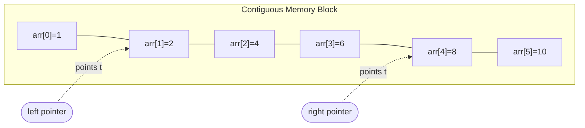
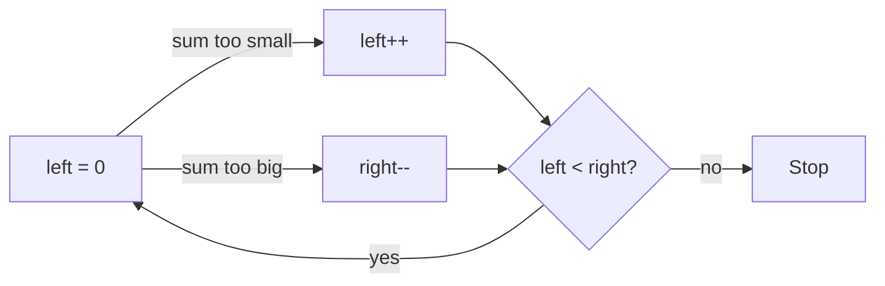
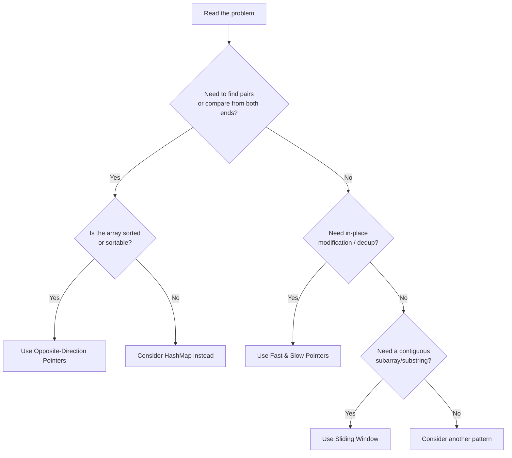
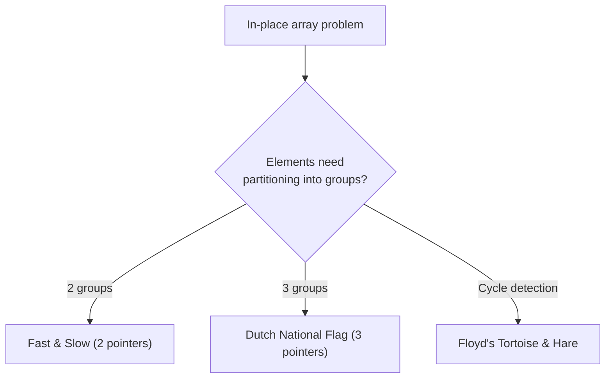
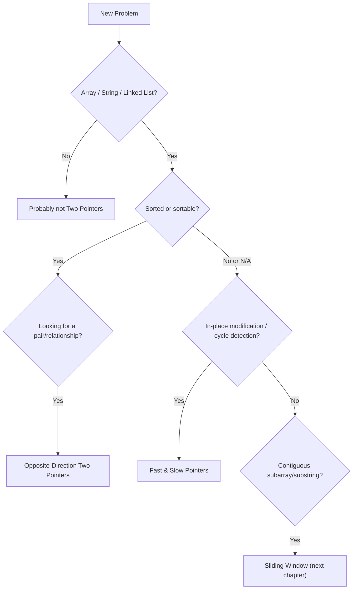

# Two Pointers Pattern

> *"Before you learn to run, learn to walk from both ends of the road."*

The **Two Pointers** pattern is one of the most elegant and widely used techniques in algorithmic problem solving. It takes a problem that naively costs you nested loops — and therefore quadratic time — and reshapes it so that a handful of indices, moving intelligently through the data, solve it in a single linear pass.

This chapter builds directly on **`01-Traversal.md`**. If Traversal taught you how to *walk* through an array one step at a time, Two Pointers teaches you how to walk through it with **two feet instead of one** — sometimes moving toward each other, sometimes moving together, always making a decision at every step that eliminates possibilities other approaches would waste time checking.

By the end of this chapter, Two Pointers will feel less like a "trick" and more like an obvious consequence of how arrays are structured in memory.

---

## Learning Objectives

After completing this chapter, you should be able to:

- Explain **what** the Two Pointers pattern is, in plain language and in code
- Explain **why** it turns O(n²) brute-force solutions into O(n) solutions
- Recognize **when** a problem is a Two Pointers candidate, often within seconds of reading it
- Distinguish between the different **types** of two-pointer strategies (opposite direction, same direction, sliding window, multiple pointers)
- Analyze the **time and space complexity** of two-pointer solutions with a rigorous justification, not just a memorized rule
- Apply the pattern confidently to classic **interview problems**
- Avoid the **common bugs** that trip up even experienced engineers (infinite loops, off-by-one errors, unsorted-array mistakes)

---

## Prerequisites

Before continuing, make sure you're comfortable with the ideas from **`01-Traversal.md`**:

| Concept | Why it matters here |
|---|---|
| Arrays | Two Pointers operates almost exclusively on arrays and array-like structures (strings, linked lists) |
| Traversal | Two Pointers is traversal — just with two cursors instead of one |
| Indexes | Pointers in this pattern are *indices*, not addresses — you must be fluent with index arithmetic |
| Random Access | The technique relies on O(1) access to `arr[i]` for any `i` — this is what makes "jumping" pointers cheap |
| Time Complexity | You need to be able to *prove*, not guess, why a solution is O(n) instead of O(n²) |

> **Note:** If any of these feel shaky, it's worth a quick pass back through `01-Traversal.md` before continuing. Two Pointers is not a new topic — it's Traversal with a second cursor and a smarter strategy for moving it.

---

## Motivation

Let's start where every good optimization story starts: with the slow solution.

### The Problem

> Given a **sorted** array of integers, find two numbers that add up to a given `target`.

### The Brute-Force Instinct

The first instinct almost everyone has is: *check every pair*.

```python
def two_sum_brute_force(arr, target):
    n = len(arr)
    for i in range(n):
        for j in range(i + 1, n):
            if arr[i] + arr[j] == target:
                return [i, j]
    return [-1, -1]
```

This works. But look at what it's actually doing:

```
arr = [1, 2, 4, 6, 8, 10]   target = 10

Pairs checked:
(1,2) (1,4) (1,6) (1,8) (1,10)
(2,4) (2,6) (2,8) (2,10)
(4,6) (4,8) (4,10)
(6,8) (6,10)
(8,10)
```

That's **15 comparisons** for just 6 elements. In general, the number of pairs is:

```
n(n-1)/2  →  O(n²)
```

As `n` grows, this becomes unacceptable:

| n (array size) | Pairs checked (n²/2) |
|---:|---:|
| 10 | ~45 |
| 1,000 | ~500,000 |
| 100,000 | ~5,000,000,000 |

At 100,000 elements, brute force is checking **five billion** pairs. On most machines that's several seconds to minutes — completely unacceptable for a production system, and an instant red flag in an interview.

The problem isn't that the brute force is "wrong." It's that it's **wasteful**. It rechecks information it already has. Once we know `arr[0] + arr[5]` is too small, do we really need to separately discover that `arr[0] + arr[4]` might also be too small? Two Pointers is built on the insight that **sorted order carries information**, and we should use that information to eliminate entire ranges of possibilities at once.

---

## What is the Two Pointers Pattern?

Forget code for a moment. Think about real life.

**Analogy 1 — Two people walking toward each other**
Imagine two friends starting at opposite ends of a long hallway, walking toward each other to meet in the middle. Neither of them re-walks ground the other has already covered. Together, they cover the entire hallway in half the time it would take one person alone.

**Analogy 2 — Searching a bookshelf from both ends**
You're looking for two books whose combined thickness matches a shelf gap exactly. Instead of comparing every book to every other book, you grab the leftmost (thinnest, if sorted by width) and rightmost (thickest) book and adjust based on whether your total is too small or too large.

**Analogy 3 — Closing elevator doors**
Two elevator door panels slide toward each other from opposite sides. Each one only ever moves in one direction, and together they "close the gap" — this is a nice mental image for the *opposite-direction* pointer pattern.

**Analogy 4 — Two cameras moving through a crowd**
One camera moves quickly, scanning ahead; another moves slowly, staying behind to record only what matters. This is the mental model for the *fast & slow* pointer pattern you'll see later in this chapter.

### Connecting the Analogy to Arrays

In every one of these analogies, two independent "agents" move through the same space, each carrying partial information, and together they make a decision no single agent could make alone as efficiently.

In an array, this becomes:

- Two **index variables** (commonly named `left`/`right` or `slow`/`fast`)
- Each pointing at a position in the array
- Each moving according to a **rule** based on what they observe
- The loop ends when a **stopping condition** is met (usually `left >= right`, or `fast` reaching the end)

```python
left = 0
right = len(arr) - 1

while left < right:
    # look at arr[left] and arr[right]
    # decide which pointer to move
    ...
```

That's it. That's the skeleton of nearly every opposite-direction two-pointer solution you will ever write.

---

## Visualization

Let's trace the Two Sum problem visually using `arr = [1, 2, 4, 6, 8, 10]`, `target = 10`.

**Initial State**

```
  L                                   R
+----+----+----+----+----+----+
| 1  | 2  | 4  | 6  | 8  | 10 |
+----+----+----+----+----+----+
  0    1    2    3    4    5

sum = arr[L] + arr[R] = 1 + 10 = 11   (too big → move R left)
```

**Step 1 — Move Right pointer left**

```
  L                              R
+----+----+----+----+----+----+
| 1  | 2  | 4  | 6  | 8  | 10 |
+----+----+----+----+----+----+
  0    1    2    3    4    5

sum = 1 + 8 = 9   (too small → move L right)
```

**Step 2 — Move Left pointer right**

```
       L                        R
+----+----+----+----+----+----+
| 1  | 2  | 4  | 6  | 8  | 10 |
+----+----+----+----+----+----+
  0    1    2    3    4    5

sum = 2 + 8 = 10   ✅ FOUND! return [1, 4]
```

**If the pointers had crossed (no answer exists)**

```
                 R    L
+----+----+----+----+----+----+
| 1  | 2  | 4  | 6  | 8  | 10 |
+----+----+----+----+----+----+

left >= right → loop ends, no pair found
```

Notice the key behavior: **every move discards an entire set of impossible pairs**, not just one. When `sum` was too big at `(1, 10)`, we didn't just rule out `(1,10)` — we ruled out `(1,10)`, `(2,10)`, `(4,10)`, etc. being *the* answer alongside index 10, because we know moving `R` down is the only way to shrink the sum given a sorted array. That's the whole trick.

---

## Memory Visualization

A common misconception among beginners is that "moving a pointer" somehow moves data. It doesn't. **The array is completely static in memory.** Only two integer variables — `left` and `right` — change value.

```
Array in memory (contiguous block):

Address:   1000  1004  1008  1012  1016  1020
Value:     [ 1 ] [ 2 ] [ 4 ] [ 6 ] [ 8 ] [10 ]
Index:       0     1     2     3     4     5

left  = 1   →  points at index 1  →  address 1004
right = 4   →  points at index 4  →  address 1016
```

Because arrays support **O(1) random access**, jumping `left` from index `1` to index `2` costs exactly the same as jumping it from index `1` to index `500`. This is *why* the two-pointer trick is cheap: pointer movement is just integer arithmetic, not physical data movement.



> **Interview Tip:** If an interviewer asks "what's actually moving in memory?", the correct answer is: *nothing in the array — only the index variables change.* This shows you understand the pattern at a systems level, not just a syntax level.

---

## Why Two Pointers Works

Here's the mathematical heart of the pattern, explained intuitively first.

### Intuition First

If an array is **sorted**, then moving `left` to the right can only **increase** `arr[left]`, and moving `right` to the left can only **decrease** `arr[right]`. This monotonic behavior means every comparison you make gives you *directional* information: "the sum is too big" always means "shrink from the right," never "maybe shrink from either side, who knows."

Contrast this with an unsorted array, where increasing `left` might increase *or* decrease `arr[left]` unpredictably — the direction gives you no reliable information, and the whole strategy collapses.

### The Proof Sketch

Claim: the opposite-direction two-pointer loop for Two Sum runs in **O(n)** time.

1. `left` starts at `0` and only ever **increases**.
2. `right` starts at `n-1` and only ever **decreases**.
3. The loop terminates when `left >= right`.
4. Each iteration of the loop moves `left` forward by at least 1, **or** moves `right` backward by at least 1 (never both stay still).
5. The total distance `left` can travel is at most `n`. The total distance `right` can travel is at most `n`.
6. Therefore the loop body executes **at most `2n` times**, which simplifies to **O(n)**.

This is fundamentally different from nested loops, where the *inner* loop resets and re-scans the same territory for every step of the *outer* loop. Two Pointers never backtracks — each index visits its territory **at most once**.

> **Note:** This "each pointer moves at most n times, so total work is O(n)" argument is the standard proof technique for *all* two-pointer variants, not just opposite-direction ones. You'll reuse this exact reasoning for fast & slow pointers and sliding windows.

---

## Types of Two Pointers

### Opposite Direction

```
Left → · · · · · · ← Right
```

The pointers start at opposite ends and move toward each other, usually meeting in the middle or crossing entirely.

**When to use it:** The array (or string) is sorted, or has a property that lets you meaningfully compare "an item from each end."

**Classic examples:**

| Problem | Idea |
|---|---|
| Two Sum II (sorted input) | Move `left` up if sum too small, `right` down if too big |
| Container With Most Water | Move the pointer at the **shorter** wall inward, since the taller wall can never be the bottleneck |
| Valid Palindrome | Compare characters from both ends, skipping non-alphanumeric characters |



---

### Same Direction (Fast & Slow)

```
Slow →
Fast   →→→
```

Both pointers move in the **same direction**, but at different speeds or under different conditions. The slow pointer typically marks "the boundary of valid/processed data," while the fast pointer explores ahead.

**When to use it:** In-place array modification, deduplication, or detecting cycles in a linked list.

**Classic examples:**

| Problem | Slow pointer role | Fast pointer role |
|---|---|---|
| Remove Duplicates from Sorted Array | Marks the end of the unique-elements section | Scans forward looking for the next unique value |
| Move Zeroes | Marks where the next non-zero should go | Scans forward looking for non-zero values |
| Linked List Cycle (Floyd's algorithm) | Moves 1 node at a time | Moves 2 nodes at a time — if there's a cycle, they *must* eventually meet |

```
Move Zeroes — arr = [0, 1, 0, 3, 12]

slow=0 fast=0   [0, 1, 0, 3, 12]   arr[fast]=0 → skip, fast++
slow=0 fast=1   [0, 1, 0, 3, 12]   arr[fast]=1 → swap(slow,fast), slow++, fast++
slow=1 fast=2   [1, 0, 0, 3, 12]   arr[fast]=0 → skip, fast++
slow=1 fast=3   [1, 0, 0, 3, 12]   arr[fast]=3 → swap(slow,fast), slow++, fast++
slow=2 fast=4   [1, 3, 0, 0, 12]   arr[fast]=12 → swap(slow,fast), slow++, fast++
slow=3 fast=5   [1, 3, 12, 0, 0]   fast out of bounds → stop
```

---

### Sliding Window

Sliding Window is, structurally, a **specialized same-direction two-pointer technique** where the region *between* the two pointers (the "window") represents a subarray or substring currently being examined. Instead of a single comparison per step, you maintain a running aggregate (sum, count, set of characters) over the window and expand/shrink it based on a condition.

```
[  window shrinks from the left  ]      [ window expands from the right ]
        left→                                              →right
```

Because the mechanics (two indices, monotonic movement, O(n) total work) are identical to what you just learned, Sliding Window will feel almost familiar rather than new when you reach the next chapter, **`03-Sliding-Window.md`**, where it gets a full dedicated treatment.

---

### Multiple Pointers

Some problems need **three or more** pointers working together. The most famous example is the **Dutch National Flag** problem, which partitions an array into three sections using three pointers: `low`, `mid`, and `high`.

```
Sort Colors: arr = [2, 0, 2, 1, 1, 0]   (0=red, 1=white, 2=blue)

  low                              high
+---+---+---+---+---+---+
| 2 | 0 | 2 | 1 | 1 | 0 |
+---+---+---+---+---+---+
  mid

Rule:
  arr[mid] == 0  → swap(low, mid); low++; mid++
  arr[mid] == 1  → mid++
  arr[mid] == 2  → swap(mid, high); high--   (mid stays — must re-check swapped value)
```

This is a single-pass, in-place, O(n) partitioning algorithm — a beautiful generalization of the two-pointer idea to three cursors.

---

## Dry Runs

### Dry Run 1 — Two Sum II

`arr = [2, 7, 11, 15]`, `target = 9`

| Step | Left | Right | arr[L] | arr[R] | Sum | Decision |
|---|---|---|---|---|---|---|
| 1 | 0 | 3 | 2 | 15 | 17 | Too big → `right--` |
| 2 | 0 | 2 | 2 | 11 | 13 | Too big → `right--` |
| 3 | 0 | 1 | 2 | 7 | 9 | ✅ Found → return `[0, 1]` |

### Dry Run 2 — Move Zeroes

`arr = [0, 1, 0, 3, 12]` (traced fully in the section above — final result: `[1, 3, 12, 0, 0]`)

Swap-by-swap view:

```
Swap 1: index(slow=0) ↔ index(fast=1)  → [0,1,0,3,12] → [1,0,0,3,12]
Swap 2: index(slow=1) ↔ index(fast=3)  → [1,0,0,3,12] → [1,3,0,0,12]
Swap 3: index(slow=2) ↔ index(fast=4)  → [1,3,0,0,12] → [1,3,12,0,0]
```

### Dry Run 3 — Remove Duplicates from Sorted Array

`arr = [1, 1, 2, 2, 3]`

| slow | fast | arr[fast] vs arr[slow] | Action |
|---|---|---|---|
| 0 | 1 | equal (1 == 1) | fast++ |
| 0 | 2 | different (2 != 1) | slow++, arr[slow]=arr[fast] → `[1,2,2,2,3]` |
| 1 | 3 | equal (2 == 2) | fast++ |
| 1 | 4 | different (3 != 2) | slow++, arr[slow]=arr[fast] → `[1,2,3,2,3]` |

Final unique length = `slow + 1 = 3` → first 3 elements `[1, 2, 3]` are the answer.

---

## Decision Process



A second, narrower decision tree focused purely on in-place array problems:



---

## Complexity Analysis

### Why Brute Force is O(n²)

Nested loops mean the inner loop's cost is paid **once per outer iteration**. If the outer loop runs `n` times and the inner loop runs up to `n` times, total work is:

```
n × n = n²
```

### Why Two Pointers is O(n)

As proven earlier: each pointer moves monotonically and independently covers at most `n` positions over the life of the algorithm. There is no re-scanning. Total pointer movements are bounded by:

```
(moves of left) + (moves of right) ≤ n + n = 2n = O(n)
```

### Space Complexity

Almost all two-pointer solutions use **O(1) extra space** — just the pointer variables themselves — because the technique modifies or reads the array **in place**, without allocating auxiliary structures like hash maps or extra arrays. This is one of the biggest reasons interviewers love this pattern: it's both time- *and* space-optimal.

| Approach | Time | Space |
|---|---|---|
| Brute Force (nested loops) | O(n²) | O(1) |
| HashMap-based | O(n) | O(n) |
| Two Pointers (sorted input) | O(n) | O(1) |

> **Warning:** Two Pointers achieving O(1) space assumes you're allowed to reorder or don't need to preserve original indices. If the problem requires returning *original* unsorted indices (like classic Two Sum on an unsorted array), you may need a HashMap instead — sorting would destroy the index information, unless you track it separately.

---

## Templates

### Java

**Opposite Pointers**

```java
public int[] twoSum(int[] arr, int target) {
    int left = 0, right = arr.length - 1;
    while (left < right) {
        int sum = arr[left] + arr[right];
        if (sum == target) {
            return new int[]{left, right};
        } else if (sum < target) {
            left++;   // need a bigger sum
        } else {
            right--;  // need a smaller sum
        }
    }
    return new int[]{-1, -1};
}
```
- **What happens:** Two indices converge from opposite ends, using the sorted property to decide direction.
- **Time Complexity:** O(n) — each pointer moves at most n times total.
- **Space Complexity:** O(1) — only two integer variables.
- **Common mistake:** Forgetting the `left < right` condition and letting pointers cross, causing incorrect or duplicate pairs.

**Fast & Slow Pointers**

```java
public int removeDuplicates(int[] arr) {
    if (arr.length == 0) return 0;
    int slow = 0;
    for (int fast = 1; fast < arr.length; fast++) {
        if (arr[fast] != arr[slow]) {
            slow++;
            arr[slow] = arr[fast];
        }
    }
    return slow + 1;
}
```
- **What happens:** `slow` marks the boundary of the "clean" section; `fast` scans ahead looking for new unique values.
- **Time Complexity:** O(n) — fast pointer visits every element exactly once.
- **Space Complexity:** O(1) — modifies the array in place.
- **Common mistake:** Starting `fast` at 0 instead of 1, causing an immediate self-comparison that wastes a step (not incorrect, just redundant) — or forgetting to return `slow + 1` instead of `slow`.

**Sliding Window Base Template**

```java
public int slidingWindowTemplate(int[] arr, int target) {
    int left = 0, sum = 0, result = Integer.MAX_VALUE;
    for (int right = 0; right < arr.length; right++) {
        sum += arr[right];
        while (sum >= target) {
            result = Math.min(result, right - left + 1);
            sum -= arr[left];
            left++;
        }
    }
    return result == Integer.MAX_VALUE ? 0 : result;
}
```
- **What happens:** `right` always expands the window; `left` shrinks it only when a condition is satisfied.
- **Time Complexity:** O(n) — `left` and `right` together move at most 2n times.
- **Space Complexity:** O(1).
- **Common mistake:** Using an `if` instead of a `while` for the shrinking step, which prevents the window from shrinking as much as it should.

**Multiple Pointers (Dutch National Flag)**

```java
public void sortColors(int[] arr) {
    int low = 0, mid = 0, high = arr.length - 1;
    while (mid <= high) {
        if (arr[mid] == 0) {
            swap(arr, low++, mid++);
        } else if (arr[mid] == 1) {
            mid++;
        } else {
            swap(arr, mid, high--);  // do NOT increment mid here
        }
    }
}

private void swap(int[] arr, int i, int j) {
    int temp = arr[i];
    arr[i] = arr[j];
    arr[j] = temp;
}
```
- **What happens:** Three pointers partition the array into `[0s | 1s | unprocessed | 2s]` sections.
- **Time Complexity:** O(n) — single pass.
- **Space Complexity:** O(1).
- **Common mistake:** Incrementing `mid` after swapping with `high` — the swapped-in value hasn't been checked yet, so `mid` must stay put.

---

### Python

**Opposite Pointers**

```python
def two_sum(arr, target):
    left, right = 0, len(arr) - 1
    while left < right:
        total = arr[left] + arr[right]
        if total == target:
            return [left, right]
        elif total < target:
            left += 1     # need a bigger sum
        else:
            right -= 1    # need a smaller sum
    return [-1, -1]
```
- **What happens:** Identical logic to the Java version — index arithmetic drives the search.
- **Time Complexity:** O(n).
- **Space Complexity:** O(1).
- **Common mistake:** Using `<=` instead of `<` in the while condition, allowing `left == right` (comparing an element with itself).

**Fast & Slow Pointers**

```python
def remove_duplicates(arr):
    if not arr:
        return 0
    slow = 0
    for fast in range(1, len(arr)):
        if arr[fast] != arr[slow]:
            slow += 1
            arr[slow] = arr[fast]
    return slow + 1
```
- **What happens:** Same as Java — `slow` tracks the last confirmed unique element.
- **Time Complexity:** O(n).
- **Space Complexity:** O(1).
- **Common mistake:** Returning `slow` instead of `slow + 1` (off-by-one on the final count).

**Sliding Window Base Template**

```python
def min_subarray_len(arr, target):
    left = 0
    total = 0
    result = float('inf')
    for right in range(len(arr)):
        total += arr[right]
        while total >= target:
            result = min(result, right - left + 1)
            total -= arr[left]
            left += 1
    return 0 if result == float('inf') else result
```
- **What happens:** Same expand/shrink logic as the Java template.
- **Time Complexity:** O(n).
- **Space Complexity:** O(1).
- **Common mistake:** Forgetting to update `total` when shrinking the window, leaving stale data in the running sum.

**Multiple Pointers (Dutch National Flag)**

```python
def sort_colors(arr):
    low, mid, high = 0, 0, len(arr) - 1
    while mid <= high:
        if arr[mid] == 0:
            arr[low], arr[mid] = arr[mid], arr[low]
            low += 1
            mid += 1
        elif arr[mid] == 1:
            mid += 1
        else:
            arr[mid], arr[high] = arr[high], arr[mid]
            high -= 1   # mid is NOT incremented here
```
- **What happens:** Same three-way partition as the Java version.
- **Time Complexity:** O(n).
- **Space Complexity:** O(1).
- **Common mistake:** Advancing `mid` after swapping with `high`, skipping over an unverified value.

---

## Common Problems

| Problem | Why Two Pointers | Complexity |
|---|---|---|
| **Two Sum II** | Sorted input, need a pair summing to target | O(n) time, O(1) space |
| **Container With Most Water** | Move the shorter wall inward — it's always the bottleneck | O(n) time, O(1) space |
| **Valid Palindrome** | Compare characters from both ends inward | O(n) time, O(1) space |
| **Move Zeroes** | In-place partition of zero/non-zero elements | O(n) time, O(1) space |
| **Remove Duplicates** | In-place dedup using a "write pointer" | O(n) time, O(1) space |
| **Squares of a Sorted Array** | Largest squares come from the extremes of a sorted (possibly negative) array | O(n) time, O(n) space (output array) |
| **Sort Colors** | Three-way partition using low/mid/high | O(n) time, O(1) space |
| **Partition Array (e.g., around a pivot)** | Same in-place partition idea as Sort Colors, generalized | O(n) time, O(1) space |
| **Trapping Rain Water** | Track max-left and max-right walls while moving inward | O(n) time, O(1) space |
| **Boats to Save People** | Pair the lightest and heaviest person greedily from sorted weights | O(n log n) time (sort) + O(n), O(1) extra space |

---

## Comparison with Other Patterns

| Pattern | Best for | Typical Time | Typical Space | Needs Sorted Input? |
|---|---|---|---|---|
| **Traversal** | Simple single-pass scans (max, sum, search) | O(n) | O(1) | No |
| **Two Pointers** | Pairs, in-place partitioning, palindromes | O(n) | O(1) | Often yes (opposite direction) |
| **Sliding Window** | Contiguous subarrays/substrings with a running property | O(n) | O(1) or O(k) | No |
| **HashMap** | Pair-finding on **unsorted** data, frequency counting | O(n) | O(n) | No |
| **Binary Search** | Finding a value/boundary in sorted data via halving | O(log n) | O(1) | Yes |
| **Greedy** | Locally optimal choices that lead to a global optimum | Varies (often O(n log n) with sorting) | Varies | Often, after sorting |

**Decision rule of thumb:** if the problem needs a pair or a boundary in **sorted** data and you can avoid extra memory, prefer Two Pointers over HashMap. If the data is unsorted and you cannot sort it (e.g., you need original indices), HashMap is usually the right call instead.

---

## Common Mistakes

### 1. Moving the Wrong Pointer

```java
// ❌ Buggy: always moves `left`, ignoring the actual comparison
while (left < right) {
    int sum = arr[left] + arr[right];
    if (sum != target) {
        left++;   // wrong! ignores whether sum was too big or small
    }
}
```

```java
// ✅ Corrected
while (left < right) {
    int sum = arr[left] + arr[right];
    if (sum == target) return new int[]{left, right};
    else if (sum < target) left++;
    else right--;
}
```

### 2. Infinite Loops

```python
# ❌ Buggy: neither pointer moves in some branch
while left < right:
    if arr[left] == arr[right]:
        pass  # forgot to move a pointer!
    elif arr[left] < arr[right]:
        left += 1
    else:
        right -= 1
```

```python
# ✅ Corrected: every branch changes at least one pointer
while left < right:
    if arr[left] == arr[right]:
        left += 1
        right -= 1
    elif arr[left] < arr[right]:
        left += 1
    else:
        right -= 1
```

### 3. Using Unsorted Arrays

```java
// ❌ Buggy: applying opposite-direction pointers to unsorted data
int[] arr = {5, 1, 9, 2};
// two-pointer sum logic here breaks — direction gives no guarantees
```

```java
// ✅ Corrected: sort first (if index-agnostic), or use a HashMap
Arrays.sort(arr);  // now opposite-direction pointers are valid
```

### 4. Off-by-One Errors

```python
# ❌ Buggy: right starts at len(arr) instead of len(arr) - 1
right = len(arr)          # out of bounds!
```

```python
# ✅ Corrected
right = len(arr) - 1
```

### 5. Crossing Pointers Incorrectly

```java
// ❌ Buggy: loop condition allows left > right, producing garbage results
while (left <= right + 1) { ... }
```

```java
// ✅ Corrected
while (left < right) { ... }
```

### 6. Wrong Stopping Condition

```python
# ❌ Buggy: stops too early, misses valid pairs
while left != right:
    ...
    # if left overshoots right (skips past it), loop never ends
```

```python
# ✅ Corrected: use an inequality, not equality, as the stopping test
while left < right:
    ...
```

> **Warning:** `!=` as a loop condition is dangerous with pointers that can move by variable amounts or in unexpected orders — always prefer `<` for safety, since it correctly handles the case where pointers "jump past" each other.

---

## Interview Tips

- **Pattern recognition first:** The moment you see "sorted array" + "pair" or "in-place" + "array," say out loud (literally, in the interview): *"This looks like a Two Pointers problem because..."* — interviewers reward verbalized pattern recognition heavily.
- **State the complexity before coding:** Say *"I can solve this in O(n²) with brute force, but I believe Two Pointers gets us to O(n) time with O(1) space because the array is sorted."* This shows you're optimizing intentionally, not stumbling into the answer.
- **Watch for the sorted-array assumption:** If the interviewer says "unsorted," don't force Two Pointers — pause and consider whether sorting first is even allowed (it may break required index ordering).
- **Common follow-up questions:**
  - *"What if there are duplicate values?"* — Be ready to explain how you'd skip duplicates without breaking correctness.
  - *"What if you need all pairs, not just one?"* — Discuss how the same skeleton generalizes (advance both pointers after a match, skipping duplicates).
  - *"Can you do this without sorting?"* — Be ready to pivot to a HashMap-based O(n) time / O(n) space alternative.
- **Whiteboard advice:** Draw the array once, and represent pointer movement with arrows or by re-drawing only the pointer positions — don't redraw the entire array every step, it wastes time and space on the board.
- **Common interviewer traps:** Being asked to solve it on an *unsorted* array specifically to see if you blindly apply Two Pointers without checking prerequisites first.

---

## Pattern Recognition Checklist

Ask yourself these questions, in order, the moment you read a new problem:

1. **Is the input an array, string, or linked list?** (necessary, not sufficient)
2. **Is it sorted, or can it be sorted without losing required information?**
3. **Am I looking for a pair, triplet, or relationship between two ends?**
4. **Do I need to modify the array in place, without extra memory?**
5. **Do I need to detect a cycle or a "meeting point"?**
6. **Do I need a contiguous subarray/substring with some running property?** (→ this pushes you toward Sliding Window specifically)



---

## Real Interview Questions

**Easy**
1. Two Sum II — Input Array Is Sorted
2. Valid Palindrome
3. Move Zeroes
4. Remove Duplicates from Sorted Array
5. Squares of a Sorted Array
6. Reverse String
7. Merge Sorted Array

**Medium**
8. Container With Most Water
9. Sort Colors (Dutch National Flag)
10. 3Sum
11. 3Sum Closest
12. Remove Duplicates from Sorted Array II
13. Boats to Save People
14. Two Sum III — Data Structure Design
15. Partition Labels
16. Sort Array By Parity

**Hard**
17. Trapping Rain Water
18. 4Sum
19. Minimum Window Substring (bridges into Sliding Window)
20. Linked List Cycle II (find the entry point of the cycle)

---

## Complexity Cheat Sheet

| Pattern | Time | Space | Common Use Cases |
|---|---|---|---|
| Opposite Direction | O(n) | O(1) | Pair sums, palindromes, container problems |
| Fast & Slow | O(n) | O(1) | Deduplication, cycle detection, in-place moves |
| Sliding Window | O(n) | O(1) or O(k) | Subarray/substring with running condition |
| Multiple Pointers | O(n) | O(1) | Three-way partitioning (Dutch Flag) |
| Brute Force (baseline) | O(n²) | O(1) | Only when nothing else applies |

---

## Key Takeaways

- Two Pointers turns many O(n²) brute-force problems into **O(n)** solutions by using two indices that move with purpose instead of blindly checking every pair.
- The array itself never moves — only the **pointer variables** do. This is why the pattern is so cheap: pointer movement is O(1) arithmetic.
- **Sorted order** is what gives opposite-direction pointers their power: each comparison tells you definitively which direction to move.
- **Fast & Slow** pointers are the tool of choice for in-place modification and cycle detection, where one pointer explores and the other marks a boundary.
- **Sliding Window** is a specialized same-direction two-pointer technique for problems about contiguous ranges — the subject of the next chapter.
- Nearly every two-pointer solution achieves **O(1) extra space**, making it both time- and space-optimal compared to HashMap alternatives.
- The most common bugs are **infinite loops** (a branch that moves no pointer) and **incorrect stopping conditions** (`!=` instead of `<`) — always double check both.

---

## Quick Revision Sheet

```
TWO POINTERS — ONE PAGE SUMMARY
────────────────────────────────────────────
Opposite Direction:
    left = 0, right = n-1
    while left < right: compare, move one pointer inward

Fast & Slow:
    slow = 0
    for fast in range(1, n): conditionally advance slow

Sliding Window:
    left = 0
    for right in range(n): expand; while (condition) shrink from left

Multiple Pointers (3-way):
    low = 0, mid = 0, high = n-1
    while mid <= high: partition into 3 zones

KEY RULES:
    • Sorted input → opposite direction likely valid
    • In-place + dedup/cycle → fast & slow
    • Contiguous subrange → sliding window
    • 3-way split → multiple pointers

COMPLEXITY: almost always O(n) time, O(1) space
```

---

## Practice Problems

Ordered from foundational to advanced — solve them in this order for the smoothest learning curve.

1. **Two Sum II (sorted)** — the canonical opposite-direction warm-up
2. **Valid Palindrome** — opposite-direction with a skip-condition (non-alphanumeric chars)
3. **Reverse String** — simplest possible opposite-direction swap
4. **Squares of a Sorted Array** — opposite-direction with a twist (negative numbers)
5. **Move Zeroes** — first fast & slow in-place problem
6. **Remove Duplicates from Sorted Array** — fast & slow, classic dedup
7. **Remove Duplicates from Sorted Array II** — fast & slow with "allow up to 2 duplicates"
8. **Merge Sorted Array** — opposite-direction merging from the back
9. **Sort Array By Parity** — same-direction partition (odds/evens)
10. **Container With Most Water** — opposite-direction with a greedy insight (move shorter wall)
11. **3Sum** — opposite-direction nested inside a traversal loop
12. **3Sum Closest** — variation of 3Sum tracking closest difference instead of exact match
13. **Sort Colors** — introduces multiple pointers (Dutch National Flag)
14. **Partition Labels** — same-direction pointers tracking last-occurrence boundaries
15. **Boats to Save People** — greedy + opposite-direction pairing
16. **Linked List Cycle** — fast & slow on a linked list instead of an array
17. **Linked List Cycle II** — fast & slow, then find the cycle's entry point
18. **Trapping Rain Water** — opposite-direction with two running maximums
19. **4Sum** — generalizing 3Sum one level further
20. **Minimum Window Substring** — bridges directly into `03-Sliding-Window.md`

---

## Final Summary

Two Pointers is not a separate skill from Traversal — it's Traversal **specialized**. Where a single traversal walks through data once with one cursor, Two Pointers recognizes that many problems become dramatically simpler when a *second* cursor carries complementary information: the other end of a sorted array, the boundary of "clean" data, or a faster-moving scout searching for a cycle.

What makes this pattern so valuable for interviews and real systems alike is its combination of **O(n) time** and **O(1) space** — a rare and powerful pairing that brute force and even many HashMap-based solutions cannot match. Once you internalize the core skeleton — two indices, a clear movement rule, a clean stopping condition — you'll start recognizing Two Pointers opportunities almost instantly, and that recognition speed is exactly what separates a good problem solver from a great one.

From here, the natural next step is **`03-Sliding-Window.md`**, where you'll see this same two-pointer skeleton evolve to track a dynamic *window* over the data, rather than just two static comparison points — the technique that powers substring, subarray, and streaming problems across the entire field.
