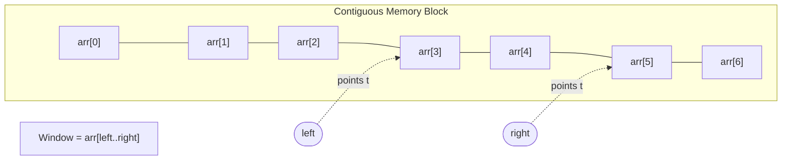
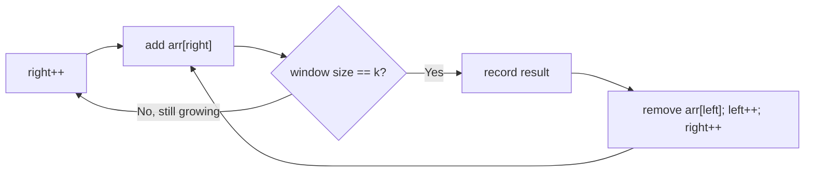
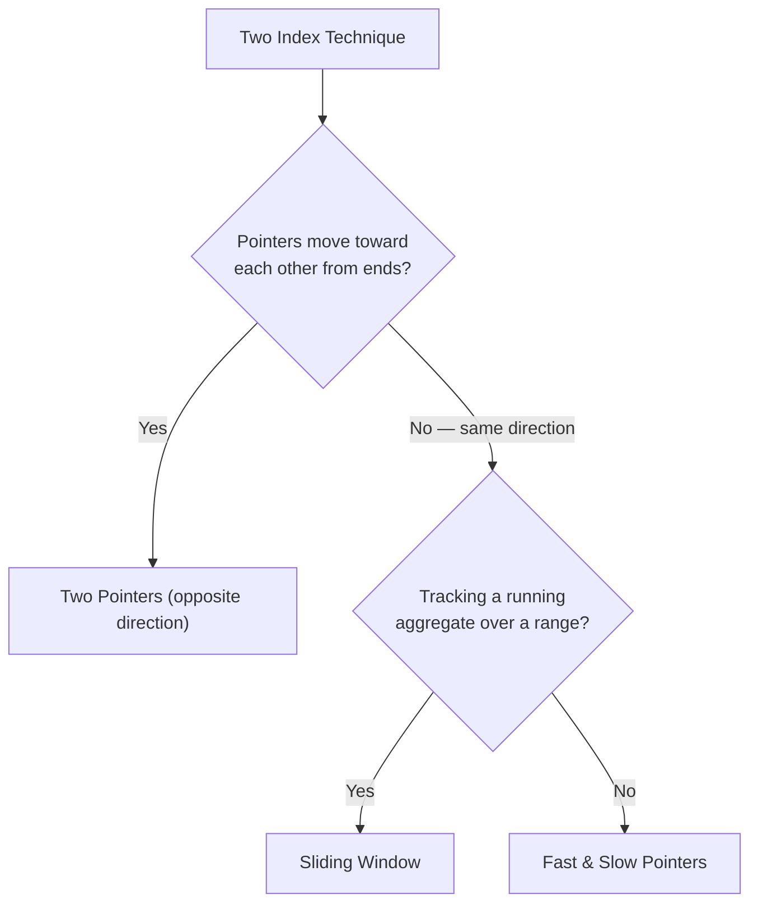
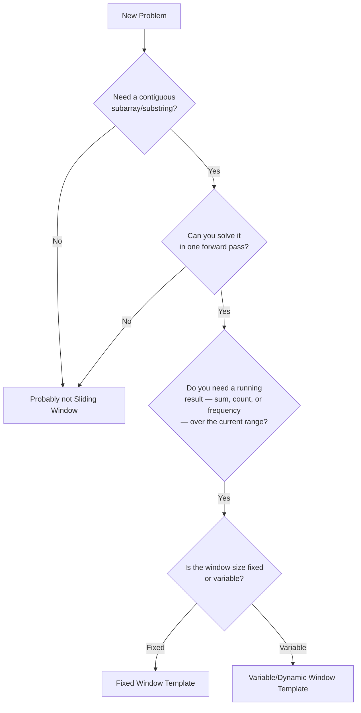

# Sliding Window Pattern

> *"Don't recompute what you can slide."*

The **Sliding Window** pattern is the natural next evolution after Two Pointers. It takes problems about *contiguous ranges* of an array or string — sums, lengths, character counts — and solves them by maintaining a "window" of elements that grows and shrinks intelligently, reusing work from the previous step instead of recalculating from scratch.

This chapter builds directly on **`01-Traversal.md`** and **`02-Two-Pointers.md`**. If you've internalized how two indices can cooperate to eliminate wasted comparisons, Sliding Window will feel like a very short step forward — because that's exactly what it is.

---

## Learning Objectives

After completing this chapter, you should be able to:

- Explain **what** Sliding Window is and why it's often described as "Two Pointers with a purpose"
- Explain **why** it exists — what specific inefficiency it eliminates
- Clearly distinguish **Traversal vs. Two Pointers vs. Sliding Window**
- Recognize and implement both **Fixed Window** and **Variable Window** variants
- Analyze **time and space complexity** with a rigorous, provable argument
- Apply the pattern to classic **interview problems** confidently
- Avoid the handful of bugs that account for almost every Sliding Window mistake in interviews

---

## Prerequisites

Make sure you're comfortable with:

| Concept | Where it's covered | Why it matters here |
|---|---|---|
| Arrays & Indexes | `01-Traversal.md` | The window is just a *range* of indices, `[left, right]` |
| Traversal | `01-Traversal.md` | Sliding Window is still a single forward pass — nothing new mechanically |
| Two Pointers | `02-Two-Pointers.md` | Sliding Window reuses the exact "two indices, monotonic movement" skeleton |
| Time Complexity | `01-Traversal.md` | You need to prove why this is O(n), not just accept it |

> **Note:** Sliding Window is not a new family of technique — it's the **same-direction two-pointer pattern** from the previous chapter, specialized so that the region *between* the pointers (the window) carries a running aggregate: a sum, a count, a character frequency map. Everything you learned about pointer movement still applies directly.

---

## Motivation

### The Problem

> Given an array of integers, find the **maximum sum of any contiguous subarray of size `k`**.

### The Brute-Force Instinct

```python
def max_sum_brute_force(arr, k):
    n = len(arr)
    max_sum = float('-inf')
    for i in range(n - k + 1):
        current_sum = 0
        for j in range(i, i + k):   # recompute the whole window every time
            current_sum += arr[j]
        max_sum = max(max_sum, current_sum)
    return max_sum
```

This recalculates the **entire sum** of the window for every single starting position, even though consecutive windows overlap in `k - 1` elements.

```
arr = [2, 5, 1, 8, 2, 9, 1]   k = 3

Window at i=0: [2,5,1] → sum = 8    (3 additions)
Window at i=1: [5,1,8] → sum = 14   (3 additions — but 5,1 were already summed!)
Window at i=2: [1,8,2] → sum = 11   (3 additions — 1,8 already summed!)
Window at i=3: [8,2,9] → sum = 19   (3 additions — 8,2 already summed!)
Window at i=4: [2,9,1] → sum = 12   (3 additions — 2,9 already summed!)
```

Every window (after the first) redoes `k - 1` additions it already performed one step earlier. The total work is:

```
(n - k + 1) windows × k additions each  →  O(n × k)
```

When `k` is large (say, `k ≈ n/2`), this degrades toward **O(n²)** — exactly the inefficiency we fought against in the Two Pointers chapter, just wearing a different costume.

| n | k | Naive operations (n × k) |
|---:|---:|---:|
| 1,000 | 10 | 10,000 |
| 1,000 | 500 | 500,000 |
| 100,000 | 50,000 | 5,000,000,000 |

The fix, as you might guess, is to **stop recomputing** and instead *update* the running sum incrementally.

---

## What is Sliding Window?

**Analogy 1 — Looking through a train window**
As a train moves forward, you don't re-perceive the entire landscape from scratch at every instant. Your view simply *shifts*: new scenery enters on one side, old scenery exits on the other. Your brain updates incrementally, not from zero.

**Analogy 2 — Moving a camera across a scene**
A panning camera doesn't re-render the whole picture for every frame — it keeps most of the frame and only updates the edges where the view has changed.

**Analogy 3 — Scanning CCTV footage**
A security analyst reviewing footage in fixed-length clips doesn't rewatch the whole video for every clip — they slide a fixed-duration "window" forward across the timeline, one clip at a time.

**Analogy 4 — Reading a sentence through a magnifier**
If you can only see a few words at a time through a magnifying glass, you slide the glass one word to the right; you don't lift it and reposition it from the start of the sentence each time.

### Connecting the Analogy to Arrays

In every analogy, there's a **bounded region of focus** that moves forward, and updating that region costs *only the difference at the edges* — not a full recomputation.

```python
left = 0
window_state = init_empty_state()

for right in range(len(arr)):
    add(window_state, arr[right])          # expand: bring new element in
    while window_is_invalid(window_state):  # shrink if needed
        remove(window_state, arr[left])
        left += 1
    # window_state now describes arr[left..right]
```

This is the skeleton for nearly every Sliding Window problem you will ever encounter.

---

## Visualization

Let's visualize a **fixed-size window** of `k = 3` sliding across `arr = [2, 5, 1, 8, 2, 9, 1]`.

```
Array:
+----+----+----+----+----+----+----+
|  2 |  5 |  1 |  8 |  2 |  9 |  1 |
+----+----+----+----+----+----+----+
   0    1    2    3    4    5    6

Window Size = 3

Step 1:  [ 2  5  1 ] 8  2  9  1     sum = 8
Step 2:    2 [ 5  1  8 ] 2  9  1    sum = 8 - 2 + 8 = 14
Step 3:    2  5 [ 1  8  2 ] 9  1    sum = 14 - 5 + 2 = 11
Step 4:    2  5  1 [ 8  2  9 ] 1    sum = 11 - 1 + 9 = 19  ← maximum
Step 5:    2  5  1  8 [ 2  9  1 ]   sum = 19 - 8 + 1 = 12
```

**What changes at every step?** Exactly two things: one element leaves the window on the left, one element enters on the right. Everything else — the sum of the "shared" middle elements — stays untouched.

Now a **variable-size window** example — finding the smallest subarray with sum ≥ 15:

```
arr = [2, 1, 5, 2, 8]   target = 15

right=0  window=[2]              sum=2   (too small, keep expanding)
right=1  window=[2,1]            sum=3   (too small)
right=2  window=[2,1,5]          sum=8   (too small)
right=3  window=[2,1,5,2]        sum=10  (too small)
right=4  window=[2,1,5,2,8]      sum=18  (≥15! shrink from left)
   left=0→1  window=[1,5,2,8]    sum=16  (still ≥15, shrink again)
   left=1→2  window=[5,2,8]      sum=15  (still ≥15, shrink again)
   left=2→3  window=[2,8]        sum=10  (<15, stop shrinking)
   → smallest window found so far: length 3 ([5,2,8])
```

Notice how the window **breathes** — expanding when the condition isn't met, contracting the moment it is, always searching for the tightest valid range.

---

## Memory Visualization

Just like in Two Pointers, **the array never moves**. Only `left` and `right` — simple integer indices — change value.

```
Address:   2000  2004  2008  2012  2016  2020  2024
Value:     [ 2 ] [ 5 ] [ 1 ] [ 8 ] [ 2 ] [ 9 ] [ 1 ]
Index:       0     1     2     3     4     5     6

left  = 3   →  address 2012
right = 5   →  address 2020

Window = arr[left..right] = arr[3..5] = [8, 2, 9]
```



> **Note:** The "window" itself is not a separate data structure that gets copied — it's a **conceptual range** defined entirely by `left` and `right`. Any aggregate you track (sum, character counts, distinct-element count) is maintained incrementally alongside it, in O(1) extra work per step.

---

## Why Sliding Window Works

### Intuition First

Instead of recomputing the sum of a window from scratch, you can express the new window in terms of the old one:

```
new_sum = old_sum − (element leaving on the left) + (element entering on the right)
```

This is the entire mathematical trick. It converts an O(k) recomputation into an **O(1) update**.

```
Old Window:  [ 5  1  8 ]           sum = 14
                  ↓
Remove Left (5):     [ 1  8 ]      sum = 14 - 5 = 9
                  ↓
Add Right (2):       [ 1  8  2 ]   sum = 9 + 2 = 11
```

### The Proof Sketch

Claim: sliding a window of any kind across an array of length `n` costs **O(n)** total, regardless of window size `k`.

1. `right` starts at `0` and moves forward exactly `n` times (once per element) — it never moves backward.
2. `left` starts at `0` and moves forward **at most** `n` times over the life of the algorithm — it also never moves backward.
3. Each element is added to the window's aggregate **exactly once** (when `right` reaches it) and removed **at most once** (when `left` passes it).
4. Therefore total work is bounded by `n` additions + `n` removals = **O(n)**, independent of `k`.

This is a direct reuse of the proof technique from `02-Two-Pointers.md`: *each pointer moves monotonically and visits each position a constant number of times.*

> **Warning:** This proof assumes the per-element add/remove operation is O(1) (like adding to a running sum, or incrementing a count in a hash map). If your window's "add" or "remove" operation is itself expensive — e.g., recomputing a sorted structure — the overall complexity will be higher than O(n), even though the *pointer movement* is still O(n).

---

## Types of Sliding Window

### Fixed Size Window

The window size `k` is **constant** throughout the algorithm. `right` and `left` move together, maintaining a constant gap.

```
right - left + 1 == k   (always true)
```

**When to use it:** The problem explicitly gives you a window size (`k`), like "subarray of size k" or "average of every k elements."

**Classic examples:**

| Problem | Idea |
|---|---|
| Maximum Sum Subarray of size K | Slide a size-k window, updating sum incrementally |
| Average of Subarrays of size K | Same as above, divide by k at each step |
| Maximum Average Subarray I | Track the max sum window, then convert to average once |



---

### Variable Size Window

The window size **changes dynamically** based on a condition. `right` always expands the window; `left` shrinks it only when necessary.

**When to use it:** The problem asks for the *longest* or *shortest* subarray/substring satisfying some property — there's no fixed size given.

**Classic examples:**

| Problem | Expand condition | Shrink condition |
|---|---|---|
| Longest Substring Without Repeating Characters | Always expand `right` | Shrink while a duplicate exists in the window |
| Minimum Size Subarray Sum | Always expand `right` | Shrink while `sum ≥ target` |
| Fruit Into Baskets | Always expand `right` | Shrink while more than 2 distinct fruit types |

```
Longest Substring Without Repeating Characters
s = "abcabcbb"

right=0 'a'  window="a"      no dup → expand           maxLen=1
right=1 'b'  window="ab"     no dup → expand           maxLen=2
right=2 'c'  window="abc"    no dup → expand           maxLen=3
right=3 'a'  window="abca"   dup 'a'! shrink from left
    left=0→1  window="bca"   dup gone → stop shrinking  maxLen=3
right=4 'b'  window="bcab"   dup 'b'! shrink from left
    left=1→2  window="cab"   dup gone → stop shrinking  maxLen=3
...
```

---

### Dynamic Window

"Dynamic window" describes the *general behavior* of a variable-size window — expanding and shrinking freely, sometimes multiple shrink-steps per single expand-step. It's not a third distinct algorithm so much as emphasis: the window's size is a **function of the data**, not a fixed input.

```
Expand →  →  →
                ↕ (may shrink several times before the next expand)
Shrink ←  ←
```

This flexibility is what allows Sliding Window to solve problems like "minimum window containing all characters of another string" (Minimum Window Substring) — where the window must aggressively shrink whenever it becomes "more valid than necessary," searching for the tightest possible bound.

---

## Dry Runs

### Dry Run 1 — Maximum Sum Subarray (Fixed Window, k = 3)

`arr = [2, 5, 1, 8, 2, 9, 1]`

| Iteration | Window | Current Sum | Maximum So Far | Decision |
|---|---|---|---|---|
| 1 | `[2,5,1]` | 8 | 8 | initial window, record sum |
| 2 | `[5,1,8]` | 14 | 14 | subtract 2, add 8 |
| 3 | `[1,8,2]` | 11 | 14 | subtract 5, add 2 |
| 4 | `[8,2,9]` | 19 | **19** | subtract 1, add 9 → new max |
| 5 | `[2,9,1]` | 12 | 19 | subtract 8, add 1 |

**Result: maximum sum = 19**

### Dry Run 2 — Longest Substring Without Repeating Characters

`s = "pwwkew"`

| right | char | window (before shrink) | duplicate? | shrink action | window (after) | maxLen |
|---|---|---|---|---|---|---|
| 0 | p | "p" | no | — | "p" | 1 |
| 1 | w | "pw" | no | — | "pw" | 2 |
| 2 | w | "pww" | yes ('w') | left: 0→1 ("www"? no — remove 'p') then still dup, left:1→2 | "w" | 2 |
| 3 | k | "wk" | no | — | "wk" | 2 |
| 4 | e | "wke" | no | — | "wke" | **3** |
| 5 | w | "wkew" | yes ('w') | left: 2→3 | "kew" | 3 |

**Result: longest substring = 3 (`"wke"`)**

> **Note:** Why does `left` move? Because the moment a duplicate enters the window, the *entire prefix up to and including the previous occurrence of that character* becomes invalid — so `left` must jump past it before the window is valid again.

### Dry Run 3 — Minimum Size Subarray Sum (target = 7)

`arr = [2, 3, 1, 2, 4, 3]`

| right | window | sum | ≥ target? | action | min length so far |
|---|---|---|---|---|---|
| 0 | [2] | 2 | no | expand | ∞ |
| 1 | [2,3] | 5 | no | expand | ∞ |
| 2 | [2,3,1] | 6 | no | expand | ∞ |
| 3 | [2,3,1,2] | 8 | yes | shrink: remove 2 → [3,1,2]=6 (stop, <target) | **4** |
| 4 | [3,1,2,4] | 10 | yes | shrink: remove 3→[1,2,4]=7 (still ≥) remove 1→[2,4]=6 (stop) | **2** |
| 5 | [2,4,3] | 9 | yes | shrink: remove 2→[4,3]=7 (still ≥) remove 4→[3]=3 (stop) | **1**... wait, check: window [4,3] length 2, already have 2 |

Final answer: **minimum length = 2** (window `[4,3]` at the point sum was still ≥ 7).

---

## Complexity Analysis

### Why Brute Force is O(n²) or O(n×k)

Every window is recomputed from scratch, either by a second nested loop over the window contents (`O(n×k)`) or by trying every `(start, end)` pair (`O(n²)`).

### Why Sliding Window is O(n)

As proven above: `right` visits each index once, `left` visits each index at most once, and updating the aggregate at each visit is O(1). Total work is bounded by:

```
(moves of right) + (moves of left) ≤ n + n = O(n)
```

This holds **regardless of window size `k`** — a crucial insight. A fixed window of size `500,000` on an array of `1,000,000` elements still only costs O(n), not O(n × k).

### Space Complexity

| Window Type | Typical Space |
|---|---|
| Fixed window with running sum | O(1) |
| Variable window with a running sum/count | O(1) |
| Variable window with a character/element frequency map | O(k) where k = alphabet size or distinct-element count (often treated as O(1) for fixed alphabets like ASCII) |

> **Warning:** "O(1) space" claims for substring problems often quietly assume a bounded alphabet (like 26 lowercase letters or 128 ASCII characters). If you're working with arbitrary Unicode strings, the frequency map's size is technically **O(min(n, alphabet size))** — always state this assumption explicitly in an interview.

---

## Templates

### Java

**Fixed Window**

```java
public int maxSumFixedWindow(int[] arr, int k) {
    int windowSum = 0;
    for (int i = 0; i < k; i++) {
        windowSum += arr[i];          // build the first window
    }
    int maxSum = windowSum;
    for (int right = k; right < arr.length; right++) {
        windowSum += arr[right] - arr[right - k];  // slide: add new, remove old
        maxSum = Math.max(maxSum, windowSum);
    }
    return maxSum;
}
```
- **What happens:** Build the first window explicitly, then slide one step at a time, updating the sum in O(1).
- **Time Complexity:** O(n) — one pass to build, one pass to slide.
- **Space Complexity:** O(1).
- **Common mistake:** Recomputing the window sum inside the sliding loop instead of using the incremental update — silently reintroduces O(n×k).

**Variable Window**

```java
public int minSubArrayLen(int target, int[] arr) {
    int left = 0, sum = 0, minLen = Integer.MAX_VALUE;
    for (int right = 0; right < arr.length; right++) {
        sum += arr[right];
        while (sum >= target) {
            minLen = Math.min(minLen, right - left + 1);
            sum -= arr[left];
            left++;
        }
    }
    return minLen == Integer.MAX_VALUE ? 0 : minLen;
}
```
- **What happens:** `right` always expands; `left` shrinks greedily while the condition holds, tightening the window as much as possible before continuing.
- **Time Complexity:** O(n).
- **Space Complexity:** O(1).
- **Common mistake:** Using `if` instead of `while` for the shrink step — this only shrinks once per expansion instead of as much as possible, producing an incorrect (too large) answer.

**Dynamic Window (character frequency)**

```java
public int lengthOfLongestSubstring(String s) {
    Map<Character, Integer> lastSeen = new HashMap<>();
    int left = 0, maxLen = 0;
    for (int right = 0; right < s.length(); right++) {
        char c = s.charAt(right);
        if (lastSeen.containsKey(c) && lastSeen.get(c) >= left) {
            left = lastSeen.get(c) + 1;    // jump left past the duplicate
        }
        lastSeen.put(c, right);
        maxLen = Math.max(maxLen, right - left + 1);
    }
    return maxLen;
}
```
- **What happens:** Tracks the last index each character was seen at; jumps `left` forward directly instead of shrinking one step at a time.
- **Time Complexity:** O(n) — each character is visited a constant number of times.
- **Space Complexity:** O(min(n, alphabet size)).
- **Common mistake:** Forgetting the `lastSeen.get(c) >= left` check — without it, `left` can incorrectly jump *backward* based on a stale, already-excluded occurrence.

---

### Python

**Fixed Window**

```python
def max_sum_fixed_window(arr, k):
    window_sum = sum(arr[:k])   # build the first window
    max_sum = window_sum
    for right in range(k, len(arr)):
        window_sum += arr[right] - arr[right - k]   # slide: add new, remove old
        max_sum = max(max_sum, window_sum)
    return max_sum
```
- **What happens:** Same incremental-update idea as the Java version.
- **Time Complexity:** O(n).
- **Space Complexity:** O(1).
- **Common mistake:** Using `sum(arr[right-k+1:right+1])` inside the loop — this looks concise but silently recomputes the whole window every iteration, reintroducing O(n×k).

**Variable Window**

```python
def min_sub_array_len(target, arr):
    left = 0
    total = 0
    min_len = float('inf')
    for right in range(len(arr)):
        total += arr[right]
        while total >= target:
            min_len = min(min_len, right - left + 1)
            total -= arr[left]
            left += 1
    return 0 if min_len == float('inf') else min_len
```
- **What happens:** Identical logic to the Java version.
- **Time Complexity:** O(n).
- **Space Complexity:** O(1).
- **Common mistake:** Placing `total += arr[right]` after the while loop instead of before — this evaluates the condition against stale data.

**Dynamic Window (character frequency)**

```python
def length_of_longest_substring(s):
    last_seen = {}
    left = 0
    max_len = 0
    for right, c in enumerate(s):
        if c in last_seen and last_seen[c] >= left:
            left = last_seen[c] + 1
        last_seen[c] = right
        max_len = max(max_len, right - left + 1)
    return max_len
```
- **What happens:** Same jump-based shrink strategy as the Java version.
- **Time Complexity:** O(n).
- **Space Complexity:** O(min(n, alphabet size)).
- **Common mistake:** Using a `set` instead of a `dict` to track seen characters — this forces a slower one-step-at-a-time shrink instead of an O(1) direct jump.

---

## Common Problems

| Problem | Idea | Why Sliding Window | Complexity |
|---|---|---|---|
| **Maximum Sum Subarray (size k)** | Slide a fixed window, track max sum | Fixed window, O(1) incremental sum | O(n) time, O(1) space |
| **Maximum Average Subarray I** | Same as above, divide by k | Fixed window | O(n) time, O(1) space |
| **Longest Substring Without Repeating Characters** | Expand right, jump left past duplicates | Variable window with frequency map | O(n) time, O(min(n,alphabet)) space |
| **Permutation in String** | Fixed-size window matching a target frequency map | Fixed window + frequency comparison | O(n) time, O(1) space (bounded alphabet) |
| **Minimum Window Substring** | Shrink aggressively once all required chars are present | Dynamic window, "expand to satisfy, shrink to minimize" | O(n) time, O(k) space |
| **Minimum Size Subarray Sum** | Shrink while sum ≥ target | Variable window | O(n) time, O(1) space |
| **Fruit Into Baskets** | Shrink while more than 2 distinct types present | Variable window with a count map | O(n) time, O(1) space (at most 3 keys) |
| **Longest Repeating Character Replacement** | Shrink while `window size - max freq char count > k` | Variable window with frequency map | O(n) time, O(1) space (26 letters) |
| **Find All Anagrams in a String** | Fixed-size window matching frequency map | Fixed window + frequency comparison | O(n) time, O(1) space |
| **Maximum Erasure Value** | Shrink while a duplicate exists, track running sum | Variable window with a set + running sum | O(n) time, O(min(n,alphabet)) space |

---

## Sliding Window vs Two Pointers

### Similarities

- Both use **two indices** moving through the same array
- Both achieve **O(n)** time by eliminating redundant recomputation
- Both rely on the **monotonic movement** proof: each pointer visits each position a bounded number of times

### Differences

| Aspect | Two Pointers (opposite direction) | Sliding Window |
|---|---|---|
| Pointer movement | Toward each other, from opposite ends | Same direction, `right` leads, `left` follows |
| What's tracked | A pairwise comparison (`arr[left]`, `arr[right]`) | A running aggregate over the **entire range** between pointers |
| Typical goal | Find a pair/triplet satisfying a condition | Find the longest/shortest/best **contiguous range** |
| Requires sorted input? | Often yes | Rarely — works on unsorted arrays and strings just as well |
| Classic problems | Two Sum II, Container With Most Water | Longest Substring, Minimum Window Substring |



### When NOT to Use Sliding Window

- The subarray/substring you need is **not contiguous** (e.g., subsequences) — Sliding Window only works on contiguous ranges.
- The "cost" of adding/removing an element from the window is **not O(1)** (e.g., maintaining a sorted window requires O(log k) per update) — this doesn't break the pattern, but it changes the complexity, and you should say so explicitly.
- The problem requires looking at **all pairs**, not a single contiguous range — that's back to Two Pointers or brute force with pruning.

---

## Common Mistakes

### 1. Updating Window in the Wrong Order

```python
# ❌ Buggy: checks the condition BEFORE adding the new element
for right in range(len(arr)):
    while total >= target:      # stale `total` from before this iteration
        ...
    total += arr[right]
```

```python
# ✅ Corrected: always add first, then check/shrink
for right in range(len(arr)):
    total += arr[right]
    while total >= target:
        ...
```

### 2. Forgetting to Subtract the Left Value

```java
// ❌ Buggy: left advances but the aggregate is never updated
while (sum >= target) {
    minLen = Math.min(minLen, right - left + 1);
    left++;   // forgot: sum -= arr[left] BEFORE incrementing!
}
```

```java
// ✅ Corrected
while (sum >= target) {
    minLen = Math.min(minLen, right - left + 1);
    sum -= arr[left];
    left++;
}
```

### 3. Moving Left Incorrectly

```python
# ❌ Buggy: moves left by a fixed amount instead of based on the actual duplicate position
if c in last_seen:
    left += 1   # wrong! should jump to last_seen[c] + 1
```

```python
# ✅ Corrected
if c in last_seen and last_seen[c] >= left:
    left = last_seen[c] + 1
```

### 4. Infinite Loops

```java
// ❌ Buggy: shrink condition never becomes false because sum is never actually reduced
while (sum >= target) {
    minLen = Math.min(minLen, right - left + 1);
    // forgot to move left or update sum at all!
}
```

```java
// ✅ Corrected: every iteration of the shrink loop must change window state
while (sum >= target) {
    minLen = Math.min(minLen, right - left + 1);
    sum -= arr[left];
    left++;
}
```

### 5. Wrong Stopping Condition

```python
# ❌ Buggy: loop uses `right <= len(arr)`, causing an out-of-bounds access
for right in range(len(arr) + 1):
    total += arr[right]   # IndexError on the last iteration
```

```python
# ✅ Corrected
for right in range(len(arr)):
    total += arr[right]
```

### 6. Window Size Off-by-One

```java
// ❌ Buggy: window length computed as right - left instead of right - left + 1
int windowLength = right - left;   // undercounts by 1
```

```java
// ✅ Corrected
int windowLength = right - left + 1;
```

> **Warning:** The `right - left + 1` formula is the single most common source of off-by-one bugs in this entire pattern. Whenever you compute a window's length, pause and double-check this exact expression.

---

## Interview Tips

- **Pattern recognition first:** The moment you see "contiguous subarray," "substring," "longest," "shortest," or "at most/exactly k distinct," say it out loud: *"This is a Sliding Window problem because we need a contiguous range and can maintain a running aggregate."*
- **Clarify fixed vs. variable:** Before coding, ask (or state): *"Is the window size fixed, or does it depend on a condition?"* This single question determines your entire template.
- **State the incremental-update trick explicitly:** Mention that you'll avoid recomputation by subtracting the outgoing element and adding the incoming one — interviewers want to hear this reasoning, not just see it in code.
- **Common follow-up questions:**
  - *"Can you do this with O(1) extra space?"* — Discuss whether your aggregate needs a hash map (alphabet-dependent) or just a running number.
  - *"What if the array contains negative numbers?"* — For sum-based shrink conditions, negative numbers can break the "shrink while too big" monotonic logic — flag this explicitly, since it may require a different approach (e.g., prefix sums + monotonic deque).
  - *"What if k can be 0 or larger than the array?"* — Always mention edge cases as part of your answer.
- **Whiteboard advice:** Draw the array once, then represent the window as a bracket `[ ... ]` that you redraw at each step instead of re-drawing the whole array — this keeps your board fast and readable.
- **Common interviewer traps:** Being given a problem that *looks* like Sliding Window but actually involves non-contiguous elements (a subsequence) — verify contiguity before committing to this pattern.

---

## Pattern Recognition Checklist



Ask yourself, in order:
1. Am I looking at a **contiguous** range (not a subsequence)?
2. Can the answer be found in a **single forward pass**?
3. Does the range have a **running property** I can update incrementally (sum, count, distinct elements)?
4. Is the window size **given** (fixed) or **determined by a condition** (variable)?

If you answered "yes" to the first three, you're almost certainly looking at a Sliding Window problem.

---

## Real Interview Questions

**Easy**
1. Maximum Sum Subarray of Size K
2. Average of Subarrays of Size K
3. Maximum Average Subarray I
4. Contains Duplicate II (within a window of size k)
5. Number of Sub-arrays of Size K and Average Greater than or Equal to Threshold

**Medium**
6. Longest Substring Without Repeating Characters
7. Minimum Size Subarray Sum
8. Fruit Into Baskets
9. Permutation in String
10. Find All Anagrams in a String
11. Longest Repeating Character Replacement
12. Max Consecutive Ones III
13. Subarray Product Less Than K
14. Longest Substring with At Most K Distinct Characters
15. Maximum Erasure Value

**Hard**
16. Minimum Window Substring
17. Sliding Window Maximum (monotonic deque variant)
18. Substring with Concatenation of All Words
19. Longest Substring with At Most Two Distinct Characters
20. Minimum Number of K Consecutive Bit Flips

---

## Complexity Cheat Sheet

| Operation | Time | Space | Notes |
|---|---|---|---|
| Fixed Window | O(n) | O(1) | Independent of window size k |
| Variable Window (running sum/count) | O(n) | O(1) | left and right each move ≤ n times |
| Variable Window (frequency map) | O(n) | O(min(n, alphabet size)) | Map size bounded by distinct elements |
| Dynamic Window (Min Window Substring style) | O(n) | O(k) | k = size of the target pattern/character set |
| Brute Force (baseline) | O(n²) or O(n×k) | O(1) | Only when nothing else applies |

---

## Key Takeaways

- Sliding Window eliminates the redundant recomputation of overlapping ranges by updating a running aggregate **incrementally**: subtract what leaves, add what enters.
- It is a **specialized, same-direction Two Pointers technique** — the skeleton (`right` expands, `left` follows) is identical; what's new is the *running aggregate* maintained between them.
- **Fixed windows** keep a constant gap between `left` and `right`; **variable windows** expand freely and shrink only when a condition demands it.
- The complexity proof is the same one you learned in `02-Two-Pointers.md`: each pointer moves monotonically and visits each index a bounded number of times, giving **O(n)** total work regardless of window size.
- The most common bugs cluster around **order of operations** (add before checking), **incomplete shrinking** (`if` instead of `while`), and **off-by-one window length** (`right - left + 1`).
- Sliding Window does **not** apply to non-contiguous subsequences — always verify contiguity before reaching for this pattern.

---

## Quick Revision Sheet

```
SLIDING WINDOW — ONE PAGE SUMMARY
────────────────────────────────────────────
Fixed Window:
    build first window of size k
    for right in range(k, n):
        add arr[right]; remove arr[right-k]
        update result

Variable Window:
    left = 0
    for right in range(n):
        add arr[right]                 # always expand
        while window_invalid():
            remove arr[left]; left++    # shrink until valid
        update result

Dynamic Window (Min Window style):
    expand right until window satisfies condition
    then shrink left as much as possible while still valid
    record best window whenever valid

KEY RULES:
    • Contiguous range only — never subsequences
    • O(1) incremental update = O(n) total, independent of k
    • while > if for shrinking (shrink as much as possible)
    • window length = right - left + 1 (memorize this)

COMPLEXITY: almost always O(n) time, O(1) or O(k) space
```

---

## Practice Problems

Ordered from foundational to advanced.

1. **Maximum Sum Subarray of Size K** — the canonical fixed-window warm-up
2. **Average of Subarrays of Size K** — fixed window, trivial extension
3. **Maximum Average Subarray I** — same idea, framed differently
4. **Contains Duplicate II** — fixed window with a hash set
5. **Longest Substring Without Repeating Characters** — first variable window with a frequency map
6. **Minimum Size Subarray Sum** — variable window, shrink while sum too big
7. **Fruit Into Baskets** — variable window, shrink while > 2 distinct types
8. **Max Consecutive Ones III** — variable window, shrink while too many zeros flipped
9. **Subarray Product Less Than K** — variable window with a running product
10. **Longest Substring with At Most K Distinct Characters** — variable window, generalized distinct-count constraint
11. **Permutation in String** — fixed window matching a target frequency map
12. **Find All Anagrams in a String** — same idea as above, collect all matches
13. **Longest Repeating Character Replacement** — variable window with a "budget" for replacements
14. **Maximum Erasure Value** — variable window with a running sum + duplicate check
15. **Minimum Window Substring** — the hardest classic dynamic window problem
16. **Sliding Window Maximum** — introduces the monotonic deque extension
17. **Longest Substring with At Most Two Distinct Characters** — specific case of problem 10
18. **Substring with Concatenation of All Words** — multiple fixed windows combined
19. **Number of Sub-arrays of Size K with Average ≥ Threshold** — fixed window, counting variant
20. **Minimum Number of K Consecutive Bit Flips** — advanced, window + greedy combination

---

## Final Summary

Sliding Window is where Traversal and Two Pointers converge into one of the most practically useful patterns in all of algorithm design. From Traversal, it inherits the single forward pass. From Two Pointers, it inherits the two-index skeleton and the proof that pointer movement is bounded by `O(n)`. What it adds is the key insight that made this whole chapter possible: **a range's aggregate can be updated incrementally**, so you never need to recompute what you've already computed.

This is precisely why Sliding Window shows up so often in interviews — it rewards the same recognition skill you've now built twice in a row (Traversal → Two Pointers → Sliding Window), while testing your discipline around correctness details like shrink conditions and off-by-one window lengths. Master this chapter, and you'll instantly recognize an enormous fraction of "contiguous subarray/substring" problems the moment you read them — often before you've even finished reading the full prompt.
