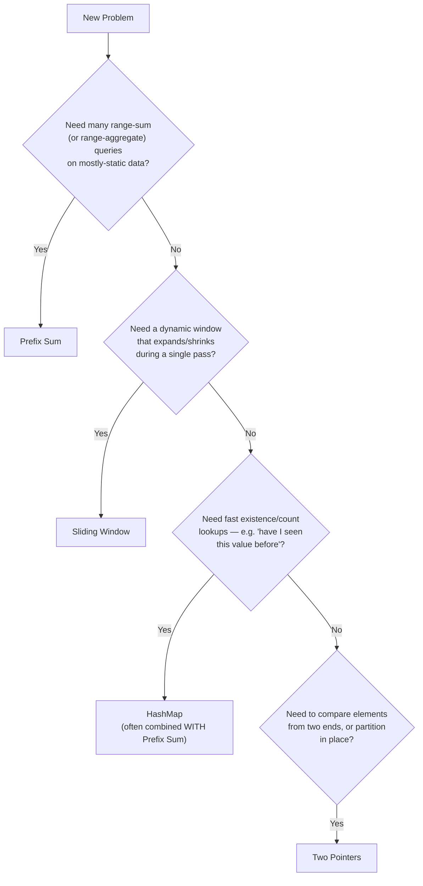

# 04 - Prefix Sum

> "Precompute once. Answer forever."

Every pattern in this repository so far has been about doing **less work per step** while still touching each element at least once — Traversal walks once, Two Pointers walks once with two cursors, Sliding Window walks once while maintaining a running aggregate. Prefix Sum takes a different, almost radical approach: it accepts a small upfront cost so that afterward, an entire *class* of questions — "what is the sum from index `l` to index `r`?" — can be answered in **constant time**, no matter how many times you ask.

### Why do we invent Prefix Sum?

Because in the real world, you rarely ask a range-sum question **once**. You ask it thousands of times, on the same underlying data, with different boundaries each time. A financial dashboard doesn't compute "total spend this month" once — it recomputes it for every filter a user applies. A game doesn't compute "total damage in the last 5 seconds" once — it recomputes it every frame. If every single one of those questions triggers a fresh linear scan, the system slows to a crawl under repeated queries, even though the underlying data barely changes.

### What problem does it solve?

Prefix Sum solves the **repeated range-query problem**: given a fixed array, answer many "sum of elements between index `l` and `r`" queries as fast as possible.

### Why is repeatedly summing ranges inefficient?

Because a naive range sum re-walks the same elements over and over. If you ask for `sum(2, 6)` and then `sum(3, 6)`, the naive approach recomputes the shared elements `[4, 5, 6]` from scratch both times, throwing away work it already did microseconds earlier. This is the exact same inefficiency you've now seen twice — in brute-force Two Sum, and in brute-force fixed-window sums — wearing yet another costume: **redundant recomputation of overlapping work**.

---

## The Learning Objectives

After this chapter, you should be able to:

- Explain precisely why Prefix Sum trades O(n) preprocessing for O(1) queries
- Build a prefix sum array from first principles, and explain every index in it
- Derive the range-sum formula visually, not just recite it
- Distinguish Prefix Sum from Sliding Window, Two Pointers, and HashMap — and know when each is the right tool
- Recognize the 1D and 2D variants, plus the Difference Array technique
- Apply Prefix Sum confidently to classic interview problems, including the HashMap-augmented variants like Subarray Sum Equals K

---

## Prerequisites

This chapter assumes comfort with everything from `01-Traversal.md`, `02-Two-Pointers.md`, and `03-Sliding-Window.md` — specifically:

| Concept | Why it matters here |
|---|---|
| Arrays & Memory Layout | Prefix Sum is itself just another array, built from the original |
| Static vs Dynamic Arrays | You'll build a new fixed-size array to hold prefix sums |
| Time Complexity | You must be able to justify O(n) build + O(1) query as *strictly better* than O(n) per query |
| Traversal | Building the prefix array is a single forward pass |
| Sliding Window | Prefix Sum solves a *different* shape of problem — many queries, not one running scan — and this chapter will draw that line sharply |

---

## The Problem

Consider the array:

```
Index:   0   1   2   3   4   5   6
Array:   3   1   4   2   5   7   6
```

**Question:** what is the sum of elements from index `2` to index `6`?

### The Naive Solution

```python
def range_sum_naive(arr, left, right):
    total = 0
    for i in range(left, right + 1):
        total += arr[i]
    return total
```

Visually, this walks across exactly the elements we care about:

```
Index:   0   1   2   3   4   5   6
Array:   3   1   4   2   5   7   6
                 ^-----------------^
              left=2              right=6

Need: 4 + 2 + 5 + 7 + 6 = 24
Cost: 5 additions → O(right - left + 1) = O(n) in the worst case
```

For a single query, this is perfectly fine. O(n) for one question is not a problem.

### Now Imagine 100,000 Queries

Suppose the same array (or one like it, at a much larger scale) receives **100,000 range-sum queries**, each with different `left` and `right` boundaries. The naive approach costs:

```
100,000 queries × O(n) per query = O(100,000 × n)
```

If `n = 100,000` as well, that's **10,000,000,000** operations — ten billion. On real hardware, this is the difference between a system that responds instantly and one that times out. And critically: **the array itself never changed** between queries. We are repeatedly paying full price to re-derive information that was fully determined the moment the array was built.

> **Note:** This is the defining symptom that should make you think "Prefix Sum": a **static array** (or one that changes rarely) paired with **many range-sum queries**. If the array changes constantly and queries are rare, Prefix Sum's upfront cost may not be worth paying — more on this in the decision sections below.

---

## The Big Idea

Instead of calculating every range from scratch, we **precompute cumulative information once**, and then every future query becomes a simple subtraction.

```
Original Array
      │
      │  (one O(n) pass)
      ▼
Prefix Array  (cumulative running totals)
      │
      │  (O(1) subtraction per query)
      ▼
Constant Time Range Queries — forever, no matter how many
```

The core insight: **a range sum is just the difference between two cumulative totals.** If you know "everything up to index 6" and "everything up to index 1," subtracting the second from the first leaves you with exactly "everything from index 2 to index 6" — nothing more, nothing less.

```
Total up to index 6:   3+1+4+2+5+7+6 = 28
Total up to index 1:   3+1             = 4
                                          ─────
Difference:                              24    ← exactly sum(2, 6)!
```

This single idea — that cumulative totals can be subtracted to isolate a range — is the entire engine behind Prefix Sum.

---

## Building Prefix Sum

Let's build a prefix sum array from scratch, step by step, using:

```
arr = [3, 1, 4, 2, 5]
```

We define `prefix[i]` = the sum of all elements from index `0` to index `i`, inclusive. Many implementations use a **length n+1** prefix array with `prefix[0] = 0` representing "the sum of zero elements" — this small trick, explained below, eliminates an entire category of edge-case bugs.

### Step-by-Step Construction (n+1 style)

```
arr:      [ 3,  1,  4,  2,  5]
prefix:   [ 0,  ?,  ?,  ?,  ?,  ?]     ← length 6 (n+1), prefix[0] = 0 always
```

**Iteration 1** — `i = 0`, `arr[0] = 3`

```
prefix[1] = prefix[0] + arr[0] = 0 + 3 = 3

prefix:   [ 0,  3,  ?,  ?,  ?,  ?]
```

**Iteration 2** — `i = 1`, `arr[1] = 1`

```
prefix[2] = prefix[1] + arr[1] = 3 + 1 = 4

prefix:   [ 0,  3,  4,  ?,  ?,  ?]
```

**Iteration 3** — `i = 2`, `arr[2] = 4`

```
prefix[3] = prefix[2] + arr[2] = 4 + 4 = 8

prefix:   [ 0,  3,  4,  8,  ?,  ?]
```

**Iteration 4** — `i = 3`, `arr[3] = 2`

```
prefix[4] = prefix[3] + arr[3] = 8 + 2 = 10

prefix:   [ 0,  3,  4,  8, 10,  ?]
```

**Iteration 5** — `i = 4`, `arr[4] = 5`

```
prefix[5] = prefix[4] + arr[4] = 10 + 5 = 15

prefix:   [ 0,  3,  4,  8, 10, 15]
```

### Final Result

```
arr:      [ 3,  1,  4,  2,  5]
prefix:   [ 0,  3,  4,  8, 10, 15]
             ↑
        "sum of the first 0 elements" — the empty prefix
```

> **Note:** `prefix[0] = 0` is not a placeholder — it is a **meaningful value**: the sum of zero elements is zero. This is what allows range sums starting at index `0` to be handled with the exact same formula as every other range, with no special case.

---

## Formula

### Definition

```
prefix[i] = arr[0] + arr[1] + ... + arr[i-1]      (using the n+1, 0-indexed-from-empty convention)
```

In other words, `prefix[i]` holds the sum of the first `i` elements of the original array — everything *before* index `i`.

### Deriving Range Sum Visually

Suppose we want `sum(left, right)` — the sum of `arr[left..right]` inclusive.

Think of `prefix[right+1]` as "everything from the start up through index `right`," and `prefix[left]` as "everything from the start up through index `left-1`" (i.e., everything *before* the range we want).

```
prefix[right+1] = arr[0] + arr[1] + ... + arr[left-1] + arr[left] + ... + arr[right]
                  └─────────────── unwanted ──────────────┘ └──────── wanted ────────┘

prefix[left]     = arr[0] + arr[1] + ... + arr[left-1]
                  └─────────────── unwanted ──────────────┘
```

Subtracting removes exactly the unwanted portion, because it appears identically in both totals:

```
prefix[right+1] - prefix[left]

  = (unwanted + wanted) - (unwanted)

  = wanted

  = sum(left, right)
```

### Why Subtraction Removes Unwanted Values

This works because **both cumulative sums share the exact same prefix** — everything from index `0` to `left - 1`. Subtraction is the mathematical operation that cancels out anything two quantities have in common, leaving only their difference. This is the same principle as "distance traveled between mile marker 40 and mile marker 65" being `65 - 40`, regardless of what happened on the road before mile marker 40 — that earlier stretch is shared history, and it cancels out.

### The Formula

```
sum(left, right) = prefix[right + 1] - prefix[left]
```

> **Warning:** This formula assumes the `n+1`-length prefix convention with `prefix[0] = 0`. If you instead use an `n`-length prefix array where `prefix[i]` means "sum through index `i` inclusive," the formula becomes `sum(left, right) = prefix[right] - prefix[left - 1]`, which requires a **special case when `left == 0`** (since `prefix[-1]` doesn't exist). This single convention choice is the source of more Prefix Sum bugs than any other decision in the entire pattern — pick one convention and be rigorous about it.

---

## Visual Intuition

```
Array:      3    1    4    2    5    7
Index:      0    1    2    3    4    5

Prefix:  0    3    4    8   10   15   22
Index:   0    1    2    3    4    5    6
```

**Query: sum(2, 5)** — sum of `arr[2..5]` = `4 + 2 + 5 + 7` = `18`

```
prefix[6] = 22   ← everything through index 5
prefix[2] = 4    ← everything through index 1 (before our range starts)

sum(2, 5) = prefix[6] - prefix[2] = 22 - 4 = 18   ✓
```

Visually, imagine the prefix array as a **filling water tank** — each new element adds more water, and the water level never drops:

```
Water level (cumulative sum):

  22 |                                        ████
  15 |                              ████████████
  10 |                    ████████████████████████
   8 |          ████████████████████████████████████
   4 |    ████████████████████████████████████████████
   3 |████████████████████████████████████████████████████
   0 └────────────────────────────────────────────────────
      prefix[0] [1]  [2]  [3]  [4]  [5]  [6]

The height difference between any two points on this staircase
IS the sum of everything between them.
```

---

## Algorithm

### Construction

```
prefix[0] = 0
for i from 0 to n-1:
    prefix[i+1] = prefix[i] + arr[i]
```

This is a single forward traversal — nothing more exotic than what you learned in `01-Traversal.md`.

### Answering Queries

```
function sum(left, right):
    return prefix[right + 1] - prefix[left]
```

### Complexities

| Phase | Complexity | Why |
|---|---|---|
| Build | O(n) | One pass over the array, O(1) work per element |
| Each Query | O(1) | A single subtraction, regardless of range size |
| m Queries | O(m) after O(n) build | Total: O(n + m), not O(n × m) |
| Space | O(n) | One extra array of size n+1 |

**Why is build O(n)?** Each `prefix[i+1]` depends only on `prefix[i]` and `arr[i]` — a single addition. There are `n` such additions total, so the whole construction is linear.

**Why is each query O(1)?** Because *all the summing work already happened during construction.* A query no longer needs to touch the original array at all — it just looks up two precomputed values and subtracts them. The range's size is irrelevant to the cost of the query; a range of size 1 and a range of size 1,000,000 both cost exactly one subtraction.

**Why is space O(n)?** We store one additional value (`prefix[i]`) for every original element, plus the extra `prefix[0] = 0` slot. This is a deliberate trade: we spend O(n) memory once, to save potentially unlimited repeated time later.

---

## Prefix Sum Variations

### Normal Prefix Sum

The standard version covered above — a separate array of cumulative sums, used for repeated range queries on a static array.

### Running Sum

A running sum is the *same computation* as a prefix sum, but framed as an **output in its own right** rather than an intermediate structure for later queries (e.g., LeetCode's "Running Sum of 1D Array" literally asks you to return the prefix array itself). Same construction, different purpose.

### In-Place Prefix Sum

Instead of allocating a new array, you can overwrite the original array as you go, since `arr[i] += arr[i-1]` only ever needs the *already-updated* previous value:

```python
for i in range(1, len(arr)):
    arr[i] += arr[i - 1]
```

**When to use it:** When memory is tight and you don't need the original array afterward. **Trade-off:** you destroy the original data, so only use this when the problem doesn't need it again.

### 2D Prefix Sum

Extends the idea to matrices, so that the sum of any **rectangular sub-region** can be computed in O(1) after O(rows × cols) preprocessing.

```
2D prefix[i][j] = sum of all elements in the rectangle
                   from (0,0) to (i-1, j-1)

Rectangle sum from (r1,c1) to (r2,c2):

  = prefix[r2+1][c2+1]
  - prefix[r1][c2+1]
  - prefix[r2+1][c1]
  + prefix[r1][c1]
```

The `+ prefix[r1][c1]` term exists because subtracting both the top strip and the left strip **double-subtracts** their overlapping corner — so we add it back once, exactly like the inclusion-exclusion principle.

**When to use it:** Range-sum queries over 2D grids — image processing, spatial analytics, board-game aggregate queries.

### Difference Array

The **inverse** of Prefix Sum: instead of answering range-*sum* queries fast, it answers range-*update* queries fast. You record only the net *change* at the boundaries of a range, then take a prefix sum of the difference array at the end to recover the final values.

```
diff[left]      += value
diff[right + 1] -= value

(after all updates, prefix-sum the diff array to get final values)
```

**When to use it:** Many range *updates* (e.g., "add 5 to every element from index 3 to 7") followed by a single final read of the array — the mirror image of Prefix Sum's "one build, many reads" shape.

---

## Prefix Sum vs Sliding Window

This is one of the most important distinctions in this entire repository, because both patterns deal with "ranges" of an array, and it's easy to reach for the wrong one under pressure.

| Aspect | Sliding Window | Prefix Sum |
|---|---|---|
| Query pattern | One continuous scan, window expands/shrinks as you go | Many independent, arbitrary range queries |
| Computation style | Online — decisions made as you traverse | Offline — precompute everything, then answer |
| Handles negative numbers? | Often breaks down (shrink condition assumes monotonicity) | Works regardless of sign |
| Typical goal | Longest/shortest/best contiguous range satisfying a condition | Sum (or other aggregate) of arbitrary, already-known ranges |
| Extra space | O(1) typically | O(n) always |
| Query cost after setup | N/A — one pass answers the whole problem | O(1) per arbitrary query |

**Decision rule:** if you're asking "find me the best/longest/shortest window satisfying X" *during a single traversal*, that's Sliding Window. If you're asking "here are `left` and `right` — tell me the sum" *repeatedly, for many different pairs*, that's Prefix Sum.

> **Warning:** Sliding Window's shrink logic (`while sum >= target: shrink`) fundamentally relies on the window's aggregate changing **monotonically** as you add/remove elements — which breaks in the presence of negative numbers, since adding an element could *decrease* the sum. Prefix Sum has no such restriction: subtraction works identically whether the numbers are positive, negative, or zero.

---

## Prefix Sum vs Two Pointers

| Aspect | Two Pointers | Prefix Sum |
|---|---|---|
| Requires sorted input? | Often yes (opposite-direction variant) | No — works on any static array |
| What it finds | A specific pair/partition satisfying a condition | The aggregate value of a known range |
| Query shape | Single pass to find one answer | Many independent lookups after one build |
| Negative numbers | Fine for fast/slow; opposite-direction depends on the problem | Always fine |

**When each is better:** Two Pointers is the right tool when you're *searching* for a pair, partition boundary, or palindrome structure by moving cursors based on comparisons. Prefix Sum is the right tool when you already know the boundaries you want summed and need the answer instantly, possibly many times over.

---

## Prefix Sum vs HashMap

Prefix Sum and HashMaps combine to solve one of the most important interview problem families: counting or finding subarrays whose sum equals a target — **without** needing nested loops or O(n) per query.

### The Key Insight: Subarray Sum Equals K

If `prefix[j]` and `prefix[i]` (with `i < j`) satisfy:

```
prefix[j] - prefix[i] = k
```

then the subarray `arr[i..j-1]` sums to exactly `k`. Rearranged:

```
prefix[i] = prefix[j] - k
```

This means: **as you build the prefix sum left to right, at each position `j` you can ask "have I seen a prefix value equal to `prefix[j] - k` before?"** A HashMap storing *how many times each prefix sum value has occurred so far* answers that question in O(1), turning an O(n²) brute-force pair search into a single O(n) pass.

```
arr = [1, 2, 3, -3, 1]     k = 3

running prefix = 0
seen = {0: 1}              ← empty prefix seen once (handles subarrays starting at index 0)

i=0  arr=1   prefix=1   need prefix-k=-2   not in seen   seen={0:1, 1:1}
i=1  arr=2   prefix=3   need prefix-k=0    IS in seen (count 1)! → found 1 subarray   seen={0:1,1:1,3:1}
i=2  arr=3   prefix=6   need prefix-k=3    IS in seen (count 1)! → found 1 subarray   seen={0:1,1:1,3:1,6:1}
i=3  arr=-3  prefix=3   need prefix-k=0    IS in seen (count 1)! → found 1 subarray   seen={...,3:2}
i=4  arr=1   prefix=4   need prefix-k=1    IS in seen (count 1)! → found 1 subarray   seen={...,4:1}

Total subarrays summing to 3: 4
```

This is why Prefix Sum and HashMap are so often taught together: the HashMap doesn't replace Prefix Sum, it **accelerates the search for a matching prefix value**, exactly the way a HashMap accelerated Two Sum on unsorted arrays back in `02-Two-Pointers.md`.

---

## Real World Applications

**Financial dashboards** — computing "total revenue between date A and date B" instantly across arbitrary date ranges, without re-summing transaction logs for every filter a user applies.

**Temperature/sensor averages** — IoT systems that need the average reading over arbitrary time windows precompute cumulative sums so any window's average is an O(1) subtraction plus a division.

**Database analytics** — OLAP-style cubes and rolling aggregates are conceptually prefix sums extended to multiple dimensions, enabling instant "sum between these two points" queries over huge datasets.

**Game development** — damage-over-time, resource accumulation, or "total distance traveled between two checkpoints" are frequently precomputed as prefix sums so gameplay logic can query them every frame without re-scanning event logs.

**Image processing** — 2D prefix sums (also called "summed-area tables") allow the average brightness or sum of pixel values inside *any* rectangle of an image to be computed in O(1), which is essential for real-time filters and feature detection.

**Histogram computations** — cumulative frequency distributions (used in percentile calculations, load balancing, and statistics) are prefix sums over a histogram's bucket counts.

---

## Common Interview Problems

| Problem | Variation Used |
|---|---|
| Running Sum of 1D Array | Normal Prefix Sum (returned directly as the answer) |
| Range Sum Query — Immutable | Normal Prefix Sum, many queries after one build |
| Find Pivot Index | Prefix Sum comparison: left sum == total - left sum - current |
| Product of Array Except Self | Prefix/suffix *products* — the multiplicative sibling of Prefix Sum |
| Subarray Sum Equals K | Prefix Sum + HashMap (count of matching prefix values) |
| Contiguous Array (equal 0s and 1s) | Prefix Sum with a +1/-1 mapping trick + HashMap of first-seen index |
| Maximum Size Subarray Sum Equals K | Prefix Sum + HashMap storing the *first* index each prefix value was seen |

---

## Common Mistakes

### 1. Wrong Indexing

```python
# Buggy: treats prefix[i] as "sum through index i" but built it as
# "sum through index i-1" (n+1 convention) — mismatched mental model
def sum_range(prefix, left, right):
    return prefix[right] - prefix[left]   # off by one in both bounds
```

```python
# Corrected: consistent with the n+1 convention used throughout this chapter
def sum_range(prefix, left, right):
    return prefix[right + 1] - prefix[left]
```

### 2. Inclusive vs Exclusive Confusion

```python
# Buggy: assumes prefix[i] means "sum through index i inclusive" (n-length array)
# but then also uses the n+1-style formula — the two conventions clash
prefix = [0] * n              # n-length, prefix[0] = arr[0] normally in this style
...
result = prefix[right + 1] - prefix[left]   # prefix[right+1] is out of bounds!
```

```python
# Corrected: pick ONE convention and stay consistent.
# n+1 convention (recommended — no special case for left == 0):
prefix = [0] * (n + 1)
for i in range(n):
    prefix[i + 1] = prefix[i] + arr[i]
result = prefix[right + 1] - prefix[left]
```

### 3. Off-by-One in Construction

```python
# Buggy: loop bound excludes the last element
for i in range(n - 1):
    prefix[i + 1] = prefix[i] + arr[i]
# prefix[n] is never computed — queries touching the last element break
```

```python
# Corrected
for i in range(n):
    prefix[i + 1] = prefix[i] + arr[i]
```

### 4. Forgetting `prefix[0] = 0`

```python
# Buggy: starts the array at arr[0] directly, breaking the subtraction formula
# for any range that starts at index 0
prefix = [arr[0]]
for i in range(1, n):
    prefix.append(prefix[-1] + arr[i])
# now prefix[left] for left == 0 doesn't represent "zero elements summed"
```

```python
# Corrected: always seed with a leading zero
prefix = [0]
for x in arr:
    prefix.append(prefix[-1] + x)
```

### 5. Integer Overflow

In languages with fixed-width integers (Java `int`, C++ `int`), summing a large array of large values can silently **overflow** a 32-bit integer. A prefix sum array is *especially* vulnerable because it accumulates the largest possible total by the final index.

```java
// Buggy: int prefix sum over large or numerous values can overflow
int[] prefix = new int[n + 1];

// Corrected: use long for the prefix array when values or n are large
long[] prefix = new long[n + 1];
```

### 6. Ignoring Negative Numbers

```python
# Buggy: assumes prefix sums are always non-decreasing, then tries to
# binary-search over them (only valid for non-negative arrays!)
```

```python
# Corrected: with negative numbers present, prefix sums are NOT monotonic,
# so binary search over the prefix array is invalid — fall back to the
# HashMap technique (Subarray Sum Equals K style) instead, which works
# regardless of sign.
```

> **Warning:** The "prefix sums are sorted, so I can binary search them" shortcut is only valid when **all elements are non-negative**. The moment negative numbers enter the array, the prefix array can go up and down, and binary search silently produces wrong answers. Always check this assumption before reaching for binary search on a prefix array.

---

## Complexity Analysis

| Operation | Naive | Prefix Sum |
|---|---|---|
| Preprocessing | — (none needed) | O(n) |
| Single range-sum query | O(n) worst case | O(1) |
| m range-sum queries | O(n × m) | O(n + m) |
| Space | O(1) | O(n) |

**Why does this matter at scale?** For `n = 100,000` and `m = 100,000`, naive costs roughly `10,000,000,000` operations, while Prefix Sum costs roughly `200,000` — a difference of five orders of magnitude. This is the entire economic argument for the pattern: pay a small, fixed, one-time cost to make an unbounded number of future questions nearly free.

---

## Interview Thinking Process



Ask yourself, in order:
1. Will this array be queried for range sums **more than once**?
2. Is the array **static**, or does it change rarely compared to how often it's queried?
3. Does the problem involve "subarray sum equals X" language? — that's your signal to pair Prefix Sum **with** a HashMap.
4. Is the range's size determined dynamically as I scan (Sliding Window), or already known and fixed per query (Prefix Sum)?

---

## Mental Models

**Bank account balance** — Your balance today is not recomputed from every historical deposit and withdrawal every time you check it; it's a running total. The change in balance between two dates is simply `balance(end) - balance(start)` — you never need to re-examine every transaction in between. This is exactly `prefix[right+1] - prefix[left]`.

**Odometer / distance traveled** — A car's odometer accumulates total distance monotonically. The distance driven between mile marker 40 and mile marker 65 is `65 - 40`, regardless of the route's shape before mile 40. The odometer doesn't need to "remember" the drive — it only needs two readings.

**Water tank fill level** — As water flows in steadily, the tank's level is a running cumulative total. The amount of water added between two points in time is the difference between two level readings — you don't need to track every drop individually once you have the readings.

**Why Prefix Sum stores accumulated information:** in every analogy, the *individual* events (a transaction, a mile, a drop of water) stop mattering once they're absorbed into a running total. What matters for future questions is only the *cumulative state* at any two points — and the difference between those two states answers "what happened in between," in O(1), no matter how much time (or array space) separates them.

---

## Visualization Gallery

**Construction (forward accumulation)**

```
arr:      3     1     4     2     5
          │     │     │     │     │
          ▼     ▼     ▼     ▼     ▼
prefix: 0 → 3 → 4 → 8 → 10 → 15
        (each step: prefix[i] = prefix[i-1] + arr[i-1])
```

**Query (subtraction isolates a range)**

```
prefix:  [ 0,  3,  4,  8, 10, 15]
                 └──────────┘
          sum(1,3) = prefix[4] - prefix[1] = 10 - 3 = 7
          (check: arr[1]+arr[2]+arr[3] = 1+4+2 = 7 ✓)
```

**Subtraction visualized as canceling shared history**

```
prefix[4] = [arr0 + arr1 + arr2 + arr3]
prefix[1] = [arr0]
                        │
                        ▼ subtract shared prefix
sum(1,3)  =        [arr1 + arr2 + arr3]
```

**Memory layout**

```
Original array (read-only after build):
Address: 3000  3004  3008  3012  3016
Value:   [ 3 ] [ 1 ] [ 4 ] [ 2 ] [ 5 ]

Prefix array (new, separate allocation):
Address: 4000  4004  4008  4012  4016  4020
Value:   [ 0 ] [ 3 ] [ 4 ] [ 8 ] [10 ] [15 ]
```

**Traversal direction (always left to right, once)**

```
i=0 → i=1 → i=2 → i=3 → i=4
 building prefix[i+1] from prefix[i], never backward
```

**Running totals as a staircase**

```
15 ┤                         ●
10 ┤                 ●───────┘
 8 ┤         ●───────┘
 4 ┤ ●───────┘
 3 ┤●┘
 0 └─┴───┴───┴───┴───┴──
   [0] [1] [2] [3] [4] [5]
```

---

## Cheat Sheet

```
PREFIX SUM — ONE PAGE SUMMARY
────────────────────────────────────────────
Build (n+1 convention, no special cases):
    prefix[0] = 0
    for i in range(n):
        prefix[i+1] = prefix[i] + arr[i]

Query:
    sum(left, right) = prefix[right + 1] - prefix[left]

Subarray Sum Equals K (Prefix Sum + HashMap):
    seen = {0: 1}
    running = 0
    for x in arr:
        running += x
        count += seen.get(running - k, 0)
        seen[running] = seen.get(running, 0) + 1

2D Range Sum:
    sum(r1,c1,r2,c2) = P[r2+1][c2+1] - P[r1][c2+1] - P[r2+1][c1] + P[r1][c1]

Difference Array (inverse — fast range UPDATES):
    diff[left]    += value
    diff[right+1] -= value
    # prefix-sum the diff array at the end to get final values

KEY RULES:
    • prefix[0] = 0 always — represents the empty range
    • sum(left,right) = prefix[right+1] - prefix[left]  (n+1 convention)
    • Works with negative numbers; sliding window shrink logic does not
    • Use long/64-bit for prefix sums when values or n are large
    • Prefix sums are only sorted if all elements are non-negative

COMPLEXITY: O(n) build, O(1) per query, O(n) space
```

---

## Key Takeaways

- Prefix Sum trades a one-time O(n) preprocessing cost for O(1) answers to an unlimited number of future range-sum queries.
- The core formula, `sum(left, right) = prefix[right+1] - prefix[left]`, works because subtraction cancels the shared cumulative history between two points.
- `prefix[0] = 0` is not a placeholder — it represents the sum of zero elements, and it's what lets ranges starting at index 0 use the exact same formula as every other range.
- Prefix Sum is fundamentally different from Sliding Window: it answers **many independent, arbitrary** range queries after one build, while Sliding Window answers **one running question** during a single traversal.
- Prefix Sum works correctly with negative numbers; Sliding Window's shrink logic and binary-search-over-prefix-sums do not, without extra care.
- Combined with a HashMap, Prefix Sum solves an entire family of "subarray sum equals K" problems in O(n), by asking "have I seen this exact prefix value before?" at each step.
- Variants — 2D Prefix Sum, Difference Arrays, in-place prefix sums — all extend the same core idea: precompute cumulative or delta information once, then answer derived questions cheaply.

---

## Interview Summary

**What interview clues should immediately make me think about Prefix Sum?**

- The problem mentions **multiple queries** on the same array ("given `q` queries, each asking for the sum between...")
- The phrase **"range sum"**, **"subarray sum"**, or **"cumulative"** appears anywhere in the prompt
- You're asked for something that can be reframed as "difference between two running totals" — pivot index, equilibrium point, balance point
- The problem says **"subarray sum equals K"** or **"count subarrays with property X"** — this is your cue to pair Prefix Sum with a HashMap
- You're working with a **2D grid** and asked for the sum of arbitrary rectangular regions, repeatedly
- The array is described as **static** or "given once," with the real work being answering questions about it afterward
- You catch yourself about to write a nested loop where the inner loop re-sums a range you've already partially summed before — that's the brute-force smell Prefix Sum exists to eliminate

If two or more of these signals appear together, Prefix Sum (possibly combined with a HashMap) is very likely the intended solution.
