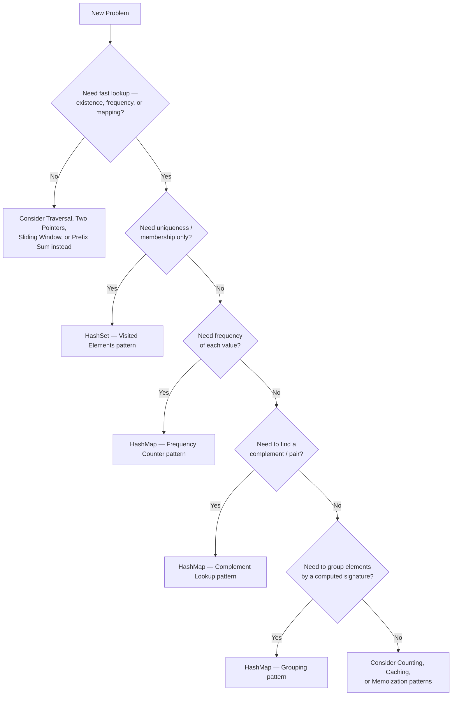

# 05 - Hashing

> "Don't search for it. Know exactly where it lives."

Every pattern so far in this repository has optimized *how* we move through data — one pointer, two pointers, a sliding window, a precomputed prefix. Hashing takes a fundamentally different approach: instead of optimizing the *walk*, it optimizes the **destination**. A well-designed hash table lets you ask "does this value exist?" or "what is stored under this key?" and get an answer in close to constant time, regardless of how much data you're searching through.

### Why is searching repeatedly expensive?

Because a linear search re-examines data it has no memory of having seen before. Every single query starts from zero, walking element by element until it finds a match or exhausts the array. If you ask the same kind of question a million times — "have I seen this before?", "what's the frequency of this?", "does this pair exist?" — a linear search pays the full O(n) price, one million times over, even when the underlying data never changes between queries.

### Why do computers need near-constant-time lookup?

Because real systems — databases, compilers, operating systems, browsers — perform lookups constantly, at massive scale, under strict latency requirements. A system that re-scans its entire dataset for every lookup does not scale; a system that can jump almost directly to the answer does. This is the exact same economic argument you saw in `04-Prefix-Sum.md` — pay a small upfront cost, save enormous repeated cost later — but applied to *lookup* instead of *range aggregation*.

This need leads naturally to the **Hash Table**: a data structure that trades a modest amount of extra memory and some careful engineering for lookups that are, on average, O(1) — independent of how many elements it holds.

---

## Learning Objectives

By the end of this chapter, you should be able to:

- Explain why arrays alone cannot give us fast lookup **by value**, only by index
- Describe every component of a hash table's architecture, from hash function to bucket to stored value
- Explain why collisions are mathematically unavoidable, and how chaining and open addressing resolve them
- Reason about load factor and rehashing, and connect rehashing directly to the amortized analysis you learned for Dynamic Arrays
- Recognize the eight recurring hashing patterns that appear across the vast majority of interview problems
- Instantly recognize the interview language that signals "use a hash table"

---

## Prerequisites

This chapter assumes you're comfortable with the material from `01-Traversal.md` through `04-Prefix-Sum.md`, specifically:

| Concept | Why it matters here |
|---|---|
| Arrays & Memory Layout | A hash table's internal storage is, at its core, still an array of buckets |
| Static vs Dynamic Arrays | A hash table's bucket array **grows dynamically**, exactly like the arrays from that chapter |
| Amortized Analysis | Rehashing is expensive per-operation but cheap on average — the same argument used to justify dynamic array resizing |
| Traversal, Two Pointers, Sliding Window | You'll see all three combined with hashing throughout this chapter and in future ones |
| Prefix Sum | The "Subarray Sum Equals K" pattern from `04-Prefix-Sum.md` is revisited here from the hashing side |

---

## Motivation

### The Problem

```
arr = [8, 5, 1, 7, 9, 2, 6]
```

**Question:** does the value `9` exist in this array?

### The Naive Solution — Linear Search

```python
def contains(arr, target):
    for x in arr:
        if x == target:
            return True
    return False
```

```
Index:   0   1   2   3   4   5   6
Array:   8   5   1   7   9   2   6
         ✗   ✗   ✗   ✗   ✓ found at index 4 — after 5 comparisons
```

For one query, this is fine — O(n) in the worst case, but a single question doesn't need to be fast.

### "What if we need to answer this question one million times?"

Now suppose we're building a system — a spell checker, a duplicate detector, a login-attempt tracker — that needs to answer "does X exist?" **repeatedly**, against the same underlying dataset, potentially for different values of `X` each time.

```
1,000,000 existence-checks × O(n) per check = O(1,000,000 × n)
```

If `n = 1,000,000` as well, that's **one trillion** operations. This is precisely the same shape of inefficiency you saw in `04-Prefix-Sum.md`: we're repeatedly paying full linear cost for a question whose answer, in principle, shouldn't require re-scanning anything at all. Prefix Sum solved this for range *sums*. Hashing solves it for **existence, frequency, and key-to-value lookup**.

> **Note:** The moment a problem says or implies "check membership/frequency/existence many times" against a fixed or slowly-changing dataset, your instinct should immediately reach for a hashing-based structure — a HashSet or HashMap — before reaching for a loop.

---

## From Arrays to Hash Tables

### Access vs Search

Arrays give you extraordinary speed for one very specific operation: **access by index**.

```
arr[4]   → O(1)   — jump directly to the memory address: base + (4 × element_size)
```

But arrays give you **no shortcut** for the opposite operation: **search by value**.

```
"where is the value 9?"   → O(n)   — you must check every index, because
                                       values are not stored in a way that
                                       tells you where to look
```

This asymmetry is the entire reason Hashing exists. Arrays organize data by **position**; Hash Tables organize data by **content**. If we could somehow compute, directly from a value, exactly *which* array slot it should live in — without checking anything else — search would become just as fast as index access.

```
Array:            index → value      (fast lookup: you already know the index)
Hash Table:        value → index      (fast lookup: you COMPUTE the index from the value)
```

This reversal — computing a *location* from a *value*, instead of searching for the value across all locations — is the foundational idea of hashing.

---

## What is Hashing?

Before any formal definition, consider a few everyday systems that already work this way:

**Library shelves organized by call number** — you don't search every shelf in the building for a book. The call number is itself a formula that tells you which section, which shelf, which position to walk directly to.

**Student IDs** — a university doesn't store students in a giant unsorted list and scan it for every lookup. The student ID is designed so that administrative systems can jump directly to a specific record.

**Phone contacts** — when you save a contact, your phone doesn't need to scan your entire contact list to find "Mom" later; it maintains an internal structure that maps the name directly to the stored entry.

**A dictionary (the book)** — a paper dictionary is alphabetically organized specifically so you can jump close to the right page immediately, rather than reading from page one. A hash table takes this even further: it computes, precisely, which "page" a word belongs on.

**A parking garage with numbered spaces** — if every car is assigned a space number based on some rule (say, the last two digits of its license plate), you don't need to search the garage for a car — you compute its space directly from its plate.

### The Formal Definition

A **hash table** is a data structure that stores key-value (or just value) pairs, using a **hash function** to compute an array index directly from a key, so that insertion, lookup, and deletion can all be performed in close to constant time on average.

The magic is not that hash tables are "smarter" than arrays — it's that they **compute the answer to "where should this go?"** instead of searching for it.

---

## Hash Table Architecture

```
        Key
         │
         ▼
  ┌─────────────┐
  │ Hash Function│
  └─────────────┘
         │
         ▼
     Hash Code
         │
         ▼   (reduced via modulo to fit table size)
   Bucket Index
         │
         ▼
  ┌───────────────────────────────┐
  │   Bucket Array (the table)     │
  │  [0][1][2][3][4][5][6][7][8]   │
  │        │           │           │
  │        ▼           ▼           │
  │    (stored)    (stored)        │
  └───────────────────────────────┘
```

Each stage has a distinct job:

1. **Hash Function** — transforms an arbitrary key (string, number, object) into a large integer, called the hash code.
2. **Hash Code** — a large integer, not yet usable as an array index (it may be far larger than the table's size).
3. **Bucket Index** — the hash code reduced into a valid array position, typically via `hash_code % table_size`.
4. **Storage** — the actual bucket array, where values (or key-value pairs, or chains of them) physically live in memory.

---

## Hash Function

### The Pipeline

```
Input Key ("apple")
      │
      ▼
Transformation  (e.g., sum of character codes, polynomial hashing, etc.)
      │
      ▼
Large Integer  (hash code, e.g., 96354729)
      │
      ▼  (mod table size, e.g., mod 10)
Bucket Index  (e.g., 9)
```

### Worked Examples

```
hash("cat")   → some large integer → % 10 → bucket 3
hash("dog")   → some large integer → % 10 → bucket 7
hash(42)      → 42 itself (numbers often hash close to their own value) → % 10 → bucket 2
hash("cat") again → SAME large integer → % 10 → bucket 3   (deterministic!)
```

### Characteristics of a Good Hash Function

| Property | Why it matters |
|---|---|
| **Deterministic** | The same key must always produce the same hash code — otherwise you could never find something you already inserted |
| **Fast to compute** | If hashing itself were slow, we'd lose the entire performance benefit over linear search |
| **Uniform distribution** | Keys should spread evenly across buckets — a hash function that clusters everything into a few buckets degrades toward O(n) behavior |
| **Low collision rate** | Fewer keys mapping to the same bucket means less work resolving conflicts |

> **Note:** A hash function does **not** need to be reversible. You should never be able to go from a hash code back to the original key — that's a different concept (encryption) entirely. Hash functions only need to go one direction: key → number.

---

## Buckets

A **bucket** is simply one slot in the underlying array that a hash table uses for storage. Visually:

```
Bucket Array (capacity = 8):

Index:     0      1      2      3      4      5      6      7
Content: empty  empty  "dog"  empty  "cat"  empty  empty  empty
```

**Empty buckets** contain no data yet — they represent unused capacity, exactly like unused slots at the end of a dynamic array's underlying buffer.

**Occupied buckets** hold one or more entries (a single value, a key-value pair, or — as you'll see next — a small chain of entries when collisions occur).

```
Occupied bucket (single entry):        Occupied bucket (after a collision):
┌────────────┐                          ┌────────────────────────┐
│   "cat"    │                          │ "cat" → "car" → "can"  │
└────────────┘                          └────────────────────────┘
```

---

## Collisions

### Why Collisions Are Unavoidable

A hash table typically has far **fewer buckets** than the number of *possible* keys. If you're hashing arbitrary strings into, say, 1,000 buckets, there are infinitely more possible strings than there are buckets — by the **pigeonhole principle**, multiple distinct keys are mathematically guaranteed to eventually map to the same bucket index, no matter how good your hash function is.

```
Two different keys:

  "cat"  ──hash──▶  bucket 3
  "dog"  ──hash──▶  bucket 3     ← COLLISION: different keys, same bucket
```

```
Bucket Array (capacity = 8):

Index:     0      1      2      3           4      5      6      7
Content: empty  empty  empty  "cat","dog"  empty  empty  empty  empty
                              └── collision! ──┘
```

Collisions are not a sign of a bad hash function — they are a **mathematical certainty** for any hash function mapping a large key space into a smaller bucket space. What separates good hash tables from bad ones is not "avoiding" collisions entirely, but **handling them efficiently** when they occur.

---

## Collision Resolution

### Separate Chaining

Each bucket holds a small collection (commonly a linked list, sometimes a small array or tree) of all entries that hashed to that index.

```
Index:     0      1      2         3               4
Content: empty  empty  empty   ["cat"]→["dog"]   empty
                                   (linked list chain)
```

**Advantages**
- Simple to implement and reason about
- The table never "fills up" in a hard sense — chains can grow to accommodate more entries
- Deletion is straightforward — just remove a node from the chain

**Disadvantages**
- Extra memory overhead for the chain's pointers/links
- Worst case (all keys collide into one bucket) degrades to O(n) — a linked-list scan
- Poor cache locality compared to contiguous storage, since chain nodes may be scattered in memory

### Open Addressing

Instead of chaining, every entry lives **directly in the bucket array itself**. On a collision, the algorithm searches for the *next available slot* according to a defined probing sequence.

**Linear Probing**

```
hash("cat") = bucket 3   (occupied!)
   → try bucket 4        (occupied!)
   → try bucket 5        (empty — insert here)

Index:     0      1      2      3       4       5       6
Content: empty  empty  empty  "cat"  "dog"   "car"    empty
                                      (collided,   (collided,
                                       moved +1)    moved +2)
```

**Quadratic Probing**

Instead of checking the *next* slot, the probe distance grows quadratically: `+1², +2², +3², ...`

```
hash("cat") = bucket 3   (occupied!)
   → try bucket 3+1=4    (occupied!)
   → try bucket 3+4=7    (empty — insert here)
```

This spreads out clustered collisions more than linear probing, reducing "clumping" of nearby occupied slots.

**Double Hashing**

Uses a **second hash function** to determine the probe step size, so different keys that collide at the same initial bucket follow *different* probe sequences — further reducing clustering.

```
step = hash2("cat")   (e.g., step = 5)
hash("cat") = bucket 3   (occupied!)
   → try bucket 3+5=8 mod capacity
   → try bucket 3+10=13 mod capacity
   ...
```

### Comparison Table

| Strategy | Extra Memory | Worst Case | Cache Locality | Deletion Complexity |
|---|---|---|---|---|
| Separate Chaining | Higher (pointers/links) | O(n) if all collide | Poor | Simple |
| Linear Probing | Lower (in-place) | O(n) if heavily clustered | Excellent | Requires tombstones or shifting |
| Quadratic Probing | Lower (in-place) | O(n) in pathological cases | Good | Requires tombstones |
| Double Hashing | Lower (in-place) | O(n) in pathological cases (rare) | Good | Requires tombstones |

> **Warning:** In open addressing, **deletion is not as simple as clearing a slot** — doing so can break the probe chain for other entries that were placed *past* the deleted slot during a collision. Most implementations use a special "tombstone" marker to indicate "this slot is empty, but keep probing past it," rather than treating it as a genuinely empty, probe-stopping slot.

---

## Load Factor

```
Load Factor (α) = Number of Elements Stored / Table Capacity
```

```
Example:
  7 elements stored, capacity = 10
  Load Factor = 7 / 10 = 0.7
```

### Why Performance Degrades as Load Factor Increases

As the load factor climbs toward 1 (and beyond, in chaining), the *probability* of collisions increases sharply, because there are fewer empty buckets available. In chaining, this means longer chains to traverse. In open addressing, this means longer probe sequences before finding an empty slot — and near full capacity, insertion can degrade catastrophically, sometimes even becoming impossible without resizing.

```
Low Load Factor (α = 0.2):              High Load Factor (α = 0.9):
┌───┬───┬───┬───┬───┬───┐              ┌───┬───┬───┬───┬───┬───┐
│ x │   │   │   │   │   │              │ x │ x │ x │ x │ x │   │
└───┴───┴───┴───┴───┴───┘              └───┴───┴───┴───┴───┴───┘
  plenty of empty space →                  almost no empty space →
  collisions rare, probes short             collisions common, probes long
```

### The Threshold

Most hash table implementations trigger a **resize (rehash)** once the load factor crosses a fixed threshold — commonly around `0.7` to `0.75` — trading a burst of upfront work for restored fast performance going forward.

---

## Rehashing

### When Does Resizing Happen?

When the load factor exceeds the implementation's threshold (commonly ~0.75), the table resizes — almost always by **doubling** its capacity, for the same amortized-cost reasons you learned when studying Dynamic Arrays.

### Why?

Because a table that keeps growing without resizing will see its load factor climb indefinitely, and performance will degrade from O(1) average toward O(n) as collisions become the norm rather than the exception.

### How? — Step-by-Step Visualization

```
Old Table (capacity 4, load factor about to exceed threshold):

Index:   0      1      2      3
Content: "cat"  "dog"  empty  "car"
                  │
                  ▼
        Allocate Bigger Table (capacity 8)

Index:   0  1  2  3  4  5  6  7
Content: .  .  .  .  .  .  .  .    (all empty, freshly allocated)
                  │
                  ▼
      Recompute Hashes (each key's bucket index depends on capacity!)

hash("cat") % 4 = 3   →  hash("cat") % 8 = 5   (DIFFERENT bucket!)
hash("dog") % 4 = 1   →  hash("dog") % 8 = 1   (may or may not change)
hash("car") % 4 = 3   →  hash("car") % 8 = 2   (DIFFERENT bucket!)
                  │
                  ▼
              Insert Again

Index:   0  1  2  3  4  5    6  7
Content: .  "dog"  .  .  .  "cat"  "car"  .
```

### Why Elements Move

Because the bucket index formula (`hash_code % capacity`) directly depends on `capacity`. The moment capacity changes, **every single key's target bucket potentially changes too** — even keys that weren't involved in the collision that triggered the resize. This is why rehashing requires **re-inserting every existing element**, not just the new one.

### Amortized Cost — Direct Parallel to Dynamic Arrays

A single rehash operation is expensive — O(n), since every element must be recomputed and reinserted. But because resizing happens **exponentially less often** as the table grows (doubling means the next resize is twice as far away), the *cost per insertion*, averaged over the table's entire lifetime, remains **O(1) amortized** — exactly the same argument used in your Dynamic Arrays chapter to justify amortized O(1) `append`.

```
Insertions:     1  2  3  4  5  6  7  8  9  10 11 12 13 ...
Resize event:            ↑resize            ↑resize
                       (capacity 4→8)      (capacity 8→16)

Even though individual resize operations cost O(n), they happen so
infrequently (halving in frequency each time) that the AVERAGE cost
per insertion, across all insertions, stays O(1).
```

---

## Time Complexity

| Operation | Average | Worst Case | Why |
|---|---|---|---|
| Insert | O(1) | O(n) | Average: hash + place in one step. Worst: all keys collide into one bucket/chain |
| Search | O(1) | O(n) | Average: hash + direct lookup. Worst: must scan an entire chain or probe sequence |
| Delete | O(1) | O(n) | Same reasoning as search — must locate the entry first |

**Why average case is O(1):** with a good hash function and a load factor kept below the resize threshold, each bucket holds, on average, only a small constant number of entries — so operations touch a bounded, small amount of work regardless of the table's total size.

**Why worst case is O(n):** if the hash function performs poorly (or is deliberately attacked — "hash flooding") such that every key collides into the same bucket, the table degenerates into a single linked list or a single long probe sequence, and every operation becomes a linear scan.

---

## Memory Complexity

Hash tables trade **extra memory** for **faster lookup**:

```
Extra memory (unused capacity, chain pointers, or probe headroom)
                    │
                    ▼
         Faster average-case lookup
```

A hash table deliberately keeps some empty buckets (to maintain a healthy load factor) and, in chaining implementations, spends additional memory on pointers linking chain nodes together. This is a **deliberate, worthwhile trade** — a small, constant-factor increase in memory usage in exchange for turning O(n) searches into O(1) average-case lookups.

| Structure | Space | Notes |
|---|---|---|
| Array (no hashing) | O(n) | Tightly packed, no wasted space, but O(n) search |
| Hash Table | O(n) | Same asymptotic order, but with a larger constant factor (empty buckets, chain overhead) |

---

## HashSet vs HashMap

| Aspect | HashSet | HashMap |
|---|---|---|
| Stores | Values only | Key-value pairs |
| Typical question answered | "Does this value exist?" | "What value is associated with this key?" |
| Underlying mechanism | Identical hash table machinery | Identical hash table machinery |
| Real-world example | Tracking which usernames are already taken | Mapping a username to its full account record |
| Real-world example 2 | Tracking which pages of a website you've already visited (deduplication) | Mapping a product ID to its price |

> **Note:** A HashSet is, under the hood, almost always implemented as a HashMap where the "value" is simply ignored (or set to a dummy constant) — the two are the same core data structure, exposed through different interfaces.

---

## Common Hashing Patterns

### Pattern 1 — Visited Elements

**Idea:** track which elements you've already processed to avoid redundant work or detect revisits.

```
seen = {}
for x in arr:
    if x in seen:
        # already visited — handle duplicate/cycle logic
    seen.add(x)
```

**Visualization:**

```
arr:  [4, 2, 7, 2, 9]
seen: {4} → {4,2} → {4,2,7} → DUPLICATE 2 detected → ...
```

**Complexity:** O(n) time, O(n) space.
**Interview examples:** Contains Duplicate, Linked List Cycle (with a HashSet instead of Floyd's algorithm), Happy Number.

---

### Pattern 2 — Frequency Counter

**Idea:** count how many times each element appears.

```
freq = {}
for x in arr:
    freq[x] = freq.get(x, 0) + 1
```

**Visualization:**

```
arr:  [a, b, a, c, b, a]
freq: {a: 3, b: 2, c: 1}
```

**Complexity:** O(n) time, O(k) space, where k = number of distinct elements.
**Interview examples:** Valid Anagram, Top K Frequent Elements, Group Anagrams (via sorted-string or count-signature keys).

---

### Pattern 3 — Index Mapping

**Idea:** map a value directly to its position(s) in the array, enabling instant "where is this?" lookups.

```
index_of = {}
for i, x in enumerate(arr):
    index_of[x] = i
```

**Visualization:**

```
arr:      [10, 20, 30, 40]
index_of: {10:0, 20:1, 30:2, 40:3}
```

**Complexity:** O(n) time and space.
**Interview examples:** Two Sum (returning indices, not just existence), Find Duplicate File in System.

---

### Pattern 4 — Complement Lookup

**Idea:** for each element, check whether the value that would "complete" it (e.g., `target - x`) has already been seen.

```
seen = {}
for i, x in enumerate(arr):
    complement = target - x
    if complement in seen:
        return [seen[complement], i]
    seen[x] = i
```

**Visualization:**

```
arr = [2, 7, 11, 15]   target = 9

x=2   complement=7   not seen yet   → remember 2
x=7   complement=2   IS seen!       → return [index of 2, index of 7]
```

**Complexity:** O(n) time, O(n) space — versus O(n²) brute force pair-checking.
**Interview examples:** Two Sum, Two Sum variants, 4Sum II (pairwise complement counting).

---

### Pattern 5 — Grouping

**Idea:** bucket elements together based on a shared computed key (a "signature").

```
groups = {}
for word in words:
    key = "".join(sorted(word))   # anagram signature
    groups.setdefault(key, []).append(word)
```

**Visualization:**

```
words: ["eat", "tea", "tan", "ate", "nat", "bat"]

signature("eat") = signature("tea") = signature("ate") = "aet"
signature("tan") = signature("nat") = "ant"
signature("bat") = "abt"

groups: {"aet": [eat,tea,ate], "ant": [tan,nat], "abt": [bat]}
```

**Complexity:** O(n × k log k) time (k = average word length, for sorting each signature), O(n) space.
**Interview examples:** Group Anagrams.

---

### Pattern 6 — Counting

**Idea:** use hashing to count occurrences of a derived quantity (not just raw values) — such as running prefix sums, parity states, or difference signatures.

```
running = 0
seen = {0: 1}
count = 0
for x in arr:
    running += x
    count += seen.get(running - k, 0)
    seen[running] = seen.get(running, 0) + 1
```

**Complexity:** O(n) time, O(n) space.
**Interview examples:** Subarray Sum Equals K, Contiguous Array.

---

### Pattern 7 — Caching

**Idea:** store previously computed results keyed by their input, so repeated identical requests skip recomputation entirely.

```
cache = {}
def expensive_computation(x):
    if x in cache:
        return cache[x]
    result = do_expensive_work(x)
    cache[x] = result
    return result
```

**Complexity:** O(1) amortized per repeated call, versus repeating the full computation cost each time.
**Interview examples:** LRU Cache (HashMap + Doubly Linked List), general request/response caching systems.

---

### Pattern 8 — Memoization

**Idea:** a specific application of caching, applied to recursive or overlapping-subproblem computations, so identical subproblems are only solved once.

```
memo = {}
def fib(n):
    if n in memo:
        return memo[n]
    if n <= 1:
        return n
    memo[n] = fib(n-1) + fib(n-2)
    return memo[n]
```

**Complexity:** O(n) time (versus exponential without memoization), O(n) space for the memo table.
**Interview examples:** Fibonacci variants, Word Break, Climbing Stairs, Longest Common Subsequence.

---

## Hashing + Arrays

Arrays and Hashing are used together constantly, because they solve **complementary** problems: arrays give you fast, ordered, indexed storage; hashing gives you fast, unordered, value-based lookup. Nearly every "does this exist," "how many times does this appear," or "have I paired this before" question over an array is answered by layering a hash table *on top of* the array traversal — you still walk the array once, but each step now includes an O(1) hash lookup instead of a nested O(n) search.

---

## Hashing + Prefix Sum

Recall from `04-Prefix-Sum.md` that a subarray sums to `k` exactly when two prefix sums differ by `k`: `prefix[j] - prefix[i] = k`. The problem is efficiently finding, for each `j`, whether a *matching* `prefix[i]` exists among everything computed so far. A HashMap storing "how many times has each prefix sum value occurred" answers that existence/count question in O(1), which is what turns the brute-force O(n²) search over all `(i, j)` pairs into a single O(n) pass. Hashing doesn't replace Prefix Sum here — it **accelerates the lookup step** that Prefix Sum alone would otherwise need to search for.

---

## Hashing + Sliding Window

Recall from `03-Sliding-Window.md` that "Longest Substring Without Repeating Characters" needs to know, at every step, whether the newly added character already exists somewhere inside the current window — and if so, exactly where, so `left` can jump directly past it. A HashMap storing "the last index each character was seen at" answers both questions — existence and position — in O(1), which is precisely what allows the window's `left` pointer to jump directly to the correct position instead of shrinking one step at a time. Hashing turns the window's internal "is this character already inside?" check from an O(window size) scan into an O(1) lookup.

---

## Real World Applications

**Databases** — index structures (particularly hash indexes) allow a database to locate a row matching a given key without scanning the entire table.

**Compilers** — symbol tables, which track variable and function names during compilation, are implemented as hash tables so identifier lookups during parsing and code generation stay fast regardless of program size.

**Operating Systems** — page tables and file system lookups use hashing-based structures to translate identifiers (virtual addresses, filenames) into physical locations quickly.

**DNS (Domain Name System)** — resolving a domain name to an IP address is fundamentally a massive, distributed key-value lookup problem, conceptually a hash table spread across many servers.

**Caches** — in-memory caches store recently used data keyed by a request identifier, so repeated requests skip expensive recomputation or network calls.

**Redis** — an entire database system built around hash-table semantics, offering O(1) average-case access to keys at massive scale.

**Browser Cache** — browsers hash URLs (and sometimes content) to quickly determine whether a resource has already been downloaded and can be reused instead of re-fetched.

**Password Verification** — systems never store your literal password; they store a cryptographic hash of it, and verification means hashing your input and comparing hash values — never comparing raw passwords.

**Spell Checkers** — a dictionary of valid words is stored in a hash set, so checking whether a typed word is valid is an O(1) average-case lookup instead of a search through a word list.

**Blockchain** — blocks are linked and verified using cryptographic hashes; each block's hash depends on its contents, making tampering detectable, since altering data changes the resulting hash.

**Distributed Systems** — consistent hashing is used to determine which server or shard is responsible for a given piece of data, allowing systems to scale horizontally while minimizing data movement when nodes are added or removed.

---

## Common Interview Clues

| Clue in the problem statement | Why it implies Hashing |
|---|---|
| "Contains duplicate" | Needs O(1) existence checks as you scan — a HashSet's core operation |
| "Frequency" / "how many times" | Needs a running count per value — a HashMap frequency counter |
| "Seen before" | Needs to remember prior elements for O(1) lookup — a HashSet |
| "Fast lookup" | A direct signal that O(n) search is unacceptable — hashing is the standard fix |
| "Pair sum" / "two numbers that add up to..." | Needs complement lookup — check `target - x` in O(1) |
| "Complement" | Same as above — anything phrased as "the other value that completes this" |
| "Unique" / "distinct" | Needs a HashSet to track which values have already appeared |
| "Count" | Needs a frequency map, or a running-value counting map (as in Subarray Sum Equals K) |
| "Grouping" / "group by" | Needs a HashMap keyed by a computed signature |
| "Membership" | The literal definition of what a HashSet answers |
| "Mapping" / "map one thing to another" | The literal definition of what a HashMap provides |

---

## Common Mistakes

### 1. Using a List Instead of a Set

```python
# Buggy: checking membership in a list is O(n), silently reintroducing
# the exact inefficiency hashing exists to solve
seen = []
for x in arr:
    if x in seen:      # O(n) scan through the list every time!
        ...
    seen.append(x)
```

```python
# Corrected: use a set for O(1) average membership checks
seen = set()
for x in arr:
    if x in seen:       # O(1) average
        ...
    seen.add(x)
```

### 2. Forgetting Duplicate Keys Overwrite Silently

```python
# Buggy: assumes each key is inserted once, silently loses earlier data
index_of = {}
for i, x in enumerate(arr):
    index_of[x] = i   # if x repeats, earlier index is silently overwritten
```

```python
# Corrected: if all occurrences matter, store a list of indices per key
index_of = {}
for i, x in enumerate(arr):
    index_of.setdefault(x, []).append(i)
```

### 3. Using Mutable Objects as Keys

```python
# Buggy: lists are mutable and unhashable in Python — this raises a TypeError
cache = {}
cache[[1, 2, 3]] = "result"   # TypeError: unhashable type: 'list'
```

```python
# Corrected: use an immutable equivalent as the key
cache = {}
cache[tuple([1, 2, 3])] = "result"
```

> **Warning:** A hash table relies on a key's hash code staying **constant** for as long as it's stored. If a key were mutable and its contents changed after insertion, its hash code would change too — but the table wouldn't know to move it to a new bucket, permanently breaking lookups for that entry. This is precisely why most languages forbid or discourage mutable types as hash keys.

### 4. Wrong Equality Semantics

```java
// Buggy: using a custom object as a HashMap key without overriding
// equals() and hashCode() — Java falls back to reference equality,
// so two "equal" objects are treated as different keys
class Point {
    int x, y;
}
map.put(new Point(1, 2), "A");
map.get(new Point(1, 2));   // returns null! different object reference
```

```java
// Corrected: override both equals() and hashCode() consistently
class Point {
    int x, y;
    @Override
    public boolean equals(Object o) {
        if (!(o instanceof Point)) return false;
        Point p = (Point) o;
        return x == p.x && y == p.y;
    }
    @Override
    public int hashCode() {
        return Objects.hash(x, y);
    }
}
```

### 5. Ignoring Collisions Entirely

```python
# Buggy: assumes every lookup is O(1) unconditionally, without
# accounting for degenerate hash functions or adversarial inputs
# (this is a reasoning mistake, not a syntax mistake — but it leads to
# incorrect complexity claims in an interview)
```

```
# Corrected mental model: state clearly that hashing is O(1) AVERAGE
# case, and O(n) worst case, and explain why (poor hash function,
# adversarial input, or high load factor without rehashing).
```

### 6. Wrong Complexity Assumptions

A very common interview mistake is claiming a hash table operation is "always O(1)" without qualification. The correct, precise claim is: **O(1) average case, assuming a good hash function and a well-maintained load factor; O(n) worst case.** Interviewers frequently probe exactly this distinction.

---

## Complexity Cheat Sheet

| Operation | Average Case | Worst Case | Space |
|---|---|---|---|
| Insert | O(1) | O(n) | O(1) per insert |
| Search / Lookup | O(1) | O(n) | O(1) |
| Delete | O(1) | O(n) | O(1) |
| Build from n elements | O(n) | O(n²) (pathological) | O(n) |
| Rehash (single event) | O(n) | O(n) | O(n) temporarily (old + new table) |
| Rehash (amortized per insert) | O(1) | O(1) | — |

---

## Visualization Gallery

**Memory — bucket array as contiguous storage**

```
Address: 5000  5008  5016  5024  5032  5040
Bucket:  [ 0 ] [ 1 ] [ 2 ] [ 3 ] [ 4 ] [ 5 ]
Value:    .    "dog"  .    "cat"  .    .
```

**Hash function pipeline**

```
"apple" → [hash function] → 738294122 → [% 8] → bucket 2
```

**Collision (two keys, one bucket)**

```
"cat" ──┐
        ├──▶ bucket 3
"dog" ──┘
```

**Separate chaining**

```
bucket 3: "cat" → "dog" → "cow"   (linked list of colliding entries)
```

**Linear probing**

```
bucket 3: "cat"   (original)
bucket 4: "dog"   (collided, moved +1)
bucket 5: "cow"   (collided, moved +2)
```

**Load factor visualization**

```
α = 0.25                          α = 0.85
[x|.|.|.|.|.|.|.]                 [x|x|x|x|x|x|x|.]
 sparse, fast                      crowded, slow
```

**Rehashing (capacity doubling)**

```
Before (capacity 4):     After (capacity 8):
[.|.|.|.]      resize    [.|.|.|.|.|.|.|.]
     │        ────────▶        ▲
     ▼                          │
 recompute every hash and reinsert
```

---

## Practice Problems

### Easy

| Problem | Pattern Used | Main Idea |
|---|---|---|
| Contains Duplicate | Visited Elements | Track seen values in a HashSet; O(1) membership check per element |
| Valid Anagram | Frequency Counter | Compare character frequency maps of both strings |
| Two Sum | Complement Lookup | For each value, check if `target - x` was already seen |
| Intersection of Two Arrays | Visited Elements | Put one array into a set, check membership while scanning the other |
| Happy Number | Visited Elements | Track seen sums to detect a cycle instead of looping forever |
| Isomorphic Strings | Index Mapping | Map characters from one string to the other bidirectionally, checking consistency |

### Medium

| Problem | Pattern Used | Main Idea |
|---|---|---|
| Group Anagrams | Grouping | Bucket words by a sorted-character (or count) signature |
| Top K Frequent Elements | Frequency Counter | Count frequencies, then extract the k largest (often via a heap) |
| Longest Consecutive Sequence | Visited Elements | Put all values in a set; only start counting a sequence from its true start (no predecessor in the set) |
| Subarray Sum Equals K | Counting | Track how many times each running prefix sum has occurred |
| Find Duplicate File in System | Grouping | Group file paths by their content signature (hash of contents) |

### Hard

| Problem | Pattern Used | Main Idea |
|---|---|---|
| Minimum Window Substring | Frequency Counter + Sliding Window | Track a target frequency map, shrink the window while it stays "valid" |
| Word Pattern II | Index Mapping | Bidirectional mapping between pattern characters and substrings, with backtracking |
| Alien Dictionary | Grouping / Graph + Hashing | Build an adjacency structure (hash-based graph) from letter-order constraints, then topologically sort |

---

## Interview Thinking Process



Ask yourself, in order:
1. Does this problem require repeated existence, frequency, or lookup checks?
2. Is the data static enough that precomputing a hash structure pays off?
3. Am I about to write a nested loop to check "does this pair/value exist elsewhere" — could a HashMap answer that in O(1) instead?
4. Does the problem language include any of the clue words from the table above?

---

## Mental Models

**Library** — books are shelved by call number, a computed address, not searched for shelf by shelf.

**Phone Book** — contacts are organized so that looking up "Smith" doesn't require reading every entry from "Aaronson" onward.

**Dictionary** — a word's definition is found by jumping close to its expected location, not scanning from the first page.

**Warehouse** — inventory systems assign every item a bin location computed from its SKU, so a worker walks directly to the right shelf instead of searching the entire warehouse floor.

**Parking Garage** — assigning spaces by a formula (e.g., a hash of the license plate) means any car's location can be computed instantly, without walking every row.

**Student Database** — a student ID is designed precisely so that a system can locate a specific student's record without scanning every enrolled student.

Every one of these systems shares the same underlying idea a hash table formalizes: **compute where something belongs, rather than searching for where it ended up.**

---

## Key Takeaways

- Hashing solves the problem arrays cannot: fast lookup **by value**, not just by index.
- A hash table's architecture is a pipeline: key → hash function → hash code → bucket index → stored value.
- Collisions are mathematically unavoidable when mapping a large key space into a smaller bucket space — good hash tables handle them efficiently rather than trying to eliminate them.
- Separate chaining and open addressing (linear probing, quadratic probing, double hashing) are the two dominant collision-resolution families, each with distinct memory and cache-locality trade-offs.
- Load factor governs performance; once it crosses a threshold, rehashing restores fast average-case behavior at the cost of a one-time O(n) operation — amortized to O(1) per insert overall, exactly like dynamic array resizing.
- Average-case hash table operations are O(1); worst-case operations are O(n) — always state both when discussing complexity in an interview.
- Eight recurring patterns — visited elements, frequency counter, index mapping, complement lookup, grouping, counting, caching, and memoization — cover the overwhelming majority of hashing-based interview problems.
- Hashing is most powerful when **combined** with other patterns: Prefix Sum + HashMap for subarray sums, Sliding Window + HashMap for substring problems.

---

## Interview Summary

**What interview clues should immediately make me think about Hashing?**

- The words **"duplicate," "unique," "distinct," or "seen before"** appear anywhere in the problem
- The words **"frequency," "count," or "how many times"** appear
- The problem asks for a **pair, complement, or "the other value that completes this"**
- The phrase **"fast lookup"** or **"efficient search"** is stated or implied
- The problem asks you to **group** elements by some shared property
- You catch yourself about to write a **nested loop** to check whether something exists elsewhere in the data — that nested loop is almost always replaceable by a single pass plus a hash table
- The problem is a **variant of a Prefix Sum or Sliding Window problem**, but asks for something existence- or frequency-based within the range, rather than just a raw aggregate

If two or more of these signals appear together, reaching for a HashSet or HashMap is very likely the correct first move.
