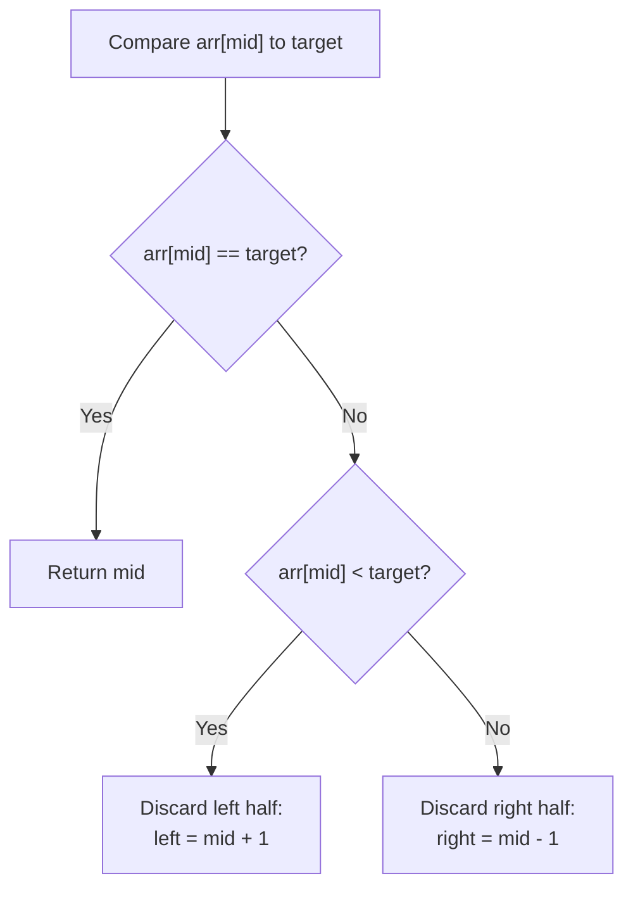
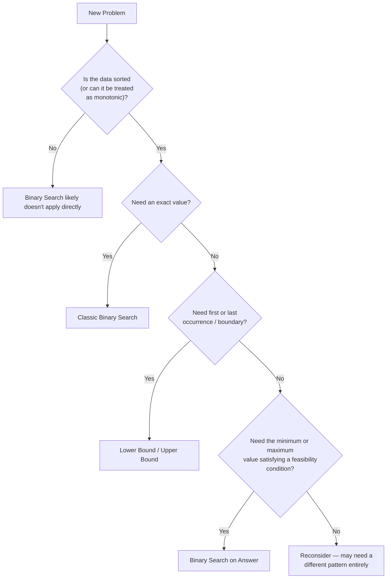

# 06 - Binary Search

> "Why check every possibility, when each check tells you which half to throw away?"

Every pattern so far in this repository has reduced *how much work* we do per element — Traversal walks once, Two Pointers eliminates ranges with two cursors, Sliding Window reuses overlapping work, Prefix Sum precomputes so queries become instant, Hashing computes a destination instead of searching for one. Binary Search takes a different angle entirely: it reduces the **size of the problem itself**, by half, at every single step.

### Why does Binary Search exist?

Because Linear Search — checking element after element — wastes an enormous amount of information that sorted data already gives us for free. If an array is sorted and you compare your target against the middle element, you don't just learn "is this the answer?" — you learn **an entire direction**: everything to one side can be discarded immediately, without ever looking at it.

### Why does searching linearly become inefficient?

Because Linear Search treats every element as equally likely to be the answer, checking them one at a time regardless of what earlier comparisons revealed. On a sorted array of a million elements, Linear Search might need to inspect up to a million values. Binary Search needs at most **twenty**. This isn't a minor constant-factor improvement — it's a fundamentally different growth rate, and understanding why is the heart of this chapter.

### Introducing Divide-and-Conquer

Binary Search is the simplest possible example of a **divide-and-conquer** algorithm: split the problem in half, solve the relevant half, discard the rest, and repeat. This same idea — shrink the problem by a constant fraction every step — underlies merge sort, quicksort, and a huge portion of algorithmic thinking beyond this chapter. Binary Search is where nearly everyone first learns it.

---

## Learning Objectives

After this chapter, you should be able to:

- Explain precisely why Binary Search achieves O(log n) time, with a visual and mathematical derivation
- Implement Binary Search correctly, iteratively and recursively, without introducing infinite loops or off-by-one errors
- Recognize and implement the major variations: lower bound, upper bound, first/last occurrence, insert position, and peak finding
- Master **Binary Search on Answer** — the advanced pattern that applies binary search to a space of possible *answers*, not just array indices
- Instantly recognize the interview language that signals Binary Search, including problems that don't look like search problems at all

---

## Prerequisites

This chapter builds on everything through `05-Hashing.md`:

| Concept | Why it matters here |
|---|---|
| Arrays & Random Access | Binary Search needs O(1) access to `arr[mid]` for any index — this is what makes "jumping" to the middle cheap |
| Static/Dynamic Arrays | Both support random access; Binary Search works on either |
| Traversal | Understanding a single linear pass is the baseline Binary Search improves upon |
| Time Complexity | You must be able to justify O(log n) rigorously, not just cite it |
| Hashing | Binary Search and Hashing solve overlapping problems differently — this chapter draws that line clearly |
| Prefix Sum | Some Binary Search on Answer problems combine directly with prefix sums to validate a candidate answer in O(n) |

### Why Binary Search Requires Sorted Data

Binary Search's entire strategy rests on one guarantee: comparing your target against the middle element tells you, with certainty, which half it could be in. This only works if the data is **ordered** — in an unsorted array, `arr[mid]` being too small tells you *nothing* about whether the target is to the left or the right, because either half could contain values in any order.

### Why Random Access Is Required

Jumping directly to `arr[mid]` must be an O(1) operation, or the entire strategy collapses. This is why **linked lists are poor candidates for Binary Search** — reaching the middle node of a linked list requires walking from the head, which is itself O(n). Applying the "jump to the middle" strategy to a structure where jumping costs O(n) defeats the entire purpose; you'd pay O(n) per comparison, for O(log n) comparisons, for a total worse than just scanning linearly once.

---

## Motivation

### The Setup

Suppose you have **one million sorted numbers**, and you need to find whether a specific value exists.

### How Long Does Linear Search Take?

```
Worst case: the value is the very last element, or doesn't exist at all.
→ up to 1,000,000 comparisons.
```

### How Does Binary Search Reduce the Work?

```
Search Space: 1,000,000 elements
      │  compare against the middle → discard half
      ▼
    500,000 elements
      │  compare against the middle → discard half
      ▼
    250,000 elements
      │  compare against the middle → discard half
      ▼
    125,000 elements
      │  ... this halving continues ...
      ▼
        1 element
      │
      ▼
     Found (or confirmed absent)
```

How many halving steps does it take to shrink 1,000,000 down to 1?

```
1,000,000 → 500,000 → 250,000 → 125,000 → 62,500 → 31,250 → 15,625
→ 7,813 → 3,907 → 1,954 → 977 → 489 → 245 → 123 → 62 → 31 → 16 → 8 → 4 → 2 → 1

That's 20 steps.
```

**Twenty comparisons**, versus up to a million. This is the entire promise of Binary Search: turning a linear problem into a logarithmic one.

| n (array size) | Linear Search (worst case) | Binary Search (worst case) |
|---:|---:|---:|
| 100 | 100 | 7 |
| 10,000 | 10,000 | 14 |
| 1,000,000 | 1,000,000 | 20 |
| 1,000,000,000 | 1,000,000,000 | 30 |

Notice how slowly the Binary Search column grows compared to the Linear Search column — this is the visual signature of logarithmic growth.

---

## The Core Idea

**Don't search everything. Discard half of the search space every iteration.**

```
[........................................]   ← full search space
                    ↓ compare against middle, discard one half
[....................]                        ← half remains
                    ↓
        [..........]                          ← quarter remains
                    ↓
            [.....]                           ← eighth remains
                    ↓
              [..]                            ← continues shrinking
                    ↓
               [Found]
```

Every arrow above represents **one comparison** — and after that one comparison, an entire half of the remaining space is provably eliminated, without ever being examined.

> **Note:** The word "search" in Binary Search is slightly misleading — it implies looking *for* something across a space. It's more precise to think of it as **repeatedly eliminating half of what's left**, until only the answer (or proof of absence) remains.

---

## How Binary Search Works

Binary Search maintains three key variables throughout its execution:

| Variable | Meaning |
|---|---|
| `left` | The smallest index that could still contain the answer |
| `right` | The largest index that could still contain the answer |
| `mid` | The index currently being examined — the "midpoint" of `[left, right]` |

At each step, we compare `arr[mid]` against the `target`, and make a decision:

```
if arr[mid] == target:   found it — return mid
if arr[mid] < target:    target must be to the right — move left = mid + 1
if arr[mid] > target:    target must be to the left  — move right = mid - 1
```

### Step-by-Step Visualization

Searching for `23` in `arr = [2, 5, 8, 12, 16, 23, 38, 56, 72, 91]` (indices `0` through `9`):

```
Step 1:
  L                                      R
[ 2,  5,  8, 12, 16, 23, 38, 56, 72, 91]
  0   1   2   3   4   5   6   7   8   9
              mid = (0+9)/2 = 4  → arr[4] = 16

  16 < 23  →  target is to the right  →  left = mid + 1 = 5
```

```
Step 2:
                          L               R
[ 2,  5,  8, 12, 16, 23, 38, 56, 72, 91]
                          5   6   7   8   9
              mid = (5+9)/2 = 7  → arr[7] = 56

  56 > 23  →  target is to the left  →  right = mid - 1 = 6
```

```
Step 3:
                          L   R
[ 2,  5,  8, 12, 16, 23, 38, 56, 72, 91]
                          5   6
              mid = (5+6)/2 = 5  → arr[5] = 23

  23 == 23  →  FOUND at index 5
```

Three comparisons found the answer in a 10-element array — and the gap grows dramatically as `n` grows, while the number of comparisons grows only logarithmically.

---

## Mid Calculation

The most common formula:

```
mid = left + (right - left) / 2
```

### Why Not `mid = (left + right) / 2`?

This simpler-looking formula has a subtle danger: **integer overflow**. If `left` and `right` are both large (close to the maximum value a fixed-width integer type can hold), their sum `left + right` can exceed that maximum and wrap around to a negative number in languages with fixed-width integers, like Java's `int` or C++'s `int`.

```
Example (32-bit signed integer, max ≈ 2,147,483,647):

left  = 1,500,000,000
right = 2,000,000,000

left + right = 3,500,000,000   ← OVERFLOWS a 32-bit int, wraps to a
                                   negative number, producing a
                                   nonsensical negative mid index
```

The safer formula avoids this entirely:

```
mid = left + (right - left) / 2

left  = 1,500,000,000
right = 2,000,000,000

right - left = 500,000,000        ← small, safe
left + 500,000,000/2 = 1,750,000,000   ← correct, no overflow
```

> **Warning:** This overflow bug is one of the most famous bugs in computer science history — a version of it existed in production binary search implementations (including, at one point, in Java's standard library) for years before being discovered and fixed. Always prefer `left + (right - left) / 2` over `(left + right) / 2` in languages with fixed-width integers.

---

## Binary Search Algorithm

### Initialization

```
left = 0
right = n - 1
```

### Loop Condition

```
while left <= right:
```

We use `<=`, not `<`, because when `left == right`, there is still exactly **one element left to check** — excluding that case with `<` would incorrectly skip the last remaining candidate.

### Compare

```
mid = left + (right - left) / 2
if arr[mid] == target: return mid
```

### Move Left

```
elif arr[mid] < target:
    left = mid + 1     # target is strictly greater than arr[mid], so mid itself is eliminated too
```

```
[........ eliminated ........][ mid ][.... still possible ....]
                                  ↑
                        arr[mid] < target, so mid can't be the answer either
                        new left = mid + 1
```

### Move Right

```
elif arr[mid] > target:
    right = mid - 1    # target is strictly less than arr[mid], so mid itself is eliminated too
```

```
[.... still possible ....][ mid ][........ eliminated ........]
                              ↑
                     arr[mid] > target, so mid can't be the answer either
                     new right = mid - 1
```

### Termination

```
if left > right:
    return -1   # search space is empty — target does not exist
```

```
Search space shrinking to nothing:

[..............]   left=0  right=9
       ↓
[......]           left=5  right=9
       ↓
[.]                 left=7  right=7
       ↓
(empty)             left=8  right=7   ← left > right, loop ends, not found
```

### Full Iterative Implementation

```python
def binary_search(arr, target):
    left, right = 0, len(arr) - 1
    while left <= right:
        mid = left + (right - left) // 2
        if arr[mid] == target:
            return mid
        elif arr[mid] < target:
            left = mid + 1
        else:
            right = mid - 1
    return -1
```

---

## Complexity Analysis

### Why Time Complexity Is O(log n)

Each iteration discards **half** of the remaining search space. Starting with `n` elements, after `k` iterations, the remaining search space size is:

```
n / 2^k
```

The algorithm terminates when the remaining space shrinks to 1 (or 0). Solving for `k`:

```
n / 2^k = 1
2^k = n
k = log2(n)
```

So the number of iterations required is `log2(n)` — and since each iteration does O(1) work (one comparison, one arithmetic update), total time complexity is **O(log n)**.

### Visual Derivation

```
n elements
  ↓ ÷2
n/2
  ↓ ÷2
n/4
  ↓ ÷2
n/8
  ↓ ÷2
 ...
  ↓ ÷2
  1        ← after log2(n) divisions

Number of ÷2 steps to go from n down to 1 = log2(n)
```

### Memory Complexity

The **iterative** version uses O(1) extra space — just the `left`, `right`, and `mid` variables. The **recursive** version uses O(log n) extra space, due to the call stack accumulating one frame per recursive call (and there are `log n` such calls before termination).

---

## Recursive vs Iterative

### Iterative

```python
def binary_search_iterative(arr, target):
    left, right = 0, len(arr) - 1
    while left <= right:
        mid = left + (right - left) // 2
        if arr[mid] == target:
            return mid
        elif arr[mid] < target:
            left = mid + 1
        else:
            right = mid - 1
    return -1
```

### Recursive

```python
def binary_search_recursive(arr, target, left=0, right=None):
    if right is None:
        right = len(arr) - 1
    if left > right:
        return -1
    mid = left + (right - left) // 2
    if arr[mid] == target:
        return mid
    elif arr[mid] < target:
        return binary_search_recursive(arr, target, mid + 1, right)
    else:
        return binary_search_recursive(arr, target, left, mid - 1)
```

### Comparison

| Aspect | Iterative | Recursive |
|---|---|---|
| Time Complexity | O(log n) | O(log n) |
| Space Complexity | O(1) | O(log n) — call stack |
| Readability | Slightly more verbose | Often closer to the mathematical definition |
| Risk of stack overflow | None | Possible on extremely large `n` in languages without tail-call optimization |
| Typical interview preference | Usually preferred for its O(1) space | Acceptable, but be ready to discuss the space trade-off |

**When to use recursive:** when the problem is naturally expressed recursively (e.g., some divide-and-conquer variants) or when code clarity matters more than the O(log n) stack overhead, which is small in practice (`log2(1,000,000,000) ≈ 30` stack frames).

**When to use iterative:** in performance-critical code, or whenever you want to guarantee O(1) space with no risk of stack-related issues.

---

## Binary Search Variations

### Classic Search

Find the exact index of a target value, or determine it doesn't exist. Covered fully above.

### Lower Bound

Find the **first index** where `arr[index] >= target` — the leftmost position where `target` could be inserted while keeping the array sorted.

```
arr = [1, 3, 3, 3, 5, 7]     target = 3

Lower bound = index 1  (first position where arr[index] >= 3)
```

### Upper Bound

Find the **first index** where `arr[index] > target` — the leftmost position *after* all occurrences of `target`.

```
arr = [1, 3, 3, 3, 5, 7]     target = 3

Upper bound = index 4  (first position where arr[index] > 3)
```

### First Occurrence

The leftmost index where `arr[index] == target`, if it exists — closely related to lower bound.

```
arr = [1, 3, 3, 3, 5, 7]     target = 3

First occurrence = index 1
```

### Last Occurrence

The rightmost index where `arr[index] == target`, if it exists — one less than upper bound.

```
arr = [1, 3, 3, 3, 5, 7]     target = 3

Last occurrence = index 3
```

```python
def lower_bound(arr, target):
    left, right = 0, len(arr)
    while left < right:
        mid = left + (right - left) // 2
        if arr[mid] < target:
            left = mid + 1
        else:
            right = mid          # keep mid as a candidate — don't exclude it
    return left

def upper_bound(arr, target):
    left, right = 0, len(arr)
    while left < right:
        mid = left + (right - left) // 2
        if arr[mid] <= target:
            left = mid + 1
        else:
            right = mid
    return left
```

> **Note:** Notice the loop condition here is `left < right`, not `left <= right`, and `right` starts at `len(arr)`, not `len(arr) - 1`. This is a **different but equally valid convention**, commonly used for boundary-finding variants, where the search space represents "candidate insertion points" rather than "candidate value indices." Mixing these two conventions within the same implementation is one of the most common sources of Binary Search bugs — pick one and be consistent.

### Insert Position

Identical in mechanics to Lower Bound — "where would this value be inserted to keep the array sorted?" is precisely the lower bound query.

### Peak Element

Find any index where `arr[index]` is greater than both of its neighbors, using binary search on the **slope direction** rather than an exact value:

```
arr = [1, 2, 3, 1]

              peak
               ↓
[1,   2,   3,   1]
 0    1    2    3

mid=1: arr[1]=2 < arr[2]=3 → slope rising → peak must be to the right → left = mid+1
mid=2: (converges) arr[2]=3 is a peak (arr[3] < arr[2] and arr[1] < arr[2])
```

The key insight: if `arr[mid] < arr[mid+1]`, the array is "rising" at `mid`, which guarantees a peak exists somewhere to the right (since the array must eventually stop rising, either at a peak or at the boundary). This lets you discard the left half exactly like classic Binary Search, even though the array isn't globally sorted.

### Binary Search on Answer

Covered in full detail in its own section below — this is the most advanced and highest-leverage variation for interviews.

---

## Binary Search on Answer

### The Insight

Sometimes the array itself isn't what you binary search over — instead, you binary search over the **space of possible answers**, using a **feasibility check** to decide which half to discard. This works whenever the feasibility of an answer is **monotonic**: once an answer works, every "easier" or "larger" answer (depending on the problem) also works, and once an answer fails, every "harder" answer also fails.

```
Possible Answers:  [1, 2, 3, 4, 5, 6, 7, 8, 9, 10]
Feasibility:        F  F  F  F  T  T  T  T  T  T
                              ↑
                    the boundary between "impossible" and "possible" —
                    THIS is what we binary search for
```

### Why the Answer Itself Becomes the Search Space

Instead of asking "is index `mid` the target?", we ask **"is candidate answer `mid` feasible?"** — and because feasibility is monotonic, a single check tells us which half of the answer range to discard, exactly like classic Binary Search tells us which half of an index range to discard.

### Worked Example — Minimum Eating Speed (Koko Eating Bananas)

**Problem sketch:** Koko must eat all banana piles within `h` hours, eating at a constant speed of `k` bananas/hour per pile. Find the minimum `k` that allows her to finish in time.

```
Possible speeds:   1  2  3  4  5  6  7  8  9 ...
Can finish in h hours?   F  F  F  T  T  T  T  T ...
                               ↑
                    binary search for this boundary
```

```python
def min_eating_speed(piles, h):
    def hours_needed(speed):
        return sum((pile + speed - 1) // speed for pile in piles)

    left, right = 1, max(piles)
    while left < right:
        mid = left + (right - left) // 2
        if hours_needed(mid) <= h:
            right = mid          # mid works — try to find something smaller
        else:
            left = mid + 1       # mid too slow — need a faster speed
    return left
```

### Other Classic Binary Search on Answer Problems

| Problem | What's being binary searched | Feasibility check |
|---|---|---|
| Minimum Eating Speed | Eating speed `k` | Can all piles be eaten within `h` hours at speed `k`? |
| Capacity to Ship Packages Within D Days | Ship capacity | Can all packages ship within `D` days at this capacity? |
| Split Array Largest Sum | The "largest subarray sum" cap | Can the array be split into ≤ `m` parts, each ≤ this cap? |
| Aggressive Cows | Minimum distance between cows | Can all cows be placed with at least this much distance between any two? |
| Painter's Partition | Maximum work assigned per painter | Can the boards be painted by `k` painters if none exceeds this maximum? |

> **Note:** In every one of these problems, the phrase to listen for is some version of *"find the minimum/maximum X such that condition Y holds."* This phrasing — minimize/maximize a threshold subject to a feasibility condition — is the single strongest signal for Binary Search on Answer.

---

## Binary Search vs Linear Search

| Aspect | Linear Search | Binary Search |
|---|---|---|
| Time Complexity | O(n) | O(log n) |
| Requires sorted data? | No | Yes |
| Works on linked lists? | Yes, naturally | Poorly (no O(1) random access) |
| Simplicity | Extremely simple | Slightly more complex, prone to off-by-one bugs |
| Best for | Small or unsorted data, one-off searches | Large sorted data, repeated searches |

---

## Binary Search vs Two Pointers

| Aspect | Two Pointers | Binary Search |
|---|---|---|
| Search space reduction per step | Eliminates a constant amount (one element) per step | Eliminates half the remaining space per step |
| Time Complexity | O(n) | O(log n) |
| Typical structure | Two indices scanning across the array together | One index jumping directly to informative midpoints |
| Best for | Finding pairs, partitioning, palindromes | Finding a specific value or boundary in sorted/monotonic data |

**Key distinction:** Two Pointers is still fundamentally a **linear** technique — O(n) total work, just without redundant re-scanning. Binary Search is a **logarithmic** technique — it doesn't just avoid redundant work, it actively avoids *looking at* most of the data at all.

---

## Binary Search vs Hashing

| Aspect | Hashing | Binary Search |
|---|---|---|
| Average lookup time | O(1) | O(log n) |
| Requires sorted data? | No | Yes |
| Extra memory | O(n) for the hash table | O(1) (iterative) |
| Supports range queries (e.g., "how many values are ≤ x")? | Poorly — hash tables don't preserve order | Naturally — this is exactly what lower/upper bound answer |
| Supports "find closest value" queries? | No — hashing only answers exact membership | Yes — binary search naturally finds nearby values |

**When Hashing is better:** pure existence/frequency/membership checks where order doesn't matter — Hashing's O(1) beats Binary Search's O(log n).

**When Binary Search is better:** anything involving order — range counting, closest value, first/last occurrence, or "minimum/maximum value satisfying a condition" (Binary Search on Answer) — none of which a hash table can answer at all, regardless of speed.

---

## Common Interview Clues

| Keyword / Phrase | Why it implies Binary Search |
|---|---|
| "Sorted" | The single strongest signal — Binary Search requires order to work |
| "Minimum" / "Maximum" (of a feasible value) | Strong signal for Binary Search on Answer |
| "Search space" | Explicitly names the concept this pattern is built around |
| "Threshold" | Suggests a monotonic feasibility boundary — classic Binary Search on Answer |
| "Answer space" | Directly describes Binary Search on Answer |
| "Monotonic function" | The formal requirement underlying every Binary Search on Answer problem |
| "First True" / "Last False" (or equivalent phrasing) | Describes exactly what lower/upper bound search locates |
| "Find X such that condition Y holds, minimizing/maximizing X" | The canonical phrasing of Binary Search on Answer problems |

---

## Common Mistakes

### 1. Integer Overflow in Mid Calculation

```java
// Buggy: can overflow for large left/right values
int mid = (left + right) / 2;
```

```java
// Corrected
int mid = left + (right - left) / 2;
```

### 2. Infinite Loop

```python
# Buggy: mid is not properly excluded, so left/right never converge
while left < right:
    mid = left + (right - left) // 2
    if arr[mid] < target:
        left = mid          # should be mid + 1 — infinite loop if left stays at mid!
    else:
        right = mid
```

```python
# Corrected: always make forward progress
while left < right:
    mid = left + (right - left) // 2
    if arr[mid] < target:
        left = mid + 1
    else:
        right = mid
```

### 3. Wrong Mid for the Loop Style

```python
# Buggy: using "right = mid" style boundaries (exclusive) together
# with "right = mid - 1" logic (inclusive) — the two conventions conflict
left, right = 0, len(arr)          # exclusive convention
while left <= right:               # WRONG loop condition for this convention
    ...
```

```python
# Corrected: pick one convention consistently
# Inclusive convention:
left, right = 0, len(arr) - 1
while left <= right:
    ...

# OR exclusive convention:
left, right = 0, len(arr)
while left < right:
    ...
```

### 4. Wrong Boundaries at Initialization

```python
# Buggy: right initialized to len(arr) when using the inclusive convention
left, right = 0, len(arr)     # off by one — should be len(arr) - 1
while left <= right:
    mid = left + (right - left) // 2
    if mid == len(arr):        # out-of-bounds access risk
        ...
```

```python
# Corrected
left, right = 0, len(arr) - 1
```

### 5. Off-by-One in Boundary Updates

```python
# Buggy: forgets to exclude mid after a failed comparison, causing
# the same mid to be re-checked forever
if arr[mid] < target:
    left = mid       # should be mid + 1
```

```python
# Corrected
if arr[mid] < target:
    left = mid + 1
```

### 6. Incorrect Loop Condition

```python
# Buggy: using left < right for classic exact-match search discards
# the final candidate when only one element remains
left, right = 0, len(arr) - 1
while left < right:      # WRONG for classic search — should be <=
    ...
```

```python
# Corrected
while left <= right:
    ...
```

### 7. Missing Answer Update in Binary Search on Answer

```python
# Buggy: never records the best feasible answer found so far —
# only tracks left/right without saving the result
while left < right:
    mid = left + (right - left) // 2
    if is_feasible(mid):
        right = mid       # correct narrowing, but nothing is recorded separately
    else:
        left = mid + 1
# if the loop's final left/right convention is off, the "answer" may
# actually be the last INFEASIBLE value checked, not the feasible one
```

```python
# Corrected: in the exclusive convention shown here, `left` (== `right`
# at termination) IS guaranteed to be the answer, precisely because
# every step keeps at least one known-feasible or undetermined value
# inside [left, right) — but ALWAYS verify this invariant explicitly
# for your specific problem, or track best_answer separately to be safe:
best_answer = None
while left <= right:
    mid = left + (right - left) // 2
    if is_feasible(mid):
        best_answer = mid
        right = mid - 1
    else:
        left = mid + 1
```

> **Warning:** Binary Search on Answer bugs are almost always convention mismatches — mixing an inclusive `[left, right]` loop with exclusive-style boundary updates, or vice versa. When in doubt, explicitly track the best feasible answer in a separate variable rather than relying on `left` or `right` alone at termination.

---

## Real World Applications

**Databases** — B-tree indexes, used by nearly every relational database, are a generalization of binary search across disk pages, enabling logarithmic-time lookups even on massive tables.

**Search Engines** — sorted posting lists and index structures use binary-search-style techniques to quickly locate document ranges matching a query term.

**Version Control** — `git bisect` uses binary search directly: given a range of commits where a bug was introduced somewhere in between, it binary searches the commit history to find the exact commit, turning a linear investigation into a logarithmic one.

**Games** — collision detection and spatial partitioning systems often binary search sorted coordinate lists to quickly determine which objects might be interacting.

**Operating Systems** — memory allocators and scheduling systems use binary-search-based structures to quickly locate free blocks or scheduled tasks within sorted structures.

**Scheduling** — resource allocation systems that need to find "the earliest available slot that fits a requirement" often frame the search as a Binary Search on Answer problem.

**Machine Learning Hyperparameter Search** — when a metric behaves monotonically with respect to a hyperparameter (e.g., increasing a threshold monotonically increases precision while decreasing recall), practitioners binary search over the hyperparameter's range to find the value achieving a target trade-off, instead of exhaustively trying every value.

---

## Visualization Gallery

**Search space shrinking**

```
[███████████████████████████████]   n elements
[███████████████]                    n/2
[███████]                            n/4
[███]                                n/8
[█]                                  1
```

**Pointer movement**

```
L                                   R
[........................................]
        L →              ← R
[........................................]
              L →   ← R
[........................................]
                LR
[........................................]
```

**Decision tree at a single step**



**Recursive call tree**

```
binary_search(arr, target, 0, 9)
        │
        ▼ (arr[mid] < target)
binary_search(arr, target, 5, 9)
        │
        ▼ (arr[mid] > target)
binary_search(arr, target, 5, 6)
        │
        ▼ (arr[mid] == target)
      return mid
```

**Iterations to convergence**

```
n = 1,000,000
iteration 1:  500,000 remaining
iteration 2:  250,000 remaining
iteration 3:  125,000 remaining
       ...
iteration 20:       1 remaining
```

**Answer space (Binary Search on Answer)**

```
Candidate answers:   1    2    3    4    5    6    7    8
Feasible?            F    F    F    T    T    T    T    T
                                    ↑
                          binary search converges here
```

---

## Complexity Cheat Sheet

| Variant | Time | Space (Iterative) | Space (Recursive) |
|---|---|---|---|
| Classic Search | O(log n) | O(1) | O(log n) |
| Lower / Upper Bound | O(log n) | O(1) | O(log n) |
| First / Last Occurrence | O(log n) | O(1) | O(log n) |
| Insert Position | O(log n) | O(1) | O(log n) |
| Peak Element | O(log n) | O(1) | O(log n) |
| Binary Search on Answer | O(log(range) × feasibility check cost) | O(1) + check cost | O(log(range)) + check cost |

> **Note:** For Binary Search on Answer, total complexity depends heavily on how expensive the feasibility check itself is. If checking feasibility costs O(n), total complexity becomes O(n log(range)) — still dramatically better than trying every candidate answer individually, which would cost O(range × n).

---

## Practice Problems

### Easy

| Problem | Pattern | Main Idea |
|---|---|---|
| Binary Search | Classic Search | Standard implementation — find exact target index |
| Search Insert Position | Insert Position / Lower Bound | Find where target would be inserted to keep sorted order |
| Guess Number Higher or Lower | Classic Search | Binary search against an interactive feedback oracle instead of an array |
| Valid Perfect Square | Binary Search on Answer | Search the space of possible square roots for an exact match |
| First Bad Version | Lower Bound (First True) | Binary search for the first version where `isBadVersion` returns true |

### Medium

| Problem | Pattern | Main Idea |
|---|---|---|
| Search in Rotated Sorted Array | Modified Classic Search | Determine which half is sorted, then decide which half to search |
| Find Peak Element | Peak Element | Use slope direction instead of exact comparison to discard half |
| Find Minimum in Rotated Sorted Array | Modified Classic Search | Binary search for the rotation point using slope comparisons |
| Search a 2D Matrix | Classic Search on flattened index space | Treat the 2D grid as a virtual 1D sorted array via index math |
| Koko Eating Bananas | Binary Search on Answer | Find the minimum eating speed satisfying the time constraint |

### Hard

| Problem | Pattern | Main Idea |
|---|---|---|
| Median of Two Sorted Arrays | Binary Search on Partition Point | Binary search for a partition index that balances both arrays' halves |
| Split Array Largest Sum | Binary Search on Answer | Find the minimum possible "largest subarray sum" under a split-count constraint |
| Capacity to Ship Packages Within D Days | Binary Search on Answer | Find the minimum ship capacity meeting the day constraint |
| Aggressive Cows | Binary Search on Answer | Find the maximum minimum-distance achievable between placed cows |
| Painter's Partition | Binary Search on Answer | Find the minimum possible maximum-work assigned to any single painter |

---

## Interview Thinking Process



Ask yourself, in order:
1. Is the underlying data sorted, or can the *answer space* be treated as monotonic even if the array itself isn't fully sorted?
2. Am I looking for an exact match, a boundary, or an optimal threshold value?
3. Could I write a function `is_feasible(candidate)` that returns `True`/`False` in a way that's monotonic across the candidate range? If so, Binary Search on Answer applies.
4. Would checking every candidate one-by-one work but be too slow? That performance gap is often the strongest hint that Binary Search (on the answer, not the array) is the intended fix.

---

## Mental Models

**Dictionary** — you don't read a dictionary front to back looking for a word; you open to roughly the middle, see whether your word comes before or after alphabetically, and repeat within the correct half — exactly Binary Search's decision rule.

**Phone Book** — the same idea: flipping open near the letter you expect, then narrowing left or right based on what you see, rather than scanning every page sequentially.

**Library** — searching a shelf of alphabetically sorted books by opening roughly to the middle and narrowing toward the correct section, rather than reading every spine from left to right.

**Elevator Floors** — if you're trying to find a specific floor by feel (imagine the buttons aren't labeled, but you have a way to ask "are we above or below floor X?"), the fastest strategy is to test the middle floor first, then narrow the range based on the answer — the elevator shaft itself becomes the "answer space" being binary searched.

**Guess the Number Game** — a classic children's game ("I'm thinking of a number between 1 and 100 — guess higher or lower") is Binary Search performed by a human: guessing 50 first, then narrowing based on "higher" or "lower" feedback, converges far faster than guessing 1, 2, 3, 4... in order.

Every one of these analogies shares the same structural insight Binary Search formalizes: **one well-chosen comparison in the middle of an ordered space eliminates half of everything else, without needing to look at it.**

---

## Key Takeaways

- Binary Search exploits **sorted order** to eliminate half the remaining search space with every comparison, achieving O(log n) time instead of O(n).
- It requires **random access** (O(1) access to any index), which is why it works well on arrays but poorly on linked lists.
- Always use `mid = left + (right - left) / 2` instead of `(left + right) / 2` to avoid integer overflow.
- Iterative implementations use O(1) space; recursive implementations use O(log n) space due to the call stack.
- Beyond classic exact-match search, the variations — lower bound, upper bound, first/last occurrence, insert position, peak element — cover the vast majority of "find a boundary" interview problems.
- **Binary Search on Answer** is the highest-leverage advanced pattern: whenever a problem asks you to minimize or maximize a value subject to a monotonic feasibility condition, you can binary search the *answer space* itself, using a feasibility check to decide which half to discard.
- Binary Search and Hashing solve different problems: Hashing wins for pure O(1) existence/frequency checks; Binary Search wins whenever order, ranges, closeness, or optimal thresholds matter.
- The overwhelming majority of Binary Search bugs come from mixing inclusive and exclusive boundary conventions within the same implementation — pick one convention and apply it consistently.

---

## Interview Summary

**What interview clues should immediately make me think about Binary Search?**

- The data is explicitly stated to be **sorted**, or can be treated as monotonic
- The problem asks for the **minimum** or **maximum** value satisfying some condition
- The phrase **"search space"** or **"answer space"** appears, explicitly or implicitly
- The word **"threshold"** appears, suggesting a boundary between feasible and infeasible values
- The problem describes a **monotonic function or condition** — "if X works, does something larger/smaller also work?"
- The phrasing resembles **"first true"** or **"last false"** in a sequence of pass/fail outcomes
- The problem is phrased as **"find X such that condition Y holds, minimizing/maximizing X"** — the canonical Binary Search on Answer template
- You catch yourself considering a brute-force loop that tries every candidate value one by one, and each candidate can be checked in isolation — ask whether that check is monotonic; if so, binary search the candidates instead of trying them all

If two or more of these signals appear together, Binary Search — classic or on-the-answer — is very likely the intended solution.
