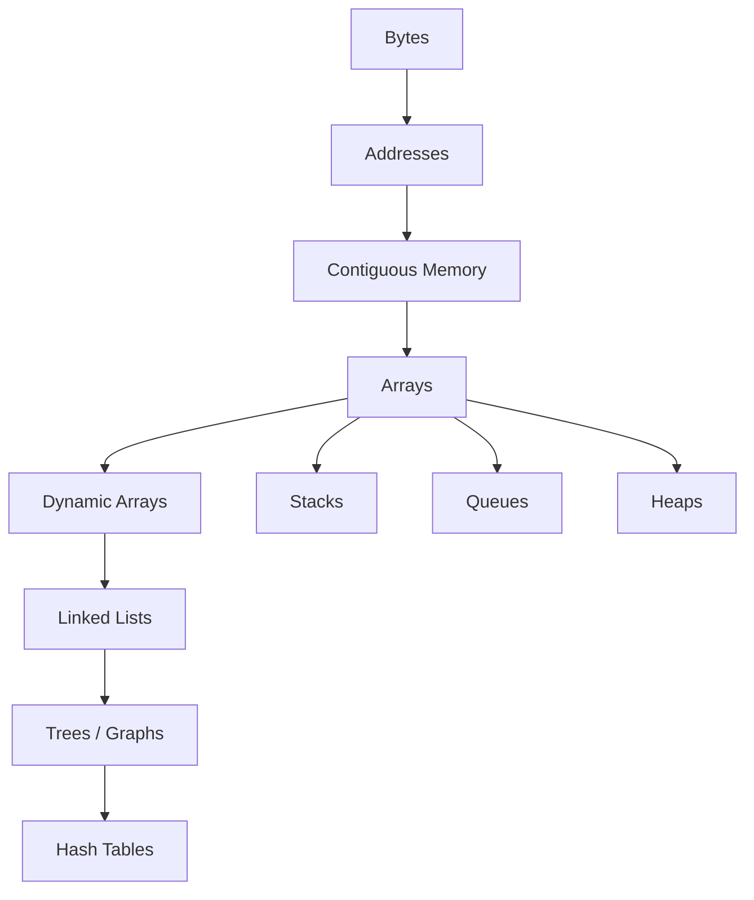
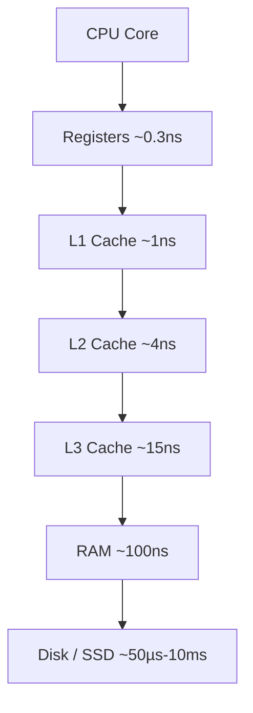
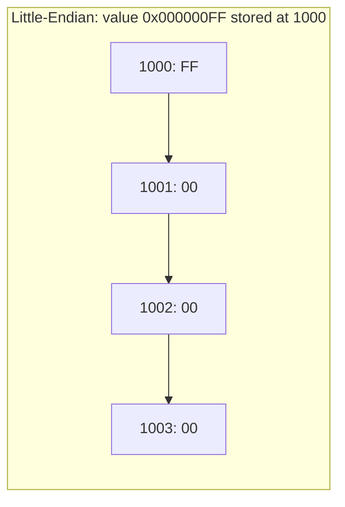
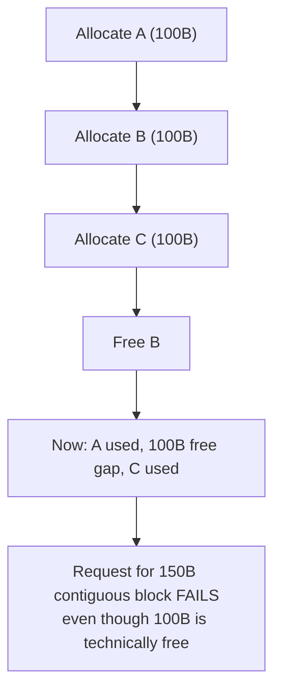
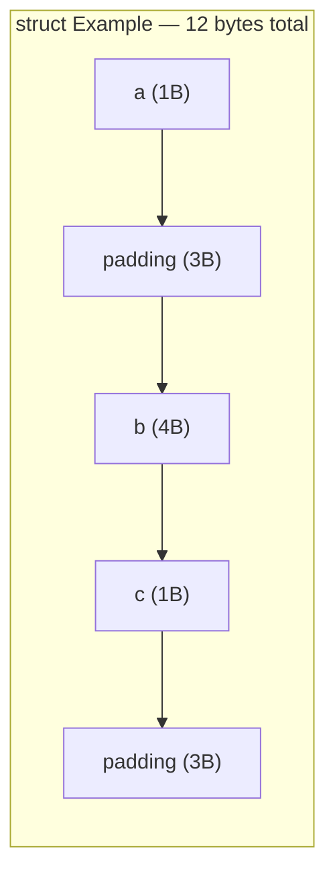
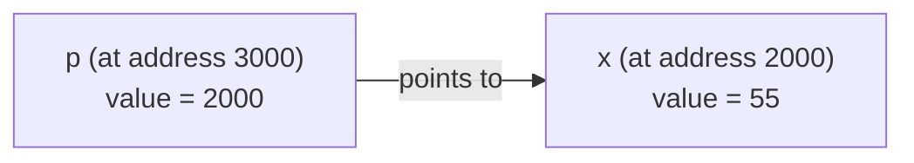
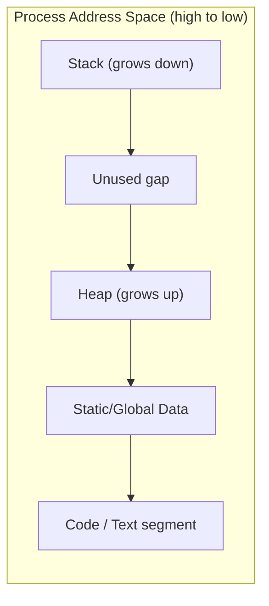
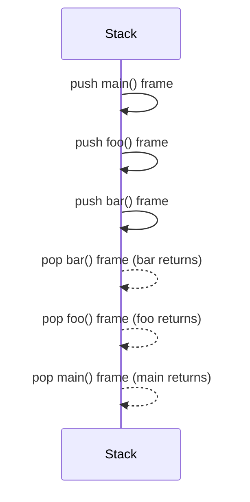
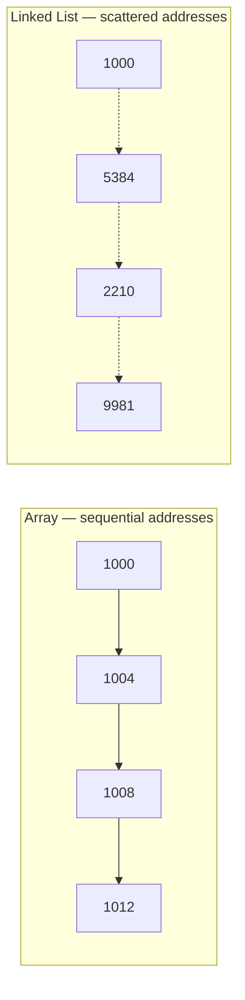
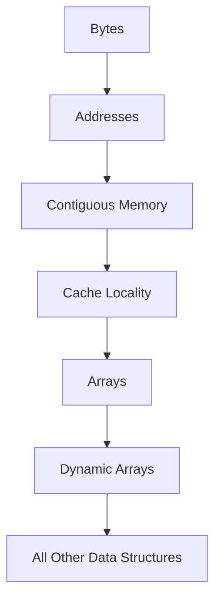

# 02 — Memory Layout

> **Chapter Goal:** Before you write a single array, linked list, or hash table, you need to understand the substrate they all live on: raw, dumb, undifferentiated memory. This chapter builds that intuition from the silicon up.

---

## Table of Contents

1. [Why Memory Matters](#1-why-memory-matters)
2. [What is RAM?](#2-what-is-ram)
3. [Memory is Just Bytes](#3-memory-is-just-bytes)
4. [Memory Addresses](#4-memory-addresses)
5. [Contiguous Memory](#5-contiguous-memory)
6. [Data Types and Memory](#6-data-types-and-memory)
7. [Alignment and Padding](#7-alignment-and-padding)
8. [Variables Are Names](#8-variables-are-names)
9. [Pointers](#9-pointers)
10. [Heap vs Stack](#10-heap-vs-stack)
11. [Cache Locality](#11-cache-locality)
12. [From Memory to Arrays](#12-from-memory-to-arrays)
13. [Common Misconceptions](#13-common-misconceptions)
14. [Engineering Insights](#14-engineering-insights)
15. [Visual Summary](#15-visual-summary)
16. [Self Check](#16-self-check)
17. [Key Takeaways](#17-key-takeaways)

---

## 1. Why Memory Matters

> 💡 **Key Insight**
> Every data structure you will ever learn — array, linked list, tree, graph, hash table, stack, queue, heap — is, at the hardware level, *the same thing*: a pattern of bytes at addresses. The "structure" exists only in how we choose to read and connect those bytes.

Before we can talk about `O(1)` array access or `O(log n)` tree traversal, we need to answer a much more primitive question:

**What actually *is* a variable, once your program is running?**

The answer, uncomfortably, is: *nothing special*. There is no such thing as an "array" or a "node" inside RAM. There are only bytes, sitting at addresses, waiting to be interpreted. Every abstraction you rely on — every `struct`, every `class`, every `int[]` — is a **story your compiler tells you**, layered on top of a machine that only understands one primitive operation:

```
load byte(s) from address X
store byte(s) at address X
```

That's it. That is the entire vocabulary of memory.

### The Chain of Abstraction



Every node up this chain is *built out of* the node below it. A linked list is not a magical chain of floating boxes — it is a collection of memory blocks, each storing raw bytes for data plus raw bytes for an address pointing to the next block. A hash table is not a magical box that "knows" where things are — it is an array (contiguous memory) combined with an arithmetic function that converts a key into an index.

> 🎯 **Think Like the CPU**
> The CPU does not see "an array of 10 integers." It sees a starting address and a size. It doesn't know or care what you call it. Every time you write `arr[i]`, you are asking the CPU to compute `base_address + (i * element_size)` and fetch whatever bytes happen to be there. If your bookkeeping is wrong, the CPU will happily hand you garbage — or someone else's data.

### Real World

Compiler engineers, kernel developers, database engineers, and game programmers all obsess over memory layout because performance, correctness, and security all live at this level. A buffer overflow is a memory layout bug. A cache-miss-heavy loop is a memory layout bug. An "accidentally quadratic" program is very often a memory layout bug in disguise (repeated shifting of contiguous memory, for example).

### Mini Summary

- Data structures are conceptual; memory is physical.
- Every structure you'll study is a pattern imposed on bytes.
- Understanding bytes-and-addresses first makes every later data structure feel *obvious* instead of memorized.

---

## 2. What is RAM?

RAM (**Random Access Memory**) is a giant array of storage cells, each holding a fixed number of bits, each reachable in roughly constant time regardless of position — hence "random" access, as opposed to sequential media like tape.

But RAM does not exist alone. It's one rung on a ladder of storage technologies, each trading capacity for speed.

### The Memory Hierarchy

```
        FASTEST, SMALLEST, MOST EXPENSIVE
                    ▲
                    │
              ┌───────────┐
              │ Registers │   ~0.3 ns    (a handful of bytes)
              └─────┬─────┘
                    │
              ┌───────────┐
              │ L1 Cache  │   ~1 ns       (~32–64 KB)
              └─────┬─────┘
                    │
              ┌───────────┐
              │ L2 Cache  │   ~4 ns       (~256 KB–1 MB)
              └─────┬─────┘
                    │
              ┌───────────┐
              │ L3 Cache  │   ~15 ns      (a few MB, shared)
              └─────┬─────┘
                    │
              ┌───────────┐
              │    RAM    │   ~80–100 ns  (GBs)
              └─────┬─────┘
                    │
              ┌───────────┐
              │   Disk    │   ~50,000–10,000,000 ns (TBs)
              └───────────┘
                    │
                    ▼
        SLOWEST, LARGEST, CHEAPEST
```



> ⚠️ **Warning**
> These numbers are not just trivia. A cache miss that forces a trip to RAM can cost you **100x** more cycles than a cache hit. A page fault that forces a trip to disk can cost you **100,000x** more. Algorithms with "worse" Big-O can *outperform* "better" ones in practice purely because they respect this hierarchy.

### Why the Hierarchy Exists

You cannot build a memory that is simultaneously huge, cheap, and fast — physics won't allow it. Fast memory (SRAM, used in caches) requires more transistors per bit and sits physically closer to the CPU core, which makes it expensive and small. Slow memory (DRAM, used for RAM) is cheaper and denser, but requires periodic refreshing and longer signal travel time. Disks are denser still, but mechanically or electrically much slower to access.

The hierarchy is a *bet*: most programs exhibit **locality** (defined rigorously in [Section 11](#11-cache-locality)), so keeping recently- and nearby-used data in fast, small memory pays off far more often than not.

### Intuition

Think of it like a desk (registers), the drawers beside your desk (L1/L2/L3 cache), a filing cabinet across the room (RAM), and a storage unit across town (disk). You *could* work exclusively from the storage unit, but you'd spend all day driving. Good programs are ones that keep what they need nearby.

### Real World

Database engines build entire architectures — buffer pools, B-trees with large fanout, sequential write-ahead logs — around minimizing trips to disk. Game engines pack related data (position, velocity, health) into tight structures so a single cache line load pulls in everything a physics update needs. High-frequency trading systems obsess over L1/L2 cache residency because nanoseconds are money.

### Common Mistake

Assuming "RAM is fast" as an absolute, rather than *relative to disk but slow relative to cache*. Many performance bugs come from code that is technically "in RAM" but thrashes the cache — jumping around memory so much that the CPU is effectively paying RAM-latency prices on every access.

### Mini Summary

- Speed and size trade off; there's no free lunch in memory design.
- The hierarchy exists because physics forces small+fast+expensive vs. large+slow+cheap.
- Respecting the hierarchy (locality) is often more important than asymptotic complexity.

---

## 3. Memory is Just Bytes

Strip away every language feature, every class, every framework, and what's left is this:

> **RAM is a single, flat, enormous array of bytes.**

A **bit** is the smallest unit — a 0 or a 1. A **byte** is a group of 8 bits, and it is the smallest unit that has an **address**. You cannot ask the hardware "give me bit number 4,000,001" directly; you ask for a byte, and if you want a specific bit, you extract it yourself with bitwise operations.

### Visualizing Flat Memory

```
Address:   1000   1001   1002   1003   1004   1005   1006   1007
Content:  [ ?? ] [ ?? ] [ ?? ] [ ?? ] [ ?? ] [ ?? ] [ ?? ] [ ?? ]
```

Every one of those boxes is a byte. Every byte can hold a value from `0` to `255` (i.e. `00000000` to `11111111` in binary). Memory itself does not know or care whether that byte is:

- part of an `int`
- part of a `char`
- part of a pointer
- part of a `struct`
- unused garbage left over from a previous program

> 💡 **Key Insight**
> **Memory has no types.** Types are a fiction maintained entirely by the compiler and, at best, enforced weakly by hardware features like memory protection. To the RAM chip, a byte holding the ASCII character `'A'` (`01000001`) is bit-for-bit indistinguishable from the byte holding the number `65`. Interpretation is everything.

### Behind the Scenes

When your program starts, the operating system hands it a range of addresses (a *virtual address space*). Your compiler and runtime carve that space into regions — code, stack, heap, static data — but from RAM's perspective, it is still just one long strip of bytes with no internal fences except the ones the OS enforces through page tables.

### Common Mistake

Believing memory "stores variables." Memory stores **bytes at addresses**. The variable name, its type, and its scope are compile-time concepts that vanish (mostly) by the time your program runs — more on this in [Section 8](#8-variables-are-names).

### Mini Summary

- The bit is the atomic unit of information; the byte (8 bits) is the atomic unit of *addressing*.
- RAM is a flat array of bytes — nothing more.
- Meaning is imposed by software, not stored by hardware.

---

## 4. Memory Addresses

If memory is a flat array of bytes, then an **address** is simply the *index* into that array. Just as `arr[3]` means "the 4th element of `arr`," address `1003` means "the byte at position 1003 in RAM."

### Visualizing Addressed Memory

```
Address     Data
--------    ----
1000        25
1001        00
1002        00
1003        00
1004        FF
1005        A2
1006        00
1007        00
```

(Values shown in hexadecimal, as is conventional for raw memory dumps.)

### Multi-Byte Values

A single byte can only represent 256 distinct values (0–255). Most data types need more range than that, so they span **multiple consecutive bytes**. A 32-bit integer, for instance, occupies 4 consecutive bytes:

```
Address:   1000  1001  1002  1003
Byte:      25    00    00    00     →  interpreted together as: 37 (decimal)
```

The CPU doesn't read "an int" — it reads 4 bytes starting at address 1000, then reassembles them into a single 32-bit number according to a convention (see: **endianness**, below).

> 📝 **Note — Endianness**
> Different CPU architectures order multi-byte values differently. **Little-endian** machines (most x86/x64, most ARM in practice) store the least-significant byte first. **Big-endian** machines store the most-significant byte first. This is why the same 4 bytes can represent different numbers depending on architecture — a subtle and very real source of bugs when reading raw binary data across systems.



### Intuition

Think of RAM as a street of houses, each with a unique address, each house exactly one byte "wide." A 4-byte integer is like a family that needs 4 adjacent houses to live in — they must be next to each other, and the "family's address" is conventionally the address of the *first* house.

### Real World

Debuggers, disassemblers, and tools like `xxd`, `hexdump`, or `gdb`'s `x/` command let you look directly at addresses and raw bytes — this is the ground truth beneath every high-level variable name you'll ever use.

### Common Mistake

Assuming addresses are meaningful or "random." Addresses are just sequential positions — what varies (and what *looks* random) is which addresses the OS/allocator decided to hand your process, often randomized deliberately for security (**ASLR** — Address Space Layout Randomization). The addressing scheme itself is perfectly systematic.

### Mini Summary

- An address is an index into the flat byte array that is memory.
- Multi-byte types occupy consecutive addresses.
- Endianness determines the byte order within those multi-byte values.

---

## 5. Contiguous Memory

This is one of the most consequential ideas in this entire chapter — nearly everything about array performance, and nearly everything about *why linked lists exist as an alternative*, traces back to this single concept.

### Definition

> **Contiguous memory** means a block of memory where every byte occupies a strictly consecutive address, with no gaps, from the start of the block to its end.

### Visualizing Good vs. Bad Memory

**Contiguous (good):**

```
+----+----+----+----+----+----+----+----+
| E0 | E1 | E2 | E3 | E4 | E5 | E6 | E7 |
+----+----+----+----+----+----+----+----+
1000 1004 1008 1012 1016 1020 1024 1028
```

**Fragmented (bad):**

```
+----+          +----+                +----+
| E0 |  (gap)   | E1 |     (gap)      | E2 |
+----+          +----+                +----+
1000            1050                  1200
```

### Why Arrays *Require* Contiguity

An array's defining performance trick is **O(1) random access** via arithmetic:

```
address_of(arr[i]) = base_address + (i × element_size)
```

This formula only works if every element is exactly `element_size` bytes away from its neighbor, with zero gaps. If elements were scattered arbitrarily (as in the fragmented diagram above), there would be no formula — you'd need to *store* each element's address somewhere, which is precisely what a linked list does, at the cost of extra memory and extra pointer-chasing.

> 🎯 **Think Like the CPU**
> To fetch `arr[347]`, the CPU does not "search" for element 347. It performs one multiplication, one addition, and one memory load. Contiguity is what makes indexing a *calculation* instead of a *search*.

### Fragmentation

Over the life of a running program, memory gets allocated and freed repeatedly. If a large contiguous block is needed but only small scattered free chunks are available, the system suffers from **fragmentation** — plenty of total free memory, but no single piece large enough to satisfy the request.



### Real World

Memory allocators (`malloc`/`free`, garbage collectors, custom game-engine allocators) exist specifically to manage this problem — deciding *where* to place new allocations to minimize fragmentation, sometimes via strategies like best-fit, first-fit, buddy allocation, or compacting/moving garbage collectors that physically relocate objects to re-establish contiguity.

### Common Mistake

Assuming "there's enough free memory" guarantees an allocation will succeed. Total free bytes and *contiguous* free bytes are entirely different quantities — and it's the latter that array-like allocations depend on.

### Mini Summary

- Contiguity means no gaps between elements — a strict requirement for arrays.
- It enables O(1) index math instead of search.
- Fragmentation is what happens when contiguity becomes hard to guarantee over time.

---

## 6. Data Types and Memory

Every data type has a fixed **size** — the number of bytes it consumes — determined by the language, the compiler, and the target platform.

### Common C-family Type Sizes (typical 64-bit system)

| Type       | Typical Size (bytes) | Range (signed, typical)                          |
|------------|-----------------------|---------------------------------------------------|
| `char`     | 1                     | -128 to 127                                        |
| `short`    | 2                     | -32,768 to 32,767                                  |
| `int`      | 4                     | -2,147,483,648 to 2,147,483,647                    |
| `long`     | 8 (Linux/macOS) / 4 (Windows) | platform-dependent                          |
| `long long`| 8                     | ~±9.2 × 10¹⁸                                       |
| `float`    | 4                     | ~7 significant decimal digits (IEEE 754 single)    |
| `double`   | 8                     | ~15–17 significant decimal digits (IEEE 754 double)|
| `pointer`  | 8 (64-bit) / 4 (32-bit) | address-space dependent                          |

> ⚠️ **Warning — Platform Differences**
> `long` is a classic portability trap: it's 4 bytes on 32-bit Windows and most 64-bit Windows compilers, but 8 bytes on 64-bit Linux/macOS. Never assume a type's size — use `sizeof()` in C/C++, or prefer fixed-width types like `int32_t`, `int64_t` from `<stdint.h>` when exact size matters.

### Why Size Matters

Size determines:

1. **How many addresses a value occupies** (an `int` occupies 4 consecutive byte-addresses).
2. **How far apart array elements sit** (`arr[i]` jumps `sizeof(element)` bytes per step).
3. **How much memory a program consumes** at scale — a difference between `int32_t` and `int64_t` in a billion-element array is 4 GB.

### Visualizing an `int` in Memory

```
int x = 55;

Address:   2000   2001   2002   2003
Byte:      37     00     00     00      (little-endian, hex 0x37 = 55 decimal)
```

### Real World

Database systems obsess over type sizing — choosing `SMALLINT` vs `INT` vs `BIGINT` for a column with billions of rows can mean gigabytes of difference in storage and, more importantly, in how much fits in cache during a scan.

### Common Mistake

Assuming type sizes are identical across all languages and platforms, or forgetting that a `bool` in many languages still consumes a full byte (not a single bit), because memory is byte-addressable.

### Mini Summary

- Every type has a fixed, platform-dependent byte size.
- Size determines addressing math for arrays and total memory footprint.
- Never assume — verify with `sizeof()` or documentation.

---

## 7. Alignment and Padding

Modern CPUs don't just read memory byte-by-byte; they read it in chunks (called *words*, often 4 or 8 bytes), and they are fastest — sometimes only *capable* — when a multi-byte value starts at an address that is a multiple of its own size. This requirement is called **alignment**.

### Why Compilers Insert Padding

Consider this struct:

```c
struct Example {
    char  a;   // 1 byte
    int   b;   // 4 bytes
    char  c;   // 1 byte
};
```

Naively, you might expect this to take `1 + 4 + 1 = 6` bytes. It doesn't. Because `int b` must start at an address divisible by 4 (its alignment requirement), the compiler inserts invisible **padding** bytes.

### Before and After Visualization

**Naive (impossible) layout:**

```
+---+---+---+---+---+---+
| a | b | b | b | b | c |
+---+---+---+---+---+---+
0   1   2   3   4   5
```
`b` starts at address 1 — **not a multiple of 4**. Illegal / slow on many architectures.

**Actual compiled layout (with padding):**

```
+---+----+----+----+----+---+----+----+----+
| a | P  | P  | P  |  b |  b |  b |  b | c | P  P  P
+---+----+----+----+----+----+----+----+---+
0   1    2    3    4    5    6    7   8   9
```

- `a` occupies byte 0.
- Bytes 1–3 are **padding** so that `b` can start at byte 4 (a multiple of 4).
- `b` occupies bytes 4–7.
- `c` occupies byte 8.
- The compiler typically adds **trailing padding** too (bytes 9–11), so the *entire struct's size* is itself a multiple of its largest member's alignment — this matters for correct alignment when the struct is placed in an **array** of structs.

Final size: **12 bytes**, not 6.



> 💡 **Tip**
> You can often shrink a struct's memory footprint simply by **reordering fields** from largest alignment requirement to smallest, minimizing the padding the compiler needs to insert. Reordering the struct above as `int b; char a; char c;` needs only 6 bytes plus 2 trailing padding bytes = 8 bytes, versus 12.

### Real World

This matters enormously at scale. Game engines and high-performance systems routinely audit struct layouts (`sizeof()`, `offsetof()`) because a "wasted" 4 bytes per struct becomes gigabytes when you have hundreds of millions of instances (particles, network packets, database rows).

### Common Mistake

Assuming `sizeof(struct) == sum of sizeof(members)`. It almost never is, once more than one type is mixed.

### Mini Summary

- Alignment is a hardware requirement: multi-byte values should start at addresses matching their size.
- Padding is the compiler's silent insertion of unused bytes to satisfy alignment.
- Field ordering directly affects memory footprint.

---

## 8. Variables Are Names

Here is a truth that surprises many programmers the first time they truly internalize it:

> **Variable names do not exist at runtime.**

`x`, `count`, `userAge` — these are conveniences for *you*, the human, and for the compiler while it's translating your source code. Once compilation is done, the compiler has replaced every reference to `x` with a specific memory address (or, often, a specific register). The running machine code contains no strings, no symbol names — just raw addresses and register numbers.

### The Compiler's Secret Ledger

During compilation, the compiler maintains a **symbol table** — an internal mapping from names to storage locations:

```
Symbol Table (compile-time only, discarded/stripped in final binary):

  Name        →   Location
  --------        --------
  x           →   stack offset -4  (or register %eax)
  count       →   stack offset -8
  userAge     →   address 0x601040 (static/global memory)
```

At runtime, none of this exists. If you attach a debugger to a *stripped* binary (one with debug symbols removed), you will see only addresses and raw bytes — no trace that a variable named `userAge` was ever involved.

> 📝 **Note**
> Debug builds retain symbol tables (e.g., via DWARF or PDB debug info) *specifically* so tools like `gdb` or Visual Studio can show you variable names again — but this is a courtesy layered on top, not something the CPU itself understands or needs.

### Visualization

```
Source Code:              Compiled Reality:
--------------             ------------------
int score = 42;    →      Address 3000: 2A 00 00 00
                            (the name "score" is GONE — only bytes remain)
```

### Real World

This is why **reverse engineering** binaries is hard — the human-readable names are stripped away, leaving analysts to infer meaning purely from patterns of addresses, instructions, and data flow.

### Common Mistake

Believing that a variable's name is somehow "attached" to its memory, or that renaming a variable in source code changes anything about runtime behavior. It changes *nothing* about the compiled bytes — it only changes the compiler's bookkeeping.

### Mini Summary

- Variable names are compile-time labels, not runtime entities.
- The compiler translates names into addresses/registers and then discards the mapping (unless debug info is preserved).
- At runtime, only bytes and addresses exist.

---

## 9. Pointers

If memory is a giant array of bytes, and every byte has an address, then it's natural to want to *store an address itself* as a value. That is exactly what a **pointer** is.

### Definition

> A **pointer** is a variable whose value is a memory address.

Nothing more mystical than that. If `x` lives at address `2000`, then a pointer `p` that "points to `x`" simply *holds the number 2000* as its value.

### Visualizing a Pointer

```
Address   Variable    Value
-------   --------    -----
2000      x           55
...
3000      p           2000     ← p's value IS the address of x
```



### Dereferencing

**Dereferencing** a pointer means: "go to the address stored in this pointer, and fetch (or set) the value there."

```
p        = 2000        (the address, stored inside p)
*p       = 55           (dereference: 'go to address 2000, read the value')
```

Think of a pointer as a *sticky note with an address written on it*. The sticky note itself is not the house — it just tells you where the house is. Dereferencing is the act of walking to that address and looking inside.

> ⚠️ **Warning**
> A pointer and the thing it points to are **two entirely separate pieces of memory**, each with its own address. Confusing "the address stored in `p`" with "`p`'s own address" is one of the most common early sources of pointer bugs.

### Intuition Table

| Expression | Meaning |
|---|---|
| `x` | the value stored at `x`'s address |
| `&x` | the address of `x` (produces a pointer) |
| `p` | the address stored inside pointer `p` |
| `*p` | the value found at the address `p` holds |

> 🎯 **Think Like the CPU**
> To the CPU, a pointer is just an integer, exactly like any other 4- or 8-byte value. The only thing that makes it "special" is that *your program* chooses to interpret that integer as an address and issue a follow-up memory read using it.

We will not yet discuss pointer arithmetic (adding to a pointer to "walk" through memory) — that becomes essential once we formally introduce arrays in the next chapter. For now, the goal is pure intuition: **a pointer is an address stored as a value, and dereferencing follows that address.**

### Real World

Every "reference," "handle," or "smart pointer" you'll encounter in higher-level languages (Java references, Python object references, C++ `shared_ptr`) is, underneath, a pointer — an address, sometimes wrapped with extra bookkeeping (reference counts, type tags) for safety.

### Common Mistake

Believing "a pointer contains the value." It does not — it contains an *address*, from which the value can be *retrieved*. This distinction is the entire basis of pointer semantics.

### Mini Summary

- A pointer stores an address, nothing more.
- Dereferencing follows that address to reach the actual data.
- Pointers are just integers with a special interpretation layered on top.

---

## 10. Heap vs Stack

A running program doesn't use memory uniformly — it divides its address space into distinct regions, two of which dominate day-to-day programming: the **stack** and the **heap**.

### The Big Picture

```
High Addresses
+-------------------------+
|         Stack           |   ← grows DOWNWARD
|            ↓             |
|                          |
|            ↑             |
|          Heap            |   ← grows UPWARD
+-------------------------+
|     Static / Global      |
+-------------------------+
|           Code            |
+-------------------------+
Low Addresses
```



### Stack Memory

The **stack** stores local variables and function call bookkeeping. Every time a function is called, a **stack frame** is pushed; every time it returns, that frame is popped.

```
call main()
   → push frame for main()          [ main's locals ]
   call foo()
      → push frame for foo()        [ foo's locals ]
      call bar()
         → push frame for bar()     [ bar's locals ]
         ← bar() returns → pop frame for bar()
      ← foo() returns → pop frame for foo()
   ← main() returns → pop frame for main()
```



Key properties:

- **Fast**: allocation is just moving a pointer (the stack pointer); no bookkeeping needed.
- **Automatic lifetime**: memory is reclaimed the instant the function returns.
- **Fixed, limited size**: exceeding it causes a **stack overflow**.
- **LIFO** (Last-In-First-Out) discipline.

### Heap Memory

The **heap** stores memory that must **outlive** the function that created it, or whose size isn't known until runtime.

Key properties:

- **Slower**: requires an allocator to find/track free space ([Section 5](#5-contiguous-memory)).
- **Manual or garbage-collected lifetime**: memory persists until explicitly freed (`free`, `delete`) or reclaimed by a garbage collector.
- **Much larger capacity** than the stack.
- **No inherent ordering** — allocations and frees can happen in any order, which is precisely why fragmentation ([Section 5](#5-contiguous-memory)) is a heap problem, not a stack problem.

### Why Dynamic Arrays Live on the Heap

A stack-allocated array must have a size known at compile time and disappears the moment its function returns. A **dynamic array** — one that can grow, shrink, and outlive the function that created it — needs memory that:

1. Persists beyond a single function call.
2. Can be resized (which, as we'll see in the next chapter, usually means *reallocating* a new contiguous block).

Only the heap satisfies both requirements.

| Property | Stack | Heap |
|---|---|---|
| Speed | Very fast | Slower |
| Lifetime | Automatic (function scope) | Manual / GC-managed |
| Size | Small, fixed limit | Large, limited by system memory |
| Fragmentation risk | None | Yes |
| Typical contents | Local variables, return addresses | Dynamic arrays, objects, large buffers |

> ⚠️ **Warning**
> Returning a pointer to a **stack-allocated** local variable from a function is a classic bug (a "dangling pointer") — the stack frame is popped and that memory may be overwritten by the very next function call.

### Real World

Recursive algorithms without a base case (or with excessive depth) crash with a *stack overflow* precisely because each call pushes another frame onto a fixed-size stack. This is why deep recursion is sometimes rewritten iteratively, using the heap (an explicit stack data structure) instead of the call stack.

### Common Mistake

Assuming "heap" refers to the *heap data structure* (the priority-queue structure you'll learn about later) — it does not. This "heap" is simply the name for a region of general-purpose dynamic memory. The naming collision is unfortunate but entrenched.

### Mini Summary

- Stack: fast, automatic, function-scoped, limited size.
- Heap: slower, manual/GC lifetime, large, fragmentation-prone.
- Anything that must outlive its creating function, or whose size is determined at runtime, belongs on the heap.

---

## 11. Cache Locality

This section explains *why* contiguous memory isn't just convenient for indexing math — it's dramatically **faster** in practice.

### Spatial Locality

> **Spatial locality**: if you access memory address `X`, you are likely to access nearby addresses (`X+1`, `X+2`, ...) soon after.

CPUs exploit this by never fetching a single byte from RAM in isolation. Instead, they fetch an entire **cache line** (typically 64 bytes) surrounding the requested address, betting that you'll need the neighbors too.

```
You request:        address 1000

CPU actually loads:  [1000|1001|1002|...|1063]   ← entire 64-byte cache line
```

If your next access is `1004`, it's **already in cache** — no trip to RAM required. This is precisely why iterating over a contiguous array is fast: each cache line load "pre-fetches" the next several elements for free.

### Temporal Locality

> **Temporal locality**: if you access address `X` once, you are likely to access it *again* soon.

This is why loops that repeatedly touch the same small set of variables benefit from caching — those values stay resident in L1/L2 cache across iterations rather than being evicted.

### Visualizing Locality-Friendly vs. Locality-Hostile Access

**Array traversal (locality-friendly):**

```
Access pattern:  1000 → 1004 → 1008 → 1012 → 1016 ...
Cache lines:     [============ one cache line covers many elements ============]
Result: mostly cache HITS after the first load.
```

**Linked list traversal (locality-hostile):**

```
Access pattern:  1000 → 5384 → 2210 → 9981 → 3007 ...
                 (each node's "next" pointer can point ANYWHERE in the heap)
Cache lines:     [xxxx]    [xxxx]      [xxxx]     [xxxx]     [xxxx]
Result: mostly cache MISSES — a RAM round-trip nearly every step.
```



> 💡 **Key Insight**
> This is the deep reason "arrays are fast, linked lists are slow" in practice, *even when their Big-O complexity is identical*. Big-O counts operations; it does not account for the wildly different real-world cost of a cache hit vs. a cache miss. An `O(n)` array scan can be an order of magnitude faster than an `O(n)` linked-list traversal.

### Prefetching

Modern CPUs go further with **hardware prefetchers**: circuits that detect predictable access patterns (like striding through an array) and speculatively load upcoming cache lines *before* you ask for them. Predictable, sequential access patterns are prefetcher-friendly; scattered, pointer-chasing patterns defeat prefetching almost entirely.

### Real World

This is why performance-sensitive code (game engines, numerical computing, database query engines) favors "array of structs" reorganized into "struct of arrays," why columnar databases outperform row-oriented ones for analytics, and why modern C++/Rust libraries increasingly favor contiguous containers (`Vec`, `std::vector`) over pointer-linked ones by default.

### Common Mistake

Believing that reducing the *number* of operations always improves performance. Reducing *cache misses* is frequently the bigger lever — a naive but contiguous algorithm often beats a "smarter" but pointer-heavy one.

### Mini Summary

- Spatial locality: nearby addresses tend to be accessed together — exploited via cache lines.
- Temporal locality: recently accessed addresses tend to be reused — exploited via cache retention.
- Contiguous memory is cache-friendly; pointer-chasing structures are cache-hostile.

---

## 12. From Memory to Arrays

We now have every ingredient needed to define an array with real understanding, rather than rote memorization:

- Memory is a flat sequence of addressed bytes ([§3](#3-memory-is-just-bytes), [§4](#4-memory-addresses)).
- Data types have fixed sizes ([§6](#6-data-types-and-memory)).
- Contiguous placement enables address arithmetic ([§5](#5-contiguous-memory)).
- Contiguous placement is also what makes cache locality work in your favor ([§11](#11-cache-locality)).
- Something must store where a block of memory begins — that's a pointer ([§9](#9-pointers)).
- That block usually lives on the heap if it needs to persist or grow ([§10](#10-heap-vs-stack)).

Put these together, and an **array** falls out naturally:

> An array is nothing more than **a contiguous block of same-sized elements**, referenced by the address of its first byte, where any element can be located via simple arithmetic on that starting address.

```
Array of 5 ints, starting at address 4000:

Address:   4000     4004     4008     4012     4016
Element:   arr[0]   arr[1]   arr[2]   arr[3]   arr[4]
```

No formula for computing an element's address has been introduced yet — that, along with growth strategies, resizing, and the true cost model of dynamic arrays, is the subject of the **next chapter**. For now, sit with the intuition:

> 🎯 **Think Like the CPU**
> An array isn't a "container" in the way you might picture a box holding other boxes. It's a *promise*: a promise that if you tell me the starting address and I know the element size, I can find *any* element without searching — because they are all sitting right next to each other, in order, with no gaps.

### Mini Summary

- An array = contiguous memory + fixed-size elements + a starting address.
- Everything from Sections 1–11 is a prerequisite for genuinely understanding *why* this definition works.
- The formal indexing formula and dynamic resizing are covered next.

---

## 13. Common Misconceptions

| Misconception | Why It's Wrong |
|---|---|
| **"Memory stores variables."** | Memory stores bytes. Variable names are compiler-only bookkeeping that vanishes at runtime ([§8](#8-variables-are-names)). |
| **"Addresses are random."** | Addresses are sequential positions in a flat array. What *looks* random is usually deliberate randomization (ASLR) of *where* your process's regions begin — the addressing scheme itself is systematic. |
| **"RAM stores arrays" (as a special structure).** | RAM has no concept of "array." An array is a convention your program imposes on a contiguous run of bytes — the hardware doesn't distinguish it from any other memory. |
| **"Pointers contain values."** | A pointer contains an *address*. The value is retrieved by dereferencing — following that address to another location ([§9](#9-pointers)). |
| **"An array stores indexes."** | An array stores *elements*, contiguously. Indexes are never physically stored — they're computed on the fly via arithmetic on the base address. |
| **"`sizeof(struct)` equals the sum of member sizes."** | Alignment padding almost always makes struct size larger than the naive sum ([§7](#7-alignment-and-padding)). |
| **"The heap is the heap data structure."** | The memory heap and the priority-queue heap are unrelated concepts that happen to share a name. |
| **"Big-O alone predicts real-world performance."** | Cache locality can cause identical-complexity algorithms to differ by 10x or more in wall-clock time ([§11](#11-cache-locality)). |

### Mini Summary

Nearly every misconception above stems from the same root error: treating a **software abstraction** (variable, array, pointer-as-value) as if it were a **hardware reality**. Hardware only ever sees bytes and addresses.

---

## 14. Engineering Insights

Memory layout is not an academic curiosity — it is a load-bearing concern across every major domain of software engineering.

### Operating Systems

- **Virtual memory** gives each process the *illusion* of a private, contiguous address space, while the OS secretly maps it onto scattered physical pages via page tables.
- **Paging and swapping**: when physical RAM is exhausted, the OS evicts rarely-used pages to disk — an operation orders of magnitude slower than a cache miss, which is why "swap thrashing" can bring a system to its knees.

### Compilers

- Compilers decide stack frame layout, register allocation, and struct padding — all driven directly by the concepts in this chapter.
- Optimizing compilers restructure loops specifically to improve spatial/temporal locality (loop tiling, loop interchange).

### Machine Learning

- Tensor libraries (NumPy, PyTorch) store multi-dimensional arrays in contiguous memory with a defined **stride** pattern, because matrix operations are overwhelmingly bottlenecked by memory bandwidth and cache behavior, not raw arithmetic throughput.
- "Row-major" vs. "column-major" layout decisions can produce order-of-magnitude performance differences in matrix multiplication purely from access-pattern locality.

### Database Systems

- **Row-oriented** storage favors fetching whole records; **column-oriented** storage favors analytical scans over one attribute across millions of rows — a direct application of spatial locality to disk and cache behavior.
- **B-trees** (not binary trees) are the dominant on-disk index structure specifically because their high branching factor minimizes the number of *disk-latency* trips, respecting the memory hierarchy from Section 2.

### Game Engines

- **Entity-Component-System (ECS)** architectures store components in tightly packed contiguous arrays ("struct of arrays") specifically to maximize cache-line utilization during per-frame updates across thousands of entities.
- Custom **memory pools/arenas** avoid the overhead and fragmentation risk of general-purpose heap allocation during real-time gameplay loops.

### Networking

- Network protocols define exact byte layouts (with explicit endianness — "network byte order" is big-endian) because packets crossing between architectures must agree on byte interpretation.
- Zero-copy techniques rely on precise understanding of buffer memory layout to avoid redundant copying between kernel and user space.

### Embedded Systems

- With kilobytes (not gigabytes) of RAM, embedded engineers manually plan every byte — struct padding, stack depth, and heap fragmentation are not abstractions to embedded developers; they are daily, hands-on constraints, often with no virtual memory or OS safety net at all.

### Mini Summary

Across every domain, the same handful of ideas recur: respect the memory hierarchy, prefer contiguity, minimize padding waste, and design data layouts around access patterns — not just around conceptual elegance.

---

## 15. Visual Summary

```
                    ┌─────────────┐
                    │    Bytes     │
                    └──────┬──────┘
                           │
                    ┌──────▼──────┐
                    │  Addresses   │
                    └──────┬──────┘
                           │
                 ┌─────────▼─────────┐
                 │ Contiguous Memory  │
                 └─────────┬─────────┘
                           │
                  ┌────────▼────────┐
                  │  Cache Locality  │
                  └────────┬────────┘
                           │
                     ┌─────▼─────┐
                     │   Arrays   │
                     └─────┬─────┘
                           │
                  ┌────────▼────────┐
                  │ Dynamic Arrays   │
                  └────────┬────────┘
                           │
                ┌──────────▼──────────┐
                │   Data Structures    │
                │ (Lists, Trees, etc.)│
                └──────────────────────┘
```



> 📦 **Summary Box**
> Everything in computer science's data-structure canon is a specific *arrangement strategy* layered on top of this exact chain. You have not merely learned "background theory" — you have learned the physical foundation that explains *why* every algorithmic tradeoff you'll study next actually exists.

---

## 16. Self Check

Answer these conceptually — no code required. If you can explain each in plain English without hand-waving, you have internalized this chapter.

1. Why can't a plain, fixed-size array grow in place once memory around it is already occupied?
2. Why does contiguous memory allow O(1) indexing, while non-contiguous memory does not?
3. Why are linked lists typically slower to iterate than arrays, even though both are "O(n)" to traverse?
4. Why does the CPU cache matter more than raw instruction count in many real-world performance problems?
5. Why does a struct's `sizeof()` often exceed the sum of its members' sizes?
6. Why do variable names disappear after compilation, and what replaces them?
7. Why must dynamic data typically live on the heap rather than the stack?
8. What is the practical difference between a pointer's value and the value it points to?

> 🧩 **Quiz — Quick Fire**
> **Q:** True or False — "A pointer stores the data it points to."
> **A:** False. A pointer stores an *address*; the data lives separately, at that address.
>
> **Q:** True or False — "RAM access time is uniform regardless of which part of the memory hierarchy is actually serving the request."
> **A:** False. Registers, caches, RAM, and disk differ in latency by many orders of magnitude.
>
> **Q:** True or False — "Struct field order can change a struct's total memory size."
> **A:** True — due to alignment and padding rules.

---

## 17. Key Takeaways

- **Memory is a flat array of bytes.** There are no variables, types, or structures at the hardware level — only bytes at addresses.
- **Addresses are indices**, not random labels; multi-byte values span consecutive addresses, ordered according to the platform's endianness.
- **Contiguity is what makes array indexing O(1)** — it turns "search for an element" into "compute an address."
- **Fragmentation** is the natural enemy of contiguous allocation over a program's lifetime.
- **Types have fixed sizes**, and those sizes drive both addressing math and total memory footprint — never assume without verifying.
- **Alignment forces the compiler to insert padding**, meaning struct size is not simply the sum of its members.
- **Variable names are compile-time fictions** — the running program only knows addresses and registers.
- **Pointers are addresses stored as values**; dereferencing follows that address to reach real data.
- **The stack** is fast, automatic, and function-scoped; **the heap** is slower, manually/GC-managed, and required for anything that must outlive its creating function or whose size is determined at runtime.
- **Cache locality — spatial and temporal — explains real-world performance** far better than Big-O alone; contiguous access patterns are dramatically faster than pointer-chasing ones.
- **An array is simply contiguous, fixed-size-element memory** referenced by a starting address — the natural, almost inevitable consequence of everything covered in this chapter.
- Nearly every data structure you will study next is a *deliberate strategy* for arranging bytes in memory to optimize some specific access pattern — you now have the vocabulary to understand *why* each strategy works, rather than simply *that* it works.

---

**Next Chapter → `03-Arrays.md`**: We formalize the indexing formula, examine amortized growth strategies for dynamic arrays, and derive the real cost model behind `append()`.
