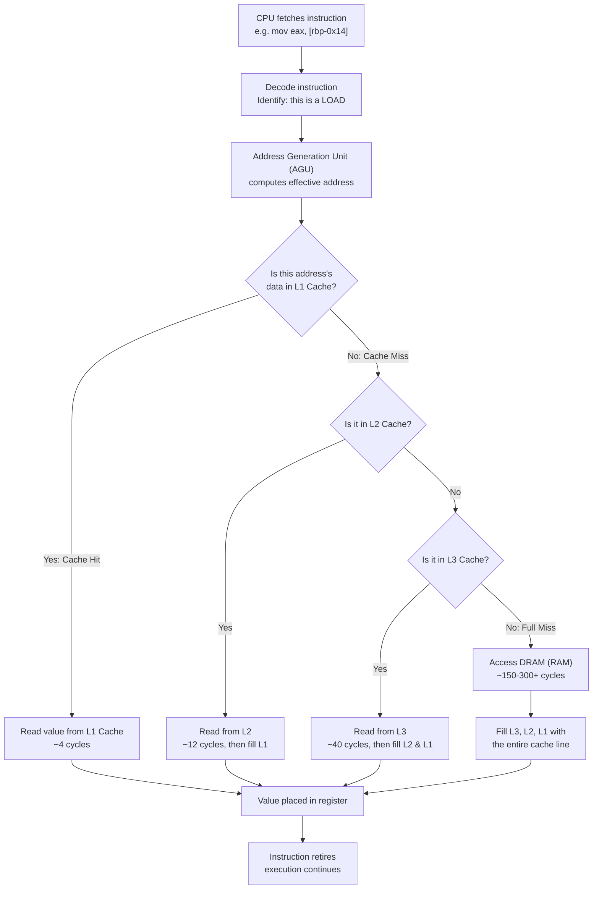
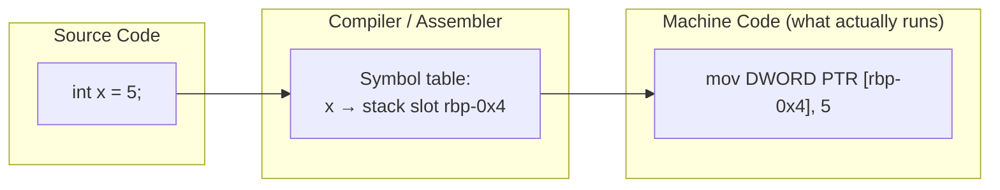
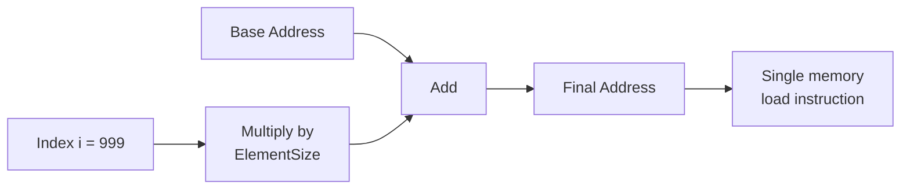
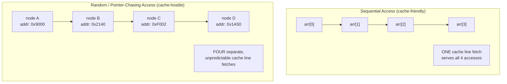
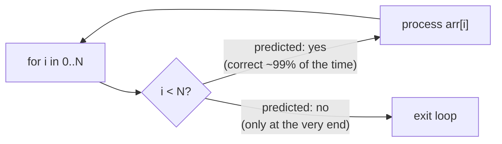
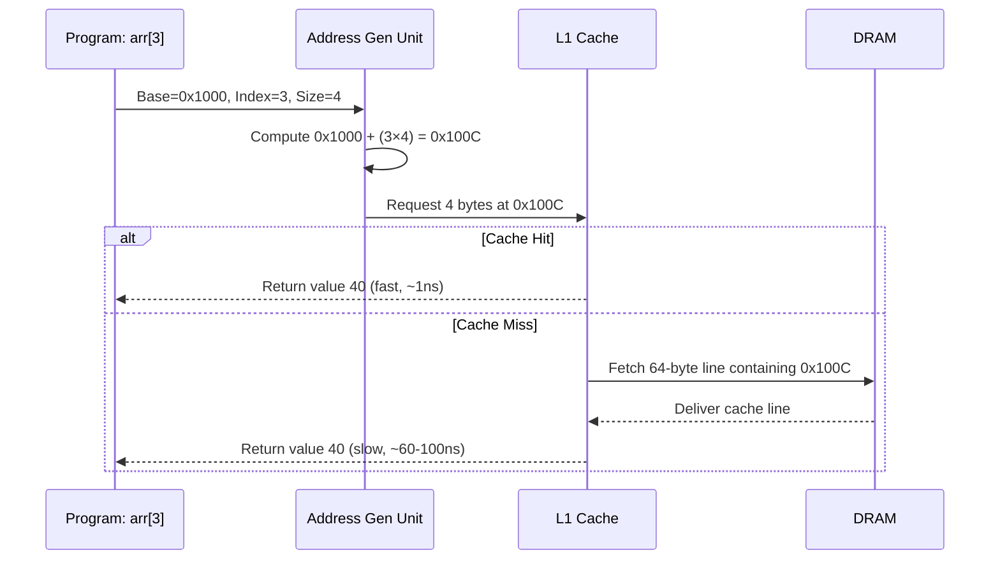
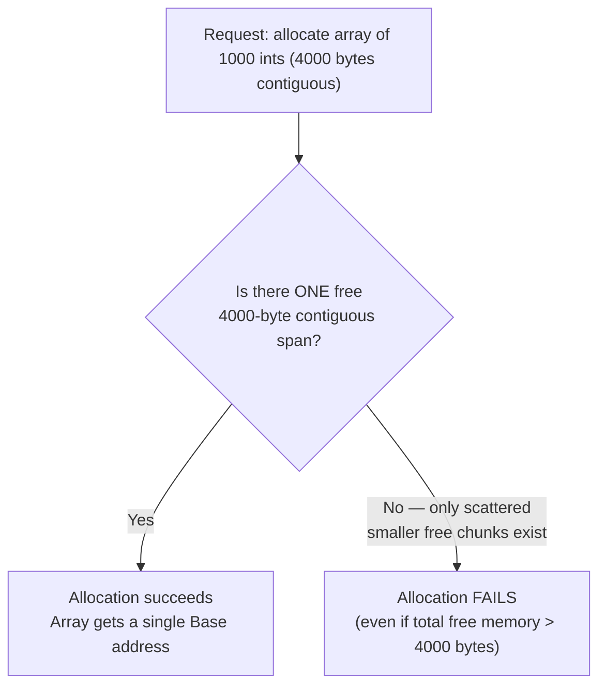

# 03 — How Memory Really Works

> *"There is no array. There is no variable. There is only an address, and the byte that lives there."*

---

## Preface: Where We Left Off

In the previous chapter, we built the vocabulary: RAM as a flat sea of addressable bytes, the idea of a memory address, the heap and the stack as two disciplines for managing that sea, and a first glance at the cache hierarchy that sits between the CPU and DRAM.

That was the *nouns*. This chapter is about the *verbs*.

We are going to answer one question with total precision, from as many angles as it takes:

> **What does the CPU actually do when your program touches memory?**

By the end, you will never again think of `arr[3]` as "the CPU grabbing the fourth box in a row." You will think of it as what it truly is: **a single arithmetic instruction that computes an address, followed by a memory transaction.** Everything else — arrays, structs, objects, linked lists — is a story we tell *ourselves*. The hardware doesn't know the story. It only knows addresses.

---

## 1. Introduction — Memory Doesn't Know What You Think It Knows

Here is the sentence this entire chapter is built to justify:

> **RAM is a giant, flat, undifferentiated array of bytes — and nothing more.**

Not an array of integers. Not an array of `Student` objects. Not a filing cabinet with labeled folders called `x`, `y`, or `myLinkedList`. Just bytes, billions of them, each one sitting behind a numeric address, indistinguishable from its neighbors except for that number.

When you write:

```c
int score = 95;
int grades[5] = {70, 80, 90, 100, 60};
printf("%d", grades[3]);
```

you *think* in terms of `grades`, indices, and elements. The CPU never sees any of that. By the time your program is running, every one of those names has been erased. The CPU receives an instruction that, translated into plain English, says:

> "Load 4 bytes starting at address `0x7ffee2a1c02c`."

That's it. No `grades`. No `[3]`. No `int`. Just a number, and a request to read some bytes starting there.

### Think Like the CPU

If you could interview the CPU mid-execution and ask, *"What is `grades[3]`?"* — it would stare at you blankly. The CPU has never heard of `grades`. It only knows:

```
mov eax, DWORD PTR [rbp-0x14]
```

Translated: *"Take whatever address is in register `rbp`, subtract `0x14`, and load 4 bytes from that address into `eax`."*

There is no symbolic reasoning happening. There is no lookup table mapping `"grades[3]"` → value. There is only address arithmetic, computed once, at compile time or run time, and baked into the instruction stream.

### Common Misconception

> ❌ *"The computer looks up the variable `grades[3]` somewhere in memory."*

There is no lookup. Lookup implies searching — scanning something to find a match. The CPU does the *opposite* of searching: it computes a precise numeric destination and goes straight there in one step. This distinction — **computation vs. search** — is the single most important idea in this chapter, and we will return to it again and again.

### Summary

- RAM is undifferentiated: it stores bytes, not types.
- Variable names are a *compiler-time* fiction that disappears before your program runs.
- The CPU's fundamental verb is not "find," it is "compute-and-go."

---

## 2. What Happens When You Access Memory?

Let's zoom into the full pipeline of a single memory access, from the moment an instruction is fetched to the moment a value lands in a register.

### The Conceptual Pipeline



### Walking Through Each Stage

**1. Instruction Fetch & Decode.** The CPU doesn't know it's "accessing an array." It knows it has decoded a `MOV` (or `LOAD`) instruction whose operand is a memory reference, not an immediate value or a register.

**2. Address Generation.** Modern CPUs have a dedicated hardware unit — the **Address Generation Unit (AGU)** — whose *only job* is arithmetic for addresses: base + index × scale + displacement. This is a specialized adder, separate from the main ALU, so that address computation can happen in parallel with other work.

**3. Cache Lookup.** The computed address is checked against the cache hierarchy, from smallest/fastest (L1) to largest/slowest (L3). This is a hardware-level, associative lookup — extremely fast, but conceptually still "is this address present," not "is this variable present."

**4. RAM Access on Miss.** If no cache level has the data, the memory controller issues a request to DRAM. This is orders of magnitude slower — potentially 100x the latency of an L1 hit.

**5. Value Returned.** The byte(s) travel back up through the cache hierarchy (populating each level along the way) and land in a CPU register, ready for use by the executing instruction.

### Engineering Note

> On a modern x86-64 processor running at ~3–4 GHz, an L1 cache hit costs roughly **4 cycles** (about 1 nanosecond), while a full miss all the way to DRAM can cost **200+ cycles** (over 60 nanoseconds). That's a **50x–70x** difference for the *exact same instruction* — the only variable is *where the data physically was*. This single fact motivates almost every optimization technique in this chapter.

### Real-World Example

A JSON parser reading a 10 MB file sequentially will glide through cache lines predictably, hitting L1/L2 the vast majority of the time. A pointer-heavy tree traversal over the same *logical* amount of data can be dramatically slower — not because there's more work, but because each node access is a near-random jump to an unpredictable address, guaranteeing frequent cache misses.

### Summary

Every memory access is a race through a hierarchy: register → L1 → L2 → L3 → DRAM. The CPU always asks the same question — *"do I have this address already?"* — never *"what variable is this?"*

---

## 3. Bytes Are the Only Reality

### Intuition

Take a locked warehouse with a billion identical shelf slots, each holding exactly one byte, and each slot stamped with a unique number. That's RAM. There are no signs on the shelves saying "Array," "Object," or "Linked List." Those categories exist only in the mind of the programmer and in the source code — never in the warehouse itself.

### Technical Explanation

Every high-level construct you use is a **layout convention** enforced by the compiler and your own code discipline, not a physical property of memory:

| Construct   | What memory actually stores |
|---|---|
| `int x`       | 4 raw bytes, no label, no type tag |
| `struct Point { int x, y; }` | 8 contiguous bytes: 4 for `x`, then 4 for `y`, with the boundary existing only in the compiler's mind |
| `int arr[5]`  | 20 contiguous bytes; there is no metadata byte marking "this is an array" |
| A linked list node | A blob of bytes containing a value *and* an address of another blob of bytes, with no inherent "list-ness" |

RAM does not store types. It does not store structure. It stores **bit patterns**. The interpretation of those bit patterns — "this is an `int`," "this is a `float`," "this is the third element of an array" — exists purely in the compiled instructions that *read* those bytes a particular way.

### Visualization

```
Physical RAM (a tiny slice):

Address:   1000  1001  1002  1003  1004  1005  1006  1007
Byte:      0x5F  0x00  0x00  0x00  0x2A  0x00  0x00  0x00
           └──────── int x = 95 ────┘ └──────── int y = 42 ────┘
```

Nothing in that byte sequence says "these first four bytes form one variable and the next four form another." That boundary is a **fact about the compiled program**, not a fact about memory.

### Behind the Scenes

If you dump raw memory with a debugger, you'll see exactly this: an undifferentiated stream of hex bytes. Tools like GDB or a hex editor can show you *any* region of memory as a wall of numbers — and only *you*, armed with knowledge of the source code's layout, can say "these four bytes are supposed to be interpreted as an `int`."

### Common Misconception

> ❌ *"An `int` array and a `float` array 'look different' in memory."*

They don't. Four bytes representing the integer `1077936128` and four bytes representing the IEEE-754 float `3.14` can be **bit-for-bit identical**. The only difference is which *instructions* interpret those bytes — as an integer load or a floating-point load. Memory itself is agnostic.

### Summary

- Memory has no built-in notion of type, structure, or collection.
- Every abstraction (array, struct, object, list) is a layout convention enforced entirely by the compiler and the instructions it emits.
- "Reading a byte as an int" vs. "reading it as a float" is a decision made by *code*, not a property stored *in* the byte.

---

## 4. Variables After Compilation

### Intuition

A variable name is training wheels for humans. The compiler needs it briefly, to reason about your program — and then throws it away.

### Technical Explanation

Consider:

```c
int x = 5;
```

**Before compilation (source code):** `x` is a symbolic name. It exists in your editor, in the compiler's internal symbol table, and in debug metadata (if you compile with `-g`).

**After compilation (machine code):** `x` has been replaced by one of two things:

1. **A fixed memory address** (for globals/statics), or
2. **An offset relative to a base register** — most commonly the stack pointer `rsp` or base pointer `rbp` (for locals).

The name `x` never appears in the executable's instruction stream. It survives only in optional debug symbols, which a debugger uses to *translate back* from addresses to names for your convenience — a translation that exists purely for humans, not for the CPU.

### Visualization



**Before:** `x` is a name in a table.
**After:** `x` is gone. All that remains is *"the 4 bytes located at `rbp - 4`."*

### Real-World Example

Compile a tiny C program with `gcc -S` to see the generated assembly:

```c
int add(int a, int b) {
    int result = a + b;
    return result;
}
```

produces something like:

```asm
add:
    mov DWORD PTR [rbp-0x14], edi   ; a → stack slot
    mov DWORD PTR [rbp-0x18], esi   ; b → stack slot
    mov eax, DWORD PTR [rbp-0x14]
    add eax, DWORD PTR [rbp-0x18]
    mov DWORD PTR [rbp-0x1c], eax   ; result → stack slot
    mov eax, DWORD PTR [rbp-0x1c]
    ret
```

Notice: `a`, `b`, and `result` never appear as *names*. They appear as **offsets from `rbp`**. The names existed for your benefit while reading the assembly listing (added by the assembler as a comment-like courtesy) — the CPU executes only the offsets.

### Common Misconception

> ❌ *"Variables 'live' in memory and keep their name as an identifier."*

Variable names are a **compile-time-only artifact**. At runtime, there are no names — only addresses (or register slots, if the compiler decided the variable never needs to touch memory at all).

### Summary

- Source-level variable names are erased during compilation.
- They are replaced by addresses (globals) or stack offsets/registers (locals).
- Debuggers *reconstruct* names for humans using separate debug symbol tables — the running program itself has no idea what "x" was ever called.

---

## 5. Address Calculation — Deriving It From First Principles

This is the mathematical heart of the chapter. Let's *derive* the array-indexing formula rather than hand it to you.

### Step 1: The Building Blocks

To find any byte in memory, you need only one thing: **its address**. So the real question becomes: *given an array and an index, how do we compute the address of that element?*

We need three ingredients:

1. **Base Address** — the address of the *first* byte of the array. Call it `B`.
2. **Element Size** — how many bytes each element occupies. Call it `S`.
3. **Index** — which element we want, counting from zero. Call it `i`.

### Step 2: Reasoning It Out

Imagine an array of `int`s (4 bytes each), and the array starts at address `1000`.

- Element 0 starts at `1000` (that's the base — zero elements displaced from the start).
- Element 1 starts *after* element 0 has finished — i.e., 4 bytes later → `1004`.
- Element 2 starts *after* elements 0 and 1 have finished — i.e., 8 bytes later → `1008`.
- Element 3 starts *after* elements 0, 1, and 2 — i.e., 12 bytes later → `1012`.

Do you see the pattern? To reach element `i`, we skip exactly `i` *complete elements*, each of size `S`. So the total displacement from the base is `i × S`.

### Step 3: The Formula Emerges

```
Address(i) = Base + (i × ElementSize)
```

This isn't a rule someone invented arbitrarily — it *falls out* of the simple fact that contiguous elements are laid end-to-end with no gaps, and to skip `i` of them you must skip `i × S` bytes.

### Visualization

```
Base = 1000, ElementSize = 4

Index:      0      1      2      3      4
Address: 1000   1004   1008   1012   1016
          └─4B─┘└─4B─┘└─4B─┘└─4B─┘

Address(3) = 1000 + (3 × 4) = 1000 + 12 = 1012 ✓
```

### Behind the Scenes

This is precisely what the AGU (Address Generation Unit) computes in hardware, often in a **single instruction** thanks to x86's *scaled-index addressing mode*:

```asm
; rbx = base address, rcx = index
mov eax, DWORD PTR [rbx + rcx*4]
```

That one instruction encodes `Base + Index × Scale` directly in silicon — the CPU has dedicated circuitry for exactly this formula because it is so overwhelmingly common.

### Think Like the CPU

Given `Base = 0x1000`, `ElementSize = 8` (a `double`), and `Index = 5`:

```
Address = 0x1000 + (5 × 8) = 0x1000 + 40 = 0x1028
```

The CPU does not "count over" five elements one by one. It performs **one multiplication and one addition**, then goes straight there.

### Common Misconception

> ❌ *"The formula `Base + i × Size` is a programming trick."*

It's not a trick — it is the **only possible consequence** of contiguous, fixed-size layout. Once you fix "elements sit back-to-back with no gaps," this formula is mathematically forced, not designed.

### Summary

- Address calculation requires exactly three inputs: base, index, element size.
- The formula `Address = Base + (Index × ElementSize)` is derived, not arbitrary.
- Hardware has dedicated support (scaled-index addressing) because this pattern is so fundamental.

---

## 6. Why O(1) Random Access Exists

### Intuition

"Random access" doesn't mean the CPU picks randomly — it means the CPU can reach **any** element in the same amount of time, regardless of *which* element it is or how large the array is.

### Technical Explanation

Look again at the formula:

```
Address(i) = Base + (i × ElementSize)
```

Every term on the right-hand side is **already known** before the access happens:

- `Base` is known once the array is allocated.
- `ElementSize` is known at compile time (it's determined by the type).
- `i` is known at the moment of the access (it's just a number, possibly computed, but a single value).

Computing this formula takes **exactly one multiplication and one addition** — a fixed, constant amount of work, *completely independent* of how large the array is or which index you request. Whether `i = 0` or `i = 1,000,000`, the computation is identical in cost: one multiply, one add, one memory transaction.

This is the literal definition of **O(1)**: the cost does not grow with input size.

### Why the CPU Never Loops

To access `arr[999]`, the CPU does **not**:

```
❌ start at arr[0], step to arr[1], step to arr[2], ... 999 times
```

It does exactly this, once:

```
✅ Address = Base + (999 × ElementSize)
   Load 4 bytes from Address
```

There is no iteration. There is no traversal. The index `999` is plugged directly into arithmetic, not used as a "number of hops."

### Visualization



One path. One computation. No branch, no loop, no dependency on `i`'s magnitude.

### Real-World Example

Accessing `bigArray[5]` and `bigArray[5000000]` compile down to the *same shape of instruction* — only the immediate/register value for the index differs. Benchmark both and (cache effects aside) you'll see the raw addressing cost is identical.

### Common Misconception

> ❌ *"Bigger index means more work for the CPU."*

The *index value* changes what number gets multiplied, but it does not change the *amount of computation*. Multiplying by 5 and multiplying by 5,000,000 are both single-cycle-class operations on modern hardware — asymptotically and practically constant.

### Summary

- O(1) access exists because the address formula has a fixed number of arithmetic steps, regardless of index size.
- The CPU computes a destination; it never "walks" toward it.
- Random access means *uniform cost for any index*, not "unpredictable" access.

---

## 7. Why Linked Lists Cannot Do This

### Intuition

An array gives you a *formula*. A linked list gives you a *treasure hunt* — each clue (node) only reveals the location of the *next* clue, not the destination.

### Technical Explanation

In an array, the address of *any* element can be derived algebraically from the base and the index — no dereferencing of intermediate data required.

In a linked list, there is no such formula, because nodes are **not** required to be contiguous. Node `k`'s address bears no arithmetic relationship to node `k-1`'s address — it could be anywhere in the heap. The *only* way to discover where node `k` lives is to have already visited node `k-1` and read the pointer stored inside it.

### Visual Comparison

**Array — direct computation:**

```
Index i
   │
   ▼
Address = Base + i × Size   (pure arithmetic, no memory access needed yet)
   │
   ▼
Single memory read → Value
```

**Linked List — sequential dependency:**

```
Head
  │
  ▼
[Node 0: value | next] ──read next pointer──▶ [Node 1: value | next] ──▶ [Node 2: value | next] ──▶ ...
      (memory access #1)                          (memory access #2)         (memory access #3)
```

To reach node `k`, you must perform `k` **dependent** memory accesses — each one blocking the next, because you cannot know the address of node `k` until you've read node `k-1`.

### ASCII Side-by-Side

```
ARRAY (random access, O(1)):

  index i  ──▶  [ arithmetic ]  ──▶  address  ──▶  value
                (constant time, no chain of dependent loads)


LINKED LIST (sequential access, O(n)):

  head ──▶ node0 ──▶ node1 ──▶ node2 ──▶ ... ──▶ node(k)
           read      read      read              read
         (must happen in order — each depends on the previous)
```

### Behind the Scenes: Why This Matters for the CPU Pipeline

Array access requires computing an address using values already available — the CPU can often issue this early, even speculatively, and pipeline it with other work. Linked-list traversal creates a **chain of true data dependencies**: each memory load's *result* is needed as the *address* for the next load. The CPU literally cannot start load `k+1` until load `k` has returned, because it doesn't yet know where to look. This defeats pipelining, defeats out-of-order execution's ability to hide latency, and defeats hardware prefetchers (they can't guess an unpredictable heap address).

### Common Misconception

> ❌ *"Both arrays and linked lists are O(n) in the worst case, so it doesn't matter which one you use."*

Big-O hides constants — and here, the constants are enormous. Array traversal is O(n) with tiny, predictable, pipeline-friendly per-element cost. Linked-list traversal is O(n) with large, unpredictable, pipeline-hostile per-element cost (frequently a full cache miss *per node*). Same asymptotic class, wildly different real-world performance — often 10x–50x apart.

### Summary

- Arrays support O(1) access because addresses are computable without touching memory first.
- Linked lists require O(n) access because each node's address is a *secret* revealed only by visiting the previous node.
- This isn't a minor implementation detail — it's a structural property with major performance consequences for the CPU pipeline.

---

## 8. CPU Cache in Practice

We introduced the cache hierarchy conceptually in the previous chapter. Now let's understand it operationally.

### The Cache Line: The Real Unit of Memory Transfer

The CPU **never** fetches a single byte from RAM. It fetches a fixed-size chunk called a **cache line** — almost universally **64 bytes** on modern x86-64 and ARM64 processors.

```
Cache Line (64 bytes):

┌────┬────┬────┬────┬────┬────┬────┬────┬─── ... ───┬────┐
│ B0 │ B1 │ B2 │ B3 │ B4 │ B5 │ B6 │ B7 │            │ B63│
└────┴────┴────┴────┴────┴────┴────┴────┴─── ... ───┴────┘
   ← Requesting ANY single byte in this range pulls in ALL 64 →
```

If you ask for the byte at address `1000`, the hardware doesn't fetch just that byte — it fetches the entire aligned 64-byte block containing it (e.g., bytes `960`–`1023`), on the theory that nearby bytes are likely to be needed soon.

### Spatial Locality

**Spatial locality** is the principle that if you access address `X`, you are likely to access addresses *near* `X` soon after. Arrays are the textbook embodiment of this: accessing `arr[0]` pulls in a cache line that likely *also contains* `arr[1]`, `arr[2]`, `arr[3]`, etc. (for a 4-byte `int`, one 64-byte line holds 16 consecutive elements).

### Temporal Locality

**Temporal locality** is the principle that if you access address `X` now, you are likely to access the *same* address `X` again soon. A loop counter or a frequently-called function's instructions are classic examples.

### Visualizing Sequential vs. Random Access



### Pointer Chasing

**Pointer chasing** is the pattern of following a pointer to a new, unpredictable memory location, over and over (classic in linked lists, trees, and graphs). Each hop:

1. Cannot be predicted ahead of time by the hardware prefetcher.
2. Likely lands on a different cache line than the previous hop.
3. Creates a *dependent* load — the CPU can't start hop `k+1` until hop `k`'s address is known.

This combination — **unpredictability + dependency** — is precisely why pointer-chasing structures suffer so much more from cache misses than arrays do.

### Table: Access Pattern vs. Cache Behavior

| Access Pattern | Predictable by Prefetcher? | Cache Line Reuse | Typical Latency Profile |
|---|---|---|---|
| Sequential array scan | Yes (stride detected) | Very high | Mostly L1 hits after warm-up |
| Strided array access (e.g., every 8th element) | Often yes | Moderate | Mix of hits/misses depending on stride vs. line size |
| Random array index access | No | Low | Frequent misses, but at least each is independent |
| Linked list / tree pointer chasing | No | Very low | Frequent misses, **and** dependent (can't overlap) |

### Engineering Note

> Hardware prefetchers watch for **strided access patterns** — "the program just read address `X`, then `X+4`, then `X+8`..." — and start speculatively pulling future cache lines *before* they're requested. This works beautifully for array scans. It is powerless against pointer chasing, because there is no arithmetic stride to detect; the next address is data, not a pattern.

### Multi-Level Cache Behavior in Detail

It's worth walking through what "checking the cache" actually means, because it isn't one lookup — it's a cascade.

```
Request for address 0x4F20 arrives at the memory subsystem:

  1. Check L1 (per-core, ~32KB, ~4 cycles)      → Miss
  2. Check L2 (per-core, ~256KB-1MB, ~12 cycles) → Miss
  3. Check L3 (shared, several MB, ~40 cycles)   → Hit!
  4. Copy the 64-byte line into L2 and L1
  5. Serve the requested bytes to the core
```

Each level is larger and slower than the one before it — this is a deliberate trade-off. L1 must be small enough to respond in a handful of cycles (physically close to the execution units), while L3 can afford to be large and slower because it's the "last line of defense" before the far more expensive trip to DRAM.

### Table: Typical Latency and Size at Each Level (Illustrative, Modern x86-64)

| Level | Typical Size | Typical Latency | Shared or Per-Core? |
|---|---|---|---|
| Registers | A few hundred bytes | ~0 cycles (immediate) | Per-core |
| L1 Cache | 32–48 KB (data) | ~4–5 cycles | Per-core |
| L2 Cache | 256 KB – 2 MB | ~10–14 cycles | Per-core (usually) |
| L3 Cache | 8 MB – 64+ MB | ~30–50 cycles | Shared across cores |
| DRAM (RAM) | Gigabytes | ~150–300+ cycles | Shared, off-chip |

These numbers vary by generation and vendor, but the *shape* of the curve — each level roughly an order of magnitude larger and several times slower than the previous — is a stable architectural pattern across virtually every modern CPU.

### Cache Associativity, Briefly

A cache cannot simply store "any line anywhere" — that would make searching it prohibitively slow. Instead, most caches are **set-associative**: each memory address maps to a specific *set* of cache lines (determined by bits in the address), and within that set, the line can occupy one of a small number of "ways" (commonly 4, 8, or 16). This means two different addresses that happen to map to the *same* set can evict each other from cache even if the cache isn't globally full — a subtlety that matters for understanding certain pathological performance cases (e.g., accessing array elements with a stride that happens to be a power of two matching the cache's set size), but is beyond the scope of what you need to internalize here. The takeaway: cache lookups are fast specifically *because* they don't search everywhere — they search a small, address-determined subset.

### Behind the Scenes: What a Cache Miss Actually Costs You

A "miss" is not just "a bit slower." Consider a tight loop performing one million array accesses:

- **All L1 hits:** ~1,000,000 × 4 cycles ≈ 4,000,000 cycles.
- **All full DRAM misses:** ~1,000,000 × 250 cycles ≈ 250,000,000 cycles.

That's roughly a **60x** difference in total execution time for *the exact same logical operation*, purely as a function of where the data physically was. This is why systems programmers obsess over access patterns — the algorithmic work might be identical, but the memory behavior can dominate total runtime by orders of magnitude.

### Summary

- Cache transfers happen in 64-byte lines, not individual bytes.
- Spatial locality (nearby data) and temporal locality (recently used data) are the two pillars cache design exploits.
- Lookups cascade through L1 → L2 → L3 → DRAM, each level larger and slower than the last.
- Sequential array access is the best-case pattern for both principles; pointer chasing is close to the worst case.

---

## 9. Why Arrays Are CPU-Friendly

Beyond caching alone, arrays cooperate with nearly every major optimization a modern CPU performs.

### Hardware Prefetching

As discussed, sequential array access has a detectable *stride* (constant distance between consecutive addresses). The prefetcher locks onto this stride and starts loading future cache lines before the program even asks — effectively hiding RAM latency behind useful computation.

### Instruction Pipelining

Modern CPUs execute instructions in overlapping stages (fetch, decode, execute, memory, writeback) — multiple instructions are "in flight" simultaneously, like a factory assembly line. Array-processing loops tend to have **predictable control flow** (a simple loop condition, checked every iteration in the same way), which lets the CPU's **branch predictor** correctly guess "loop continues" almost every time, keeping the pipeline full.

### Branch Prediction



A simple counted loop over an array is *the* canonical case where branch prediction shines: the same branch outcome ("keep looping") repeats thousands of times in a row, so the predictor's accuracy approaches 100%, and mispredictions (which cost 15–20 cycles each by flushing the pipeline) are rare, occurring only once at loop exit.

### SIMD (Data-Level Parallelism)

Because array elements are contiguous and uniformly typed, the CPU can load and operate on *multiple elements at once* using SIMD instructions (SSE/AVX on x86, NEON on ARM) — e.g., adding 8 `int`s in a single instruction instead of 8 separate ones. This is only possible because the data has a **predictable, uniform, contiguous layout** — exactly what an array guarantees and a linked list cannot.

### Why "Same Big-O" Doesn't Mean "Same Speed"

| Factor | Array | Linked List |
|---|---|---|
| Prefetch-friendly | ✅ Yes (constant stride) | ❌ No (unpredictable addresses) |
| Cache line utilization | ✅ High (many elements/line) | ❌ Low (often 1 useful value/line, rest wasted) |
| Branch prediction | ✅ Trivial loop pattern | ⚠️ Depends, but traversal itself is a dependency chain regardless |
| SIMD-vectorizable | ✅ Often | ❌ Essentially never |
| Memory overhead per element | Low (just the data) | Higher (data + pointer(s), often + allocator metadata) |

### Common Misconception

> ❌ *"If two algorithms have the same Big-O complexity, they'll run at roughly the same speed."*

Big-O measures **growth rate**, not **wall-clock time**. It deliberately ignores constant factors — but on real hardware, those constant factors are dominated by cache behavior, prefetching, and pipelining, which can easily differ by an order of magnitude between array-based and pointer-based structures doing "the same" O(n) work.

### Real-World Example: Summing an Array vs. Summing a Linked List

Consider two logically identical tasks: sum one million integers stored as (a) a contiguous array, and (b) a singly linked list.

**Array summation:**
- The prefetcher detects the constant stride (4 bytes) almost immediately and begins streaming future cache lines ahead of demand.
- The loop's branch (`i < N`) is trivially predicted.
- On many architectures, the compiler can auto-vectorize this loop, summing 4 or 8 integers per SIMD instruction instead of one at a time.
- Result: the operation is often **memory-bandwidth-bound**, not latency-bound — the CPU is fed data almost as fast as it can consume it.

**Linked-list summation:**
- Each `next` pointer is unpredictable heap data; the prefetcher has nothing to lock onto.
- Each node access is a *dependent* load — the CPU must wait for node `k`'s data before it can even know where node `k+1` lives.
- SIMD is not applicable; there's no way to "vectorize" a chain of pointer dereferences.
- Result: the operation is **latency-bound**, dominated by a long chain of (potentially) full cache misses that cannot overlap.

Both are O(n). In practice, on real hardware, the array version can be **5x to 20x faster** for large `n`, purely due to how well each pattern cooperates with the memory subsystem — no algorithmic difference required.

### Behind the Scenes: Out-of-Order Execution and Memory-Level Parallelism

Modern CPUs don't necessarily execute instructions in the exact order they appear — they use **out-of-order execution** to find independent work to do while waiting on a slow operation. When accessing array elements at *known, independent* addresses, the CPU can often issue several loads "in flight" simultaneously (this is called **memory-level parallelism**), overlapping their latencies instead of paying for each one serially. Pointer chasing defeats this too: since each address depends on the *result* of the previous load, there is no independent work to overlap — the loads are forced to happen one after another, fully serialized, no matter how aggressive the CPU's out-of-order machinery is.

### Summary

- Arrays align with nearly every hardware optimization: prefetching, pipelining, branch prediction, SIMD, and memory-level parallelism via out-of-order execution.
- Linked structures actively defeat most of these mechanisms due to unpredictable, *dependent* memory access.
- This is *why*, in practice, array-based algorithms often dramatically outperform theoretically-equivalent pointer-based ones — often by 5x-20x or more, despite identical Big-O complexity.

---

## 10. Real Memory Walkthrough — `int arr[5]`

Let's make everything above completely concrete with one fully worked example.

### The Setup

```c
int arr[5] = {10, 20, 30, 40, 50};
```

Assume the array is allocated on the stack starting at address `0x1000` (a friendly round number for illustration). Each `int` is 4 bytes.

### Byte-Level Layout

```
Index:        0             1             2             3             4
Value:        10            20            30            40            50
Address:    0x1000        0x1004        0x1008        0x100C        0x1010

Byte view (little-endian, 4 bytes per int):

0x1000: 0A 00 00 00   0x1004: 14 00 00 00   0x1008: 1E 00 00 00   0x100C: 28 00 00 00   0x1010: 32 00 00 00
        └── 10 ──┘             └── 20 ──┘             └── 30 ──┘             └── 40 ──┘             └── 50 ──┘
```

| Index | Address | Raw Bytes (hex) | Interpreted Value |
|---|---|---|---|
| 0 | `0x1000` | `0A 00 00 00` | 10 |
| 1 | `0x1004` | `14 00 00 00` | 20 |
| 2 | `0x1008` | `1E 00 00 00` | 30 |
| 3 | `0x100C` | `28 00 00 00` | 40 |
| 4 | `0x1010` | `32 00 00 00` | 50 |

### CPU Computing `arr[3]`

**Step 1 — Known quantities at the moment of access:**
- `Base = 0x1000`
- `ElementSize = 4` (sizeof(int))
- `Index = 3`

**Step 2 — Apply the formula:**

```
Address(3) = Base + (Index × ElementSize)
           = 0x1000 + (3 × 4)
           = 0x1000 + 12
           = 0x1000 + 0xC
           = 0x100C
```

**Step 3 — Issue the memory transaction:**

```
Read 4 bytes starting at 0x100C  →  bytes: 28 00 00 00  →  value: 40
```

### Visualizing the Whole Journey



### Engineering Note

> Because `0x1000` through `0x1010` all fall within a single 64-byte-aligned cache line (`0x1000`–`0x103F`), accessing **any one** element of this array — even just `arr[0]` — would have pulled the **entire array** into L1 cache in one transaction. This is why iterating `arr[0]` through `arr[4]` after touching any single element is essentially "free" from a cache-miss perspective: the data is already there.

### Summary

- A concrete address computation is nothing more than one multiplication and one addition applied to known quantities.
- The entire array likely fits in a single cache line, making sequential access to small arrays extremely fast.
- What feels like "indexing into an array" is, at the hardware level, "compute an address, issue a load."

---

## 11. Memory Fragmentation

### Intuition

Imagine a parking lot where cars park and leave at random. Even if the *total* empty space is huge, it might be scattered in single-car-sized gaps — making it impossible to park a bus, even though "enough space" technically exists. That's fragmentation.

### External Fragmentation

**External fragmentation** occurs when free memory exists, but it's broken into small, non-contiguous chunks scattered across the address space — none large enough to satisfy a new, larger allocation request.

```
Heap over time:

[ USED ][ FREE ][ USED ][ FREE ][ USED ][ FREE ][ USED ]
           4KB              6KB              3KB

Total free = 13KB
But: request for a single contiguous 10KB block → FAILS
     (no single gap is ≥ 10KB, even though the sum is)
```

### Internal Fragmentation

**Internal fragmentation** occurs when an allocator hands out a block *larger* than what was requested (due to alignment requirements or fixed-size allocation classes), wasting the unused tail of that block.

```
Requested: 18 bytes
Allocator hands out a 32-byte block (nearest size class)
Wasted: 14 bytes — unusable by anyone else, "trapped" inside your allocation
```

### Why Arrays Demand Contiguous Memory

An array's entire O(1) access guarantee rests on the formula `Base + i × Size` pointing to a *valid, reserved* address for every `i` in range. That's only true if the whole array occupies one unbroken span of memory. If fragmentation means no such span of the needed size is currently available, **the allocation simply fails** — even if the total free memory in the system would be more than sufficient.



### Real-World Example

A long-running server process that repeatedly allocates and frees variable-sized buffers can, over hours or days, fragment its heap so severely that a *large* allocation fails with an out-of-memory error — despite `top` or `htop` reporting plenty of "free" memory system-wide. This is a classic, notoriously hard-to-debug production issue.

### Common Misconception

> ❌ *"If the total free memory is greater than what I'm requesting, the allocation will succeed."*

False for arrays and any structure requiring contiguity. Total free bytes and *contiguous* free bytes are entirely different quantities, and only the latter matters for array allocation.

### Summary

- External fragmentation: free memory exists, but scattered.
- Internal fragmentation: allocated memory exists, but partially wasted.
- Arrays are especially vulnerable to *external* fragmentation because their core performance guarantee depends on contiguity.

---

## 12. Dynamic Allocation — A Motivating Question

We've now built a complete, rigorous understanding of *why* arrays work the way they do — and *why* that same design has a sharp edge.

Ask yourself:

> **What happens when your program needs an array, but no single contiguous block of the required size is currently available?**

Or a related question:

> **What happens when your array is "full," and you need to add one more element — but the very next byte after your array is already occupied by something else?**

You cannot simply "extend" the array in place; the bytes right after it may belong to another variable entirely. And you cannot magically summon a bigger contiguous block out of a fragmented heap by wishing for one.

This is not a flaw in the array as a concept — it is a direct, unavoidable **consequence** of everything we've just proven: O(1) access requires contiguity, and contiguity is a scarce, sometimes unavailable resource.

This tension — *"I need contiguous memory, but contiguous memory isn't guaranteed to exist in the size I want, when I want it"* — is precisely the problem that motivates the next major data structure in this book. We will not solve it yet. For now, simply sit with the question, because understanding *why* it's hard is what will make the solution feel inevitable rather than arbitrary.

---

## 13. Engineering Notes — Why Memory Layout Matters Everywhere

Memory layout isn't an academic curiosity — it is a first-class design concern across nearly every domain of systems engineering.

**Operating Systems.** The OS memory manager (paging, virtual memory, the buddy allocator, slab allocators) exists almost entirely to manage the tension between "programs want contiguous virtual memory" and "physical RAM is fragmented and shared among many processes." Virtual memory is, in large part, an elaborate illusion of contiguity built on top of physically scattered pages.

**Compilers.** Compilers make deliberate decisions about struct field ordering, padding, and alignment specifically to optimize cache-line usage and avoid *false sharing* in multi-threaded code. Reordering struct fields can measurably change performance without changing program logic at all.

**Database Engines.** Row-oriented vs. column-oriented storage is fundamentally a memory-layout decision. Column stores pack same-typed values contiguously specifically to exploit spatial locality and enable SIMD-accelerated scans over billions of rows — the same principles from Section 9, applied at the storage-engine level.

**Machine Learning.** Tensor libraries (NumPy, PyTorch, TensorFlow) obsess over contiguous, well-strided memory layouts (`C-contiguous` vs. `Fortran-contiguous`) precisely because matrix multiplication throughput is dominated by cache behavior, not raw FLOP counts. A "logically correct" but poorly-laid-out tensor operation can be an order of magnitude slower.

**Game Engines.** The Entity-Component-System (ECS) architecture pattern exists specifically to replace pointer-chasing object graphs with contiguous arrays-of-components ("Data-Oriented Design"), because game engines must process tens of thousands of entities within a strict per-frame time budget (often ~16ms for 60fps), and cache misses are the enemy of that budget.

**Embedded Systems.** With kilobytes (not gigabytes) of RAM and no virtual memory to paper over fragmentation, embedded engineers often avoid dynamic allocation entirely, preferring statically-sized arrays precisely *because* their layout and lifetime are fully predictable at compile time.

### Table: Domain vs. Memory Concern

| Domain | Core Memory Concern | Why It Matters |
|---|---|---|
| Operating Systems | Virtual memory, paging, fragmentation | Illusion of contiguity over scattered physical RAM |
| Compilers | Struct padding, alignment | Cache-line efficiency, avoiding false sharing |
| Databases | Row vs. columnar layout | Spatial locality for scan-heavy workloads |
| Machine Learning | Tensor strides, contiguity | Cache-bound matrix operations dominate runtime |
| Game Engines | ECS / Data-Oriented Design | Meeting hard per-frame latency budgets |
| Embedded Systems | Static allocation | No virtual memory to hide fragmentation |

### A Closer Look: Struct Padding and Alignment

Since we mentioned compilers inserting padding, let's see it concretely. Consider:

```c
struct Bad {
    char  a;   // 1 byte
    int   b;   // 4 bytes
    char  c;   // 1 byte
};
```

You might expect this struct to occupy `1 + 4 + 1 = 6` bytes. On most compilers, it actually occupies **12 bytes**, because the compiler inserts padding so that `b` (a 4-byte `int`) starts at an address divisible by 4 — a hardware alignment requirement for efficient access — and pads the end of the struct so that arrays of `Bad` keep every element aligned too.

```
Offset:  0    1    2    3    4    5    6    7    8    9   10   11
         [a] [pad][pad][pad][────── b ──────][c] [pad][pad][pad]
```

Reordering the fields — placing same-sized fields together — can shrink this considerably:

```c
struct Good {
    int  b;    // 4 bytes
    char a;    // 1 byte
    char c;    // 1 byte
    // 2 bytes padding to round up to 8
};
```

This drops the struct from 12 bytes to 8 — a 33% reduction, with **zero change in program logic**. Multiply that savings across millions of struct instances in a large array, and the effect on both memory footprint *and* cache-line utilization (more useful structs per 64-byte line) becomes substantial. This is a direct, practical consequence of everything covered in this chapter: layout is not automatic or "smart" — it follows mechanical rules the engineer can reason about and control.

### Virtual Memory as an Illusion of Contiguity

It's worth being precise about one subtlety: when we say an array needs "contiguous memory," we almost always mean contiguous in **virtual address space** — the address space the OS presents to your process — not necessarily contiguous in **physical RAM**. The operating system's paging system maps virtual pages to physical page frames that may be scattered anywhere in physical memory, yet still appear to your program as one unbroken run of addresses. This is precisely why a process can often successfully allocate a large array even when physical RAM is itself fragmented — the OS performs a layer of indirection that restores the *appearance* of contiguity your array depends on. This doesn't eliminate fragmentation as a concept; it just moves *where* fragmentation is fought (the OS still needs enough free physical page frames, and virtual address space itself can become fragmented too) — but it explains why "contiguous" in application-level discussions of arrays is a slightly different claim than "physically adjacent in the DRAM chips."

### Summary

Every layer of the software stack — from silicon to game loops — is, in some form, fighting the same battle: *how do we keep related data physically close together so the CPU's cache hierarchy can do its job?* Struct layout, virtual memory, storage engines, and tensor libraries are all different faces of the same underlying problem this chapter has been building toward.

---

## 14. Common Misconceptions — Revisited and Dismantled

| Misconception | Why It's False |
|---|---|
| "The CPU knows array indexes." | The CPU only ever sees a computed address. "Index 3" is erased into "the number 3," multiplied and added — the *concept* of indexing doesn't survive compilation. |
| "Memory stores arrays." | Memory stores bytes. "Array" is a layout convention understood only by the compiler and the programmer's code, never by the RAM chip itself. |
| "Variables stay after compilation." | Variable *names* vanish entirely; only addresses/offsets remain in the compiled instructions. Debug symbols reconstruct names purely for human convenience. |
| "The CPU searches for `Array[5]`." | There is no search. Search implies scanning candidates for a match. Address computation is direct, constant-time arithmetic with no scanning involved. |
| "Big-O tells you which is faster." | Big-O ignores constant factors, and on real hardware those constants are dominated by cache/pipeline behavior — sometimes by 10–50x. |
| "More free RAM means my allocation will succeed." | Contiguous free RAM is what matters for array-like structures, not total free RAM — fragmentation can defeat allocation even with abundant total free space. |
| "All memory access takes the same amount of time." | Access time varies by 50–100x depending on whether data is in L1 cache or must be fetched from DRAM. |

---

## 15. Think Like the CPU

Let's run through several deliberate scenarios, thinking exactly as the hardware would.

### Scenario 1: Access `arr[100]`

Given: `Base = 0x2000`, `ElementSize = 4`.

```
Address = 0x2000 + (100 × 4)
        = 0x2000 + 400
        = 0x2000 + 0x190
        = 0x2190
```

The CPU performs one multiply (`100 × 4`), one add, and issues a single load at `0x2190`. It does **not** touch `arr[0]` through `arr[99]` in the process.

### Scenario 2: Access `matrix[3][7]` in a 2D array of `int`, declared as `int matrix[10][10]`

A 2D array is really a 1D array in disguise, laid out **row-major** (each row stored contiguously, one after another):

```
FlatIndex = (row × NumCols) + col
          = (3 × 10) + 7
          = 37

Address = Base + (FlatIndex × ElementSize)
        = Base + (37 × 4)
        = Base + 148
```

The CPU never "sees" two dimensions — it collapses them into one linear offset before touching memory.

### Scenario 3: Access `arr[i]` where `i` is a variable computed at runtime (e.g., `i = user_input * 2`)

The formula doesn't change — only *when* `i` becomes known does. The CPU still computes `Base + i × Size`, just using whatever value happens to be sitting in the register for `i` at that moment. The cost is identical whether `i` was a compile-time constant or the result of a runtime calculation — because the *arithmetic shape* of the work is the same.

### Scenario 4: Access `arr[-1]` (undefined behavior in C)

```
Address = Base + (-1 × 4) = Base - 4
```

The CPU will happily compute this address — it has no concept of "valid array bounds." It will issue a memory access to whatever lives 4 bytes *before* the array, which might be another variable's data, unallocated memory, or (if you're unlucky) memory outside the process's mapped region, potentially causing a segmentation fault. **The formula doesn't know about your array's boundaries — only you and your programming language's runtime checks (if any) do.**

### Common Misconception

> ❌ *"Out-of-bounds access is 'caught' by the hardware."*

Only *sometimes*, and only indirectly — if the computed address happens to fall on a memory page your process doesn't own, the OS's page-fault mechanism will raise a segmentation fault. But if it lands on a page you *do* own (e.g., adjacent to a legitimately allocated buffer), the access silently succeeds and corrupts or leaks data. Bounds checking is a **software** discipline (built into languages like Python, Java, Rust), not a guaranteed **hardware** one.

---

## 16. Visual Summary — The Full Journey

```
                    Program
                       │
                       ▼
                    Compiler
             (erases variable names,
              computes offsets/addresses)
                       │
                       ▼
                  Machine Code
         (LOAD/STORE instructions with
          base+index+scale addressing)
                       │
                       ▼
                   Addresses
         (pure numbers — no types, no names)
                       │
                       ▼
                      CPU
        (Address Generation Unit computes
         Base + Index × ElementSize)
                       │
                       ▼
                     Cache
        (L1 → L2 → L3, organized in
         64-byte lines, exploiting locality)
                       │
                       ▼
                      RAM
        (accessed only on a full cache miss;
         orders of magnitude slower)
                       │
                       ▼
                     Bytes
        (the only thing that actually
         exists at the destination address)
                       │
                       ▼
                    Arrays
        (a human interpretation — layout
         convention imposed on those bytes)
```

Read this diagram top to bottom, and you have the entire chapter in one glance: **abstraction flows downward into addresses, and addresses flow into bytes.** Nothing above the "Addresses" line survives into hardware execution.

---

## 17. Self Check

Answer these conceptually — no code required. If you can explain each one out loud, in your own words, to someone who's never taken this course, you've internalized the chapter.

1. Why is `Array[i]` an O(1) operation, regardless of the size of the array or the value of `i`?
2. Why does the *size of each element* need to be known before an address can be computed?
3. Why does contiguous memory matter for array performance — what specifically breaks if elements are scattered?
4. Why can't memory "understand" the concept of a variable, an array, or an object?
5. Why is a linked list's access pattern fundamentally *sequential*, even though, in principle, "the data is all in RAM" just like an array?
6. Why can two algorithms share the same Big-O complexity yet perform very differently in practice?
7. Why might a system report "plenty of free memory" and still fail to allocate a large array?
8. What specific hardware feature benefits the most from sequential array access, and why does pointer chasing defeat it?
9. If variable names disappear after compilation, what does a debugger actually use to show you `x = 5` when you inspect a running program?
10. Why is `arr[-1]` not "blocked" by the hardware, and what actually determines whether it crashes your program?

---

## 18. Transition

We have now traced the entire path from source code to silicon: how a variable name is erased at compile time, how an index becomes an address through simple, derivable arithmetic, how that address races through a cache hierarchy built on locality, and how contiguous layout is the single property underlying nearly every performance guarantee — and every performance *pitfall* — we've discussed.

Now that we understand how memory actually works, we are finally ready to study **Static Arrays** — not as a programming construct, but as a direct consequence of contiguous memory and address arithmetic.
