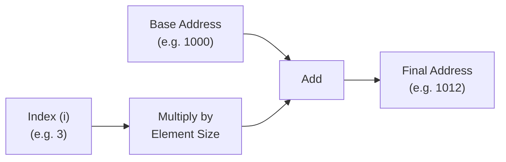
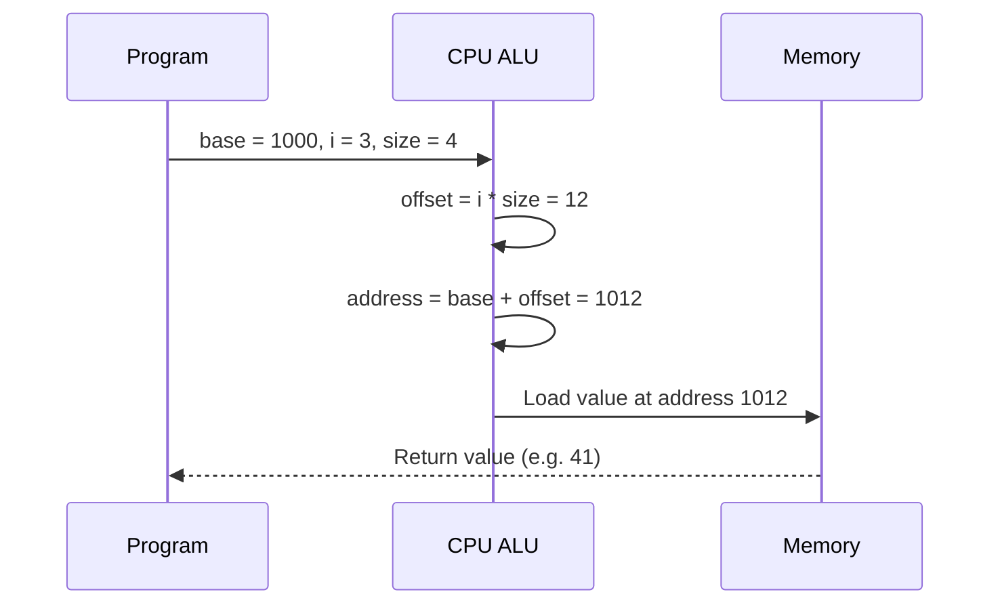
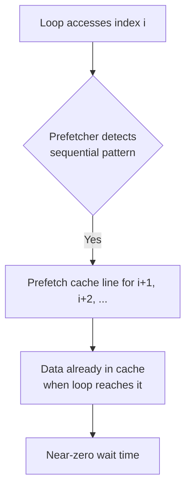
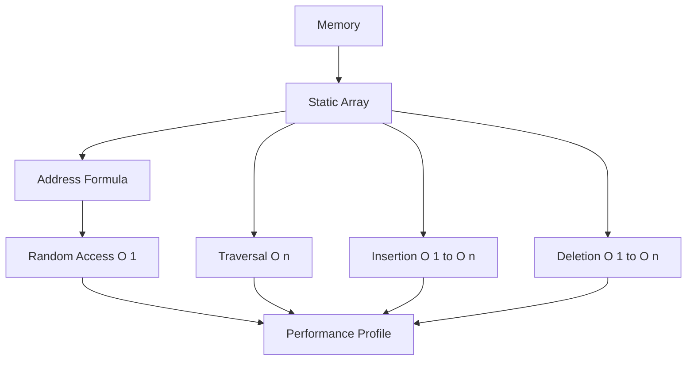

# 04. Static Arrays

> *"Everything is memory. The array is simply the first honest way we learned to talk about it."*

---

## Chapter Roadmap

In the previous chapters, we built the foundation this chapter depends on:

- **Memory Layout** — how a program's memory is organized into segments
- **CPU Memory Access** — how the processor reads and writes bytes
- **Cache** — why memory access is not uniform in cost
- **Addresses** — what a memory address actually represents
- **Contiguous Memory** — why "next to each other" matters
- **Address Arithmetic** — how addresses can be computed, not just stored

Every one of those ideas was preparation. None of them, on their own, gave us a *data structure*. This chapter is where they finally converge into the first true data structure of the book: the **Static Array**.

By the end of this chapter you will be able to answer, from first principles rather than memorization:

- Why arrays are contiguous, and what breaks if they aren't
- Why array elements must be fixed-size
- Why `Array[i]` is O(1) — not "because someone said so," but mechanically
- Why insertion and deletion cost O(n)
- How address calculation actually happens inside the CPU
- Why arrays dominate cache performance benchmarks
- Why the static array's greatest strength — fixed size — is also the seed of its replacement

Let's begin.

---

# 1. Introduction

## 1.1 The Oldest Data Structure

Long before hash tables, trees, heaps, or graphs existed as abstractions, the array already existed — not as an invention, but as a *direct consequence* of how memory works. A computer's RAM is, physically and logically, a giant one-dimensional array of bytes, each identified by a numeric address. The "array" as a data structure is nothing more than us *acknowledging* that fact and using it deliberately.

This is why arrays are not merely "one of many data structures." They are the **substrate** other data structures are built on top of.

> **Engineering Insight**
> A data structure is not a magical container. It is a *policy* for how to use memory. The array is the simplest possible policy: "give me N equal-sized slots, laid out one after another, and let me jump to any of them instantly using arithmetic."

## 1.2 Arrays as the Hidden Engine of Almost Everything

Consider how many "advanced" structures are, underneath, just arrays with rules layered on top:

| Structure | What it really is |
|---|---|
| `Vector` / `ArrayList` / Dynamic Array | A static array that reallocates and copies when full |
| Binary Heap | A static array interpreted as a tree via index arithmetic (`2i+1`, `2i+2`) |
| Hash Table | A static array of buckets, indexed by a hash function instead of a raw index |
| Matrix / 2D Array | A static array reinterpreted with row-major or column-major address math |
| Tensor (ML) | An N-dimensional generalization of the same contiguous-buffer idea |
| Image Buffer | A static array of pixels, each pixel a fixed-size group of bytes (RGB, RGBA) |
| String (in many languages) | A static array of characters/bytes with a length or sentinel |

None of these structures invented a new way of talking to memory. They all speak the *same dialect*: base address + offset. The array is that dialect's grammar.

> **Think Like the CPU**
> The CPU does not know what a "Vector" or a "HashMap" is. It only knows addresses and offsets. Every higher-level structure eventually compiles down to the same instructions an array uses: compute an address, load or store a value. If you understand array address arithmetic deeply, you have already understood 80% of how every other data structure touches memory.

## 1.3 Why This Chapter Matters

Students often meet arrays first and internalize them shallowest. By the time they reach heaps, hash tables, or dynamic arrays, they treat the array as "solved" and stop thinking about it. This is a mistake. Every performance bug involving cache misses, every "why is this O(n) insertion so slow," every "why is my linked list slower than my array even though both are O(n)" — all of it traces back to a precise understanding (or lack of one) of what an array *is* at the memory level.

This chapter builds that precise understanding.

### Mini Summary
Arrays are not "just a beginner topic." They are the physical embodiment of contiguous memory and address arithmetic, and nearly every advanced data structure is an array wearing a costume.

---

# 2. What Is a Static Array?

## 2.1 Formal Definition

> **A Static Array is a fixed-size, contiguous block of memory in which every element occupies the same number of bytes, and each element is accessed by computing its address directly from an index.**

This definition is dense on purpose. Every word in it is load-bearing. Let's take it apart.

## 2.2 Word-by-Word Breakdown

### Static

"Static" means the size is **decided before the array is used**, and does not change during the array's lifetime. Once you allocate an array of 10 integers, it will always occupy space for exactly 10 integers — never 9, never 11 — until it is destroyed and a new array is created.

> **Tip**
> "Static" here refers to *size*, not necessarily *storage duration*. A static array can live on the stack, the heap, or in a global/static memory segment. Don't confuse "Static Array" (fixed capacity) with "static storage duration" (a C/C++ keyword concept from earlier chapters). They are related but not identical ideas.

### Fixed-size

The number of slots is a constant, known at allocation time. This is what makes the entire structure predictable: the compiler or runtime knows *exactly* how much memory to reserve, in advance, with no guesswork.

### Contiguous

Every element sits immediately after the previous one in memory, with no gaps. Element `i` and element `i+1` differ in address by exactly one element's size — never more, never less. This is the property that makes address arithmetic possible at all (we built the theoretical groundwork for this in the "Contiguous Memory" chapter; now we use it).

### Memory

We are talking about physical (or virtual, from the OS's perspective) memory — a linear sequence of addressable bytes. The array does not exist as an abstract idea; it exists as real bytes sitting at real addresses.

### Element

A single logical value stored in the array — an `int`, a `double`, a `struct`, a pixel, a character. The array does not care what the element *means*; it only cares how many bytes it occupies.

### Equal-sized

Every element, regardless of value, occupies the exact same number of bytes. This is not an implementation detail — it is the **load-bearing assumption** that makes O(1) access possible. We will prove this formally in Section 5.

> **Engineering Insight**
> Take away "contiguous" and you lose the ability to predict where element `i` lives. Take away "equal-sized" and you lose the ability to *compute* where element `i` lives even if you know it's contiguous. Both properties are required — neither is optional — for O(1) random access to exist.

## 2.3 A Mental Model

Think of a static array as a **row of identical lockers** bolted to a wall, numbered starting from a known position. If you know:

1. Where locker #0 starts (base address)
2. How wide each locker is (element size)
3. Which locker number you want (index)

...you can walk directly to that locker without checking any of the others. You never "search" for locker #7 — you calculate its position and walk straight there.

This is the single most important intuition to hold onto for the rest of this chapter.

### Mini Summary
A Static Array is a memory promise: "N equal-sized slots, placed back-to-back, whose locations can be calculated instead of searched." Every property — static, fixed-size, contiguous, equal-sized — exists to make that promise mechanically true.


---

# 3. Memory Representation

## 3.1 Visualizing an Array in Memory

Let's ground everything in a concrete example. Suppose we declare an array of 5 integers, and each integer occupies 4 bytes (a common size on most modern architectures). Suppose the array's first byte lives at address `1000`.

```
Index:      0      1      2      3      4
Value:     15     22     31     41     50

Address:  1000   1004   1008   1012   1016
          +----+  +----+  +----+  +----+  +----+
Memory:   | 15 |  | 22 |  | 31 |  | 41 |  | 50 |
          +----+  +----+  +----+  +----+  +----+
```

Notice the addresses: `1000, 1004, 1008, 1012, 1016`. Each jumps by exactly `4` — the size of one `int`. This is not a coincidence; it is the *definition* of contiguity applied to equal-sized elements.

## 3.2 Explaining Every Address

| Index | Value | Address | Why |
|---|---|---|---|
| 0 | 15 | 1000 | Base address — where the array begins |
| 1 | 22 | 1004 | 1000 + (1 × 4) |
| 2 | 31 | 1008 | 1000 + (2 × 4) |
| 3 | 41 | 1012 | 1000 + (3 × 4) |
| 4 | 50 | 1016 | 1000 + (4 × 4) |

Each address is simply the base address plus the index multiplied by the element size. We are previewing Section 5's formula here deliberately — you should already start to feel the pattern before we formalize it.

## 3.3 Why Elements Must Be Contiguous

Imagine, instead, that the operating system scattered these five integers across memory wherever there happened to be free space:

```
15 at address 4021
22 at address 9987
31 at address 1200
41 at address 7333
50 at address 55
```

Now ask yourself: how would you find element `3` (value `41`)? You cannot compute `4021 + 3 × 4`, because that arithmetic assumes the values are laid out in order, one after another. Without contiguity, the only way to find element `3` is to **store a separate pointer for every single element**, turning your "array" into something that behaves more like a linked list — with all of a linked list's costs and none of an array's benefits.

> **Warning**
> A collection of same-typed values scattered non-contiguously in memory, connected by pointers, is *not* an array — no matter what a language chooses to call it. It may look similar on the surface, but it has fundamentally different performance properties. Always ask: "are these bytes actually next to each other?"

## 3.4 Real-World Example

Consider a grayscale image of width `W` and height `H`. Each pixel is one byte (0–255). The entire image is stored as a single contiguous static array of `W × H` bytes. Pixel `(x, y)` lives at:

```
Address(x, y) = BaseAddress + (y × W + x) × 1
```

This is exactly the same idea as our 1D integer array — just with the index computed from two coordinates instead of one. GPUs, image libraries, and video codecs rely on this contiguity for both correctness and raw throughput. A scattered, pointer-chased image buffer would be catastrophically slow to render.

## 3.5 Common Misconception

> **Misconception:** "The array variable stores all the elements."
>
> **Reality:** The array variable stores (or refers to) a *single* base address. Every element's location is *derived*, not stored. The "array" as a named concept in your code is really just a compact way of saying: "start at this address, and I promise the next N × elementSize bytes belong to me, laid out with no gaps."

### Mini Summary
An array in memory is nothing more than a labeled starting point (base address) plus a guarantee of contiguity. Every address after that is *computed*, never separately stored — which is precisely what makes arrays both compact and fast.

---

# 4. Why Arrays Need Fixed Element Sizes

## 4.1 Intuition

If every locker in our locker-row analogy is a different width, you can no longer calculate the position of locker #7 just by multiplying — you'd need to know the exact width of every locker before it. That destroys the entire point of an array: instant, calculable access.

## 4.2 Technical Explanation

Primitive types like `int`, `double`, and `char` have a **fixed, known size in bytes**, defined by the language and the platform's ABI (Application Binary Interface):

| Type | Typical Size (bytes) |
|---|---|
| `char` | 1 |
| `int` | 4 |
| `float` | 4 |
| `double` | 8 |
| `long` (platform-dependent) | 4 or 8 |
| pointer (64-bit system) | 8 |

Because these sizes are fixed, the compiler can bake the element size directly into the address arithmetic at compile time. This is why `int[]`, `double[]`, and `char[]` all support instant indexing.

## 4.3 Why Objects Are Different

Consider a `struct`/class type of variable size — for example, a string with no fixed length, or an object whose fields differ per instance. If element sizes could differ, then to find element `i` you would need to know the *cumulative size of every element before it*, which requires summing — an O(i) operation, not O(1).

This is exactly why languages that allow arrays of "objects" actually store an array of **fixed-size references (pointers)** to those objects, rather than the objects themselves inline:

```
Array of Object References (each reference is a fixed-size pointer, e.g. 8 bytes)

Address:  2000      2008      2016      2024
          +------+  +------+  +------+  +------+
Memory:   | ptr0 |  | ptr1 |  | ptr2 |  | ptr3 |
          +------+  +------+  +------+  +------+
             |         |         |         |
             v         v         v         v
          [Object A] [Object B] [Object C] [Object D]   <- variable sizes, scattered
```

The array itself is still contiguous and fixed-size — but now each "element" is a pointer (always the same size, e.g., 8 bytes on a 64-bit system), not the variable-sized object itself. The object data lives elsewhere, potentially non-contiguous, potentially different sizes.

> **Engineering Insight**
> This is the exact mechanism behind why, in many languages, an "array of objects" gives you worse cache locality than an "array of primitives." You're not iterating over the objects — you're iterating over pointers to objects, then chasing each pointer separately. This pattern is sometimes called "Array of Pointers" versus the more cache-friendly "Array of Structures" or "Structure of Arrays," topics you'll revisit in later performance-oriented chapters.

## 4.4 Why Address Arithmetic Requires Uniform Size

Formally: address arithmetic assumes

```
Address(i) = Address(i - 1) + ElementSize
```

for a *constant* `ElementSize`. If `ElementSize` varied per element, this recurrence would require knowing every previous element's size — turning O(1) access into an O(n) sum. Fixed size isn't a convenience; it's the mathematical precondition for constant-time addressing.

### Mini Summary
Fixed-size elements are what allow address arithmetic to use simple multiplication instead of cumulative summation. Variable-sized data (objects, strings) is handled indirectly, via fixed-size pointers/references, precisely to preserve this property.


---

# 5. Address Calculation

## 5.1 Building the Intuition First

Go back to the locker analogy. To find locker `i`, you need to know three things:

1. Where locker `0` begins (the **base address**)
2. How wide each locker is (the **element size**)
3. Which locker you want (the **index**)

Then the position of locker `i` is simply: walk past `i` lockers, each of width `ElementSize`, starting from the base.

## 5.2 The Formula

$$
\text{Address}(Array[i]) = \text{BaseAddress} + (i \times \text{ElementSize})
$$

This single formula is the mechanical foundation of every array access in every programming language, at every level of the stack, from your source code down to the generated machine instructions.

## 5.3 Breaking Down Each Term

| Term | Meaning |
|---|---|
| `BaseAddress` | The memory address of element `0` — the array's starting point |
| `i` | The index of the element you want to access |
| `ElementSize` | The fixed number of bytes each element occupies |
| `i × ElementSize` | The **offset**, in bytes, from the base to element `i` |
| `BaseAddress + offset` | The final, absolute address of element `i` |

> **Tip**
> The word "offset" will reappear constantly throughout this book. An offset is always a *relative* distance from some reference point. Array indexing is the simplest possible offset calculation you will encounter.

## 5.4 Worked Example 1 — Integers, 0-Based Indexing

Given:
- `BaseAddress = 2000`
- `ElementSize = 4` (an `int`)
- `i = 3`

```
Address(Array[3]) = 2000 + (3 × 4) = 2000 + 12 = 2012
```

## 5.5 Worked Example 2 — Doubles, Different Base

Given:
- `BaseAddress = 5000`
- `ElementSize = 8` (a `double`)
- `i = 5`

```
Address(Array[5]) = 5000 + (5 × 8) = 5000 + 40 = 5040
```

## 5.6 Worked Example 3 — Characters (Bytes)

Given:
- `BaseAddress = 800`
- `ElementSize = 1` (a `char`)
- `i = 10`

```
Address(Array[10]) = 800 + (10 × 1) = 810
```

Since `char` elements are exactly 1 byte, the address offset equals the index directly — a useful special case worth internalizing.

## 5.7 Worked Example 4 — 1-Based Indexing

Not every array convention starts at 0. Some languages and mathematical notations (Fortran, MATLAB, R, and classical algorithm pseudocode) use 1-based indexing, where the first element is `Array[1]`.

The formula must be adjusted so that index `1` maps to offset `0`:

$$
\text{Address}(Array[i]) = \text{BaseAddress} + ((i - 1) \times \text{ElementSize})
$$

Given:
- `BaseAddress = 3000`
- `ElementSize = 4`
- `i = 1` (the first element, 1-based)

```
Address(Array[1]) = 3000 + ((1 - 1) × 4) = 3000 + 0 = 3000
```

And for `i = 4`:

```
Address(Array[4]) = 3000 + ((4 - 1) × 4) = 3000 + 12 = 3012
```

> **Warning**
> Mixing up 0-based and 1-based assumptions is one of the most common sources of off-by-one bugs in all of computer science. The array does not "know" which convention you intend — the formula only produces a correct address if you apply the *correct* offset convention consistently.

## 5.8 Visualizing the Computation



## 5.9 Real-World Example

A video frame buffer of resolution `1920 × 1080`, using 4 bytes per pixel (RGBA), stores pixel `(x, y)` at:

```
Address(x, y) = BaseAddress + ((y × 1920 + x) × 4)
```

Graphics drivers execute *billions* of these calculations per second. The reason this is feasible at all is that the calculation is pure arithmetic — no searching, no branching on data, no pointer chasing. It compiles down to a single multiply-add sequence (often fused into one instruction, e.g. `LEA` on x86).

### Mini Summary
Every array access, in every language, on every platform, reduces to the same formula: `BaseAddress + (index × ElementSize)`. The only variation across conventions is whether indexing starts at 0 or 1, which simply shifts the offset term.

---

# 6. Random Access

## 6.1 Why `Array[i]` Is O(1)

"Random access" means: the cost of accessing element `i` does not depend on `i`, and does not depend on how many elements are in the array. Whether you access element `0` or element `999,999`, the cost is identical — one arithmetic calculation and one memory read.

This is a direct and inevitable consequence of the address formula from Section 5. Since `Address(i) = BaseAddress + i × ElementSize` involves a fixed number of operations (one multiplication, one addition) *regardless of the value of `i`*, the time complexity is constant: **O(1)**.

## 6.2 There Is No Searching

This point cannot be overstated, because it is where most conceptual confusion originates. Accessing `Array[500000]` does **not** involve scanning through elements `0` through `499999` to "get there." The CPU does not walk the array. It computes one address and jumps straight to it — exactly like knowing a house's street address lets you drive directly there without visiting every house on the street first.

> **Misconception Alert**
> Many students mentally simulate array access as "the CPU walks along the array counting until it reaches index i." This is **false**. It might be true for a *linked list* (where there's no address formula, only "follow the next pointer"), but it is never true for a static array.

## 6.3 CPU Execution, Step by Step

At the machine level, an array access like `array[i]` typically compiles to something conceptually like:

```
1. Load base address of `array`         (from register/stack)
2. Load value of `i`                    (from register/stack)
3. Multiply i by ElementSize            (shift or multiply instruction)
4. Add result to base address           (single ADD or fused LEA instruction)
5. Dereference the computed address     (single MOV / load instruction)
```

On many architectures, steps 3 and 4 collapse into a **single instruction** (for example, x86's `LEA` — "Load Effective Address" — or an addressing mode that natively supports `base + index*scale`). This means array indexing can be, quite literally, one instruction away from the final memory access.



## 6.4 Visualizing "Jumping" vs "Walking"

```
Linked List access (index 3):           Array access (index 3):

[0] -> [1] -> [2] -> [3]                Address = Base + 3*size
 walk   walk   walk  FOUND               jump directly --------> [3]

Cost: O(n) — must traverse              Cost: O(1) — direct calculation
```

## 6.5 Real-World Example

A database engine storing fixed-width rows in a table file can compute the byte offset of row `N` directly (`RowSize × N`), allowing it to `seek()` straight to that row on disk without scanning previous rows — the same random-access principle applied at the filesystem level, not just in RAM.

### Mini Summary
Random access is O(1) because the address formula is a constant amount of arithmetic, independent of index or array size. There is no traversal, no comparison, no searching — only calculation followed by a single memory access.


---

# 7. Core Operations

For each operation below we cover: definition, memory visualization, step-by-step execution, complexity, cache behavior, and a real-world example.

## 7.1 Access

**Definition:** Retrieve the value stored at a given index.

**Memory Visualization:**

```
Address:   1000   1004   1008   1012   1016
          +----+  +----+  +----+  +----+  +----+
Memory:   | 15 |  | 22 |  | 31 |  | 41 |  | 50 |
          +----+  +----+  +----+  +----+  +----+
                              ^
                        Array[3] -> 41
```

**Step-by-step execution:**
1. Compute `Address(3) = 1000 + 3×4 = 1012`
2. Load the 4 bytes at address `1012`
3. Interpret those bytes as an `int` → `41`

**Complexity:** O(1) — always, regardless of array size or index.

**Cache behavior:** Excellent. A single access typically pulls an entire cache line (commonly 64 bytes) into cache — meaning several *neighboring* elements are loaded "for free" alongside the one you asked for.

**Real-world example:** Reading a specific frame's timestamp from a fixed-size array of video frame metadata, by index, in O(1), regardless of video length.

---

## 7.2 Update

**Definition:** Overwrite the value stored at a given index with a new value.

**Memory Visualization:**

```
Before:  +----+  +----+  +----+  +----+  +----+
         | 15 |  | 22 |  | 31 |  | 41 |  | 50 |
         +----+  +----+  +----+  +----+  +----+

Array[2] = 99

After:   +----+  +----+  +----+  +----+  +----+
         | 15 |  | 22 |  | 99 |  | 41 |  | 50 |
         +----+  +----+  +----+  +----+  +----+
```

**Step-by-step execution:**
1. Compute `Address(2) = 1000 + 2×4 = 1008`
2. Write the new value's bytes directly to address `1008`, overwriting the old value

**Complexity:** O(1) — same address computation as Access, followed by a store instead of a load.

**Cache behavior:** Excellent for the same reason as Access; if the line is already cached from a previous read, the update is essentially free beyond the store instruction itself.

**Real-world example:** Updating a single pixel's color value in an image buffer, or a single player's health value in a fixed-size array of game entities.

---

## 7.3 Traversal

**Definition:** Visit every element of the array, typically in index order.

**Memory Visualization:**

```
+----+  +----+  +----+  +----+  +----+
| 15 |  | 22 |  | 31 |  | 41 |  | 50 |
+----+  +----+  +----+  +----+  +----+
  ^        ^       ^       ^       ^
 step1   step2   step3   step4   step5
```

**Step-by-step execution:**
1. Start at index `0`
2. Access the current index
3. Increment index by 1
4. Repeat until index equals array length

**Complexity:** O(n) — every element must be visited exactly once.

**Cache behavior:** This is where arrays truly shine. Because traversal accesses consecutive addresses, the CPU's **hardware prefetcher** detects the sequential pattern and proactively loads upcoming cache lines *before* they are requested. Sequential traversal of an array is close to the fastest possible way to move through memory.

**Real-world example:** Summing every value in a fixed array of sensor readings to compute an average, once per second, in an embedded system.

---

## 7.4 Search (Unsorted)

**Definition:** Find whether a target value exists in the array (and possibly its index), with no assumption about ordering.

**Memory Visualization:**

```
Target = 41

+----+  +----+  +----+  +----+  +----+
| 15 |  | 22 |  | 31 |  | 41 |  | 50 |
+----+  +----+  +----+  +----+  +----+
  no      no      no    FOUND!
```

**Step-by-step execution:**
1. Start at index `0`
2. Compare current element to target
3. If match, return index (or true)
4. Otherwise move to next index
5. If end of array reached with no match, report "not found"

**Complexity:**
- Worst case: O(n) — target is last, or absent entirely
- Average case: O(n) — expected ~n/2 comparisons
- Best case: O(1) — target happens to be at index 0

**Cache behavior:** Still sequential, still prefetch-friendly — search over an unsorted array is far faster in practice than its Big-O alone would suggest, purely because of memory locality.

**Real-world example:** Scanning a small fixed-size array of recent error codes to check if a specific code has occurred.

> **Performance Note**
> If the array is *sorted*, binary search reduces this to O(log n). We are deliberately not covering binary search in this chapter — it belongs to the Searching Algorithms chapter later in this book — but it's worth remembering that sortedness is what unlocks that improvement, not the array structure itself.

---

## 7.5 Insertion

**Definition:** Place a new value at a specific index, shifting subsequent elements to make room.

**Memory Visualization:**

```
Before (insert 99 at index 2):
+----+  +----+  +----+  +----+  +----+
| 15 |  | 22 |  | 31 |  | 41 |  | 50 |
+----+  +----+  +----+  +----+  +----+
  0       1       2       3       4

Step 1: Shift elements at index >= 2 one slot to the right
+----+  +----+  +----+  +----+  +----+  +----+
| 15 |  | 22 |  | __ |  | 31 |  | 41 |  | 50 |
+----+  +----+  +----+  +----+  +----+  +----+

Step 2: Write new value into the freed slot
+----+  +----+  +----+  +----+  +----+  +----+
| 15 |  | 22 |  | 99 |  | 31 |  | 41 |  | 50 |
+----+  +----+  +----+  +----+  +----+  +----+
```

**Step-by-step execution:**
1. Ensure there is free capacity at the end (a static array technically has none — insertion into a truly full static array is impossible without reallocation, discussed in Section 13)
2. Starting from the last element, shift each element one position to the right, working backward to avoid overwriting values before they're copied
3. Write the new value into the now-empty target index

**Complexity:**
- Worst case: O(n) — inserting at index 0 shifts every other element
- Best case: O(1) — inserting at the very end (if space is available)
- Average case: O(n) — proportional to how many elements lie after the insertion point

**Cache behavior:** The shifting step is still sequential memory movement, so it benefits from locality — but it is fundamentally doing far more work (n memory writes) than a simple access or update.

**Real-world example:** Inserting a new score into a fixed-size, position-sensitive leaderboard array to keep it ordered.

---

## 7.6 Deletion

**Definition:** Remove the value at a specific index, shifting subsequent elements left to close the gap.

**Memory Visualization:**

```
Before (delete index 1, value 22):
+----+  +----+  +----+  +----+  +----+
| 15 |  | 22 |  | 31 |  | 41 |  | 50 |
+----+  +----+  +----+  +----+  +----+
  0       1       2       3       4

Step 1: Shift elements at index > 1 one slot to the left
+----+  +----+  +----+  +----+  +----+
| 15 |  | 31 |  | 41 |  | 50 |  | __ |
+----+  +----+  +----+  +----+  +----+

Step 2: Logical size decreases by 1 (last slot becomes unused/garbage)
```

**Step-by-step execution:**
1. Locate the index to delete (O(1) if index known, O(n) if searching by value first)
2. Shift every subsequent element one position to the left
3. Optionally clear or ignore the now-unused final slot

**Complexity:**
- Worst case: O(n) — deleting index 0 shifts every remaining element
- Best case: O(1) — deleting the last element requires no shifting
- Average case: O(n)

**Cache behavior:** Same as insertion — sequential shifting is cache-friendly *per operation*, but the operation still touches O(n) memory locations in the worst case.

**Real-world example:** Removing a completed task from a fixed-size array-backed task queue, shifting remaining tasks forward.

### Mini Summary
Access and Update are O(1) because they only need address arithmetic. Traversal, Search, Insertion, and Deletion are O(n) because they inherently require visiting or moving multiple elements — the array's structure doesn't change this, but its contiguity makes the O(n) work as fast as physically possible on real hardware.


---

# 8. Complexity Analysis

## 8.1 The Complete Table

| Operation | Best Case | Average Case | Worst Case | Why |
|---|---|---|---|---|
| Access | O(1) | O(1) | O(1) | Direct address computation, independent of position or size |
| Update | O(1) | O(1) | O(1) | Same address computation, followed by a write instead of a read |
| Traversal | O(n) | O(n) | O(n) | Must visit every element exactly once, no shortcut exists |
| Search (unsorted) | O(1) | O(n) | O(n) | Best case: target at index 0. Worst/avg: no way to skip elements without order |
| Insertion | O(1) | O(n) | O(n) | Best case: insert at end. Worst case: insert at index 0, shifting all elements |
| Deletion | O(1) | O(n) | O(n) | Best case: delete last element. Worst case: delete index 0, shifting all elements |

## 8.2 Why Each Complexity Exists — Not Just What It Is

**Access / Update are O(1) because they are *arithmetic*, not *traversal*.** The formula `BaseAddress + i × ElementSize` takes the same number of CPU cycles whether `i` is 0 or 10 million. There is nothing in the array's structure that scales with position.

**Traversal is O(n) because visiting "every element" is, definitionally, a task whose size equals the number of elements.** No data structure — array, tree, hash table, anything — can visit n elements in fewer than n steps. This is a floor imposed by the problem itself, not by the array.

**Search is O(n) in an unsorted array because there is no information to eliminate candidates.** Without an ordering guarantee, the only sound strategy is to check elements one at a time until you find a match or exhaust the array. The best case (O(1)) is a lucky accident of where the target happens to sit, not a guaranteed property.

**Insertion and Deletion are O(n) because contiguity is a promise the array must continuously keep.** If you insert at index 0 and don't shift everything else, you no longer have a contiguous array — you have a contiguous array with a hole, or an overlap. Maintaining "no gaps, no overlaps" after every mutation is the *price* of the very property that makes Access O(1). You cannot get O(1) access **and** O(1) arbitrary insertion from the same fixed-layout structure — this tradeoff is fundamental, not accidental, and you'll see it re-appear when we study linked lists (which flip the tradeoff the other direction).

> **Engineering Insight**
> Every data structure is a tradeoff, not a free lunch. The array trades expensive insertion/deletion for cheap, guaranteed-constant access. Later chapters will introduce structures that make the opposite trade. Understanding *why* the array's costs exist prepares you to recognize the same tension everywhere else in this book.

### Mini Summary
O(1) operations (Access, Update) exist because they rely purely on arithmetic. O(n) operations (Traversal, Search, Insertion, Deletion) exist because they require visiting or shifting a number of elements proportional to the array's size or the operation's position — a direct consequence of maintaining strict contiguity.

---

# 9. Why Insertions Are Expensive

## 9.1 Visualizing the Shift

Suppose we have this array and want to insert `100` at index `1`:

```
Before:
Index:     0     1     2     3     4
Value:    10    20    30    40    50
```

To make room, every element from index 1 onward must move one slot to the right — and this must happen **from right to left**, so we don't overwrite values before copying them.

```
Step 1 — shift index 4 -> 5:
Index:     0     1     2     3     4     5
Value:    10    20    30    40    50    50   <- (temporary duplicate)

Step 2 — shift index 3 -> 4:
Index:     0     1     2     3     4     5
Value:    10    20    30    40    40    50

Step 3 — shift index 2 -> 3:
Index:     0     1     2     3     4     5
Value:    10    20    30    30    40    50

Step 4 — shift index 1 -> 2:
Index:     0     1     2     3     4     5
Value:    10    20    20    30    40    50

Step 5 — write 100 at index 1:
Index:     0     1     2     3     4     5
Value:    10   100    20    30    40    50
```

## 9.2 Counting the Copies

If the array has `n` elements and we insert at index `k`, the number of elements that must shift is:

$$
\text{ElementsShifted} = n - k
$$

- Inserting at the **end** (`k = n`): 0 elements shift → O(1)
- Inserting at the **beginning** (`k = 0`): all `n` elements shift → O(n)
- Inserting in the **middle** (`k = n/2`): about `n/2` elements shift → still O(n) asymptotically

## 9.3 Why This Cost Is Unavoidable

The array's entire value proposition — O(1) access via address arithmetic — depends on the invariant that element `i` always sits at `BaseAddress + i × ElementSize`. If we insert a new element at index 1 *without* shifting everything after it, then element 2 no longer sits where the formula expects it to. The formula would break for every element after the insertion point. Shifting is the *cost of preserving the formula's correctness*.

> **Real World**
> This is exactly why inserting into the front of a large `ArrayList` (Java), `std::vector` (C++), or Python `list` is a well-known performance trap. It's not an implementation flaw — it's an unavoidable consequence of contiguous, fixed-formula storage. Experienced engineers reach for a different structure (e.g., a deque or linked list) specifically when frequent front-insertions are expected.

### Mini Summary
Insertion cost is proportional to the number of elements *after* the insertion point, because every one of them must physically move to preserve the array's contiguous, formula-driven layout. Inserting at the end is cheap; inserting at the front is maximally expensive.

---

# 10. Why Deletions Are Expensive

## 10.1 Visualizing the Left Shift

Suppose we delete the element at index `1` (value `20`) from:

```
Before:
Index:     0     1     2     3     4
Value:    10    20    30    40    50
```

Every element after index 1 must shift one slot to the **left**:

```
Step 1 — shift index 2 -> 1:
Index:     0     1     2     3     4
Value:    10    30    30    40    50

Step 2 — shift index 3 -> 2:
Index:     0     1     2     3     4
Value:    10    30    40    40    50

Step 3 — shift index 4 -> 3:
Index:     0     1     2     3     4
Value:    10    30    40    50    50

Final logical array (size reduced by 1):
Index:     0     1     2     3
Value:    10    30    40    50
```

## 10.2 Counting the Copies

For an array of `n` elements, deleting index `k` requires shifting:

$$
\text{ElementsShifted} = n - k - 1
$$

- Deleting the **last** element (`k = n - 1`): 0 elements shift → O(1)
- Deleting the **first** element (`k = 0`): `n - 1` elements shift → O(n)

## 10.3 Cache Effects

Unlike insertion (which shifts right-to-left to avoid overwriting), deletion shifts **left-to-right**, and this direction is also sequential and prefetch-friendly. The *pattern* of memory access remains cache-optimal even though the *volume* of work is O(n). This is an important nuance:

> **Performance Note**
> "O(n)" tells you the *count* of operations, not how *fast* those operations run in absolute time. A cache-friendly O(n) shift over a contiguous array can be an order of magnitude faster in wall-clock time than an O(n) traversal of a linked list, purely because of memory locality. Big-O is not the whole performance story — Section 11 makes this precise.

### Mini Summary
Deletion, like insertion, costs O(n) in the worst case because closing the resulting gap requires shifting every subsequent element left by one position, in order to preserve the array's strict contiguity invariant.


---

# 11. Cache Friendliness

## 11.1 Spatial Locality

**Spatial locality** is the principle that if a program accesses a memory address, it is likely to access nearby addresses soon after. Arrays are the textbook embodiment of this principle: accessing `Array[i]` almost always precedes accessing `Array[i+1]` in typical code (loops, traversal, summation, searching).

## 11.2 Sequential Access and Cache Lines

Modern CPUs don't fetch memory one byte, or even one element, at a time. They fetch in fixed-size chunks called **cache lines** — commonly 64 bytes. When you read `Array[0]`, the CPU doesn't just load 4 bytes for one `int`; it loads the entire 64-byte cache line containing it, which — for a 4-byte `int` array — includes roughly the next **15 elements** for free.

```
Cache Line (64 bytes) containing indices 0–15 of an int[] array:

+---+---+---+---+---+---+---+---+---+---+---+---+---+---+---+---+
| 0 | 1 | 2 | 3 | 4 | 5 | 6 | 7 | 8 | 9 |10 |11 |12 |13 |14 |15 |
+---+---+---+---+---+---+---+---+---+---+---+---+---+---+---+---+
  ^
  Accessing index 0 pulls this ENTIRE line into cache — indices 1-15
  are now "free" for the CPU to access without hitting main memory again.
```

## 11.3 Prefetching

Beyond the passive benefit of cache lines, modern CPUs include a **hardware prefetcher** that detects sequential access patterns (like a simple `for` loop over an array) and proactively fetches *upcoming* cache lines into cache **before** the program even asks for them. Sequential array traversal is the single easiest pattern for a prefetcher to recognize and exploit.



## 11.4 Array vs Linked List — Same Big-O, Different Reality

Both a full array traversal and a full linked-list traversal are, formally, **O(n)**. Big-O analysis alone suggests they should be roughly comparable. In practice, they are not remotely comparable:

| Property | Array | Linked List |
|---|---|---|
| Memory layout | Contiguous | Scattered (each node separately allocated) |
| Cache line reuse | High — many elements per line | Low — usually 1 useful value per cache line fetched |
| Prefetch-friendly | Yes | No — next node's address is unpredictable until dereferenced |
| Pointer chasing | None | Required at every step |
| Big-O of traversal | O(n) | O(n) |
| **Real-world speed** | **Often 5–50× faster** | Significantly slower in practice |

```
Array traversal — memory access pattern:
[0][1][2][3][4][5][6][7][8][9]   <- one straight sweep, cache-friendly

Linked List traversal — memory access pattern:
[Node A]---->[Node C]---->[Node B]---->[Node D]
 addr 4021     addr 1200     addr 9987     addr 55
   (scattered across memory — every hop can be a cache miss)
```

> **Engineering Insight**
> Big-O complexity measures the *number of operations*, not the *cost per operation*. A cache miss can cost 100–300+ CPU cycles, while a cache hit costs roughly 1–4 cycles. If a linked list traversal causes a cache miss on nearly every node, its "O(n)" is doing far more real work per step than an array's "O(n)." This is why experienced engineers say: **"Big-O tells you how it scales, not how fast it runs."**

## 11.5 Real-World Example

Numerical computing libraries (NumPy, BLAS, linear algebra kernels) are built almost entirely around dense, contiguous arrays specifically to exploit this cache and prefetch behavior. A naive linked-list-based matrix would be orders of magnitude slower than a contiguous array-based matrix, even though both could theoretically express the "same" mathematical object.

### Mini Summary
Arrays are cache-friendly because their contiguous layout means one memory fetch loads many usable elements at once, and their predictable access pattern lets hardware prefetchers work proactively. This is why arrays consistently outperform pointer-based structures with identical Big-O complexity.

---

# 12. Advantages

## 12.1 Fast Random Access
Address arithmetic makes any element reachable in O(1), independent of array size — a property few other structures offer natively.

## 12.2 Simple Memory Layout
There is no metadata, no pointers between elements, no bookkeeping beyond a base address, an element size, and a length. The layout is as close to "raw memory" as a data structure can get.

## 12.3 Excellent Cache Performance
As detailed in Section 11, contiguity means the hardware's caching and prefetching mechanisms work at maximum efficiency, often making array-based algorithms dramatically faster in wall-clock time than their Big-O complexity alone would predict.

## 12.4 Low Overhead
Each element costs *exactly* its own size — no extra pointers (typically 8 bytes each on 64-bit systems) per element, no per-node allocation overhead, no fragmentation between elements.

```
Array of 4 ints:            Linked list of 4 ints:
16 bytes total               4 × (4 bytes data + 8 bytes pointer + allocator overhead)
                              = potentially 60-100+ bytes total
```

## 12.5 Predictable Performance
Because access time never depends on position or history, arrays offer extremely predictable latency — a property that matters enormously in real-time systems, embedded firmware, and performance-critical inner loops.

## 12.6 Easy Address Computation
The formula from Section 5 is trivial to implement, trivial for a compiler to optimize (often into a single instruction), and easy to reason about — both for programmers and for compilers performing optimizations like loop unrolling or vectorization.

> **Tip**
> Many advanced CPU features — SIMD vector instructions, hardware prefetching, cache-line alignment optimizations — are specifically designed around contiguous, fixed-stride data. Arrays are, in a real sense, the data structure the hardware was *designed* to be good at.

### Mini Summary
Arrays win on access speed, memory efficiency, predictability, and hardware alignment — advantages that stem directly from contiguity and fixed element size, not from any clever algorithmic trick.

---

# 13. Limitations

## 13.1 Fixed Capacity
Once allocated, a static array cannot grow or shrink. If you need a 6th slot in a 5-element array, there is no operation that expands it in place — you must allocate an entirely new, larger block and copy everything over (a preview of the motivation for Dynamic Arrays, coming in Chapter 5).

## 13.2 Expensive Insertion
As shown in Section 9, inserting anywhere but the end costs O(n) due to the shifting required to preserve contiguity.

## 13.3 Expensive Deletion
As shown in Section 10, deleting anywhere but the end costs O(n) for the same structural reason.

## 13.4 Need for Contiguous Memory
The operating system must find a single unbroken block of memory large enough for the entire array. As arrays grow large, finding such a block becomes harder, especially in a fragmented address space.

## 13.5 Large Allocations May Fail
Even if the *total* free memory in a system exceeds what an array needs, allocation can fail if no single contiguous region is large enough. This is fundamentally different from structures like linked lists, which can succeed using many small, scattered allocations even under fragmentation.

```
Fragmented Memory:
[Free 10KB][Used][Free 8KB][Used][Free 12KB][Used][Free 6KB]

Total free memory: 36 KB
Largest contiguous free block: 12 KB

Requesting a 20KB static array -> FAILS, even though 36KB is technically free.
```

## 13.6 Memory Waste
If a static array is allocated larger than needed "just in case," the unused capacity is wasted memory that cannot be reclaimed or used for anything else until the array itself is destroyed or resized.

> **Warning**
> Over-allocating "to be safe" is a common beginner habit that trades a small convenience for real, measurable memory waste — especially significant in memory-constrained environments like embedded systems.

### Mini Summary
The array's rigid, fixed-size, contiguous nature — the very source of its speed — is also the source of its biggest weaknesses: it cannot grow, it resists mid-array mutation, and it demands a single unbroken region of memory that may not always be available.


---

# 14. Static Arrays Across Languages

## 14.1 Which Languages Have True Static Arrays?

A "true" static array, in the sense used throughout this chapter, is a fixed-size, contiguous, stack-or-heap-allocated block with compile-time-known (or explicitly fixed) size and no hidden resizing logic.

| Language | True Static Array? | Notes |
|---|---|---|
| C | Yes | `int arr[5];` is a genuine fixed-size contiguous block, often stack-allocated |
| C++ | Yes | `int arr[5];` and `std::array<int, 5>` are true static arrays; `std::vector` is NOT (it's dynamic) |
| Java | Partially | `int[] arr = new int[5];` is fixed-size and contiguous, but always heap-allocated with a header (length, type info) |
| Python | No (simulated) | `list` is a dynamic, resizable array-like structure; there is no built-in fixed-size primitive array in ordinary usage (the `array` module offers something closer, but even it can resize) |
| JavaScript | No (simulated) | `Array` is dynamic and resizable by default; `TypedArray` (e.g., `Int32Array`) is the closer equivalent to a true static array |

## 14.2 Explaining the Differences

**C and C++** give programmers the most direct access to the concept described in this chapter — an array declared with a fixed size is genuinely a contiguous block with no hidden metadata beyond what you explicitly track (size is usually not even stored automatically; `sizeof` at compile time, or a separately tracked variable, is used).

**Java** arrays are fixed in length once created — you truly cannot resize a Java array object — but they always live on the heap and carry a small object header (containing type information and the length), which is more overhead than a raw C array but still far closer to a "true" static array than something like an `ArrayList`.

**Python's `list`** is not a static array in this chapter's sense at all — it is a dynamic array (covered in the next chapter) that automatically grows as needed. True fixed-size, low-level arrays exist in Python only through specialized modules (`array`, or NumPy's `ndarray`, which is fixed-size *per allocation* but can be reallocated to a new size, unlike a raw C array).

**JavaScript's `Array`** is, by default, a dynamic, resizable, and even sparse structure — closer to a hybrid of array and hash map internally, depending on the engine. `TypedArray` variants (`Int32Array`, `Float64Array`, etc.) are the actual fixed-size, contiguous, uniformly-typed structures that match this chapter's definition.

## 14.3 Comparison Table

| Feature | C `int arr[5]` | C++ `std::array<int,5>` | Java `int[]` | Python `list` | JS `Array` |
|---|---|---|---|---|---|
| Fixed size | Yes | Yes | Yes | No | No |
| Contiguous | Yes | Yes | Yes | Mostly (of pointers for objects) | Engine-dependent |
| Bounds checking | No | Optional (`.at()`) | Yes (runtime exception) | Yes | Yes |
| Auto-resizing | No | No | No | Yes | Yes |
| Stores length | No (programmer tracks it) | Yes (compile-time) | Yes (`.length`) | Yes (`len()`) | Yes (`.length`) |
| True static array? | Yes | Yes | Yes (fixed-length heap array) | No | No (unless TypedArray) |

> **Real World**
> When a language's "array" auto-resizes, you are actually using a *Dynamic Array* — the subject of the very next chapter — even if the language calls it "array." Recognizing this distinction is essential; conflating the two is one of the most common sources of confusion when reasoning about performance across languages.

### Mini Summary
C and C++ offer arrays that match this chapter's definition exactly. Java's arrays are fixed-length but heap-allocated with minor overhead. Python's `list` and JavaScript's default `Array` are dynamic structures wearing the name "array," and only specialized typed variants in those languages behave as true static arrays.

---

# 15. Real World Applications

Static arrays are not a classroom abstraction — they are load-bearing infrastructure across nearly every domain of computing.

**Operating Systems** — Process tables, file descriptor tables, and page tables are frequently implemented (at least in part) as fixed-size arrays indexed directly by ID, giving O(1) lookup of a process or file by its identifier.

**Machine Learning** — Model weights, activation buffers, and training batches are stored as dense, contiguous tensors — effectively multi-dimensional static arrays — because matrix multiplication throughput depends heavily on cache-friendly, contiguous memory access.

**Graphics** — Vertex buffers, texture data, and framebuffers are static arrays of fixed-size elements (positions, colors, pixels) precisely so the GPU can compute addresses and stream data with minimal overhead.

**Image Processing** — As discussed in Section 3.4, an image is fundamentally a 2D static array flattened into contiguous 1D memory, indexed via `y × width + x`.

**Databases** — Fixed-width row storage formats compute a row's disk offset directly from its row number, enabling extremely fast random-access reads without scanning.

**Game Engines** — Entity-Component-System (ECS) architectures deliberately store component data in flat, contiguous arrays ("Structure of Arrays") to maximize cache locality during per-frame updates over thousands of entities.

**Compilers** — Symbol tables, instruction buffers, and fixed-size lookup tables (e.g., opcode dispatch tables) rely on array indexing for O(1) access during parsing and code generation.

**Networking** — Fixed-size packet buffers and protocol header fields are laid out as static, fixed-offset structures, allowing routers and network stacks to parse headers via direct offset access rather than scanning.

**Scientific Computing** — Simulation grids (finite element meshes, fluid dynamics cells) are stored as large contiguous arrays so that neighboring cells — which are accessed together constantly — also sit near each other physically in memory.

**Embedded Systems** — With extremely limited RAM and no dynamic allocator in many cases, embedded firmware relies heavily on fixed-size static arrays declared at compile time, since their memory footprint is exactly known and predictable — critical for systems that cannot tolerate allocation failure at runtime.

> **Engineering Insight**
> Notice the pattern: every one of these domains cares about **predictability** and **raw throughput**. Static arrays are chosen specifically where "I know exactly how much memory this needs, and I need to access it as fast as physically possible" — the two properties this entire chapter has been building toward.

### Mini Summary
From operating system kernels to GPUs to embedded firmware, static arrays remain the default choice whenever a system needs predictable memory usage and maximum access speed — which is to say, almost everywhere performance genuinely matters.


---

# 16. Common Misconceptions

### Misconception 1: "Arrays grow automatically."
**False.** A *static* array's size is fixed at allocation and never changes. What most people picture — a collection that grows as you add elements — is a Dynamic Array (next chapter), which internally allocates a *new*, larger static array and copies the old data over. The "growth" is an illusion built on top of fixed-size arrays, not a property of arrays themselves.

### Misconception 2: "Arrays know their own size."
**Partially false, and language-dependent.** A raw C array does **not** inherently know its own length — the programmer must track it separately (or rely on `sizeof` at compile time for stack arrays). Higher-level languages like Java or Python attach a length field to the array object, but this is *metadata added by the language*, not an inherent property of contiguous memory itself.

### Misconception 3: "The array index stores a memory address."
**False.** The index is just a number (`0, 1, 2, ...`). It does not "point to" or "contain" an address — the address is *computed* fresh, every time, using the formula from Section 5. No address is stored per index anywhere.

### Misconception 4: "Array lookup searches memory."
**False.** As established in Section 6, `Array[i]` involves zero searching. It is a direct arithmetic calculation followed by a single memory access — this is precisely what makes it O(1) rather than O(n).

### Misconception 5: "Arrays can contain variable-sized objects directly."
**False**, in the sense implied. As shown in Section 4.3, when a language appears to let you build an "array of objects," it is actually storing a fixed-size array of *references/pointers* to those objects — the objects themselves, which may vary in size, live elsewhere. The array itself is still uniform and fixed-size internally.

> **Warning**
> These misconceptions are dangerous specifically because code that relies on them often *appears* to work — until it hits a large dataset, a tight performance budget, or a memory-constrained environment, at which point the false mental model produces a bug or a performance cliff that's hard to diagnose without the correct underlying picture.

### Mini Summary
Every one of these misconceptions comes from confusing *language convenience features* (auto-tracked length, dynamic resizing, object references) with the *actual mechanical behavior* of contiguous, fixed-size memory. Keep the memory model in Section 3 and Section 5 as your source of truth.

---

# 17. Interview Insights

## 17.1 Capacity vs Size
A recurring source of confusion in interviews: **capacity** is how many slots the underlying array physically has; **size** (or "length" in common usage) is how many of those slots are currently considered "in use" by the logical structure built on top. A raw static array typically has capacity == size always (every slot is "in use" by definition), but this distinction becomes critical once you study Dynamic Arrays, where capacity can exceed size.

## 17.2 "Why Is Insertion O(n)?" — The Answer Interviewers Want
Weak answer: *"Because you have to shift elements."*
Strong answer: *"Because the array's O(1) access relies on the invariant that element i always sits at `Base + i × ElementSize`. Inserting in the middle without shifting would break that invariant for every subsequent element, so shifting is mandatory to preserve correctness — and the number of elements shifted is proportional to how many elements come after the insertion point, giving O(n) in the worst case."*

The strong answer demonstrates understanding of *why*, not just *what* — exactly the depth this chapter has been building.

## 17.3 "Why Is Access O(1)?" — The Answer Interviewers Want
Weak answer: *"Because arrays are fast."*
Strong answer: *"Because element addresses are computed via `Base + i × ElementSize`, a fixed amount of arithmetic regardless of array size or index value — no traversal or comparison is required, unlike structures where you must follow references to reach a given position."*

## 17.4 Arrays vs Linked Lists — The Classic Comparison

| Property | Array | Linked List |
|---|---|---|
| Access by index | O(1) | O(n) |
| Insertion at front | O(n) | O(1) |
| Insertion at end | O(1) amortized (dynamic) / impossible (static, full) | O(1) (with tail pointer) |
| Memory overhead per element | None beyond the element itself | Extra pointer(s) per node |
| Cache performance | Excellent | Poor |
| Memory layout | Contiguous | Scattered |

> **Interview Tip**
> When asked "array or linked list — which is better?", the strongest answer is never "array" or "linked list" in isolation — it's identifying *which operations dominate* in the actual use case, then choosing based on the tradeoffs in Section 8 and this table. Interviewers are testing whether you understand the *tradeoff*, not whether you've memorized a "correct" answer.

### Mini Summary
Interviewers probe whether you understand *mechanism*, not just memorized complexity labels. Being able to derive "why" from the address formula and the contiguity invariant — rather than reciting Big-O from memory — is what separates a strong answer from a shallow one.


---

# 18. Think Like the CPU

In this section, we perform several full walkthroughs: given a base address, element size, and index, we calculate the address manually, then simulate the CPU steps required to actually fetch the value.

## 18.1 Walkthrough 1

**Given:**
- `BaseAddress = 4096`
- `ElementSize = 4` bytes (`int`)
- `Index = 7`

**Manual calculation:**
```
Offset  = Index × ElementSize = 7 × 4 = 28
Address = BaseAddress + Offset = 4096 + 28 = 4124
```

**CPU simulation:**
```
1. Load i = 7 into register R1
2. Load ElementSize = 4 into register R2  (often a compile-time constant, so this step may not need a real load)
3. R3 = R1 * R2               -> R3 = 28
4. Load BaseAddress = 4096 into register R4
5. R5 = R4 + R3                -> R5 = 4124        (this step is often a single LEA on x86)
6. Load 4 bytes from memory address R5 into register R6
7. R6 now holds Array[7]
```

## 18.2 Walkthrough 2

**Given:**
- `BaseAddress = 10000`
- `ElementSize = 8` bytes (`double`)
- `Index = 12`

**Manual calculation:**
```
Offset  = 12 × 8 = 96
Address = 10000 + 96 = 10096
```

**CPU simulation:**
```
1. R1 = 12                      (index)
2. R2 = 8                       (element size, compile-time constant)
3. R3 = R1 * R2 = 96            (often computed via a shift: 12 << 3, since 8 = 2^3)
4. R4 = 10000                   (base address)
5. R5 = R4 + R3 = 10096
6. Load 8 bytes at address 10096 into register R6
7. R6 now holds Array[12]
```

> **Tip**
> Multiplying by a power of two (2, 4, 8, 16...) can be replaced by a bit-shift instruction, which is typically faster than a general multiply. Compilers apply this optimization automatically for array indexing whenever the element size is a power of two — which covers the vast majority of primitive types.

## 18.3 Walkthrough 3 — 1-Based Indexing

**Given:**
- `BaseAddress = 500`
- `ElementSize = 2` bytes (a 16-bit `short`)
- `Index = 6` (1-based)

**Manual calculation:**
```
Offset  = (6 - 1) × 2 = 10
Address = 500 + 10 = 510
```

**CPU simulation:**
```
1. R1 = 6                       (1-based index)
2. R1 = R1 - 1 = 5               (convert to 0-based offset count)
3. R2 = 2                       (element size)
4. R3 = R1 * R2 = 10
5. R4 = 500                     (base address)
6. R5 = R4 + R3 = 510
7. Load 2 bytes at address 510 into register R6
```

Notice the extra subtraction step compared to 0-based indexing — a small but real reason many languages default to 0-based indexing: it removes one instruction from the hottest possible code path in computing.

## 18.4 Walkthrough 4 — Update Instead of Access

**Given:**
- `BaseAddress = 2000`
- `ElementSize = 4` bytes
- `Index = 3`
- `NewValue = 77`

**Manual calculation:**
```
Offset  = 3 × 4 = 12
Address = 2000 + 12 = 2012
```

**CPU simulation:**
```
1. R1 = 3
2. R2 = 4
3. R3 = R1 * R2 = 12
4. R4 = 2000
5. R5 = R4 + R3 = 2012
6. R6 = 77                       (the new value to store)
7. Store 4 bytes from R6 into memory address 2012   <- write instead of read
```

### Mini Summary
Every array operation, once you strip away syntax, reduces to a handful of register operations: multiply the index by the element size, add it to the base, then load or store at the resulting address. This is the complete mechanical reality behind every `array[i]` you will ever write.

---

# 19. Visual Summary

```
                         MEMORY
                            │
                            ▼
                     STATIC ARRAY
        (fixed-size, contiguous, equal-sized elements)
                            │
                            ▼
                    ADDRESS FORMULA
        Address(i) = BaseAddress + (i × ElementSize)
                            │
                            ▼
                     RANDOM ACCESS
                   Array[i]  ──►  O(1)
              (pure arithmetic, no searching)
                            │
                            ▼
                       TRAVERSAL
                Visit every element  ──►  O(n)
             (sequential, cache & prefetch friendly)
                            │
                            ▼
                       INSERTION
        Shift elements right to preserve contiguity
                  Best O(1)  |  Worst O(n)
                            │
                            ▼
                       DELETION
         Shift elements left to close the gap
                  Best O(1)  |  Worst O(n)
                            │
                            ▼
                      PERFORMANCE
     Excellent cache locality, low overhead, predictable —
        but rigid: fixed capacity, costly mutation
```



### Mini Summary
Everything in this chapter funnels through one formula. Contiguity and fixed element size make that formula possible; the formula makes O(1) access possible; and the same rigidity that enables O(1) access is exactly what makes insertion and deletion expensive.


---

# 20. Self Assessment

## 20.1 Conceptual Questions

1. Explain, in your own words, why fixed element size is required for O(1) address calculation. What would break, specifically, if element sizes varied?
2. Why does inserting at the end of a static array (when space exists) cost O(1), while inserting at the beginning costs O(n)? Frame your answer around the contiguity invariant.
3. Explain why an "array of objects" in a language like Java is not actually storing variable-sized objects inline. What is it storing instead?
4. Why can two algorithms both be labeled O(n) and yet have dramatically different real-world running times? Use the array-vs-linked-list comparison to justify your answer.
5. A static array physically has no concept of "capacity vs size" the way a Dynamic Array does. Explain why this distinction doesn't apply to a raw static array.

## 20.2 Calculation Exercises

For each, compute the final memory address.

1. `BaseAddress = 8000`, `ElementSize = 4`, `Index = 9` (0-based)
2. `BaseAddress = 12000`, `ElementSize = 8`, `Index = 15` (0-based)
3. `BaseAddress = 640`, `ElementSize = 1`, `Index = 640` (0-based)
4. `BaseAddress = 3200`, `ElementSize = 4`, `Index = 5` (1-based)
5. `BaseAddress = 9500`, `ElementSize = 2`, `Index = 1` (1-based)

<details>
<summary>Answers (click to expand)</summary>

1. `8000 + (9 × 4) = 8036`
2. `12000 + (15 × 8) = 12120`
3. `640 + (640 × 1) = 1280`
4. `3200 + ((5-1) × 4) = 3216`
5. `9500 + ((1-1) × 2) = 9500`

</details>

## 20.3 Complexity Exercises

For each scenario, state the time complexity and briefly justify it.

1. Reading `Array[42]` in a 10,000-element array.
2. Deleting the last element of a 500-element array.
3. Inserting a new element at index 0 of a 1,000,000-element array.
4. Searching for a value that does not exist, in an unsorted 800-element array.
5. Summing all elements of a 50-element array.

<details>
<summary>Answers (click to expand)</summary>

1. O(1) — direct address computation, independent of array size.
2. O(1) — no elements need to shift when removing the last slot.
3. O(n) — all 1,000,000 elements must shift right by one.
4. O(n) — every element must be checked since no match exists and there is no ordering to exploit.
5. O(n) — traversal must visit every element exactly once.

</details>

## 20.4 Memory-Address Exercises

1. An array of `double` (8 bytes each) begins at address `1600`. What is the address of the 10th element (0-based index 9)?
2. If `Array[3]` is at address `2012` and `ElementSize = 4`, what is the array's `BaseAddress`?
3. An array of `char` begins at address `100`. At what index does the byte at address `137` live?
4. Two arrays of `int` (4 bytes each) are laid out back-to-back in memory with no padding: Array A has 5 elements starting at address `2000`; Array B starts immediately after Array A. What is Array B's base address?

<details>
<summary>Answers (click to expand)</summary>

1. `1600 + (9 × 8) = 1672`
2. `BaseAddress = 2012 - (3 × 4) = 2012 - 12 = 2000`
3. `(137 - 100) / 1 = 37` → index 37
4. Array A occupies `5 × 4 = 20` bytes, from `2000` to `2019`. Array B starts at `2000 + 20 = 2020`.

</details>

### Mini Summary
If you can compute every address above without hesitation, and explain every complexity in terms of the contiguity invariant rather than memorized labels, you have genuinely internalized this chapter — not just memorized it.

---

# 21. Transition — What If We Don't Know the Size in Advance?

Every example in this chapter assumed something quietly powerful: **we knew the size of the array before we needed it.** Five integers. Ten pixels. A million matrix entries. In each case, the size was a known quantity, fixed at the moment of allocation.

But real programs rarely have that luxury.

- A text editor doesn't know how many characters a document will contain before the user starts typing.
- A web server doesn't know how many incoming requests it will need to buffer.
- A game doesn't know how many enemies will spawn during a level.
- A list of search results doesn't know its length until the search actually runs.

In every one of these situations, the static array's foundational promise — "a fixed, contiguous block whose size is known up front" — becomes a liability rather than a strength. If we allocate too small, we run out of room and have nowhere to put new elements without violating contiguity. If we allocate too large "just in case," we waste memory that may never be used, as discussed in Section 13.6.

This is not a flaw in the static array's design. The static array is doing *exactly* what it promises to do. The problem is that **many real-world problems don't fit the shape that promise requires.**

> **Engineering Insight**
> Notice that this limitation isn't really about arrays being "bad" — it's about a mismatch between a rigid guarantee (fixed size) and a world that is often not rigid at all. Nearly every advanced data structure you will study in this book exists because *some* mismatch like this one needed to be resolved.

So the natural question becomes: **can we keep the array's speed — O(1) access, contiguous memory, cache-friendly traversal — while also allowing it to grow when we need more room?**

The answer is yes, but it requires a clever compromise: allocate a static array as before, but when it fills up, allocate a *new, larger* static array, copy everything over, and discard the old one — all hidden behind an interface that *feels* like it "just grows."

That structure is the **Dynamic Array**, and it is the subject of the next chapter.

Before you turn the page, sit with this tension for a moment: the entire reason arrays are fast is that their size is fixed and known in advance. The entire reason we need Dynamic Arrays is that, in practice, we usually don't know the size in advance. Understanding how these two facts can be reconciled — without losing the performance properties this chapter just spent twenty sections earning — is the key insight the next chapter will unlock.
