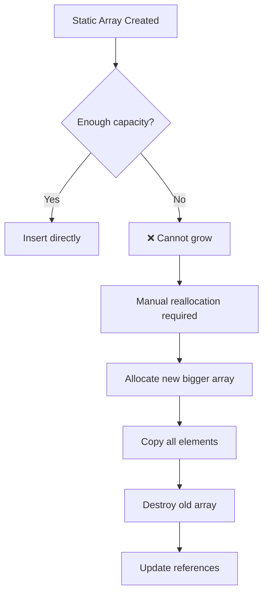
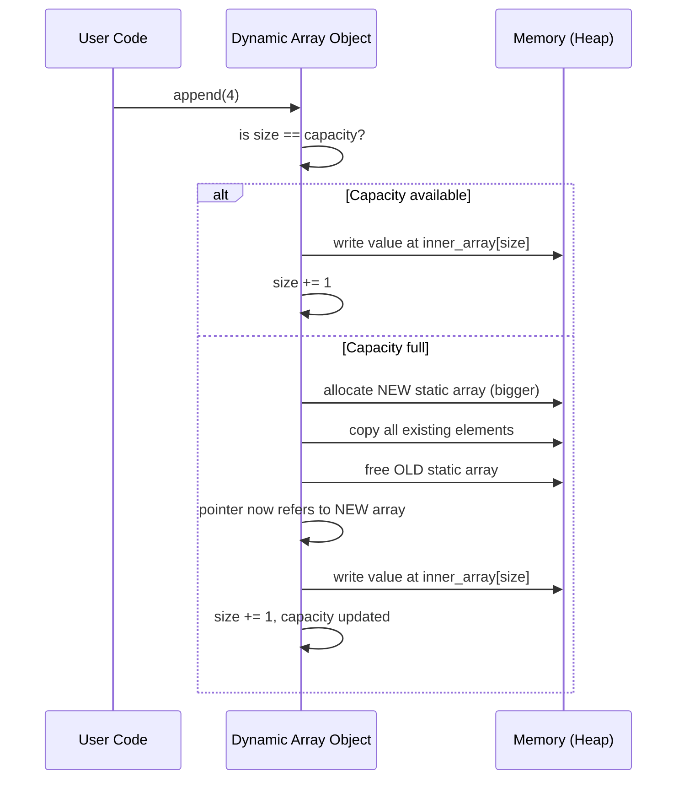
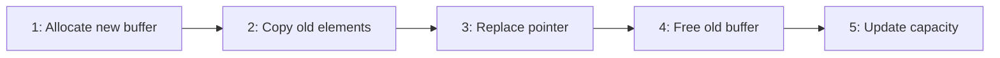
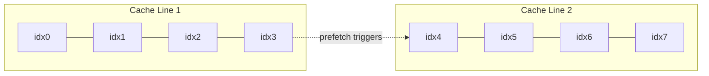
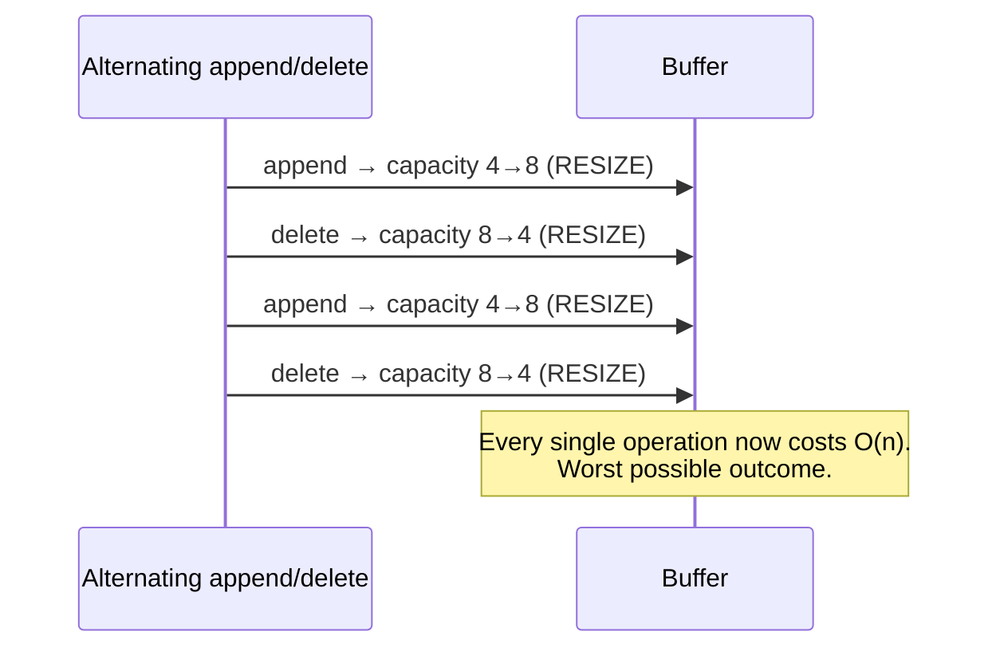

# 05 — Dynamic Arrays

> *"A static array is a promise made in advance. A dynamic array is a promise that can be renegotiated."*

In the previous chapters, we built a mental model of memory as a long, flat, addressable tape. We learned that a **static array** is nothing magical — it is simply a contract with the operating system: *"Give me N contiguous slots, and I will never ask for more."* We learned why that contiguity is precious: it gives us O(1) address arithmetic, and it gives the CPU cache exactly what it loves — predictable, sequential access.

But contracts written in advance have a problem. Life rarely respects them.

This chapter is about what happens the moment reality breaks the promise.

---

## 1. Introduction — The Day the Array Filled Up

Imagine you are building a real application. Perhaps it's a text editor tracking open tabs, a game engine tracking active enemies, or a simple to-do list tracking tasks. You look at your data, estimate a reasonable size, and allocate a static array:

```
int tasks[10];
```

Ten slots. That felt generous when you wrote it. For weeks, it works perfectly.

Then, on a random Tuesday, your eleventh task arrives.

```
tasks[10] = "Buy milk";   // ⚠️ Undefined behavior. Out of bounds.
```

There is no eleventh slot. The array was never dynamic — it was a fixed-size reservation, carved out once, at one address, for one size, forever. The memory immediately after `tasks[9]` in the address space does not belong to you. It might belong to another variable. It might belong to nothing at all. Writing there is not "slow" or "inefficient" — it is **undefined behavior**, one of the oldest and most dangerous classes of bugs in computing history.

This is not a hypothetical inconvenience. This exact problem — *"I don't know how many elements I will need, and I need to find out anyway"* — is one of the oldest problems in Computer Science. Every general-purpose collection you've ever used (Python's `list`, Java's `ArrayList`, C++'s `vector`, JavaScript's `Array`, Rust's `Vec`, Go's slice) exists **because of this exact problem**, and they all solve it using variations of the same idea: the **Dynamic Array**.

> **💡 Tip Box — The Core Tension**
> Static arrays are fast because their size is fixed at compile time or allocation time.
> Real-world programs almost never know their sizes in advance.
> Dynamic Arrays are the compromise between these two facts.

Before we can appreciate the solution, we must feel the full weight of the problem. So let's be brutally honest about why static arrays fail.

---

## 2. Why Static Arrays Fail

A static array is defined by exactly one unchangeable number: its **capacity**, fixed the moment it is born. Everything that goes wrong with static arrays traces back to this single fact.

### 2.1 Fixed Capacity

```
double prices[5];
```

The moment this line executes (or this declaration is compiled), the operating system or the runtime carves out exactly enough contiguous bytes for 5 `double`s — typically 40 bytes on a 64-bit system — and never one byte more. There is no mechanism, at the language level, to ask the array to "just be a little bigger." The array does not own the bytes after it. Some other variable, some padding, or simply unmapped memory sits there instead.

### 2.2 Unknown Future Size

Most real programs cannot know, at the moment of allocation, how many elements they will eventually need.

- A chat application doesn't know how many messages a conversation will contain.
- A web server doesn't know how many concurrent connections it will receive.
- A parser doesn't know how many tokens a source file will produce.
- A game doesn't know how many bullets will be on screen at once.

You are always guessing. And guesses are wrong in one of two directions.

### 2.3 Memory Waste (Overestimating)

Suppose you're scared of running out, so you allocate generously:

```
int userSessions[100000];
```

But on a typical day, only 200 users are active. You have reserved 100,000 slots and are using 0.2% of them. That is **memory waste** — real, physical bytes, sitting idle, unusable by anything else in the system. On embedded systems, or when multiplied across millions of server processes, this waste is not cosmetic — it is the difference between a system that runs and a system that crashes with `OutOfMemoryError`.

### 2.4 Allocation Failure (Underestimating)

Suppose instead you guess conservatively:

```
int userSessions[100];
```

The 101st user logs in. Now what? You cannot simply "extend" the array — as we'll prove rigorously in Section 3, the bytes after it are not yours. Your only option, using only static arrays, is to:

1. Allocate a brand-new, larger array somewhere else in memory.
2. Copy every existing element into it, one by one.
3. Destroy the old array.
4. Update every reference/pointer that used to point to the old array.

Which is exactly the mechanism that gives birth to the Dynamic Array — except now you'd have to hand-write this logic *every single time*, in *every single place* in your codebase that uses an array. That is unmaintainable, error-prone, and violates one of the deepest principles of software engineering: **don't repeat yourself.**

### 2.5 The Deeper Problem: Growth is Unpredictable

Even if you're willing to "just resize when needed," a subtler question emerges: **how much bigger?** Grow by 1? By 10? Double it? We will show in Section 8 that this decision is not a minor implementation detail — it is the single most consequential design decision in the entire data structure, determining whether your program runs in milliseconds or minutes.



> **⚠️ Common Mistake**
> Beginners often believe that arrays "know" how to grow, the same way a folder on a hard drive can hold more files as you add them. An array is not a folder. An array is a *reservation of contiguous addresses*. It has no concept of "more." Growth must be engineered on top of it — it does not emerge from it.

### Mini Summary

| Problem | Root Cause |
|---|---|
| Out-of-bounds crash | Fixed capacity exceeded |
| Wasted memory | Overestimated capacity |
| Allocation failure | Underestimated capacity |
| Manual resizing | No built-in growth mechanism |
| Repeated boilerplate | No abstraction over resizing logic |

Static arrays are not *broken*. They are doing exactly what they were designed to do: guarantee contiguity and fixed cost, in exchange for fixed size. The Dynamic Array is the abstraction that hides the pain of resizing behind a clean, reusable interface — without ever lying to the machine about what memory actually is.


---

## 3. Birth of Dynamic Arrays

Here is the single most important sentence in this chapter. Read it twice.

> **A Dynamic Array is not "dynamic memory." A Dynamic Array is an object that internally owns and manages a Static Array, and silently replaces that Static Array with a bigger one whenever it runs out of room.**

This sentence resolves almost every confusion beginners have about `ArrayList`, `vector`, `list`, or `Vec`. There is no special hardware instruction called "grow memory in place." There is no OS-level magic that stretches an existing allocation. Underneath every dynamic array implementation in every language, at the bottom of the abstraction, there is still a humble, boring, fixed-size static array — the exact same one you learned about in the previous chapter.

The "dynamic" part is not a property of memory. It is a property of **behavior** — an algorithm layered on top of memory that knows how to detect "I'm full" and respond by orchestrating a reallocation.

### 3.1 The Illusion of Growth

From the outside, calling `append()` on a dynamic array feels like the array is stretching, like dough:

```
[ 1, 2, 3 ]  --append(4)-->  [ 1, 2, 3, 4 ]
```

It looks like one array turned into a bigger version of itself. But that is an illusion maintained by the object wrapping the array. What actually happens, most of the time, is nothing dramatic — there was spare room, and the new element was simply written into the next open slot. But occasionally — and this is the crucial part — there is *no* spare room, and the illusion is maintained through brute force:



### 3.2 Proving the Claim: The Old Array Never Grows

This deserves a direct demonstration, because intuition often fights this fact.

```
Step 1: Allocate static array of capacity 4
Address:     1000   1004   1008   1012
Value:       [ 10 ] [ 20 ] [  _ ] [  _ ]
                                     ▲
                                capacity ends here — address 1016 is NOT ours
```

Now suppose we need capacity 8. There is no instruction that says "extend the reservation from 1000 to include 1016–1032." Those bytes may already belong to a different variable, to heap metadata, or to nothing mapped at all. The only guaranteed-safe action is to ask the memory allocator for a **brand-new** region:

```
Step 2: Allocate a DIFFERENT static array of capacity 8
Old Address: 1000  1004  1008  1012                (still capacity 4, untouched)
New Address: 5000  5004  5008  5012  5016  5020  5024  5028   (capacity 8, fresh)
```

```
Step 3: Copy old contents into new array
New Address: 5000  5004  5008  5012  5016  5020  5024  5028
New Values:  [ 10 ] [ 20 ] [  _ ] [  _ ] [  _ ] [  _ ] [  _ ] [  _ ]
```

```
Step 4: Free the old array. Update the dynamic array's internal pointer.
Old array at 1000 → returned to the OS / heap allocator, no longer valid to touch.
Dynamic Array's pointer → now 5000.
```

The array at address 1000 was **never resized**. It was **abandoned**. A completely different array, at a completely different address, took over its identity from the perspective of the program.

> **🧠 Behind the Scenes**
> This is why, in low-level languages, taking a raw pointer to an element inside a dynamic array (e.g., `&vec[2]` in C++) and holding onto it across an `append()` call is a classic bug. If that `append()` triggers a resize, your pointer now points into freed, abandoned memory — a **dangling pointer**. The array "moved," and your pointer didn't get the memo.

### 3.3 Why This Matters

Understanding this single mechanism — "grow" means "replace," not "extend" — is the foundation for everything else in this chapter: why resizing costs O(n), why doubling is used, why append is *usually* fast but *occasionally* slow, and why the next chapter's entire subject (amortized analysis) exists at all.

### Mini Summary

- A Dynamic Array is a **manager object** wrapping a Static Array.
- "Growing" a dynamic array always means: allocate new, copy, free old, repoint.
- The underlying static array itself is immutable in size — it is *replaced*, not *stretched*.
- This replacement is invisible to the caller, which is precisely the abstraction's value — and precisely its hidden cost.

---

## 4. Internal Structure

Strip away the language-specific syntax of `ArrayList`, `vector`, `list`, or `Vec`, and every dynamic array in every language is built from the same three ingredients.

```
struct DynamicArray {
    T*     data;       // pointer to the underlying static array (the "buffer")
    size_t size;        // number of elements actually stored ("logical length")
    size_t capacity;    // number of slots currently allocated ("physical length")
}
```

| Field | Meaning | Analogy |
|---|---|---|
| `data` | Address of the current underlying static array | The building's street address |
| `size` | How many elements are logically "in" the array | How many rooms are occupied |
| `capacity` | How many elements the current buffer *could* hold | How many rooms the building has |

### 4.1 Memory Visualization

```
Dynamic Array Object (small, fixed-size, lives on stack or as a struct)
┌─────────────────────────────┐
│ data      ───────────────┐  │
│ size      = 3             │  │
│ capacity  = 6              │  │
└────────────────────────────┼──┘
                              │
                              ▼
        Heap-allocated buffer (the actual static array)
        ┌──────┬──────┬──────┬──────┬──────┬──────┐
        │  10  │  20  │  30  │  ??  │  ??  │  ??  │
        └──────┴──────┴──────┴──────┴──────┴──────┘
          idx 0   idx 1   idx 2   idx 3   idx 4   idx 5
        ◄──── "size" region ────►◄──── unused slack ────►
        ◄─────────────────── "capacity" region ──────────────────►
```

Notice the **two-layer structure**: a small, fixed-size control block (`data`, `size`, `capacity`) that itself never moves, sitting beside a much larger, replaceable buffer that *does* move over the array's lifetime. This is precisely why passing a dynamic array by reference is cheap (you're copying a small struct of three fields) while the actual payload can be enormous.

> **📌 Engineering Note**
> This is why in C++, `std::vector<int> v` on the stack is only 24 bytes (three 8-byte fields: pointer, size, capacity) regardless of whether it holds 3 elements or 3 million. The heap buffer scales; the "handle" does not.

### 4.2 Real-World Example

Consider a video game's list of active enemies:

```
capacity = 100    // room reserved for up to 100 enemies
size = 47          // 47 enemies currently alive
data → [Enemy0, Enemy1, ..., Enemy46, <garbage>, <garbage>, ...]
```

The game engine can spawn up to 53 more enemies without touching the memory allocator at all — pure O(1) writes into existing slack. Only the 101st enemy triggers the expensive reallocation machinery.

### 4.3 Common Misconception

> **⚠️ Common Mistake**
> "The dynamic array has a size and that's it." No — conflating `size` and `capacity` is the single most common conceptual error learners make about this data structure. They are two independent numbers tracking two independent things, and the entire performance story of dynamic arrays is the *relationship* between them. We dedicate the next full section to this distinction because it is that important.

### Mini Summary

- A Dynamic Array's "handle" is a tiny, fixed struct: pointer + size + capacity.
- The heap buffer it points to is the real static array, replaced (not stretched) on growth.
- Copying the handle is cheap; the payload is what's expensive to move.

---

## 5. Capacity vs Size

If you remember only one distinction from this entire chapter, make it this one.

| Term | Definition | Also Known As | Changes When |
|---|---|---|---|
| **Size** | Number of elements the user has actually placed in the array | Length, count, logical size | Every `append`, `insert`, `delete` |
| **Capacity** | Number of slots physically allocated in the current buffer | Reserved space, physical size, buffer length | Only during a resize (reallocation) event |

**Size ≤ Capacity, always.** This inequality is an invariant the dynamic array must never violate.

### 5.1 Why Both Are Necessary

If a dynamic array tracked *only* size (and always allocated exactly `size` slots), then every single `append()` — not just the ones that overflow — would require a full reallocation and copy. Appending N elements would cost:

```
1 + 2 + 3 + 4 + ... + N  =  O(N²)
```

That is catastrophic. A million appends would require on the order of *five hundred billion* element copies.

By keeping `capacity` **ahead of** `size` — deliberately over-allocating — most appends become a trivial "write into the next free slot" operation, and the expensive reallocation is deferred to only a handful of occasions. This is the entire strategic idea behind dynamic arrays, and it's worth sitting with:

> **💡 Tip Box**
> Capacity is *slack you pay for in advance* so that you rarely have to pay the *much* higher price of reallocation. It is a classic engineering trade: spend a little extra memory, save a lot of time.

### 5.2 Visualizing the Gap

```
size = 4, capacity = 8

┌────┬────┬────┬────┬────┬────┬────┬────┐
│ A  │ B  │ C  │ D  │ ?? │ ?? │ ?? │ ?? │
└────┴────┴────┴────┴────┴────┴────┴────┘
◄──── occupied (size) ────►◄──── slack (capacity - size) ────►
```

Four more `append()` calls can happen here without touching the allocator — each one simply increments `size` and writes into the next slot.

### 5.3 Comparison Table: What Each Operation Touches

| Operation | Touches `size`? | Touches `capacity`? | Touches buffer? |
|---|---|---|---|
| `get(i)` | No | No | Read only |
| `set(i, v)` | No | No | Write only |
| `append(v)` (space available) | Yes (+1) | No | Write only |
| `append(v)` (full) | Yes (+1) | Yes (grows) | Full reallocation |
| `pop()` | Yes (-1) | No (usually) | No write needed |
| `insert(i, v)` | Yes (+1) | Maybe | Shift + maybe reallocate |
| `delete(i)` | Yes (-1) | No (usually) | Shift elements |

### 5.4 Real-World Example

Python exposes this distinction directly:

```
lst = [1, 2, 3]
len(lst)                 # size → 3
sys.getsizeof(lst)       # reflects capacity, not just size — reveals slack
```

Java's `ArrayList` exposes it via `size()` (logical count) versus the hidden length of its internal `Object[] elementData` (capacity), which you can influence with `ensureCapacity()` or `trimToSize()`.

### 5.5 Common Misconception

> **⚠️ Common Mistake**
> "If `size()` returns 5, the array only uses memory for 5 elements." False. It uses memory for *capacity* elements — `size` only tells you how many of those slots are logically meaningful. The other slots still exist, physically, in RAM, holding stale or default values, invisible to your logical view but very real to your memory footprint.

### Mini Summary

- **Size** = how much you're using. **Capacity** = how much you've reserved.
- Over-allocating capacity is what makes most appends cheap.
- The gap between them is deliberate slack, not waste — it's the entire mechanism that makes dynamic arrays fast on average.


---

## 6. Append Operation

The `append()` operation (sometimes called `push_back`, `add`, or `push`, depending on the language) is the single most frequently called method on a dynamic array. Its behavior splits into exactly two cases, and understanding *why* there are two cases is the gateway to everything that follows.

### 6.1 Case 1 — Free Space Exists (The Fast Path)

```
Before append(40):
size = 3, capacity = 5
┌────┬────┬────┬────┬────┐
│ 10 │ 20 │ 30 │ ?? │ ?? │
└────┴────┴────┴────┴────┘

Step 1: check size < capacity   →  3 < 5 ✓
Step 2: write value at data[size]   → data[3] = 40
Step 3: size += 1                    → size = 4

After append(40):
┌────┬────┬────┬────┬────┐
│ 10 │ 20 │ 30 │ 40 │ ?? │
└────┴────┴────┴────┴────┘
```

This is a single write plus an increment. No allocation. No copying. No pointer changes. This is as close to "free" as an operation gets in computing — genuinely **O(1)**, with no asterisk.

### 6.2 Case 2 — Array Is Full (The Slow Path)

```
Before append(40):
size = 5, capacity = 5     (size == capacity → NO ROOM)
┌────┬────┬────┬────┬────┐
│ 10 │ 20 │ 30 │ ?? │ ??  │   ← wait, this is full, size==capacity means ALL used
│ 10 │ 20 │ 30 │ 40 │ 50 │
└────┴────┴────┴────┴────┘

Step 1: check size < capacity   →  5 < 5 ✗  FULL
Step 2: allocate NEW buffer, larger capacity (e.g., double → 10)
Step 3: copy all 5 existing elements into new buffer
Step 4: free OLD buffer
Step 5: repoint data → NEW buffer
Step 6: write value at data[size]   → data[5] = 60
Step 7: size += 1, capacity updated → size = 6, capacity = 10

After append(60):
┌────┬────┬────┬────┬────┬────┬────┬────┬────┬────┐
│ 10 │ 20 │ 30 │ 40 │ 50 │ 60 │ ?? │ ?? │ ?? │ ?? │
└────┴────┴────┴────┴────┴────┴────┴────┴────┴────┘
```

This path costs a full allocation plus **N copies**, where N is the current size. It is **O(n)**, not O(1).

### 6.3 Pseudocode

```
function append(array, value):
    if array.size == array.capacity:
        grow(array)                 # expensive path — see Section 7
    array.data[array.size] = value
    array.size += 1
```

Notice the elegance: `grow()` is the *only* place where cost explodes, and it is deliberately isolated as its own operation, which we now examine in full detail.

### Mini Summary

| Case | Cost | Frequency |
|---|---|---|
| Space available | O(1) | Common (most calls) |
| Array full | O(n) | Rare (only at growth boundaries) |

Every `append()` call checks one condition — `size == capacity`? — and that single branch determines whether you take the near-free path or the expensive one.

---

## 7. Growing the Array

This is the mechanical heart of the dynamic array — the operation that everything else is designed around. Let's walk through it in maximal detail, treating it the way a CPU actually executes it, step by step.

### 7.1 The Five-Step Ritual

Every dynamic array growth, in every language, in every implementation, performs the same five steps:

1. **Allocate** a new, larger static array.
2. **Copy** every existing element from the old buffer into the new buffer.
3. **Replace** the internal pointer to reference the new buffer.
4. **Free** the old buffer.
5. **Update** the capacity field to reflect the new size.



### 7.2 Stage-by-Stage Memory Visualization

**Starting state** — a full array, `size = capacity = 4`:

```
Handle:  data → 0x1000, size = 4, capacity = 4

Heap @ 0x1000:
┌──────┬──────┬──────┬──────┐
│  A   │  B   │  C   │  D   │
└──────┴──────┴──────┴──────┘
```

**Stage 1 — Allocate.** The allocator finds a fresh region, say double the size (capacity 8), at a *completely unrelated* address, 0x2000. Note: the old buffer at 0x1000 is untouched and still fully valid at this instant.

```
Heap @ 0x1000 (OLD, still alive):        Heap @ 0x2000 (NEW, uninitialized):
┌──────┬──────┬──────┬──────┐            ┌────┬────┬────┬────┬────┬────┬────┬────┐
│  A   │  B   │  C   │  D   │            │ ?? │ ?? │ ?? │ ?? │ ?? │ ?? │ ?? │ ?? │
└──────┴──────┴──────┴──────┘            └────┴────┴────┴────┴────┴────┴────┴────┘
```

**Stage 2 — Copy.** Every element is read from the old buffer and written into the corresponding slot of the new buffer. This is a loop of `size` iterations — the expensive part.

```
Heap @ 0x2000 (NEW, mid-copy):
┌────┬────┬────┬────┬────┬────┬────┬────┐
│ A  │ B  │ C  │ D  │ ?? │ ?? │ ?? │ ?? │
└────┴────┴────┴────┴────┴────┴────┴────┘
   ▲ copied      ▲ untouched slack
```

**Stage 3 — Replace pointer.** The handle's `data` field is updated: it now points at 0x2000, not 0x1000. This single pointer write is what makes the "swap" appear instantaneous to the caller — the *illusion* of growth completes here, even though the expensive work already happened in Stage 2.

```
Handle:  data → 0x2000 (was 0x1000), size = 4, capacity = 8
```

**Stage 4 — Free the old buffer.** The memory at 0x1000 is returned to the allocator. It may be reused for something else entirely, moments later.

```
Heap @ 0x1000: [ RETURNED TO ALLOCATOR — do not touch ]
```

**Stage 5 — Update capacity.** The handle now correctly reports `capacity = 8`, unlocking four more O(1) appends before the next growth event.

### 7.3 Pseudocode

```
function grow(array):
    newCapacity = computeNewCapacity(array.capacity)   # e.g., capacity * 2
    newBuffer = allocate(newCapacity)                   # Stage 1

    for i in 0 .. array.size - 1:                        # Stage 2
        newBuffer[i] = array.data[i]

    oldBuffer = array.data
    array.data = newBuffer                                # Stage 3
    free(oldBuffer)                                        # Stage 4
    array.capacity = newCapacity                            # Stage 5
```

> **🧠 Think Like the CPU**
> From the CPU's perspective, Stage 2 (the copy loop) is a tight, predictable, sequential memory-read followed by a sequential memory-write. Because both the old and new buffers are contiguous, this is one of the most cache-friendly operations imaginable — the prefetcher happily streams both regions. This is precisely *why* dynamic array resizing, despite being O(n), is still dramatically faster in practice than the equivalent O(n) operation on a linked structure, which would involve chasing pointers scattered across the heap.

### 7.4 Why the Old and New Buffers Can Coexist

A subtlety worth noting: during Stages 1–3, *both* buffers exist simultaneously in memory. This means a resize operation momentarily requires roughly **1.5× to 2× the memory** of the final array (old buffer + partially-filled new buffer), before the old one is released in Stage 4. In memory-constrained environments (embedded systems, mobile devices), this transient spike is a real engineering concern.

> **⚠️ Warning Box**
> If you are operating close to available memory limits, a large dynamic array `append()` can fail with an out-of-memory error *even though the final result would technically fit* — because for a brief moment during the copy, both the old and new buffers must be resident simultaneously.

### Mini Summary

- Growing is always: allocate → copy → repoint → free → update capacity.
- The copy step is O(n) and dominates the cost.
- Both buffers briefly coexist, causing a temporary memory spike.
- The operation is cache-friendly (sequential read + sequential write) even though it's asymptotically expensive.


---

## 8. Why Double the Capacity?

We've established *that* the array grows. Now the critical engineering question: **grow by how much?**

This single decision — the **growth factor** — is arguably the most consequential design parameter in the entire data structure. Let's examine the candidates mathematically.

### 8.1 Strategy: Grow by +1 (Grow Exactly As Needed)

```
capacity: 1 → 2 → 3 → 4 → 5 → 6 → ... → N
```

Every single append triggers a full reallocation and copy. Total cost of N appends:

```
1 + 2 + 3 + ... + N  =  N(N+1)/2  =  O(N²)
```

For N = 1,000,000, this is on the order of **500 billion** element copies. This strategy is a disaster and is never used in any serious implementation.

### 8.2 Strategy: Grow by +10 (Fixed Constant Increment)

```
capacity: 10 → 20 → 30 → 40 → ... → N
```

Better, but still fundamentally flawed. The number of resize events is `N / 10`, and each resize costs, on average, about `N/2` copies. Total cost is still:

```
O(N) resizes × O(N) average copy size  =  O(N²)
```

Any **fixed, constant** growth increment — regardless of the constant — produces quadratic total cost as N grows, because the increment doesn't scale with the array's current size.

### 8.3 Strategy: Grow by ×1.5 (Geometric, Multiplier < 2)

```
capacity: 1 → 1.5 → 2.25 → 3.375 → ... (rounded)
```

Now something changes qualitatively. Because each new capacity is a **multiple** of the previous one, the number of resize events needed to reach size N is only `O(log N)` — and crucially, the *sizes* of those resizes form a geometric series. We will prove the total cost formally in the next chapter, but the intuitive result is:

```
Total copies across all resizes  =  O(N)      ← linear, not quadratic!
```

This is the qualitative leap that makes dynamic arrays viable at all: **any fixed multiplicative growth factor greater than 1** turns the total cost of N appends from quadratic into linear.

### 8.4 Strategy: Grow by ×2 (Doubling)

```
capacity: 1 → 2 → 4 → 8 → 16 → 32 → ... → N
```

Doubling is the most common and intuitive choice of multiplicative growth. Only `O(log₂ N)` resizes are ever needed to reach size N, and — as with any multiplicative strategy — the total copying work across the array's entire lifetime sums to `O(N)`.

### 8.5 Comparison Table

| Growth Strategy | Resize Events for N appends | Total Copy Work | Verdict |
|---|---|---|---|
| +1 (grow by exactly 1) | O(N) | O(N²) | ❌ Catastrophic |
| +10 (fixed constant) | O(N) | O(N²) | ❌ Still quadratic |
| ×1.5 (geometric) | O(log N) | O(N) | ✅ Good |
| ×2 (doubling) | O(log N) | O(N) | ✅ Good, most common |

> **🔑 Key Insight**
> The dividing line isn't "big increment vs. small increment." It's **additive vs. multiplicative**. Any additive strategy is O(N²). Any multiplicative strategy with a factor > 1 is O(N). This is a qualitative, not quantitative, difference — no amount of tuning an additive constant fixes it.

### 8.6 The Tradeoff Within Multiplicative Growth

If any multiplier works, why do languages differ? Because the multiplier controls a tradeoff between **time** (fewer resizes = faster) and **memory** (bigger jumps = more wasted slack).

| Multiplier | Resize Frequency | Wasted Memory (Worst Case) |
|---|---|---|
| ×1.25 | More frequent | Less waste (~25%) |
| ×1.5 | Moderate | Moderate (~50%) |
| ×2.0 | Least frequent | More waste (up to 100%) |

A larger multiplier means fewer, cheaper-per-element resizes over the array's lifetime, but each resize temporarily over-allocates more unused slack. A smaller multiplier conserves memory more tightly but triggers reallocation more often.

### 8.7 Real Languages, Real Choices

- **C++ `std::vector`**: The C++ Standard does not mandate a specific growth factor — it's implementation-defined. In practice, libstdc++ (GCC) uses **×2**, while libc++ (Clang/LLVM) uses approximately **×2** as well, though historically some implementations experimented with smaller factors.
- **Java `ArrayList`**: Grows by **1.5×** (specifically, `newCapacity = oldCapacity + (oldCapacity >> 1)`), favoring memory conservation over raw resize frequency.
- **Python `list`**: Uses an approximate growth pattern close to **×1.125** for large lists (with additional rounding), one of the more conservative multipliers among mainstream languages, reflecting Python's general bias toward memory efficiency.

> **📌 Engineering Note**
> There is no universally "correct" growth factor — it's a policy decision balancing memory pressure against CPU cost, tuned differently by different language designers based on their target workloads. What *is* universal is the requirement that the factor be multiplicative, not additive.

### Mini Summary

- Additive growth (+1, +10, +anything fixed) → O(N²) total cost. Never used seriously.
- Multiplicative growth (×1.5, ×2, ×anything > 1) → O(N) total cost.
- The specific multiplier is a time/memory tradeoff, not a correctness issue.
- Real languages pick different multipliers (Java: 1.5×, C++: ~2×, Python: ~1.125×) based on differing priorities.


---

## 9. Resize Walkthrough

Let's simulate, in complete and painstaking detail, what happens as we insert the letters A through H, one at a time, into a dynamic array that starts with capacity 1 and doubles whenever full.

### Insertion 1: append(A)

```
Before: size=0, capacity=0, data=null
Action: capacity 0 → array is "full" (0 == 0) → allocate capacity 1
Buffer: [ A ]
After:  size=1, capacity=1
```

### Insertion 2: append(B)

```
Before: size=1, capacity=1  → FULL (1==1) → grow to capacity 2
Copy:   [ A ] → [ A, _ ]
Write:  [ A, B ]
After:  size=2, capacity=2
```

### Insertion 3: append(C)

```
Before: size=2, capacity=2  → FULL → grow to capacity 4
Copy:   [ A, B ] → [ A, B, _, _ ]
Write:  [ A, B, C, _ ]
After:  size=3, capacity=4
```

### Insertion 4: append(D)

```
Before: size=3, capacity=4  → NOT full (3<4) → fast path
Write:  [ A, B, C, D ]
After:  size=4, capacity=4          ← no allocation, no copy!
```

### Insertion 5: append(E)

```
Before: size=4, capacity=4  → FULL → grow to capacity 8
Copy:   [ A, B, C, D ] → [ A, B, C, D, _, _, _, _ ]
Write:  [ A, B, C, D, E, _, _, _ ]
After:  size=5, capacity=8
```

### Insertions 6, 7, 8: append(F), append(G), append(H)

```
append(F): 5<8, fast path → [ A, B, C, D, E, F, _, _ ]     size=6
append(G): 6<8, fast path → [ A, B, C, D, E, F, G, _ ]     size=7
append(H): 7<8, fast path → [ A, B, C, D, E, F, G, H ]     size=8
```

### 9.1 The Full Timeline

```mermaid
gantt
    dateFormat X
    axisFormat %s
    title Capacity vs Operation Cost Over 8 Appends
    section Resize Events (Expensive)
    append(A) - cap 0→1   :a1, 0, 1
    append(B) - cap 1→2   :a2, 1, 1
    append(C) - cap 2→4   :a3, 2, 1
    append(E) - cap 4→8   :a5, 4, 1
    section Fast Appends (Cheap)
    append(D) - no resize :a4, 3, 1
    append(F) - no resize :a6, 5, 1
    append(G) - no resize :a7, 6, 1
    append(H) - no resize :a8, 7, 1
```



### 9.2 Counting the Real Work

| Append # | Element | Resize? | Elements Copied | Cumulative Copies |
|---|---|---|---|---|
| 1 | A | Yes | 0 | 0 |
| 2 | B | Yes | 1 | 1 |
| 3 | C | Yes | 2 | 3 |
| 4 | D | No | 0 | 3 |
| 5 | E | Yes | 4 | 7 |
| 6 | F | No | 0 | 7 |
| 7 | G | No | 0 | 7 |
| 8 | H | No | 0 | 7 |

Eight appends, but only **7 total element copies** across the array's entire lifetime — fewer copies than appends! This surprising fact (total copy work stays proportional to N, not N²) is precisely the phenomenon that the next chapter will formalize as **amortized analysis**.

> **💡 Tip Box**
> Notice the pattern: expensive resizes happen at appends 1, 2, 3, 5, 9, 17, 33... (powers-of-two boundaries). Between them, long stretches of pure O(1) fast-path appends occur. The expensive events get *rarer* even as they get individually *bigger* — and the two effects cancel out almost perfectly.

### Mini Summary

- Resizes cluster at capacity boundaries: 1, 2, 4, 8, 16, ...
- Between resizes, appends are pure O(1) — no allocation, no copying.
- Total copy work across N appends stays linear in N, not quadratic — the seed of amortized analysis.

---

## 10. Complexity Analysis

Let's go operation by operation, and — as instructed — explain *why*, not just state the result.

### 10.1 Access — `get(i)` — O(1)

Because the underlying buffer is contiguous, the address of element `i` is computable directly:

```
address(i) = base_address + i * element_size
```

No searching, no traversal — pure arithmetic. This is inherited directly from the static array underneath (see Chapter 3, Address Arithmetic).

### 10.2 Update — `set(i, v)` — O(1)

Same reasoning: compute the address, write directly. No dependency on `size` or any other element.

### 10.3 Search (unsorted) — `contains(v)` — O(n)

Without additional structure (sorting, hashing), there is no shortcut — every element might need to be examined before concluding `v` is absent. This is a **linear scan**, and it is one of the costs you accept in exchange for O(1) access-by-index.

### 10.4 Traversal — `for each element` — O(n)

Visiting every element necessarily costs at least one unit of work per element: O(n). What makes this fast *in practice* (not just in Big-O) is cache locality — sequential addresses mean the CPU prefetcher performs beautifully, a topic we expand on in Section 13.

### 10.5 Append (amortized) — O(1)*

We've shown that most appends are a single write (O(1)), and occasionally one is a full O(n) resize. The asterisk here is intentional and is the subject of Section 11.

### 10.6 Insert at arbitrary index — `insert(i, v)` — O(n)

Inserting in the middle requires shifting every subsequent element one position to the right *first*, to make room:

```
insert(1, X) into [A, B, C, D]:

Before:  [ A, B, C, D, _ ]
Shift:   [ A, _, B, C, D ]   (B,C,D each move right by one)
Write:   [ A, X, B, C, D ]
```

In the worst case (inserting at index 0), all `n` existing elements must shift — O(n).

### 10.7 Delete at arbitrary index — `delete(i)` — O(n)

Symmetric to insertion: removing an element leaves a gap that must be closed by shifting everything after it one position to the left.

```
delete(1) from [A, B, C, D]:

Before:  [ A, B, C, D ]
Shift:   [ A, C, D, _ ]    (C, D each move left by one)
```

Worst case (deleting index 0): O(n) shifts.

### 10.8 Resize — O(n)

As established: allocate + copy every element. This is the expensive event that append, insert, and (rarely) delete may trigger.

### 10.9 Summary Table

| Operation | Time Complexity | Why |
|---|---|---|
| Access by index | O(1) | Direct address arithmetic |
| Update by index | O(1) | Direct address arithmetic |
| Search (unsorted) | O(n) | No shortcut without extra structure |
| Traversal | O(n) | Must visit every element once |
| Append (fast path) | O(1) | Write + increment, no allocation |
| Append (resize path) | O(n) | Full reallocation and copy |
| Append (amortized) | O(1)* | Explained fully in Section 11 & next chapter |
| Insert at index | O(n) | Requires shifting elements right |
| Delete at index | O(n) | Requires shifting elements left |
| Resize event | O(n) | Allocate + copy every element |

> **⚠️ Common Mistake**
> Students often assume "arrays are fast" as a blanket statement. Arrays are fast at **index-based access** and **traversal**. They are *not* inherently fast at **insertion/deletion in the middle** or at **searching by value**. Speed in one dimension is not speed in all dimensions — this is a recurring theme across every data structure you will study.

### Mini Summary

The dynamic array inherits static arrays' O(1) indexing, pays O(n) for search/insert/delete-in-middle like any array-based structure, and introduces one genuinely novel wrinkle: append's cost depends on *when* you ask, not just *what* you're doing — which brings us to the most important section of this chapter.


---

## 11. The Famous O(1) Append

Here is a claim you have probably heard stated confidently, in textbooks, in interviews, in documentation:

> "Appending to a dynamic array is O(1)."

And here is a fact we proved with our own hands in Section 9:

> Some appends cost O(1). Others — the ones that trigger a resize — cost O(n).

These two statements appear to contradict each other. **They do not.** Understanding why they don't is one of the most important "aha" moments in all of introductory algorithms, and it deserves to be savored rather than rushed.

### 11.1 The Apparent Contradiction

```
append(A): O(1)     ← resize triggered, but array was empty, 0 elements copied
append(B): O(1)     ← resize triggered, 1 element copied
append(C): O(1)     ← resize triggered, 2 elements copied
append(D): O(1)     ← no resize
append(E): O(n)     ← resize triggered, 4 elements copied
append(F): O(1)     ← no resize
append(G): O(1)     ← no resize
append(H): O(1)     ← no resize
```

If you look at any **individual** append in isolation, you genuinely cannot promise O(1) — append E, above, cost real work proportional to the array's size at that moment. So how can anyone claim the operation is O(1)?

### 11.2 The Resolution: Zoom Out

The claim "append is O(1)" is not a claim about any *single* call. It is a claim about the **average cost per call, measured across a long sequence of calls.** This is the core intuition — and only the intuition, not the full formal machinery — behind a technique called **amortized analysis**.

Here's the intuition, expressed as a thought experiment. Imagine you perform N appends in a row, starting from an empty array, doubling capacity each time it's full. We already computed, for N=8, that total copying work was 7 — roughly equal to N. In general, it can be shown that the **total** cost of N appends, summed together, is proportional to N, not N². If total cost is O(N) and there were N operations, then the **average** cost per operation is:

```
Total cost / Number of operations  =  O(N) / N  =  O(1)
```

Each individual append "pays" a small, constant amount **on average**, even though the actual payment schedule is lumpy — mostly tiny payments, with occasional large ones, arranged so that the large ones become proportionally rarer exactly as fast as they become proportionally larger.

### 11.3 A Physical Analogy

> **🔑 Key Insight — The Savings Account Analogy**
> Imagine every append deposits a few extra "cost coins" into a savings account, even on the cheap O(1) appends. When a resize eventually happens, it doesn't pay for itself out of nowhere — it withdraws from the coins that were quietly saved up during all the preceding cheap appends. If the accounting is done correctly (as it is with doubling), the account never goes negative, and the *average* deposit per operation stays constant forever.

This "savings account" idea is the seed of what's formally called the **accounting method** in amortized analysis. We are deliberately not proving it rigorously here — that proof, along with its sibling techniques (the aggregate method and the potential method), is reserved for the next chapter.

### 11.4 Why People Still Say "O(1)"

In algorithm analysis, when we describe the cost of a sequence of operations rather than a single worst-case operation, "amortized O(1)" is often shortened, informally, to just "O(1)." This is technically a simplification — a careful engineer or interviewer will distinguish **worst-case O(1)** (true for hash-map lookups in the ideal case, or array indexing) from **amortized O(1)** (true for dynamic array append). But colloquially, in casual conversation and even in many textbooks, "O(1) append" is universally understood to mean the amortized guarantee.

> **⚠️ Warning Box**
> This distinction is not pedantic hair-splitting — it has real consequences. In systems with strict latency requirements (real-time audio processing, high-frequency trading, game engines targeting a fixed frame budget), an *occasional* O(n) spike, even if rare, can cause a missed deadline. "Amortized O(1)" is a statement about long-run averages, not about any single call's guaranteed latency. Engineers building latency-sensitive systems sometimes pre-allocate capacity explicitly (`reserve()` in C++, `ensureCapacity()` in Java) specifically to avoid unpredictable resize spikes at inconvenient moments.

### 11.5 Building the Curiosity

We have now demonstrated, with concrete numbers, that:

- Individual appends vary wildly in cost (O(1) vs O(n)).
- The *total* cost across a sequence stays surprisingly, suspiciously linear.
- There seems to be a hidden accounting mechanism — a "savings account" — that makes the expensive events pay for themselves using credit accumulated from the cheap events.

What we have *not* yet done is prove this rigorously, generalize it beyond our one example with N=8, or give it a name with mathematical teeth. That is deliberate.

> **The mathematical proof appears in the next chapter.**

### Mini Summary

- Individual append calls are *not* uniformly O(1) — some are O(n).
- The *sequence* of N appends costs O(N) in total, making the *average* cost O(1).
- This average-cost guarantee is called **amortized O(1)**, often shortened casually to "O(1)."
- The rigorous justification — the accounting, aggregate, and potential methods — awaits in **06-Amortized-Analysis.md**.


---

## 12. Memory Cost

Performance is not the only currency in systems programming — memory is the other, and dynamic arrays spend it deliberately.

### 12.1 Unused Capacity ("Slack")

At almost any given moment in a dynamic array's life, `capacity > size`. The difference is memory that has been reserved from the operating system but is not logically holding any of your data:

```
size = 6, capacity = 16

┌────┬────┬────┬────┬────┬────┬────┬────┬────┬────┬────┬────┬────┬────┬────┬────┐
│ A  │ B  │ C  │ D  │ E  │ F  │ ?? │ ?? │ ?? │ ?? │ ?? │ ?? │ ?? │ ?? │ ?? │ ?? │
└────┴────┴────┴────┴────┴────┴────┴────┴────┴────┴────┴────┴────┴────┴────┴────┘
◄─────── used (size=6) ───────►◄──────────────── slack (10 unused slots) ────────►
```

Here, 62.5% of the allocated memory is currently unused. This is not a bug — it's the direct, unavoidable consequence of doubling-based growth, and it's the price paid for O(1) amortized append.

### 12.2 The Worst-Case Slack Ratio

With a doubling strategy, the *worst possible moment* to inspect a dynamic array is immediately after a resize, when `size` is just barely more than half of `capacity`:

```
Just after resize:  size = capacity/2 + 1
Slack fraction ≈ 50%
```

With a growth factor of `k`, the worst-case slack fraction approaches `1 - 1/k`. Doubling (`k=2`) can waste up to ~50% of allocated memory at its worst moment; a 1.5× factor caps worst-case waste closer to ~33%.

### 12.3 Time vs Memory: The Fundamental Tradeoff

| Growth Factor | Resize Frequency | Time Cost | Memory Waste (Worst Case) |
|---|---|---|---|
| Small (e.g., ×1.1) | High | More total copying | Low (~9%) |
| Medium (e.g., ×1.5) | Moderate | Moderate | Moderate (~33%) |
| Large (e.g., ×2) | Low | Least total copying | High (~50%) |

There is no growth factor that minimizes *both* dimensions simultaneously — every choice is a point on a curve trading CPU cycles for RAM bytes. Language designers choose a point on this curve based on their expected workloads (Java, expecting many long-lived collections, leans toward memory conservation with 1.5×; many C++ implementations, expecting performance-critical hot loops, lean toward 2×).

### 12.4 Real-World Example

A machine learning pipeline building a training batch with `append()` in a tight loop might end up holding a dynamic array with `capacity` nearly double its actual `size` right when it's handed off to the next stage. Multiplied across millions of batches, or across gigabyte-scale tensors, this slack is not a rounding error — it can represent real, budget-relevant memory pressure. This is exactly why many high-performance numerical libraries expose an explicit `reserve(n)` or `shrink_to_fit()` — to let the programmer manually override the automatic growth policy when the final size is known in advance or once growth has finished.

> **📌 Engineering Note**
> "Slack" isn't wasted in the sense of being useless — it's *pre-paid future capacity*. The question a systems engineer asks isn't "how do I eliminate slack?" but "is the amount of slack appropriate for this specific workload?" Long-lived, rarely-resized collections can tolerate more slack. Short-lived, memory-constrained collections may want to call `shrink_to_fit()` once their final size is known.

### Mini Summary

- Capacity minus size is unused, reserved memory — "slack."
- Doubling can waste up to ~50% of allocated memory at its worst moment.
- Every growth factor trades memory efficiency against time efficiency; there is no free lunch.
- Real systems expose manual controls (`reserve`, `shrink_to_fit`) precisely because the automatic tradeoff isn't always right for every workload.

---

## 13. Cache Performance

Recall from earlier chapters: modern CPUs are dramatically faster at computation than they are at fetching data from main memory. The gap is bridged by a hierarchy of caches (L1, L2, L3) that work best when memory access is **sequential and predictable**. This section explains why dynamic arrays remain excellent citizens of that cache hierarchy — despite the apparent "wastefulness" of resizing.

### 13.1 Why Dynamic Arrays Stay Cache-Friendly

Even though a dynamic array occasionally reallocates to a new address, **within any given moment**, its underlying buffer is a single, contiguous block — exactly like the static array from earlier chapters. Traversing it means visiting consecutive addresses:

```
Traversal order:   base+0, base+1*sz, base+2*sz, base+3*sz, ...
```

This is the ideal access pattern for a CPU's hardware prefetcher, which detects sequential strides and proactively pulls upcoming cache lines into L1 before they're even requested.



### 13.2 Comparison Against Linked Lists

A linked list stores each element in an independently allocated node, scattered arbitrarily across the heap, connected only by pointers:

```
Dynamic Array in memory:
┌────┬────┬────┬────┬────┬────┬────┬────┐
│ A  │ B  │ C  │ D  │ E  │ F  │ G  │ H  │      ← one contiguous block
└────┴────┴────┴────┴────┴────┴────┴────┘

Linked List in memory:
[A]@0x1000 ──► [B]@0x7F30 ──► [C]@0x2210 ──► [D]@0x9A01 ──► ...
   (scattered across the entire heap, no locality whatsoever)
```

Traversing the dynamic array streams through memory in one direction, maximizing cache-line reuse — a single fetched 64-byte cache line might contain 16 consecutive `int`s. Traversing the linked list, by contrast, likely causes a **cache miss on almost every single node**, because each node's address bears no relationship to the previous one's.

### 13.3 Quantifying the Difference

| Property | Dynamic Array | Linked List |
|---|---|---|
| Memory layout | Contiguous | Scattered |
| Cache-line utilization | High (multiple elements per line) | Low (often 1 useful element per line) |
| Prefetcher effectiveness | Excellent | Poor to none |
| Typical real-world traversal speed | Several times faster | Slower, despite identical O(n) complexity |

> **🧠 Think Like the CPU**
> Big-O notation is blind to cache effects — it counts "operations," not "nanoseconds." Two O(n) traversals can differ by an order of magnitude in wall-clock time purely due to memory layout. This is one of the most important lessons in systems-level algorithm design: **asymptotic complexity is necessary but not sufficient for understanding real-world performance.**

### 13.4 Resizing Doesn't Undermine This

Even the "expensive" resize-and-copy operation (Section 7) is itself cache-friendly: it reads sequentially from the old buffer and writes sequentially into the new buffer — two streaming passes, exactly the pattern hardware prefetchers are built to exploit. This is part of why, despite being O(n), a resize event is *still* fast in absolute terms compared to, say, rebuilding a tree or rehashing a hash table with poor locality.

### Mini Summary

- Dynamic arrays inherit static arrays' contiguous layout, and therefore their cache-friendliness, at every point in time between resizes.
- Linked lists have equal or better theoretical complexity for some operations but suffer badly in practice due to scattered memory.
- Even the resize operation itself streams memory sequentially, keeping it fast despite being O(n).
- Real-world performance requires reasoning about both complexity *and* memory layout — Big-O alone is an incomplete picture.


---

## 14. Insertions

Appending always adds to the *end*. But often we need to insert somewhere in the *middle* — and that changes the cost profile entirely.

### 14.1 The Mechanics of Shifting

To insert a value at index `i`, every element from index `i` onward must first move one position to the right, opening a gap for the new value.

```
insert(2, X) into [A, B, C, D, E]   (size=5, capacity=6)

Step 1 — Before:
┌────┬────┬────┬────┬────┬────┐
│ A  │ B  │ C  │ D  │ E  │ ?? │
└────┴────┴────┴────┴────┴────┘
  0    1    2    3    4    5

Step 2 — Shift elements at index ≥ 2 one slot right (process from the END backward,
to avoid overwriting values before they're copied):
┌────┬────┬────┬────┬────┬────┐
│ A  │ B  │ C  │ C  │ D  │ E  │   ← intermediate: E moved to 5, D moved to 4...
└────┴────┴────┴────┴────┴────┘

Step 3 — Write X into the now-open slot at index 2:
┌────┬────┬────┬────┬────┬────┐
│ A  │ B  │ X  │ C  │ D  │ E  │
└────┴────┴────┴────┴────┴────┘

Step 4 — size += 1 → size = 6
```

> **⚠️ Common Mistake**
> Shifting must proceed from the **highest index down to the insertion point**, not left-to-right. Shifting left-to-right would overwrite values before they've been copied, silently corrupting data. This ordering detail trips up many first attempts at implementing `insert()`.

### 14.2 Pseudocode

```
function insert(array, i, value):
    if array.size == array.capacity:
        grow(array)                          # may also trigger reallocation
    for j from array.size down to i+1:
        array.data[j] = array.data[j-1]      # shift right, backward order
    array.data[i] = value
    array.size += 1
```

### 14.3 Complexity

| Insertion Position | Elements Shifted | Complexity |
|---|---|---|
| At the end (`i = size`) | 0 | O(1) — this is just `append` |
| At the beginning (`i = 0`) | size | O(n) — worst case |
| At a random middle index | ~size/2 on average | O(n) |

> **🔑 Key Insight**
> `append()` is really just `insert()` at `i = size` — the special case where zero elements need to shift. This is why append can be O(1)-amortized while general insertion cannot: shifting is fundamentally proportional to how many elements sit *after* the insertion point.

### Mini Summary

- Insertion at an arbitrary index requires shifting all subsequent elements right.
- Must shift from the back forward, to avoid overwriting unprocessed data.
- Cost ranges from O(1) (insert at end) to O(n) (insert at front).

---

## 15. Deletions

Deletion is insertion's mirror image: instead of opening a gap, we close one.

### 15.1 The Mechanics of Shifting Left

```
delete(1) from [A, B, C, D, E]   (size=5)

Step 1 — Before:
┌────┬────┬────┬────┬────┬────┐
│ A  │ B  │ C  │ D  │ E  │ ?? │
└────┴────┴────┴────┴────┴────┘
  0    1    2    3    4

Step 2 — Shift elements at index > 1 one slot LEFT (process forward this time):
┌────┬────┬────┬────┬────┬────┐
│ A  │ C  │ D  │ E  │ E  │ ?? │   ← intermediate
└────┴────┴────┴────┴────┴────┘

Step 3 — size -= 1 → size = 4. Logical array is now [A, C, D, E].
The stale trailing 'E' at index 4 is simply outside the logical size — harmless,
invisible, and will be silently overwritten by a future append.
```

### 15.2 Pseudocode

```
function delete(array, i):
    for j from i to array.size - 2:
        array.data[j] = array.data[j+1]      # shift left, forward order
    array.size -= 1
```

Note the direction reversal compared to insertion: deletion shifts **forward** (left to right), while insertion shifts **backward** (right to left) — each direction is required to avoid overwriting data before it's read.

### 15.3 Complexity

| Deletion Position | Elements Shifted | Complexity |
|---|---|---|
| Last element (`i = size-1`) | 0 | O(1) |
| First element (`i = 0`) | size - 1 | O(n) |
| Random middle index | ~size/2 on average | O(n) |

### 15.4 Does Deletion Shrink the Array?

Not necessarily — and this deserves its own dedicated discussion, because the naive answer ("shrink immediately when possible") turns out to be a serious performance trap, covered fully in the next section.

### Mini Summary

- Deletion closes a gap by shifting subsequent elements one position left.
- Must shift forward (left to right) to avoid overwriting unread data.
- Cost ranges from O(1) (delete last) to O(n) (delete first).
- Whether capacity shrinks afterward is a *separate policy decision* — see Section 16.


---

## 16. Shrinking

Growing gets most of the attention, but a mature dynamic array implementation must also decide what to do when elements are removed and slack grows large.

### 16.1 The Naive (Bad) Idea: Shrink on Every Deletion

Suppose we tried to keep `capacity` tightly matched to `size` at all times — shrinking the buffer by one slot every time an element is deleted, symmetric to growing by one slot on append. We already proved in Section 8 that additive *growth* produces O(N²) total cost. By identical reasoning, shrinking-by-a-fixed-amount on every deletion produces the same catastrophic quadratic cost, for the same reason: each shrink is itself a full reallocation and copy.

### 16.2 The Oscillation Trap

The failure mode gets even worse when append and delete are interleaved — a very common real-world pattern (think of a queue-like buffer, or an undo/redo stack). Consider a naive policy: "grow by doubling when full, shrink by halving whenever size drops to capacity/2."

```
size=4, capacity=4  →  append → resize to capacity=8 (grow)
size=5
size=4  →  delete → resize to capacity=4 (shrink, since 4 == capacity/2)
size=5  →  append → resize to capacity=8 (grow again!)
size=4  →  delete → resize to capacity=4 (shrink again!)
...repeating forever...
```



This is called **thrashing** or **oscillation**: a sequence that hovers right at the shrink/grow boundary triggers a full reallocation on *every single operation*, completely destroying the amortized O(1) guarantee we worked so hard to establish in Section 11.

> **⚠️ Warning Box**
> This is a real, documented failure mode, not a theoretical curiosity. Any resizable-buffer implementation that shrinks eagerly, symmetric to how it grows, is vulnerable to oscillation under adversarial or even coincidentally unlucky access patterns.

### 16.3 The Fix: Load Factor and Hysteresis

The standard solution introduces a **load factor** — the ratio `size / capacity` — and only shrinks when that ratio drops *well below* the growth threshold, creating a buffer zone (hysteresis) between "grow" and "shrink" triggers.

```
Grow trigger:    size / capacity ≥ 1.0     (completely full)
Shrink trigger:  size / capacity ≤ 0.25    (mostly empty)
                        ▲
              wide gap prevents oscillation
```

```
capacity=8, size=4  → load factor = 0.5   → NOT below 0.25 → no shrink
capacity=8, size=2  → load factor = 0.25  → shrink triggered → capacity → 4
```

With this wide buffer zone, an operation would need to travel a long distance (many appends or deletes) before crossing back over a resize threshold — making the *worst-case adversarial* oscillation pattern require proportionally more operations between each resize, restoring the amortized guarantee.

### 16.4 Why Many Implementations Don't Shrink At All

A surprisingly common real-world policy is: **never shrink automatically.** Once a dynamic array grows to accommodate a burst of elements, it keeps that capacity even after most elements are deleted, until the programmer explicitly requests a shrink (e.g., C++'s `shrink_to_fit()`).

> **📌 Engineering Note**
> This might look wasteful, but it reflects a common real-world access pattern: collections that grow large once often grow large again soon after (think of a video game's enemy list spiking during a boss fight, then emptying, then spiking again for the next wave). Automatically shrinking would just force the array to immediately re-grow, wasting CPU for no lasting memory benefit. "Never shrink automatically" trades a bounded amount of extra memory for protection against this exact oscillation risk.

### Mini Summary

- Naive symmetric shrinking (mirroring growth) reintroduces the same O(N²) trap as naive additive growth.
- Interleaved append/delete near a shrink threshold can cause **oscillation** — every operation becomes O(n).
- The fix is a **load factor with hysteresis**: a wide gap between grow and shrink thresholds.
- Many production implementations avoid automatic shrinking entirely, deferring to explicit, programmer-requested shrink operations.
- We are *not* deriving the formal amortized bound for shrink+grow policies here — that belongs to the next chapter's toolbox.


---

## 17. Dynamic Arrays in Real Languages

Every mainstream general-purpose language provides a built-in dynamic array, though they name it differently and tune its policies differently.

### 17.1 C++ `std::vector`

- Growth factor: implementation-defined, typically **~2×** (GCC's libstdc++) though not guaranteed by the standard.
- Shrinking: never automatic; the programmer must call `shrink_to_fit()`.
- Notable feature: `reserve(n)` lets the programmer pre-allocate capacity to avoid repeated resizing entirely — a manual override of the automatic policy.
- Memory ownership: explicit and manual-feeling (RAII-managed, deterministic destruction), reflecting C++'s systems-programming philosophy.

### 17.2 Java `ArrayList`

- Growth factor: **1.5×** (`newCapacity = oldCapacity + (oldCapacity >> 1)`).
- Shrinking: never automatic; `trimToSize()` is available for manual control.
- Notable feature: backed by `Object[]`, meaning primitive types (like `int`) are auto-boxed into wrapper objects (`Integer`) when stored in an `ArrayList<Integer>` — an extra layer of indirection with real performance cost, distinguishing it from a true primitive dynamic array.
- Garbage collection: freed old buffers are reclaimed by the JVM's garbage collector rather than freed explicitly.

### 17.3 Python `list`

- Growth factor: approximately **1.125×** for large lists (CPython's specific over-allocation formula is more nuanced, factoring in a rounding scheme), one of the most conservative among mainstream languages.
- Shrinking: CPython *does* perform some shrinking under certain deletion patterns, unlike C++ and Java's "never automatic" stance — though the precise threshold behavior is an implementation detail of CPython, not a language guarantee.
- Notable feature: Python lists store **pointers to objects**, not the objects themselves — meaning a Python list of integers is really a contiguous array of *pointers* to separately-heap-allocated integer objects, layering an additional indirection (and cache cost) on top of the dynamic array structure itself.

### 17.4 Rust `Vec<T>`

- Growth factor: **2×** (doubling), consistent with Rust's systems-programming, performance-first philosophy.
- Shrinking: never automatic; `shrink_to_fit()` available.
- Notable feature: Rust's ownership model enforces, at compile time, exactly the "dangling pointer after resize" hazard discussed in Section 3 — the borrow checker will refuse to compile code that holds a reference into a `Vec` across an operation that could invalidate it (like `push`), directly encoding this chapter's warning into the language's type system.

### 17.5 JavaScript `Array`

- Growth factor: implementation-defined, since JS engines (V8, SpiderMonkey, JavaScriptCore) are free to choose their own internal representations.
- Notable feature: JavaScript arrays are unusually flexible — internally, engines like V8 may switch between a dense, contiguous, dynamic-array-style representation and a sparse, hash-map-style representation depending on how the array is used (e.g., if indices are sparse or non-numeric keys are added), an optimization invisible at the language level but very real at the engine level.

### 17.6 Go `slice`

- Growth factor: historically **~2×** for small slices, tapering to roughly **1.25×** for larger ones, an explicit hybrid policy tuned by the Go runtime to balance memory and speed differently at different scales.
- Notable feature: Go exposes the size/capacity distinction directly in the language via `len()` and `cap()`, and slices can *share* an underlying array with other slices (a "slice of a slice"), a feature layering additional subtlety onto the ownership model discussed in Section 3.

### 17.7 Comparison Table

| Language | Type Name | Growth Factor | Auto-Shrink? | Notable Quirk |
|---|---|---|---|---|
| C++ | `std::vector` | ~2× (impl-defined) | No | `reserve()` for manual pre-allocation |
| Java | `ArrayList` | 1.5× | No | Boxes primitives into objects |
| Python | `list` | ~1.125× | Sometimes (CPython-specific) | Stores pointers, not raw values |
| Rust | `Vec<T>` | 2× | No | Borrow checker enforces resize safety |
| JavaScript | `Array` | Engine-defined | Engine-defined | May switch to sparse/hash representation |
| Go | `slice` | ~2× tapering to ~1.25× | No | Multiple slices can share one backing array |

> **🔑 Key Insight**
> Despite wildly different syntax and surrounding language philosophy, every single one of these implementations is built from the exact same three ingredients from Section 4 (pointer, size, capacity) and follows the exact same five-step growth ritual from Section 7. The differences are all in the *policy* layer — growth factor, shrink behavior — not in the *mechanism*.

### Mini Summary

- All major languages implement the same core dynamic array mechanism.
- They differ in growth factor (1.125× to 2×) and shrink policy (rarely automatic).
- Language-specific quirks (boxing, pointer indirection, sparse fallback, shared backing arrays) layer additional cost or flexibility on top of the universal core.

---

## 18. Dynamic Arrays vs Static Arrays

| Dimension | Static Array | Dynamic Array |
|---|---|---|
| Size | Fixed at creation, immutable | Grows and (sometimes) shrinks at runtime |
| Memory allocation | Once, upfront | Repeated, amortized over time |
| Access speed | O(1) | O(1) — identical |
| Append | Not supported (fixed size) | O(1) amortized |
| Insert/Delete middle | O(n), and only if capacity allows | O(n), always possible (may also resize) |
| Memory overhead | None — exact fit | Slack (unused capacity) present |
| Cache locality | Excellent | Excellent (same contiguous layout) |
| Typical use case | Known, fixed-size data (e.g., RGB pixel = 3 bytes) | Unknown or changing-size collections |
| Implementation complexity | Trivial | Requires growth/shrink policy logic |

> **📌 Engineering Note**
> A dynamic array is not a *replacement* for a static array — it is a static array *plus a policy*. Every performance property that makes static arrays good (contiguity, O(1) access, cache-friendliness) is inherited wholesale by the dynamic array. The only things added are the amortized growth cost and the memory slack — the price of flexibility.

---

## 19. Dynamic Arrays vs Linked Lists

| Dimension | Dynamic Array | Linked List |
|---|---|---|
| Memory layout | Contiguous | Scattered (nodes independently allocated) |
| Access by index | O(1) | O(n) — must traverse from the head |
| Append at end | O(1) amortized | O(1) (with tail pointer) |
| Insert/delete at front | O(n) (must shift) | O(1) (just relink pointers) |
| Insert/delete at known middle node | O(n) (must shift) | O(1) *if you already hold the node reference* — but O(n) to *find* it |
| Cache performance | Excellent | Poor (pointer chasing defeats prefetching) |
| Memory overhead per element | None beyond slack | Extra pointer(s) per node, plus allocator metadata |
| Theoretical vs practical performance | Matches | Often loses in practice despite matching/better theoretical complexity |

### 19.1 Theory vs Practice

On paper, a linked list's O(1) front-insertion looks like a clean win over a dynamic array's O(n). In practice, for most workloads, dynamic arrays *still win*, because:

1. **Cache locality dominates at small-to-medium scale.** A "slow" O(n) shift over cache-resident, contiguous memory can be faster in wall-clock time than a "fast" O(1) pointer hop that causes a cache miss and possibly a page fault.
2. **Per-element overhead.** Every linked-list node carries at least one extra pointer (8 bytes on 64-bit systems) plus allocator bookkeeping overhead, which can dwarf the size of small payloads (e.g., storing a single `int` in a node that also carries an 8-byte pointer roughly triples the memory footprint per element).
3. **Allocation cost.** Each linked-list node is a separate heap allocation — allocation itself has non-trivial, non-constant real-world cost (allocator bookkeeping, potential lock contention in multithreaded allocators), whereas a dynamic array allocates in large, infrequent batches.

> **🧠 Behind the Scenes**
> This is precisely why virtually every modern systems programmer's default advice is: *"Use a dynamic array (vector/ArrayList/list) unless you have a specific, measured reason not to."* Linked lists remain valuable for specific patterns (e.g., frequent splicing of large sublists, certain lock-free concurrent structures, or when node identity/address stability is required), but they are the exception, not the default, largely *because* of the cache-locality argument developed across this entire chapter.

### Mini Summary

- Big-O comparisons favor linked lists for some operations, but real-world performance frequently favors dynamic arrays due to cache locality.
- Linked lists carry meaningful per-element memory overhead that dynamic arrays avoid.
- The lesson generalizes: complexity analysis and real-world performance are related but distinct questions, and memory layout often decides ties (or even upsets) that Big-O alone cannot.


---

## 20. Engineering Insights — Where Dynamic Arrays Actually Live

Dynamic arrays are not a textbook curiosity — they are load-bearing infrastructure across nearly every category of real software system.

### 20.1 Operating Systems

Kernel data structures such as process tables, open file-descriptor tables, and dynamically-sized buffers for I/O often use growable array-like structures internally, favoring the same contiguity-for-performance tradeoffs discussed throughout this chapter, particularly in hot paths like scheduler run-queues.

### 20.2 Compilers

Compilers build dynamic arrays constantly during parsing and code generation: token streams, abstract syntax tree node lists, symbol tables' backing storage, and instruction sequences during code emission are all naturally variable-length and benefit from a dynamic array's amortized append performance combined with fast sequential traversal during later optimization passes.

### 20.3 Machine Learning & Tensor Libraries

While specialized tensor libraries (NumPy, PyTorch, TensorFlow) use custom fixed-shape, contiguous memory buffers for the tensors themselves (closer to static arrays with fixed, pre-declared dimensions), the *surrounding* infrastructure — batch accumulation buffers, dynamic computation graphs, variable-length token sequences in NLP pipelines — relies heavily on dynamic arrays before being finalized into fixed-shape tensors for actual computation.

### 20.4 Game Engines

Entity lists, particle systems, and per-frame event queues are classic dynamic array use cases: the number of active entities or particles changes every frame, and the cache-friendly traversal (Section 13) is essential for hitting a fixed per-frame time budget (commonly 16ms for 60 FPS) when iterating over potentially thousands of objects every single frame.

### 20.5 Databases

Query result sets, in-memory row buffers, and B-tree/B+-tree node children arrays are frequently backed by dynamic-array-style growable buffers, especially in the in-memory portions of a database engine, where the same size-unknown-in-advance problem this chapter opened with reappears at every layer of the system.

### 20.6 Networking

Packet buffers, connection pools, and per-socket receive/send queues often use dynamic arrays (or ring-buffer variants built on the same underlying principles) to absorb bursty, unpredictable traffic volume without requiring the programmer to guess a fixed buffer size in advance.

### 20.7 Graphics

Vertex buffers being constructed dynamically (before being uploaded as a fixed-size buffer to the GPU), display lists, and per-frame draw-call queues follow the identical pattern: accumulate an unknown number of items using a dynamic array, then hand off a finalized, fixed-size view to the next stage of the pipeline.

> **🔑 Key Insight**
> A recurring architectural pattern across all of these domains: use a **dynamic array during the accumulation phase** (when size is unknown), then often **finalize into something more specialized** (a fixed-size tensor, a GPU buffer, an immutable snapshot) once the size becomes known. The dynamic array is frequently a *staging structure*, not necessarily the final resting place of the data.

### Mini Summary

Dynamic arrays are the default, unglamorous workhorse underneath operating systems, compilers, machine learning pipelines, game engines, databases, networking stacks, and graphics systems — anywhere the phrase "we don't know how many yet" applies, which is nearly everywhere in real software.

---

## 21. Common Misconceptions

Let's directly confront the misunderstandings this chapter has been quietly dismantling all along, now gathered in one place.

**Misconception 1: "Dynamic Arrays don't resize themselves magically."**
They absolutely do resize automatically from the *caller's* perspective — but internally, there is no magic, only the explicit five-step ritual from Section 7 (allocate, copy, replace, free, update), executed by ordinary code, not by any special hardware capability.

**Misconception 2: "The old array becomes larger."**
False. The old array is *abandoned*, not enlarged. A brand-new array, at a different address, takes over. We proved this explicitly with addresses in Section 3.2.

**Misconception 3: "Memory is extended in place."**
There is no general-purpose, portable mechanism to extend an existing heap allocation's address range while guaranteeing it stays contiguous with what came before. (Some allocators offer `realloc()`-style calls that *may* extend in place if adjacent memory happens to be free — but this is an allocator-level optimization attempt, not a guarantee, and the dynamic array abstraction must always be correct even when that optimization fails and a full move is required.)

**Misconception 4: "Elements magically move themselves."**
Every single element that needs to end up in the new buffer is copied there by an explicit loop, one at a time — Section 7's Stage 2. This is real, measurable CPU work, not a zero-cost operation.

**Misconception 5: "Capacity equals Size."**
We dedicated all of Section 5 to this — they are independent quantities, and confusing them leads to wrong intuitions about both memory usage and performance.

**Misconception 6: "Appending is always O(1)."**
As Section 11 demonstrated in painstaking detail: individual appends are *not* uniformly O(1); it is only the *amortized average* across a sequence that carries the O(1) guarantee.

> **⚠️ Common Mistake — The Meta-Mistake**
> The single deepest misconception underlying all six of the above is treating "dynamic" as a property of *memory itself*, rather than a property of an *algorithm layered on top of* ordinary, fixed-size memory. Every misconception above dissolves once that framing is internalized.

### Mini Summary

Every misconception in this list traces back to forgetting that a dynamic array is a *manager* wrapping a *static* array — not a fundamentally different kind of memory.


---

## 22. Think Like the CPU

Let's trace `append()` one final time, but now purely from the CPU's point of view — registers, memory buses, and instruction-level thinking, stripped of language-level abstraction.

### 22.1 The Fast Path, as the CPU Sees It

```
1. LOAD  size      from the array's control block into a register
2. LOAD  capacity  from the array's control block into a register
3. COMPARE size, capacity
4. BRANCH-IF-EQUAL → slow path (not taken, this time)
5. LOAD  data_ptr  (base address of the buffer)
6. COMPUTE address = data_ptr + size * element_width     (pure arithmetic, no memory access)
7. STORE value → [address]                                 (single write to memory/cache)
8. INCREMENT size
9. STORE size → array's control block
```

Nine simple instructions, most of them register operations, with exactly **one** memory write to the actual buffer. On modern hardware, if the relevant cache line is already resident (likely, since the previous append touched an adjacent address), this entire sequence executes in a handful of nanoseconds.

### 22.2 The Slow Path, as the CPU Sees It

```
1-4.  Same checks as above, but BRANCH-IF-EQUAL IS taken this time (size == capacity)
5.  CALL allocator.allocate(newCapacity * element_width)   → returns new_data_ptr
      [this call itself involves the allocator's internal bookkeeping,
       possibly a system call like mmap/brk if the heap needs to grow,
       which is orders of magnitude slower than a simple register operation]
6.  LOOP i = 0 to size-1:
        LOAD  value  ← [old_data_ptr + i * element_width]
        STORE value  → [new_data_ptr + i * element_width]
      [this loop is where the true O(n) cost lives — size sequential
       read-then-write pairs, streaming through both buffers]
7.  CALL allocator.free(old_data_ptr)
      [returns old memory to the allocator's free list/bookkeeping structures]
8.  STORE new_data_ptr → array.data
9.  STORE newCapacity  → array.capacity
10. [continue with the fast-path steps 5-9 from above, now against the new buffer]
```

### 22.3 Visualizing the Cost Asymmetry

```mermaid
flowchart TD
    subgraph Fast Path - ~5-10 ns
    A1[Check size vs capacity] --> A2[Compute address]
    A2 --> A3[Single memory write]
    A3 --> A4[Increment size]
    end

    subgraph Slow Path - microseconds, thousands of times slower
    B1[Check size vs capacity] --> B2[Call allocator]
    B2 --> B3[Loop: copy size elements]
    B3 --> B4[Call deallocator]
    B4 --> B5[Update pointer & capacity]
    B5 --> B6[Then perform fast path write]
    end
```

> **🧠 Think Like the CPU**
> Notice that the *allocator call itself* — not just the element-copying loop — is a major cost in the slow path. Memory allocators must find free space, possibly request more pages from the operating system, and update internal bookkeeping structures (free lists, size-class bins, etc.). This is why high-performance systems often use **custom allocators** or **pre-reserved capacity** to sidestep the general-purpose allocator's overhead in hot paths.

### Mini Summary

- The fast path is a handful of register operations plus one memory write — genuinely near-instant.
- The slow path involves an allocator call, an O(n) copy loop, and a deallocator call — each a source of real, measurable latency.
- The asymmetry between these two paths, repeated across many calls, is exactly what the next chapter will formalize mathematically.

---

## 23. Visual Summary

```
                    ┌─────────────────────┐
                    │   Static Array      │
                    │ (fixed capacity)     │
                    └──────────┬───────────┘
                               │
                     capacity becomes insufficient
                               │
                               ▼
                    ┌─────────────────────┐
                    │   Capacity Full      │
                    │  (size == capacity)  │
                    └──────────┬───────────┘
                               │
                               ▼
                    ┌─────────────────────┐
                    │ Allocate New Array   │
                    │ (bigger, elsewhere)   │
                    └──────────┬───────────┘
                               │
                               ▼
                    ┌─────────────────────┐
                    │   Copy Elements      │
                    │ (O(n), sequential)    │
                    └──────────┬───────────┘
                               │
                               ▼
                    ┌─────────────────────┐
                    │  Replace Pointer     │
                    │ (handle now points    │
                    │  at new buffer)       │
                    └──────────┬───────────┘
                               │
                               ▼
                    ┌─────────────────────┐
                    │  Free Old Memory     │
                    │ (returned to system)  │
                    └──────────┬───────────┘
                               │
                               ▼
                    ┌─────────────────────┐
                    │      Continue        │
                    │ (fast O(1) appends    │
                    │  resume until full     │
                    │  again)                │
                    └──────────┬───────────┘
                               │
                               └──────► loops back to "Capacity Full"
```

This loop — fast appends, punctuated by rare, expensive resizes, forever — *is* the dynamic array. Every property discussed in this chapter is a consequence of this single repeating cycle.


---

## 24. Self Assessment

Test your understanding before moving on. No coding required — these are conceptual, tracing, and reasoning exercises.

### 24.1 Conceptual Questions

1. In your own words, explain why the phrase "the array grew" is misleading. What actually happens at the memory level?
2. Why does an *additive* growth strategy (e.g., always add exactly 10 slots) lead to O(N²) total cost, while a *multiplicative* strategy (e.g., always double) leads to O(N) total cost? Explain without using any formulas — pure intuition.
3. Why can holding a raw pointer/reference to an element inside a dynamic array become dangerous after calling `append()`?
4. Explain the difference between "worst-case O(1)" and "amortized O(1)." Give a real-world scenario where this distinction would matter to an engineer.
5. Why do dynamic arrays remain cache-friendly despite occasionally reallocating to entirely new memory addresses?
6. Why is naive symmetric shrinking (shrink immediately when size drops below capacity) dangerous when appends and deletes are interleaved?

### 24.2 Memory Tracing Exercises

For each sequence below, assume a dynamic array starting empty (`size=0, capacity=0`), doubling capacity whenever full (starting first allocation at capacity 1). Trace `size` and `capacity` after each operation.

**Exercise A:**
```
append(10)
append(20)
append(30)
append(40)
append(50)
```
Determine the size and capacity after each line, and identify which lines triggered a resize.

**Exercise B:**
```
append(1), append(2), append(3), append(4)
delete(0)
append(5)
delete(0)
delete(0)
```
Trace `size` after each operation. Does `capacity` ever decrease in this trace, assuming a "never shrink automatically" policy? Why or why not?

### 24.3 Capacity Exercises

7. A dynamic array currently has `size = 37` and `capacity = 64`, using a doubling policy. How many more elements can be appended before the *next* resize occurs? What will the new capacity be after that resize?
8. If a dynamic array uses a growth factor of ×1.5 instead of ×2, and starts at capacity 1, what is its capacity after 5 resize events? (Round up to the nearest integer at each step.)

### 24.4 Complexity Exercises

9. You need to repeatedly insert new elements at the *front* of a large collection. Explain, using this chapter's reasoning, why a dynamic array is a poor structural choice for this specific access pattern, even though it excels at appending to the *end*.
10. A colleague claims: "Since access is O(1) and append is O(1), a dynamic array is O(1) for everything." Identify and correct the flaw in this claim, citing at least two operations that break it.

> **💡 Tip Box**
> These exercises are designed to be revisited after the next chapter. Once you've studied amortized analysis formally, come back to Question 8 and try to derive the *exact* total cost formula for the ×1.5 growth strategy — you'll have all the tools you need by then.

---

## 25. Transition — What We've Built, and the Question That Remains

Let's take inventory of what we now understand, deeply and from first principles, about Dynamic Arrays:

- **Why they exist**: static arrays cannot adapt to unknown, changing sizes, and manually reimplementing resizing logic everywhere is unmaintainable.
- **Their internal implementation**: a small control block (pointer, size, capacity) managing a much larger, replaceable heap buffer.
- **Capacity vs Size**: two independent numbers, with the gap between them acting as pre-paid slack that makes most operations cheap.
- **Why resizing requires copying**: memory cannot be extended in place in general; growth means allocate-copy-replace-free, not stretching.
- **Why doubling (or any multiplicative factor) is used**: it's the qualitative difference between O(N²) and O(N) total cost across a sequence of appends.
- **Why append is usually fast**: most calls hit the O(1) fast path; only rare calls trigger the O(n) resize path.
- **Why resizing is expensive**: it is a genuine O(n) operation, momentarily requiring both old and new buffers in memory simultaneously.
- **Why Dynamic Arrays remain cache-efficient**: contiguity is preserved at every moment in time, even across reallocations, keeping the CPU's prefetcher effective.
- **Why modern languages rely on them**: from `std::vector` to `ArrayList` to Python's `list` to Rust's `Vec`, every major language builds its default growable collection on this exact mechanism, tuned with different policy knobs.

And yet, one thread has been left deliberately, carefully unresolved.

We showed, with concrete numbers in Section 9, that a sequence of 8 appends cost only 7 total element copies — nowhere near the 36 copies a naive O(N²) additive strategy would demand. We built the intuition, in Section 11, of a "savings account" where cheap operations quietly bank credit that expensive operations later withdraw. We even proved, informally, that the *total* cost of N appends stays proportional to N.

But we have not yet answered the question with full mathematical rigor:

> **Why is append considered O(1) even though resizing copies every element?**

To answer that question precisely — not just intuitively, but with a proof that holds for *any* sequence of operations, not just the one example we traced by hand — we need a formal toolkit. That toolkit has a name.

**Amortized Analysis.**

In the next chapter, we will introduce three rigorous methods — the **aggregate method**, the **accounting method**, and the **potential method** — each capable of proving, beyond any doubt, that a sequence of N dynamic array appends costs O(N) in total, no matter how large N grows or how the resizes happen to fall. We will use these same three methods again in later chapters, on entirely different data structures, because amortized analysis is not a one-time trick — it is a permanent addition to your analytical toolkit as a computer scientist.

Turn the page. It's time for the proof.

*— End of Chapter 05 —*
