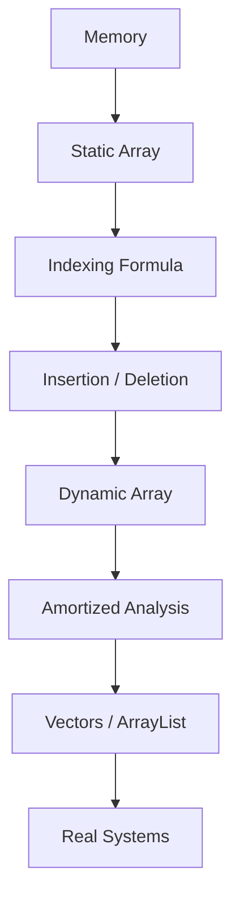

# Arrays

> *"Everything in computing is an array, until proven otherwise."*

Before there were trees, before there were hash tables, before there were graphs — there was a straight line of boxes sitting in memory, waiting to be indexed. The **array** is the atom of computer science. It is not the most powerful data structure, not the most flexible, and not the most elegant. But it is the *foundation* everything else is built on top of, and understanding it deeply is the difference between someone who *uses* data structures and someone who *understands* why they behave the way they do.

This repository is not a beginner tutorial on "how to declare an array." It is a systems-level, memory-aware deep dive into what an array actually *is*, why hardware is built to love it, and how nearly every advanced data structure you already know is secretly an array wearing a costume.

By the end of this introduction, you should be a little suspicious of every data structure you thought you understood — because you're about to see the array hiding underneath most of them.

---

## Why Study Arrays?

It is tempting to treat arrays as "the easy chapter" — the thing you skim before getting to linked lists, trees, and graphs. This is a mistake. Arrays are not a stepping stone you leave behind; they are the substrate that almost everything else is *built from*.

Consider how many structures you already know are, at their core, arrays with extra behavior layered on top:

| Structure | What it really is |
|---|---|
| **Dynamic Array / Vector / ArrayList** | An array that reallocates and copies itself when it outgrows its capacity |
| **Heap (Binary Heap)** | A complete binary tree *encoded as a flat array*, with parent/child relationships computed via index arithmetic |
| **Hash Table** | An array of buckets, indexed by a hashed key instead of a sequential integer |
| **Matrix / 2D Grid** | A single-dimension array, mentally reshaped into rows and columns |
| **Image (Pixel Buffer)** | A flat array of RGB(A) values, one array cell per pixel |
| **Graph (Adjacency Matrix)** | A 2D array where `graph[i][j]` encodes an edge |
| **Tensor (ML/DL)** | An n-dimensional array with a stride pattern describing how to walk through memory |
| **CPU Cache Line / Register File** | Fixed-size, contiguous, array-like hardware structures |
| **Database Page** | A fixed-size array of rows/records on disk |
| **Filesystem Block** | A fixed-size array of bytes addressed by block number |

> [!TIP]
> A useful habit as you study advanced data structures later: whenever you meet a new one, ask *"where is the array hiding in this?"* You will find one almost every time.

If you deeply understand arrays — the memory model, the cost model, the hardware behavior — you will find that trees, heaps, hash tables, and even databases stop feeling like separate topics and start feeling like *variations on a theme*.

---

## Arrays Are Actually Memory

Here is the idea this entire repository is built around, and it is simpler than most courses make it sound:

> [!IMPORTANT]
> **An array is not a container. An array is a contract with memory.**
> It is a promise: *"give me N equally-sized slots, sitting right next to each other, starting at one address."*

That's it. No boxes-connected-by-arrows, no hidden bookkeeping, no magic. Just a straight run of memory.

```text
Memory (each cell = 4 bytes, holding one int)

+------+------+------+------+------+
|  12  |  45  |  18  |  77  |  30  |
+------+------+------+------+------+
 1000   1004   1008   1012   1016
  [0]    [1]    [2]    [3]    [4]
```

A few facts fall directly out of this picture:

- **Contiguous** — every element sits immediately after the previous one. There are no gaps, no jumps, no pointers to "the next cell."
- **Fixed-size elements** — the array only works because every slot is exactly the same width (here, 4 bytes for an `int`). This is *why* the address math below works at all.
- **Addressable** — every slot has its own real memory address, and that address can be computed instead of looked up.

> [!NOTE]
> The gap between addresses (`1000 → 1004 → 1008 …`) is exactly the size of one element. This is not a coincidence — it is the entire mechanism that makes indexing possible.

---

## Mental Model: A Street of Houses

Formulas are easy to forget. Pictures are not. So before we touch any math, build this mental model:

Imagine a perfectly straight street. Every house is *identical in size*, and the houses are numbered in order, starting from a known starting point — the very first house on the street.

```text
Start of Street                              
      │                                       
      ▼                                       
   ┌─────┐   ┌─────┐   ┌─────┐   ┌─────┐   ┌─────┐
   │  🏠  │   │  🏠  │   │  🏠  │   │  🏠  │   │  🏠  │
   └─────┘   └─────┘   └─────┘   └─────┘   └─────┘
   House 0   House 1   House 2   House 3   House 4
```

If someone tells you "go to house #3," you don't need to walk past houses 0, 1, and 2 and count them one by one. You already know:

- Where the street **begins** (the *base address*)
- How **wide** each house is (the *element size*)
- **Which house number** you want (the *index*, i.e. how many houses to skip — the *offset*)

So you can walk directly to it: start at the beginning of the street, and skip past exactly as many houses as the index tells you.

> [!TIP]
> Hold onto this sentence, informally, without the formula yet:
> **Where a house is = where the street starts + how many houses you skip.**
> That single idea — *address = base + offset* — is the entire reason arrays support instant access. We'll formalize it precisely in the next chapter.

This is the deep reason indexing feels "instant." You are never searching. You are always *computing*.

---

## Why Arrays Are Fast

Arrays don't just have a convenient cost model on paper — they are fast in a way that lines up almost perfectly with how real hardware wants to be used.

```mermaid
flowchart LR
    A[Array Access] --> B[Random Access]
    A --> C[Spatial Locality]
    A --> D[Temporal Locality]
    B --> E[Direct address computation<br/>no traversal needed]
    C --> F[Neighboring elements<br/>load into cache together]
    D --> G[Recently used elements<br/>likely reused soon]
    F --> H[Fewer cache misses]
    G --> H
    E --> I[O(1) access]
    H --> J[Fast real-world performance]
    I --> J
```

**Random access.** Because an address can be *computed* rather than *found*, accessing `array[999]` costs exactly the same as accessing `array[0]`. There is no walking, no searching — just arithmetic.

**Spatial locality & cache lines.** CPUs don't fetch memory one byte at a time. They pull in whole **cache lines** (commonly 64 bytes) at once. When you read `array[0]`, the hardware likely already pulled `array[1]`, `array[2]`, and beyond into cache *for free*, simply because they live right next door.

```text
                 CPU requests array[0]
                            │
                            ▼
        ┌───────────────────────────────────────┐
        │           Cache Line (64 bytes)         │
        │  [0][1][2][3][4][5][6][7][8][9]...      │
        └───────────────────────────────────────┘
          ▲
          Already loaded — no extra memory trip needed
```

**Temporal locality.** If you touched an element recently (e.g. in a loop), it is likely still sitting in a fast cache level, making repeated access to nearby data even cheaper.

**Prefetching.** Modern CPUs actively *predict* that if you just read `array[i]`, you are probably about to read `array[i+1]`. Sequential array traversal is one of the few access patterns hardware prefetchers can predict almost perfectly.

**Branch prediction (briefly).** Simple `for` loops over arrays produce extremely predictable branching patterns (`i < n`, again and again), which modern CPUs speculate through with very high accuracy — another quiet contributor to array-loop speed.

> [!WARNING]
> **Linked lists don't get any of this for free.** Each node can live *anywhere* in memory. Walking a linked list means chasing pointers across scattered addresses — a pattern that is close to the worst case for CPU caches and prefetchers, even though both structures may claim "O(n) traversal" on paper.

| Property | Array | Linked List |
|---|---|---|
| Memory layout | Contiguous | Scattered |
| Random access | O(1) | O(n) |
| Cache friendliness | Excellent | Poor |
| Prefetch friendliness | Excellent | Poor |
| Insert/delete at arbitrary position | Costly (shifting) | Cheap (pointer rewire) |
| Extra memory per element | None | Pointer overhead |

---

## Real-World Uses

Arrays are not an academic exercise — they are quietly running underneath almost every system you rely on daily.

| Domain | Where arrays show up |
|---|---|
| **Operating Systems** | Page tables, process tables, file descriptor tables |
| **Machine Learning** | Tensors, weight matrices, and activation buffers are all n-dimensional arrays |
| **Compilers** | Symbol tables, instruction buffers, and bytecode arrays |
| **Databases** | Fixed-size pages and row-store buffers on disk |
| **Game Engines** | Entity-Component-System (ECS) data laid out as flat arrays for cache-friendly updates |
| **Browsers** | DOM node pools, typed arrays (`Float32Array`, `Uint8Array`) for rendering pipelines |
| **Graphics** | Pixel buffers, vertex buffers, texture data |
| **Embedded Systems** | Fixed memory-mapped buffers where dynamic allocation may be too expensive or unsafe |
| **Networking** | Packet buffers and ring buffers for high-throughput I/O |

> [!NOTE]
> Notice a pattern: whenever a system cares deeply about **raw speed and predictability**, it reaches for arrays. That is not a coincidence — it's the direct payoff of everything in the previous section.

---

## Common Misconceptions

Even experienced developers carry small misunderstandings about arrays. Let's clear them up early.

> [!WARNING]
> **"Array == List."**
> An *array* is a fixed-size, contiguous memory layout. A *list* (in the abstract-data-type sense) is a conceptual interface — "an ordered sequence of items" — that could be implemented by an array, a linked list, or something else entirely. Python's `list`, Java's `ArrayList`, and C++'s `std::vector` are *dynamic arrays wearing a "list" name badge*.

> [!WARNING]
> **"Arrays can grow."**
> A raw array cannot grow — its size is fixed the moment its memory is allocated. What *appears* to grow (a Python list, a JavaScript array, a `Vector` in Java) is actually a **dynamic array**: a wrapper that allocates a new, bigger array behind the scenes and copies everything over when it runs out of room. We'll dissect exactly how and when this happens later in this repository.

> [!WARNING]
> **"The index stores the address."**
> It doesn't. Nothing is stored for the index at all — the address is *computed on demand* from the base address, the element size, and the index. This is precisely why array access is O(1): there's no lookup table to consult.

> [!WARNING]
> **"An array stores objects."**
> In many languages, a "primitive" array stores actual values contiguously (e.g. raw `int`s in C). But an array of *objects* in languages like Java or Python often stores **references/pointers** to objects that live elsewhere on the heap — the array itself is still a contiguous block, but of *addresses*, not of the objects' full data. This distinction has real performance consequences we'll explore in later chapters.

---

## Roadmap

This repository builds up from raw memory to real-world engineering, one layer at a time:

| # | Chapter | What you'll learn |
|---|---|---|
| 1 | **Introduction** *(you are here)* | Why arrays matter and how they relate to memory |
| 2 | **Memory Model** | How memory is organized, addressed, and allocated |
| 3 | **Address Calculation** | The formal indexing formula, byte-by-byte |
| 4 | **Static Arrays** | Fixed-size arrays and their guarantees |
| 5 | **Dynamic Arrays** | Growable arrays, resizing strategies |
| 6 | **Complexity** | Big-O for every array operation, rigorously derived |
| 7 | **Cache Behavior** | Why array code often outperforms its "equivalent" Big-O rival |
| 8 | **Multidimensional Arrays** | Row-major vs. column-major, matrices, tensors |
| 9 | **Sparse Arrays** | When most of the array is "empty," and what to do about it |
| 10 | **Applications** | Arrays in OS, ML, DBs, and game engines, in depth |
| 11 | **Interview Problems** | Classic array problems, solved with full reasoning |
| 12 | **Advanced Topics** | SIMD, memory alignment, and low-level tricks |

---

## Preview Visualization



Each arrow in this diagram is a chapter. Each chapter answers exactly one question raised by the chapter before it — by the end, the path from "a row of memory cells" to "the vector class you use every day" will feel inevitable rather than magical.

---

## Learning Outcome

After finishing this repository, you will understand:

- Why array access is genuinely **O(1)** — not "fast," but *mathematically constant time*
- Where the **O(n)** cost of insertion and deletion actually comes from, in terms of real memory shifting
- **Why dynamic arrays double** their capacity instead of growing by a fixed amount
- **Amortized analysis** — how an occasionally expensive operation can still average out to O(1)
- **Cache locality** — why array code frequently outperforms structures with "better" asymptotic complexity
- The full **memory layout** of an array, down to the byte
- **Why vectors outperform linked lists** in most real-world workloads, despite similar Big-O
- **How `ArrayList` works internally** in Java — capacity, growth factor, and resizing
- **How Python's `list` works internally** — over-allocation strategy and amortized append cost
- **How C arrays differ from Java arrays** — raw memory vs. managed, bounds-checked memory

---

> [!TIP]
> Ready? The next chapter takes the informal "street of houses" picture from this introduction and turns it into a precise, byte-accurate model of how memory actually stores and addresses your data.
>
> **Next → [Memory Model](./02-memory-model.md)**
