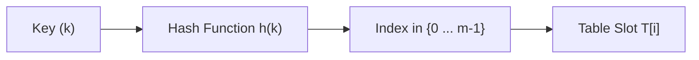
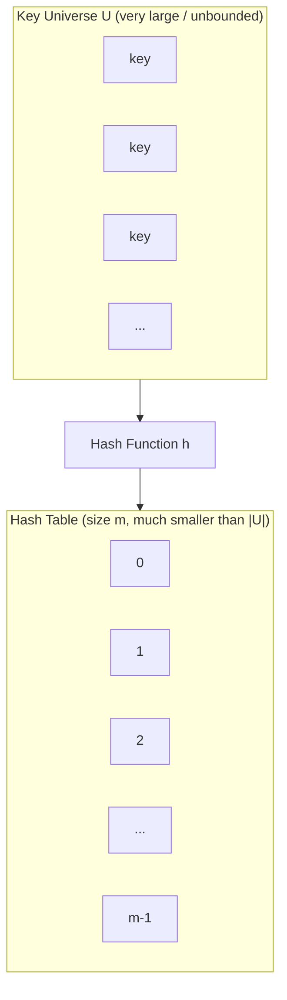
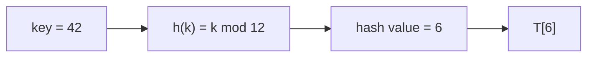
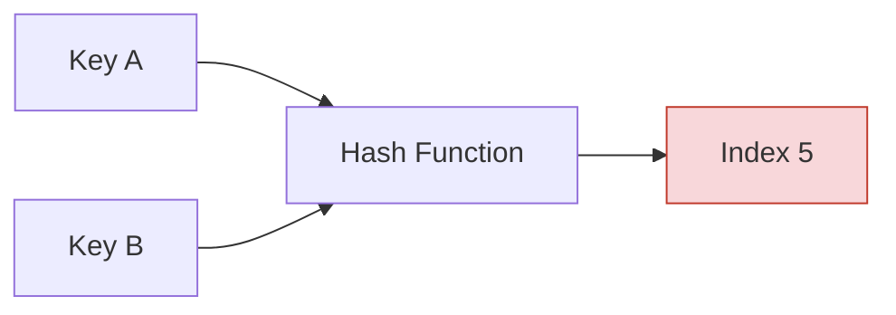
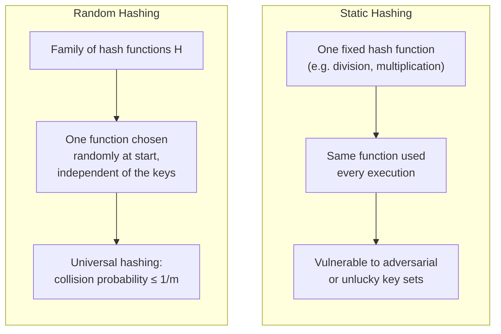

# Hash Functions

A **Hash Function** is the mechanism at the core of every hash table. It is the function `h` that takes a key and computes the position in the table where the corresponding element should be stored or found. Without a hash function, a hash table cannot decide where a key belongs — its quality directly determines how well the hash table performs.

---

## 1. What Is a Hash Function?

A hash function takes a key and produces a table index:

```
Key
 ↓
Hash Function
 ↓
Hash Value / Index
```

Formally, a hash function `h` maps the universe `U` of keys into the slots of a hash table `T[0 : m-1]`:

```
h : U → {0, 1, ..., m-1}
```



A hash function is needed because, as explained in [`01-Direct-Address-Tables.md`](./01-Direct-Address-Tables.md), direct addressing requires a table as large as the entire key universe `U`, which is often impractical. As introduced in [`02-Hash-Tables.md`](./02-Hash-Tables.md), a hash table solves this by computing an index from the key instead of using the key itself as the index — and the hash function is exactly what performs that computation.

---

## 2. The Main Purpose of a Hash Function

The main purpose of a hash function is to map keys from a potentially large key space down into a much smaller table:

```
Large Key Space
      ↓
 Hash Function
      ↓
 Smaller Table
      ↓
    Index
```

Instead of needing one table slot for every possible key in `U`, the hash function reduces the range of array indices — and hence the size of the array — down to `m` slots, where `m` is typically much smaller than `|U|`. An element with key `k` is said to **hash** to slot `h(k)`, and `h(k)` is called the **hash value** of key `k`.



---

## 3. Hash Values and Table Indices

The relationship between a key, its hash value, and the resulting table index follows this flow:

```
key = 42
   ↓
hash(key)
   ↓
some hash value
   ↓
table index
```

**Simple numerical example**, using the division method `h(k) = k mod m`:

```
key = 42
table size m = 12
h(42) = 42 mod 12 = 6
→ table index = 6
```



The exact process used to turn a key into a hash value depends on the hashing method chosen — different methods (covered later in this file) will compute different indices for the same key. What stays consistent is the overall relationship: a key is transformed into a hash value, and that hash value determines the index used in the table.

---

## 4. Properties of a Good Hash Function

A good hash function should satisfy (approximately) the assumption that each key is equally likely to hash to any of the `m` slots, independently of where any other keys have hashed to. Based on the source material, the important characteristics of a good hash function are:

- **Deterministic behavior:** A hash function must be deterministic — a given input `k` must always produce the same output `h(k)`. This is essential; without it, an element stored at `h(k)` could never be reliably found again.
- **Efficient computation:** The hash value should be computable quickly, since it is calculated on every `Search`, `Insert`, and `Delete` operation.
- **Good distribution of keys:** A good hash function should make `h` appear "random," so that keys are spread evenly across the `m` slots rather than clustering into a small number of them.
- **Minimizing collisions:** Because the key universe is generally larger than the table, collisions cannot be avoided entirely. However, a well-designed hash function reduces the number of collisions that occur by distributing keys more evenly.

---

## 5. Collision Introduction

A **collision** occurs when two different keys hash to the same table index.

**Example:**

```
Key A → Hash Function → Index 5
Key B → Hash Function → Index 5

Therefore:
Key A and Key B collide.
```



Because the universe of keys `U` is larger than the number of table slots `m`, there must be at least two keys that have the same hash value — avoiding collisions altogether is impossible. This means the quality of the hash function does not eliminate collisions, but it directly affects **how often** they occur:

- A hash function with poor distribution causes keys to cluster into fewer slots, leading to more frequent collisions.
- A hash function with good distribution spreads keys more evenly across the table, reducing collision frequency — though never removing the possibility entirely.

This document does not cover how collisions are resolved once they occur. That is addressed in:

- [`04-Collisions.md`](./04-Collisions.md)
- [`05-Open-Addressing.md`](./05-Open-Addressing.md)

---

## 6. Simple Hash Function Examples

### Example 1 — The Division Method

The division method computes the hash value as the remainder when the key is divided by the table size `m`:

```python
def simple_hash(key, table_size):
    return key % table_size
```

For example, with a table of size `m = 12` and key `k = 100`, `h(k) = 100 mod 12 = 4`.

This method is fast, since it requires only a single division operation. It may work well when `m` is a prime number not too close to an exact power of 2. However, it provides no guarantee of good average-case performance, and it constrains the table size to be a prime number.

### Example 2 — The Multiplication Method

The multiplication method computes the hash value in two steps: multiply the key `k` by a constant `A` in the range `0 < A < 1`, extract the fractional part of `kA`, then multiply by the table size `m` and take the floor:

```
h(k) = ⌊m (kA mod 1)⌋
```

where `kA mod 1` means the fractional part of `kA`, that is, `kA − ⌊kA⌋`.

The advantage of the multiplication method is that the value of `m` is not critical — it can be chosen independently of how the multiplicative constant `A` is chosen, unlike the division method, which works best when `m` is prime.

---

## 7. Static Hashing vs Random Hashing

The source material distinguishes between two general approaches to designing hash functions:

**Static hashing** uses a single, fixed hash function for all executions of a program. The division method and the multiplication method (shown above) are both examples of static hashing. The only randomness available comes from the (usually unknown) distribution of the input keys themselves.

The limitation of static hashing is that it provides no guarantee of good average-case performance for arbitrary data. If an adversary knows the fixed hash function being used, they could — in principle — choose keys that all map to the same slot, causing many collisions.

**Random hashing** addresses this by selecting the hash function itself at random, from a suitable family of hash functions, at the start of program execution — independent of the keys that will actually be hashed. A specific form of random hashing, called **universal hashing**, provides a mathematical guarantee: for any two distinct keys, the probability that a randomly chosen hash function from the family causes them to collide is at most `1/m`.

The source recommends using random hashing in practice, since it removes any dependency on knowing (or guessing) the distribution of the input keys in advance. The detailed construction of universal hash function families is part of the deeper mathematical treatment in the source material and is summarized here only at a conceptual level, since the focus of this file is understanding the role and properties of hash functions rather than their full mathematical construction.



---

## 8. Hash Functions in Problem Solving

In coding problems, the exact internal implementation of a hash function is almost never something you need to design yourself — built-in structures like Python's `dict` and `set` already use well-designed hash functions internally. What matters for problem solving is understanding **what a hash function guarantees**:

- Two equal keys will always produce the same hash value (deterministic behavior), which is why looking up a key you inserted earlier reliably works.
- A good hash function spreads keys evenly, which is why operations on `HashMap` / `HashSet` behave close to `O(1)` on average in practice, as discussed in [`02-Hash-Tables.md`](./02-Hash-Tables.md).
- Collisions are still possible, even with a good hash function — they are a normal part of how hash tables work, not a sign that something is broken.

Understanding hash functions at this conceptual level is enough to reason correctly about why `HashMap` and `HashSet` operations are fast on average, and why worst-case behavior can still occur.

---

## 9. Complexity Summary

| Aspect | Complexity | Notes |
|---|---|---|
| Computing a hash value | `O(1)` | Assumed constant time to compute `h(k)` for a given key |
| Effect on Search / Insert / Delete | Enables `O(1)` average case | Only holds if the hash function distributes keys well; poor distribution increases collisions and degrades performance |

The hash function itself does not directly cause `O(n)` behavior — but a poorly chosen or poorly distributed hash function increases collisions, which is what leads to degraded performance, as covered in [`04-Collisions.md`](./04-Collisions.md).

---

## 10. Key Takeaways

- A hash function `h` maps keys from a universe `U` into table indices `{0, 1, ..., m-1}`.
- Its main purpose is to allow a hash table to use a much smaller table than the full key universe would require.
- A good hash function is deterministic, efficient to compute, distributes keys evenly, and minimizes (but never eliminates) collisions.
- Collisions are unavoidable whenever the key universe is larger than the table — the hash function affects how *often* they happen, not whether they can happen at all.
- The division method and multiplication method are examples of static hashing, which uses one fixed function and offers no guarantees against poor performance on adversarial or unlucky data.
- Random hashing, and specifically universal hashing, addresses this by selecting the hash function randomly and independently of the input keys, guaranteeing good average-case behavior.

---

## 11. Quick Revision

```
Hash Function     = A function that maps a key to a table index
Hash Value        = The output of the hash function for a given key
Static Hashing     = Uses one fixed hash function (e.g., division, multiplication method)
Random Hashing     = Selects the hash function randomly, independent of the input keys
Universal Hashing  = A form of random hashing guaranteeing collision probability ≤ 1/m
Collision          = When two different keys map to the same index
Next topic          = Collisions
```

---

## 12. Questions to Test Understanding

1. What is the role of a hash function inside a hash table?
2. Why must a hash function be deterministic?
3. What does it mean for a hash function to have "good distribution"?
4. Why can collisions never be fully eliminated, no matter how good the hash function is?
5. What is the main limitation of static hashing, and how does random hashing address it?

<details>
<summary>Answers</summary>

1. A hash function computes the table index where a given key's element should be stored or found, mapping keys from a (potentially large) universe into a much smaller table.
2. A hash function must be deterministic so that the same key always produces the same hash value — otherwise, an element stored using one hash value could never be reliably located again on a later search.
3. Good distribution means that keys are spread evenly and unpredictably across the available table slots, rather than clustering into a small number of them, which helps keep collisions infrequent.
4. Because the universe of possible keys `U` is generally larger than the number of table slots `m`, it is mathematically guaranteed that at least two keys will map to the same slot — no hash function can avoid this entirely.
5. Static hashing uses one fixed hash function for every execution, which provides no guarantee against poor performance if the input keys happen to collide frequently (or are chosen adversarially). Random hashing addresses this by selecting the hash function randomly at the start of execution, independent of the keys being hashed, so no fixed set of keys can consistently force worst-case behavior.

</details>

---

## 13. Navigation

Previous:
[Hash Tables](02-Hash-Tables.md)

Next:
[Collisions](04-Collisions.md)
