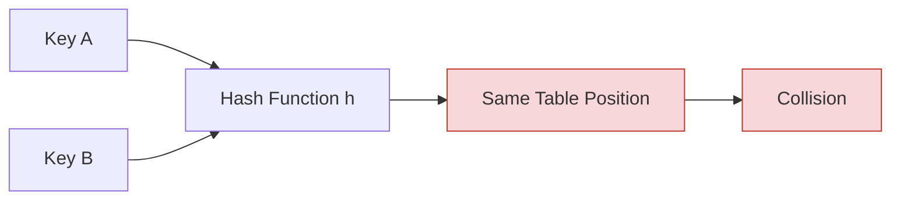
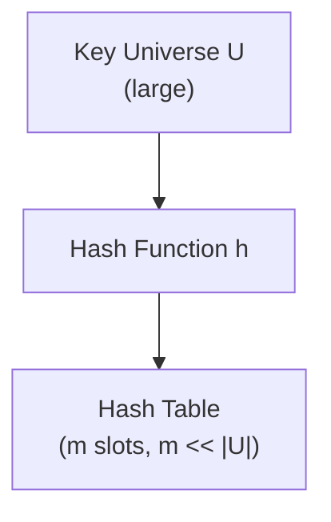
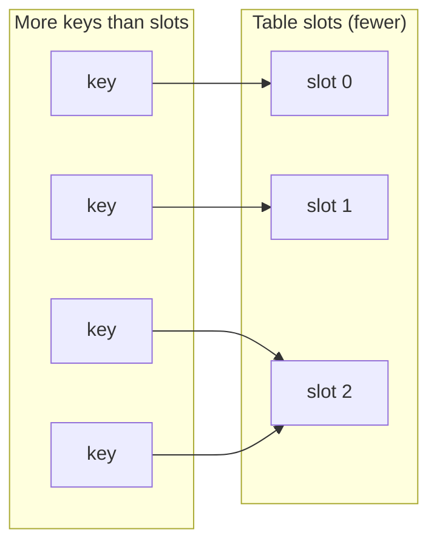
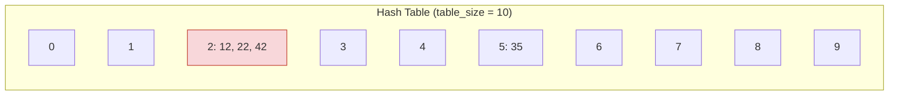
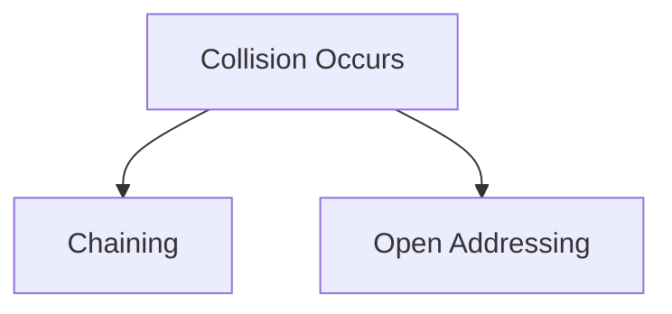
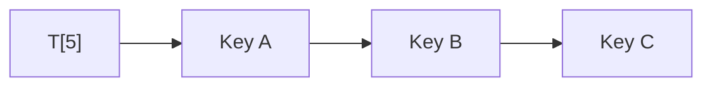
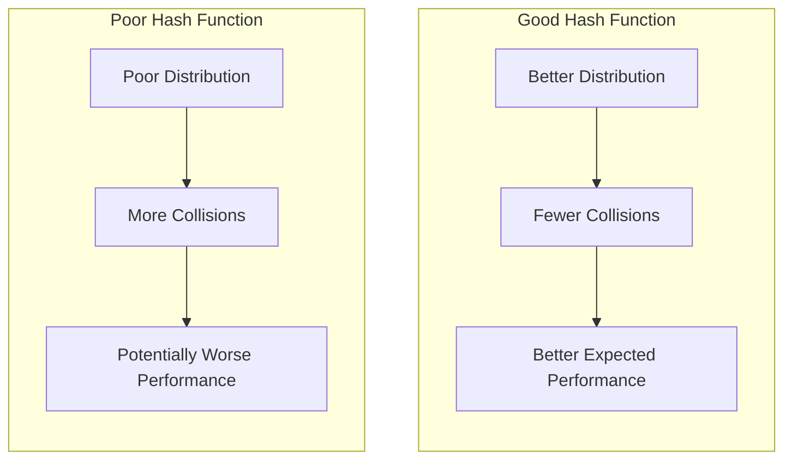
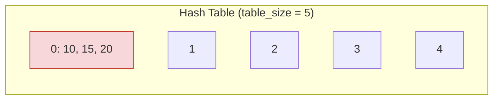

# Collisions in Hash Tables

A **collision** occurs when two different keys, after being processed by a hash function, end up assigned to the same position in a hash table.

```
Two different keys
      ↓
Hash Function
      ↓
Same table position
      ↓
Collision
```



---

## 1. What Is a Collision?

A collision happens when two distinct keys hash to the same index in the table.

**Example:**

```
Key A → Index 5
Key B → Index 5
```

Even though `Key A` and `Key B` are different keys, the hash function produces the same result for both of them: `h(Key A) = h(Key B) = 5`. Since a hash table position can only be directly identified by a single index, both keys are now competing for the same slot, `T[5]`. This is a collision.

Intuitively, a collision is simply the hash table equivalent of two different people being assigned the same seat number — the seat number (index) is the same, but the people (keys) are not.

---

## 2. Why Do Collisions Happen?

Collisions happen because a hash table maps a large — often much larger — universe of possible keys into a much smaller table:

```
Large key universe
      ↓
Smaller hash table
      ↓
Multiple keys may map to the same index
```



**Example:** Suppose the table size is `table_size = 10`, and the hash function is the division method: `index = key % table_size`.

```
12 → 12 % 10 = 2
22 → 22 % 10 = 2
```

Both `12` and `22` produce the same index, `2`, even though they are different keys. This happens simply because dividing by `10` and taking the remainder can only ever produce one of 10 possible results (`0` through `9`), while the number of possible keys is unlimited. Different keys are bound to share the same remainder sooner or later.

---

## 3. The Pigeonhole Principle Intuition

The reason collisions cannot always be avoided follows a simple intuitive idea, sometimes called the **pigeonhole principle**: if you have more items than available containers, at least one container must hold more than one item.

Applied to hashing: if the number of possible keys (the universe `U`) is larger than the number of table slots (`m`), then it is impossible for every key to have its own unique slot. At least two keys must eventually share the same index.



This is not a flaw in a particular hash function — it is a mathematical consequence of mapping a large key universe into a smaller table. No matter how well-designed the hash function is, if `|U| > m`, at least one slot must receive more than one key.

---

## 4. Collision Example

Suppose:

```
table_size = 10
```

Keys to insert:

```
12
22
35
42
```

Using `index = key % 10`:

```
12 → 12 % 10 = 2
22 → 22 % 10 = 2
35 → 35 % 10 = 5
42 → 42 % 10 = 2
```

**Resulting index assignments:**

```
Index 0:
Index 1:
Index 2 → 12, 22, 42
Index 3:
Index 4:
Index 5 → 35
Index 6:
Index 7:
Index 8:
Index 9:
```



Three different keys — `12`, `22`, and `42` — all collide at index `2`, while `35` is the only key at index `5`. This shows that collisions do not affect every slot equally; some slots may end up empty while others accumulate multiple keys, depending on the input keys and the hash function used.

---

## 5. Why Collisions Are a Problem

A hash table cannot simply place two different elements into the exact same single slot without some strategy for handling the conflict — a slot that already holds one element cannot silently hold a second one in the same space.

Collisions affect the core dictionary operations:

- **Searching:** If multiple keys hash to the same index, finding a specific key may require checking more than one candidate at that position, rather than a single direct check.
- **Insertion:** When inserting a key that collides with an existing one, the hash table must decide how to place the new element without overwriting or losing the existing one.
- **Deletion:** Removing an element must not accidentally disturb other elements that share the same index due to a collision.
- **Overall performance:** As more keys collide into the same slots, operations at those slots take longer, since more candidates may need to be examined.

It would be an oversimplification to say "collisions make hash tables slow" without qualification. What actually matters is **how well collisions are handled** and **how evenly keys are distributed** across the table. A hash table with a good hash function and a reasonable number of stored elements relative to its size can still perform close to `O(1)` on average, even though collisions occur.

---

## 6. Collision Resolution

When a collision occurs, the hash table needs a strategy for deciding where — or how — to store the conflicting element. There are two major families of collision-resolution techniques.



### Chaining

In chaining, each table slot does not hold a single element directly — instead, it holds a pointer to a secondary structure (such as a linked list) that can hold multiple elements.

```
Index 5
   ↓
[Key A]
[Key B]
[Key C]
```



All keys that hash to index `5` are appended to the list associated with that slot, rather than competing for a single storage location. This allows multiple elements to coexist at the same index without conflict.

### Open Addressing

In open addressing, all elements are stored **directly** in the table itself — there is no secondary structure. When a computed position is already occupied, the hash table searches for another position according to a probing strategy, rather than placing the element in a separate structure attached to that slot.

The detailed mechanics of how positions are searched (probing) are covered separately in [`05-Open-Addressing.md`](./05-Open-Addressing.md).

---

## 7. Collision Resolution vs Hash Function Quality

The quality of a hash function directly affects how often collisions occur, even though it can never eliminate them entirely.

```
Good Hash Function
      ↓
Better Distribution
      ↓
Fewer Collisions
      ↓
Better Expected Performance
```

```
Poor Hash Function
      ↓
Poor Distribution
      ↓
More Collisions
      ↓
Potentially Worse Performance
```



It is important to be precise here: **a good hash function does not guarantee zero collisions.** As explained in [`03-Hash-Functions.md`](./03-Hash-Functions.md), collisions are unavoidable whenever the key universe is larger than the table. A good hash function only reduces how *frequently* collisions happen, by spreading keys more evenly across the table.

---

## 8. Chaining vs Open Addressing

| Feature | Chaining | Open Addressing |
|---|---|---|
| Storage idea | Each slot points to a secondary structure (e.g., a linked list) that can hold multiple elements | All elements are stored directly within the table itself |
| Collision handling | Colliding elements are added to the list associated with their shared slot | Colliding elements are placed in a different slot found via a probing strategy |
| Basic concept | A table of "buckets," where each bucket can hold more than one element | A single array where every element occupies its own unique slot |
| Main characteristic | Slots can conceptually hold multiple elements at once | Every slot holds at most one element; collisions are resolved by finding another slot |

Both approaches solve the same underlying problem — what to do when two keys hash to the same index — but differ fundamentally in whether elements are stored directly in the table or in an attached secondary structure.

---

## 9. Collision and Complexity

Collisions are the reason hash table performance is described in terms of **average case** rather than a universal guarantee.

```
Average Case:
O(1)

Worst Case:
Can become worse when many keys collide.
```

Under reasonable assumptions about how well the hash function distributes keys (assumptions discussed in [`03-Hash-Functions.md`](./03-Hash-Functions.md)), the average time for `Search`, `Insert`, and `Delete` remains close to `O(1)`.

However, in the worst case — where many or all keys happen to collide into the same slot — the elements sharing that slot effectively form a structure similar to a single linked list, and operations on that slot can degrade toward `O(n)`, where `n` is the number of elements stored. This worst case represents the theoretical extreme, not the typical behavior of a well-implemented hash table with a reasonable number of elements relative to its size.

---

## 10. Collision Handling Example

Suppose:

```
table_size = 5
```

Keys to insert:

```
10
15
20
```

Using `index = key % 5`:

```
10 → 10 % 5 = 0
15 → 15 % 5 = 0
20 → 20 % 5 = 0
```

All three keys map to the **same index, `0`**.



A collision-resolution method now has to decide how to accommodate all three elements without losing any of them:

- With **chaining**, all three keys would be added to a list attached to index `0`.
- With **open addressing**, the second and third keys (`15` and `20`) would each need to be placed in a different slot, found by probing, since index `0` becomes occupied after the first insertion.

This document does not implement either method in full — chaining is discussed at the conceptual level above, and open addressing is covered in detail in [`05-Open-Addressing.md`](./05-Open-Addressing.md).

---

## 11. Python Perspective

When using Python's built-in `dict` and `set`, collision handling is not something you need to implement yourself — it happens automatically, internally, as part of how these structures are built on top of hash tables.

```python
# Both dict and set are implemented using hash tables internally.
# Collisions are handled automatically behind the scenes.

student = {
    "Ahmed": 20,
    "Mona": 22
}

seen = {10, 20, 30}
```

As a user of `dict` and `set`, you do not need to write any collision-handling logic — inserting, searching, and deleting keys behaves correctly regardless of whether a collision occurs internally. What matters for problem solving is understanding that these operations remain close to `O(1)` **on average**, precisely because of the collision-handling strategy working underneath the interface, combined with a well-distributed hash function.

---

## 12. Key Takeaways

- A collision occurs when two different keys hash to the same table index.
- Collisions happen because the universe of possible keys is generally much larger than the number of available table slots.
- The pigeonhole principle explains why collisions are mathematically unavoidable whenever there are more possible keys than table slots.
- Collisions affect Search, Insert, and Delete, since more than one key may need to be examined or managed at the same index.
- A good hash function reduces how *often* collisions occur by distributing keys evenly, but it can never guarantee zero collisions.
- The two major collision-resolution strategies are **chaining** (storing multiple elements per slot via a secondary structure) and **open addressing** (storing every element directly in the table by probing for another slot).
- Hash table operations are `O(1)` on **average**, but can degrade toward `O(n)` in the worst case, when many keys collide into the same slot.
- Built-in structures like Python's `dict` and `set` handle collisions internally, so problem solvers can rely on them without implementing collision handling manually.

---

## 13. Quick Revision

```
Collision            = Two different keys mapping to the same table index
Cause                = Key universe larger than the number of table slots
Pigeonhole Principle = More keys than slots guarantees at least one shared slot
Chaining             = Multiple elements stored per slot via a secondary structure
Open Addressing      = Elements stored directly in the table; collisions resolved by probing
Average Case         = O(1) for Search, Insert, Delete
Worst Case           = O(n), when many keys collide into the same slot
Next topic           = Open Addressing
```

---

## 14. Questions to Test Understanding

1. What exactly is a collision in a hash table?
2. Why are collisions mathematically unavoidable when the key universe is larger than the table?
3. How does a good hash function affect the frequency of collisions, and what does it not guarantee?
4. What is the fundamental difference between chaining and open addressing?
5. Why is hash table performance described as `O(1)` average case rather than a guaranteed `O(1)` worst case?

<details>
<summary>Answers</summary>

1. A collision is when two different keys, after being processed by the hash function, are assigned to the same index in the hash table.
2. Because the number of possible keys (the universe `U`) is generally larger than the number of available table slots (`m`), it is mathematically guaranteed — by the pigeonhole principle — that at least two keys must share the same slot.
3. A good hash function distributes keys more evenly across the table, reducing how often collisions occur. However, it does not guarantee zero collisions — collisions remain unavoidable whenever `|U| > m`.
4. Chaining stores multiple colliding elements together in a secondary structure (such as a linked list) attached to a single slot. Open addressing stores every element directly in the table itself, resolving collisions by searching for another open slot through probing.
5. Because collisions can still occur even with a good hash function, and in the worst case many keys could collide into the same slot, causing operations at that slot to degrade toward `O(n)`. The `O(1)` figure reflects the expected average performance under reasonable distribution assumptions, not a guarantee that holds in every possible scenario.

</details>

---

## 15. Navigation

Previous:
[Hash Functions](03-Hash-Functions.md)

Next:
[Open Addressing](05-Open-Addressing.md)
