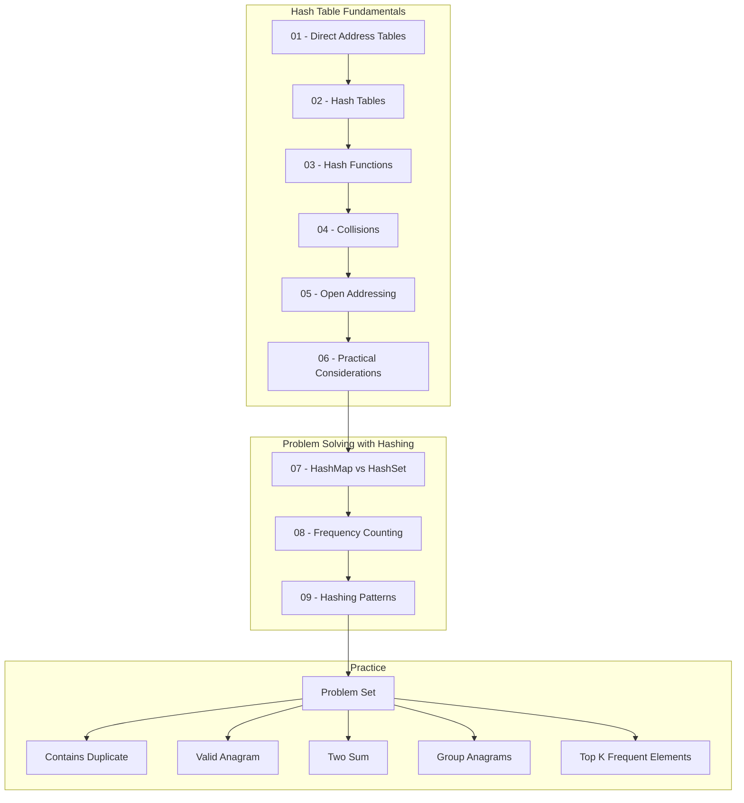

# Hashing & Hash Tables

This repository covers the fundamentals of **Hash Tables** — one of the most important data structures in computer science — along with their practical application in **Data Structures & Algorithms (DSA)** and coding interview problem solving. It is structured to take you from the theoretical foundations of hashing (direct addressing, hash functions, collision resolution, open addressing) to recognizing and applying hashing patterns in real coding problems.

---

## Table of Contents

- [What You Will Learn](#what-you-will-learn)
- [Prerequisites](#prerequisites)
- [Repository Structure](#repository-structure)
- [Learning Path](#learning-path)
- [Visual Roadmap](#visual-roadmap)
- [Core Concepts](#core-concepts)
- [Problem Solving Patterns](#problem-solving-patterns)
- [Complexity Cheat Sheet](#complexity-cheat-sheet)
- [Problem Set](#problem-set)
- [How to Use This Repository](#how-to-use-this-repository)
- [Progress Checklist](#progress-checklist)
- [Key Takeaways](#key-takeaways)
- [Further Learning](#further-learning)

---

## What You Will Learn

This repository is built around two complementary goals:

1. **Understand how Hash Tables work conceptually** — direct addressing, hash functions, collisions, chaining, open addressing, and the practical engineering trade-offs behind real-world hash table implementations.
2. **Learn how to recognize and apply Hashing patterns in coding problems** — using `HashMap` and `HashSet` structures to solve problems involving duplicates, frequency counts, fast lookups, and pair/grouping logic.

By the end of this repository, you should be able to explain *why* hash tables achieve average `O(1)` operations, and *when* to reach for a `HashMap` or `HashSet` while solving a problem.

---

## Prerequisites

Before starting, you should be comfortable with:

- **Arrays** — indexing, traversal, and basic operations.
- **Basic Big-O notation** — understanding what `O(1)`, `O(n)`, and `O(n²)` mean in terms of time complexity.

No prior knowledge of hashing is required — this repository builds the concept from the ground up.

---

## Repository Structure

The repository is organized into two parts: **Hash Table Fundamentals** (theory) and **Problem Solving with Hashing** (application).

### Part 1 — Hash Table Fundamentals

| File | Description |
|---|---|
| [`01-Direct-Address-Tables.md`](./01-Direct-Address-Tables.md) | Introduces direct addressing, the simplest form of key-based storage, and explains why it fails to scale for large key universes. |
| [`02-Hash-Tables.md`](./02-Hash-Tables.md) | Introduces the Hash Table as a solution to the limitations of direct addressing, including the concept of a hash function mapping keys to table slots. |
| [`03-Hash-Functions.md`](./03-Hash-Functions.md) | Covers what makes a good hash function, static hashing methods (division, multiplication), and universal/random hashing. |
| [`04-Collisions.md`](./04-Collisions.md) | Explains collisions, why they are unavoidable, and how chaining resolves them, including load factor and average-case analysis. |
| [`05-Open-Addressing.md`](./05-Open-Addressing.md) | Covers open addressing as an alternative collision resolution strategy (probing techniques) without external chains. |
| [`06-Practical-Considerations.md`](./06-Practical-Considerations.md) | Discusses real-world engineering concerns: resizing, load factor thresholds, memory hierarchy effects, and implementation trade-offs. |

### Part 2 — Problem Solving with Hashing

| File | Description |
|---|---|
| [`07-HashMap-vs-HashSet.md`](./07-HashMap-vs-HashSet.md) | Compares `HashMap` and `HashSet`, clarifying when to use key-value mapping versus simple membership checks. |
| [`08-Frequency-Counting.md`](./08-Frequency-Counting.md) | Explains the frequency counting technique using hash tables, a foundational pattern for many problems. |
| [`09-Hashing-Patterns.md`](./09-Hashing-Patterns.md) | Summarizes recurring hashing patterns used across coding interview problems. |

### Part 3 — Problem Set

| Folder | Description |
|---|---|
| [`problems/`](./problems) | A curated set of practice problems applying hashing concepts, ordered by increasing complexity. |

---

## Learning Path

Follow this recommended order to build understanding progressively, from theory to application:

1. Start with **Hash Table Fundamentals** (files `01` → `06`) to understand *how* and *why* hash tables work.
2. Move to **Problem Solving with Hashing** (files `07` → `09`) to learn *how to apply* these concepts using `HashMap` and `HashSet`.
3. Practice with the **Problem Set** (`problems/`) to reinforce pattern recognition and implementation skills.
4. Revisit the **Complexity Cheat Sheet** and **Core Concepts** sections below as quick references while solving problems.

---

## Visual Roadmap

---

## Core Concepts

Short descriptions of the core theoretical concepts covered in this repository:

| Concept | Description |
|---|---|
| **Direct Addressing** | Storing elements at an index equal to their key, requiring an array as large as the key universe. |
| **Hash Table** | A data structure that stores elements using a computed index derived from the key via a hash function, rather than the key itself. |
| **Hash Function** | A function that maps keys from a (potentially large) universe to a small range of table indices. |
| **Collision** | A situation where two distinct keys map to the same table index. |
| **Chaining** | A collision resolution technique where each table slot holds a linked list of all elements that hash to it. |
| **Open Addressing** | A collision resolution technique where all elements are stored directly in the table, and collisions are resolved by probing for another slot. |
| **Load Factor (α)** | The ratio of stored elements to table slots (`n / m`), used to estimate average chain length and performance. |

Detailed explanations of each concept are available in their respective files linked in the [Repository Structure](#repository-structure) section.

---

## Problem Solving Patterns

Hashing appears repeatedly across coding interview problems in a few recurring patterns:

| Pattern | Description |
|---|---|
| **Duplicate Detection** | Using a `HashSet` to detect whether an element has already been seen. |
| **Frequency Counting** | Using a `HashMap` to count occurrences of elements, often as a foundation for further logic. |
| **Fast Lookup** | Replacing linear search (`O(n)`) with hash-based lookup (`O(1)` average) to check membership or existence. |
| **Key → Value Mapping** | Associating data with a key for quick retrieval, such as mapping characters to indices or values to positions. |
| **Complement Lookup / Pair Problems** | Storing seen values to quickly find a complementary value (e.g., `target - current`) without nested loops. |
| **Grouping** | Using a computed key (such as a sorted string or signature) to group related elements together in a `HashMap`. |

These patterns are explored in depth in [`09-Hashing-Patterns.md`](./09-Hashing-Patterns.md) and applied throughout the [`problems/`](./problems) directory.

---

## Complexity Cheat Sheet

Average-case and worst-case time complexity for common `HashMap` / `HashSet` operations:

| Operation | Average Case | Worst Case |
|---|---|---|
| Insert | `O(1)` | `O(n)` |
| Search / Lookup | `O(1)` | `O(n)` |
| Delete | `O(1)` | `O(n)` |
| Iteration | `O(n)` | `O(n)` |

> **Note:** `O(1)` for insert, search, and delete is an **average-case** bound that holds under reasonable hashing assumptions (a well-distributed hash function and a controlled load factor). The **worst case** — where all keys collide into the same slot or bucket — is `O(n)`. This distinction is covered in detail in [`04-Collisions.md`](./04-Collisions.md).

---

## Problem Set

Practice problems are located in the [`problems/`](./problems) directory, ordered to build pattern recognition progressively:

| # | Problem | Pattern Focus |
|---|---|---|
| 1 | [Contains Duplicate](./problems/01-Contains-Duplicate.md) | Duplicate Detection |
| 2 | [Valid Anagram](./problems/02-Valid-Anagram.md) | Frequency Counting |
| 3 | [Two Sum](./problems/03-Two-Sum.md) | Complement Lookup / Pair Problems |
| 4 | [Group Anagrams](./problems/04-Group-Anagrams.md) | Grouping |
| 5 | [Top K Frequent Elements](./problems/05-Top-K-Frequent-Elements.md) | Frequency Counting + Fast Lookup |

Each problem file includes the problem statement, the relevant hashing pattern, and a discussion of the approach and complexity.

---

## How to Use This Repository

1. **Read a fundamentals file** (`01` through `06`) in order to build a solid conceptual understanding of how hash tables work internally.
2. **Read the application files** (`07` through `09`) to connect the theory to `HashMap` / `HashSet` usage and recognize common patterns.
3. **Solve the corresponding problem(s)** in the [`problems/`](./problems) directory tied to the pattern you just studied.
4. **Review the Complexity Cheat Sheet** before and after solving problems to reinforce the performance reasoning behind your solution.
5. **Revisit earlier files** whenever a problem's pattern is unclear — understanding *why* a hash table behaves a certain way makes pattern recognition easier over time.

---

## Progress Checklist

Use this checklist to track your progress through the repository.

**Hash Table Fundamentals**
- [ ] 01 - Direct-Address Tables
- [ ] 02 - Hash Tables
- [ ] 03 - Hash Functions
- [ ] 04 - Collisions
- [ ] 05 - Open Addressing
- [ ] 06 - Practical Considerations

**Problem Solving with Hashing**
- [ ] 07 - HashMap vs HashSet
- [ ] 08 - Frequency Counting
- [ ] 09 - Hashing Patterns

**Problem Set**
- [ ] Contains Duplicate
- [ ] Valid Anagram
- [ ] Two Sum
- [ ] Group Anagrams
- [ ] Top K Frequent Elements

---

## Key Takeaways

- A **Hash Table** trades the guaranteed worst-case performance of direct addressing for much lower memory usage, while still achieving `O(1)` average-case performance for core operations.
- **Collisions are unavoidable** whenever the key universe is larger than the table size; what matters is how effectively they are resolved (via chaining or open addressing).
- A good **hash function** aims to distribute keys as uniformly and independently as possible across table slots.
- In problem solving, most hashing-based solutions come down to a small set of recurring patterns: **duplicate detection, frequency counting, fast lookup, key-value mapping, complement lookup, and grouping**.
- Recognizing *which pattern* a problem maps to is often more valuable than memorizing individual solutions.

---

## Further Learning

This repository focuses specifically on hash tables as covered in its structure above. For deeper or adjacent study, consider exploring:

- The formal analysis of hashing with chaining (load factor, universal hashing) in [`04-Collisions.md`](./04-Collisions.md) and [`03-Hash-Functions.md`](./03-Hash-Functions.md).
- Comparing hash table performance against other lookup structures (arrays, trees) once this repository's fundamentals are complete.
- Practicing additional problems beyond the included set to strengthen pattern recognition speed.
